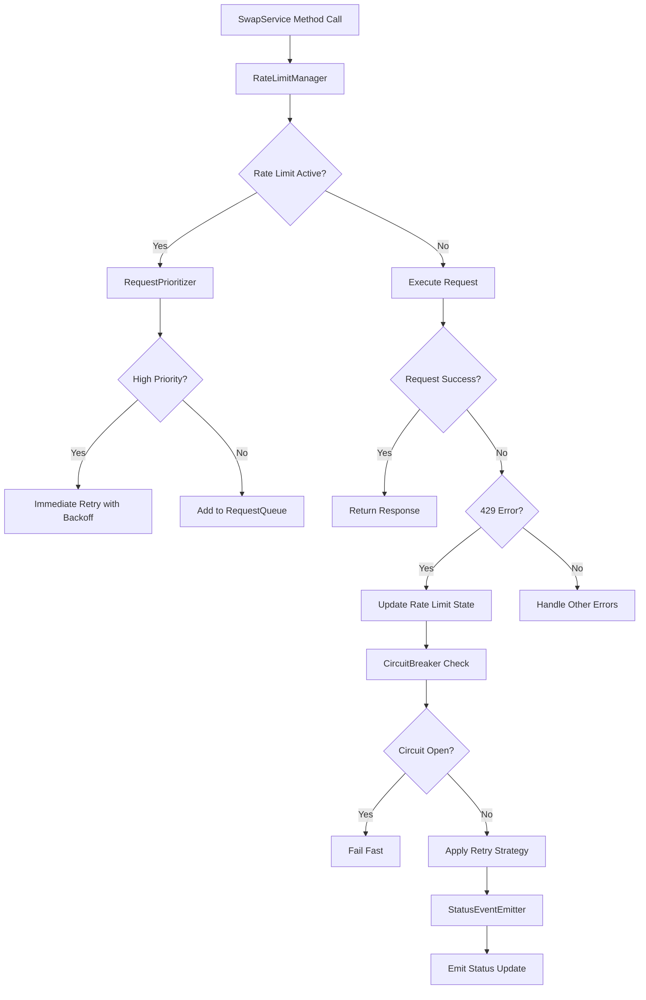

# API Rate Limiting Resilience Design

## Overview

This design implements a comprehensive rate limiting resilience system for the SwapService that provides automatic retry mechanisms, intelligent request queuing, circuit breaker protection, and enhanced error handling. The system will gracefully handle API rate limits while maintaining responsive user experience and providing clear feedback about system status.

## Architecture

### Core Components

1. **RateLimitManager**: Central coordinator for rate limiting logic and retry strategies
2. **RequestQueue**: Priority-based queue for managing pending requests during rate limiting
3. **CircuitBreaker**: Protection mechanism to prevent cascading failures
4. **RetryStrategy**: Configurable retry logic with exponential backoff
5. **StatusEventEmitter**: Event system for communicating status to UI components
6. **RequestPrioritizer**: Classification system for request importance levels

### Component Interaction Flow



## Components and Interfaces

### RateLimitManager

```typescript
interface RateLimitConfig {
  maxRetries: number;
  baseDelayMs: number;
  maxDelayMs: number;
  backoffMultiplier: number;
  jitterEnabled: boolean;
  respectRetryAfter: boolean;
}

interface RateLimitState {
  isActive: boolean;
  resetTime?: Date;
  remainingRequests?: number;
  retryAfterMs?: number;
  consecutiveFailures: number;
}

class RateLimitManager {
  private config: RateLimitConfig;
  private state: RateLimitState;
  private circuitBreaker: CircuitBreaker;
  private requestQueue: RequestQueue;
  private statusEmitter: StatusEventEmitter;

  async executeWithRateLimit<T>(
    request: () => Promise<T>,
    priority: RequestPriority,
    context: RequestContext
  ): Promise<T>;
  
  private calculateBackoffDelay(attempt: number): number;
  private updateRateLimitState(error: AxiosError): void;
  private shouldRetry(error: AxiosError, attempt: number): boolean;
}
```

### RequestQueue

```typescript
enum RequestPriority {
  CRITICAL = 1,    // Create, accept, reject, complete swap
  HIGH = 2,        // Get swap details, proposals
  MEDIUM = 3,      // Browse swaps, search
  LOW = 4          // Cache refresh, analytics
}

interface QueuedRequest {
  id: string;
  request: () => Promise<any>;
  priority: RequestPriority;
  context: RequestContext;
  timestamp: Date;
  retryCount: number;
  resolve: (value: any) => void;
  reject: (error: any) => void;
}

class RequestQueue {
  private queue: QueuedRequest[];
  private maxSize: number;
  private processing: boolean;

  enqueue(request: QueuedRequest): void;
  dequeue(): QueuedRequest | null;
  processQueue(): Promise<void>;
  clear(): void;
  getQueueStatus(): QueueStatus;
}
```

### CircuitBreaker

```typescript
interface CircuitBreakerConfig {
  failureThreshold: number;
  recoveryTimeoutMs: number;
  monitoringPeriodMs: number;
}

enum CircuitState {
  CLOSED = 'closed',
  OPEN = 'open',
  HALF_OPEN = 'half_open'
}

class CircuitBreaker {
  private state: CircuitState;
  private failureCount: number;
  private lastFailureTime?: Date;
  private config: CircuitBreakerConfig;

  async execute<T>(operation: () => Promise<T>): Promise<T>;
  private shouldAllowRequest(): boolean;
  private onSuccess(): void;
  private onFailure(): void;
  private transitionToHalfOpen(): void;
}
```

### StatusEventEmitter

```typescript
interface StatusEvent {
  type: 'rate_limit_active' | 'rate_limit_cleared' | 'circuit_breaker_open' | 
        'circuit_breaker_closed' | 'request_queued' | 'request_retry' | 'error_recovered';
  timestamp: Date;
  data: any;
  estimatedWaitTime?: number;
}

class StatusEventEmitter extends EventTarget {
  emit(event: StatusEvent): void;
  subscribe(eventType: string, callback: (event: StatusEvent) => void): void;
  unsubscribe(eventType: string, callback: (event: StatusEvent) => void): void;
}
```

## Data Models

### Enhanced Error Types

```typescript
interface RateLimitError extends SwapPlatformError {
  retryAfterMs?: number;
  remainingRequests?: number;
  resetTime?: Date;
  isRetryable: boolean;
}

interface RequestContext {
  method: string;
  endpoint: string;
  userId?: string;
  swapId?: string;
  priority: RequestPriority;
  startTime: Date;
}

interface RetryAttempt {
  attemptNumber: number;
  timestamp: Date;
  delayMs: number;
  error?: Error;
  success: boolean;
}
```

### Configuration Schema

```typescript
interface RateLimitingConfig {
  rateLimit: RateLimitConfig;
  circuitBreaker: CircuitBreakerConfig;
  requestQueue: {
    maxSize: number;
    processingIntervalMs: number;
    priorityWeights: Record<RequestPriority, number>;
  };
  monitoring: {
    enableMetrics: boolean;
    logLevel: 'error' | 'warn' | 'info' | 'debug';
    metricsRetentionMs: number;
  };
}
```

## Error Handling

### Error Classification

1. **Retryable Errors**: 429, 502, 503, 504, network timeouts
2. **Non-Retryable Errors**: 400, 401, 403, 404, 422
3. **Critical Errors**: Authentication failures, validation errors
4. **Transient Errors**: Network issues, temporary server problems

### Error Recovery Strategies

```typescript
interface ErrorRecoveryStrategy {
  canRecover(error: Error): boolean;
  recover(error: Error, context: RequestContext): Promise<void>;
  getRecoveryDelay(error: Error, attempt: number): number;
}

class NetworkErrorRecovery implements ErrorRecoveryStrategy {
  // Handles network connectivity issues
}

class AuthenticationErrorRecovery implements ErrorRecoveryStrategy {
  // Handles token refresh and re-authentication
}

class RateLimitErrorRecovery implements ErrorRecoveryStrategy {
  // Handles rate limiting with intelligent backoff
}
```

### Error Metrics and Monitoring

```typescript
interface ErrorMetrics {
  totalRequests: number;
  failedRequests: number;
  rateLimitedRequests: number;
  retriedRequests: number;
  circuitBreakerActivations: number;
  averageRetryDelay: number;
  successRateAfterRetry: number;
}

class MetricsCollector {
  recordRequest(context: RequestContext): void;
  recordError(error: Error, context: RequestContext): void;
  recordRetry(attempt: RetryAttempt): void;
  getMetrics(timeRange?: DateRange): ErrorMetrics;
}
```

## Testing Strategy

### Unit Tests

1. **RateLimitManager Tests**
   - Backoff calculation accuracy
   - Rate limit state management
   - Retry decision logic
   - Configuration validation

2. **RequestQueue Tests**
   - Priority ordering
   - Queue capacity management
   - Processing logic
   - Thread safety

3. **CircuitBreaker Tests**
   - State transitions
   - Failure threshold detection
   - Recovery timeout behavior
   - Half-open state handling

### Integration Tests

1. **End-to-End Rate Limiting**
   - Simulate 429 responses
   - Verify retry behavior
   - Test queue processing
   - Validate user feedback

2. **Error Recovery Scenarios**
   - Network failure recovery
   - Authentication error handling
   - Mixed error type handling
   - Concurrent request handling

### Performance Tests

1. **Load Testing**
   - High request volume handling
   - Queue performance under load
   - Memory usage optimization
   - CPU usage monitoring

2. **Stress Testing**
   - Circuit breaker activation
   - Queue overflow handling
   - Recovery after failures
   - Long-running rate limit scenarios

### Mock Testing Strategy

```typescript
interface MockRateLimitScenario {
  name: string;
  responses: MockResponse[];
  expectedBehavior: ExpectedBehavior;
}

class RateLimitTestHarness {
  setupScenario(scenario: MockRateLimitScenario): void;
  simulateRateLimit(duration: number, resetTime?: Date): void;
  verifyRetryBehavior(expectedAttempts: number): void;
  verifyQueueBehavior(expectedQueueSize: number): void;
}
```

## Implementation Considerations

### Performance Optimizations

1. **Request Batching**: Group similar requests when possible
2. **Intelligent Caching**: Cache responses during rate limiting periods
3. **Request Deduplication**: Avoid duplicate requests in queue
4. **Memory Management**: Efficient queue and metrics storage

### Security Considerations

1. **Token Management**: Secure handling of authentication during retries
2. **Request Sanitization**: Ensure retry requests don't leak sensitive data
3. **Rate Limit Bypass Prevention**: Validate all retry attempts
4. **Audit Logging**: Log all rate limiting events for security monitoring

### Monitoring and Observability

1. **Real-time Dashboards**: Display current rate limiting status
2. **Alert Thresholds**: Notify when circuit breaker activates
3. **Performance Metrics**: Track retry success rates and delays
4. **User Experience Metrics**: Monitor impact on user interactions

### Configuration Management

```typescript
const DEFAULT_CONFIG: RateLimitingConfig = {
  rateLimit: {
    maxRetries: 3,
    baseDelayMs: 1000,
    maxDelayMs: 30000,
    backoffMultiplier: 2,
    jitterEnabled: true,
    respectRetryAfter: true
  },
  circuitBreaker: {
    failureThreshold: 5,
    recoveryTimeoutMs: 60000,
    monitoringPeriodMs: 300000
  },
  requestQueue: {
    maxSize: 100,
    processingIntervalMs: 500,
    priorityWeights: {
      [RequestPriority.CRITICAL]: 1,
      [RequestPriority.HIGH]: 2,
      [RequestPriority.MEDIUM]: 3,
      [RequestPriority.LOW]: 4
    }
  },
  monitoring: {
    enableMetrics: true,
    logLevel: 'info',
    metricsRetentionMs: 3600000 // 1 hour
  }
};
```