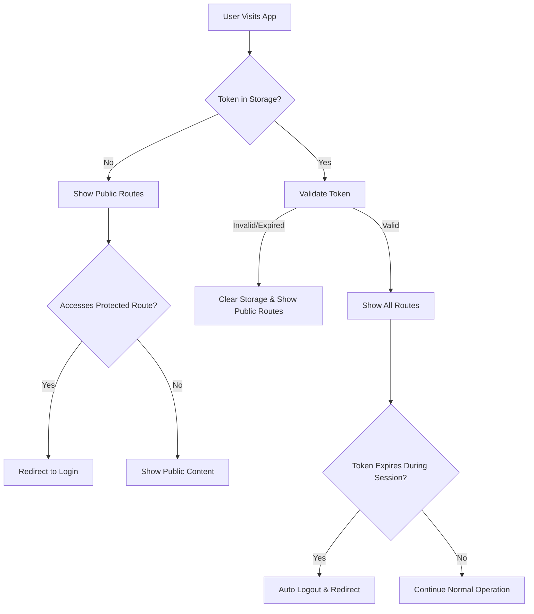

# Design Document

## Overview

This design implements a restructured routing architecture that makes `/browse` the default public view while protecting sensitive routes like `/bookings` and `/swaps` for authenticated users only. The solution includes enhanced token validation to ensure expired tokens are handled gracefully, providing both security and improved user experience.

## Architecture

### Routing Architecture

The application will use a dual-layer routing structure:

1. **Public Routes Layer**: Routes accessible without authentication
   - Root (`/`) → Browse Page (default)
   - `/browse` → Browse Page
   - `/login`, `/register`, `/auth/*` → Authentication pages

2. **Protected Routes Layer**: Routes requiring authentication
   - `/bookings` and sub-routes → Booking management
   - `/swaps` and sub-routes → Swap management  
   - `/dashboard`, `/profile`, `/admin` → User-specific pages

### Authentication Flow



## Components and Interfaces

### 1. Router Configuration

**File**: `apps/frontend/src/router/index.tsx`

**Design Changes**:
- Split routes into public and protected sections
- Remove ProtectedRoute wrapper from `/browse`
- Make root path default to Browse Page
- Maintain existing protected routes structure

**New Router Structure**:
```typescript
const router = createBrowserRouter([
  // Public routes - accessible to all users
  {
    path: '/',
    element: <Layout />,
    errorElement: <NotFoundPage />,
    children: [
      {
        index: true,
        element: <BrowsePageWithLoading />, // New default
      },
      {
        path: 'browse',
        element: <BrowsePageWithLoading />,
      },
    ],
  },
  // Authentication routes
  {
    path: '/login',
    element: <LoginForm />,
  },
  {
    path: '/register', 
    element: <RegisterForm />,
  },
  {
    path: '/auth/forgot-password',
    element: <PasswordResetRequest />,
  },
  {
    path: '/auth/reset-password',
    element: <PasswordReset />,
  },
  
  // Protected routes - authentication required
  {
    path: '/',
    element: (
      <ProtectedRoute>
        <Layout />
      </ProtectedRoute>
    ),
    children: [
      {
        path: 'bookings',
        element: <BookingsPage />,
      },
      // ... other protected routes
    ],
  },
]);
```

### 2. Enhanced AuthContext

**File**: `apps/frontend/src/contexts/AuthContext.tsx`

**Design Enhancements**:

#### Token Validation Function
```typescript
interface TokenValidationResult {
  isValid: boolean;
  reason?: 'expired' | 'invalid_format' | 'missing_claims';
}

const validateToken = (token: string): TokenValidationResult => {
  try {
    // Validate JWT format (3 parts)
    const parts = token.split('.');
    if (parts.length !== 3) {
      return { isValid: false, reason: 'invalid_format' };
    }

    // Decode and validate payload
    const payload = JSON.parse(atob(parts[1]));
    const now = Math.floor(Date.now() / 1000);

    // Check expiration with 30-second buffer
    if (payload.exp && payload.exp < (now + 30)) {
      return { isValid: false, reason: 'expired' };
    }

    // Validate required claims
    if (!payload.userId || !payload.exp) {
      return { isValid: false, reason: 'missing_claims' };
    }

    return { isValid: true };
  } catch (error) {
    return { isValid: false, reason: 'invalid_format' };
  }
};
```

#### Enhanced Initialization
```typescript
useEffect(() => {
  const savedToken = localStorage.getItem('auth_token');
  const savedUser = localStorage.getItem('auth_user');

  if (savedToken && savedUser) {
    const validation = validateToken(savedToken);
    
    if (validation.isValid) {
      setToken(savedToken);
      setUser(JSON.parse(savedUser));
    } else {
      console.log(`Stored token is ${validation.reason}, clearing auth state`);
      clearAuthStorage();
    }
  }

  setIsLoading(false);
}, []);
```

#### Periodic Token Validation
```typescript
useEffect(() => {
  if (!token || !user) return;

  const interval = setInterval(() => {
    const validation = validateToken(token);
    if (!validation.isValid) {
      console.log(`Token ${validation.reason} during session, logging out`);
      logout();
    }
  }, 60000); // Check every minute

  return () => clearInterval(interval);
}, [token, user]);
```

### 3. Layout Component Enhancement

**File**: `apps/frontend/src/components/layout/Layout.tsx`

**Design Changes**:
- Conditional rendering based on authentication status
- Support both public and protected contexts
- Dynamic navigation menu

```typescript
interface LayoutProps {
  children: React.ReactNode;
}

export const Layout: React.FC<LayoutProps> = ({ children }) => {
  const { isAuthenticated, isLoading } = useAuth();

  if (isLoading) {
    return <LoadingSpinner />;
  }

  return (
    <div className="app-layout">
      <Header isAuthenticated={isAuthenticated} />
      <div className="main-content">
        <Sidebar isAuthenticated={isAuthenticated} />
        <main className="content-area">
          {children}
        </main>
      </div>
    </div>
  );
};
```

### 4. Navigation Components

**Files**: 
- `apps/frontend/src/components/layout/Sidebar.tsx`
- `apps/frontend/src/components/layout/Header.tsx`

**Design Pattern**:
```typescript
interface NavigationProps {
  isAuthenticated: boolean;
}

// Sidebar navigation items
const getNavigationItems = (isAuthenticated: boolean) => [
  { path: '/browse', label: 'Browse Swaps', public: true },
  ...(isAuthenticated ? [
    { path: '/bookings', label: 'My Bookings', public: false },
    { path: '/swaps', label: 'My Swaps', public: false },
    { path: '/dashboard', label: 'Dashboard', public: false },
  ] : []),
];

// Header authentication controls
const AuthControls: React.FC<{ isAuthenticated: boolean }> = ({ isAuthenticated }) => {
  if (isAuthenticated) {
    return <UserMenu />;
  }
  
  return (
    <div className="auth-controls">
      <Link to="/login">Login</Link>
      <Link to="/register">Sign Up</Link>
    </div>
  );
};
```

### 5. Browse Page Enhancement

**File**: `apps/frontend/src/pages/BrowsePage.tsx`

**Design Changes**:
- Handle both authenticated and unauthenticated states
- Show authentication prompts for protected actions
- Preserve user intent for post-login redirect

```typescript
const BrowsePage: React.FC = () => {
  const { isAuthenticated } = useAuth();
  const navigate = useNavigate();

  const handleProtectedAction = (action: string, context?: any) => {
    if (!isAuthenticated) {
      navigate('/login', { 
        state: { 
          from: '/browse', 
          action,
          context 
        } 
      });
      return false;
    }
    return true;
  };

  const handleMakeProposal = (swapId: string) => {
    if (handleProtectedAction('make-proposal', { swapId })) {
      // Proceed with proposal creation
      setSelectedSwapId(swapId);
      setShowProposalModal(true);
    }
  };

  return (
    <div className="browse-page">
      {!isAuthenticated && (
        <CallToActionBanner 
          message="Sign up to create proposals and manage your swaps"
          primaryAction={{ label: "Sign Up", path: "/register" }}
          secondaryAction={{ label: "Login", path: "/login" }}
        />
      )}
      
      <SwapGrid 
        swaps={swaps}
        onMakeProposal={handleMakeProposal}
        showAuthPrompts={!isAuthenticated}
      />
    </div>
  );
};
```

## Data Models

### Authentication State

```typescript
interface AuthState {
  user: User | null;
  token: string | null;
  isAuthenticated: boolean;
  isLoading: boolean;
}

interface User {
  id: string;
  email?: string;
  username?: string;
  walletAddress?: string;
  // ... other user properties
}

interface LoginRedirectState {
  from: string;
  action?: string;
  context?: any;
}
```

### Token Validation

```typescript
interface TokenPayload {
  userId: string;
  jti: string;
  email?: string;
  username?: string;
  walletAddress?: string;
  exp: number;
  iat: number;
}

interface TokenValidationResult {
  isValid: boolean;
  reason?: 'expired' | 'invalid_format' | 'missing_claims';
  payload?: TokenPayload;
}
```

## Error Handling

### Token Validation Errors

1. **Invalid Format**: Clear storage, log warning, treat as unauthenticated
2. **Expired Token**: Clear storage, show expiration message, redirect to login
3. **Missing Claims**: Clear storage, log error, treat as unauthenticated
4. **Network Errors**: Retry validation, fallback to local validation

### Route Protection Errors

1. **Unauthenticated Access**: Redirect to login with return path
2. **Authorization Errors**: Show appropriate error message
3. **Network Failures**: Show offline message, allow retry

### User Experience Error Handling

```typescript
const ErrorBoundary: React.FC = ({ children }) => {
  return (
    <ErrorBoundaryComponent
      fallback={({ error, resetError }) => (
        <ErrorDisplay 
          error={error}
          onRetry={resetError}
          showLoginPrompt={!isAuthenticated}
        />
      )}
    >
      {children}
    </ErrorBoundaryComponent>
  );
};
```

## Testing Strategy

### Unit Testing

1. **Token Validation Functions**
   - Valid token scenarios
   - Expired token scenarios  
   - Invalid format scenarios
   - Missing claims scenarios

2. **AuthContext Behavior**
   - Initialization with valid/invalid tokens
   - Periodic validation triggers
   - Logout on token expiration

3. **Route Configuration**
   - Public route accessibility
   - Protected route redirects
   - Authentication state changes

### Integration Testing

1. **Authentication Flows**
   - Login → redirect to intended page
   - Token expiration → logout → redirect
   - Unauthenticated access → login prompt

2. **Navigation Behavior**
   - Menu items based on auth state
   - Route transitions
   - State preservation

### End-to-End Testing

1. **User Journeys**
   - Unauthenticated browsing → login → protected access
   - Token expiration during session
   - Cross-tab authentication sync

2. **Security Scenarios**
   - Expired token handling
   - Direct URL access attempts
   - Token manipulation attempts

## Security Considerations

### Token Security

1. **Storage**: Continue using localStorage with CSP headers
2. **Validation**: Client and server-side validation
3. **Expiration**: 24-hour expiration with 30-second buffer
4. **Transmission**: HTTPS only, Bearer token format

### Route Protection

1. **Client-side**: ProtectedRoute component for UX
2. **Server-side**: Auth middleware on all protected endpoints
3. **Consistency**: Same protection logic across all routes

### Data Exposure

1. **Public Data**: Only non-sensitive swap listings on browse page
2. **Protected Data**: User bookings, proposals, personal info
3. **API Endpoints**: Audit all endpoints for proper protection

## Performance Considerations

### Token Validation Performance

- **Initialization**: < 10ms for token validation
- **Periodic Checks**: Minimal CPU impact (60-second intervals)
- **Memory Usage**: No memory leaks from intervals

### Route Rendering Performance

- **Code Splitting**: Lazy load protected route components
- **Caching**: Cache navigation state and user preferences
- **Bundle Size**: Minimize impact on initial load

### Network Optimization

- **API Calls**: Batch validation with other requests when possible
- **Caching**: Cache public browse data appropriately
- **Error Handling**: Graceful degradation for network issues

## Migration Strategy

### Phase 1: Routing Changes
1. Update router configuration
2. Modify Layout component
3. Test public route access

### Phase 2: Token Validation
1. Add validation functions to AuthContext
2. Implement initialization validation
3. Add periodic validation

### Phase 3: UX Enhancements
1. Update Browse page for unauthenticated users
2. Add authentication prompts
3. Enhance error messaging

### Rollback Plan

- **Router**: Revert to original configuration
- **AuthContext**: Remove validation enhancements
- **Components**: Restore original Layout behavior

Each phase can be rolled back independently with minimal impact.