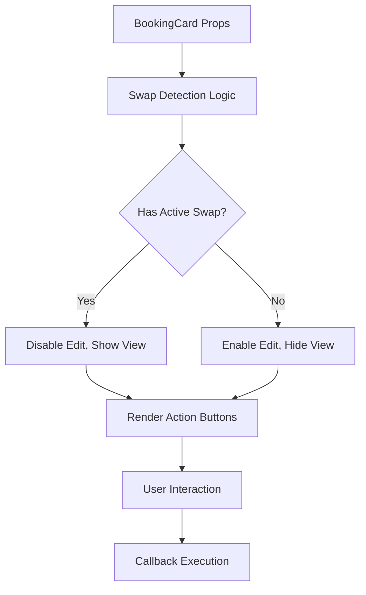

# Design Document

## Overview

This design implements UI restrictions for booking edit functionality when active swaps are present, replacing the Edit button with a View button to prevent data inconsistency while maintaining user access to booking details. The solution builds upon the existing BookingCard and BookingActions components, enhancing the swap detection logic and button state management.

## Architecture

### Component Hierarchy
```
BookingCard
├── BookingActions (OwnerActions)
│   ├── Edit Button (conditional)
│   ├── View Button (conditional)
│   ├── Create Swap Button
│   └── Manage Swap Button
└── SwapInfo Integration
```

### State Management Flow


## Components and Interfaces

### Enhanced BookingCard Component

The BookingCard component will be updated to include improved swap detection and conditional button rendering:

```typescript
interface BookingCardProps {
  // Existing props...
  onViewDetails?: (booking: Booking) => void;
  // Enhanced swap detection
  swapInfo?: SwapInfo;
  showSwapIndicators?: boolean;
}
```

### Enhanced OwnerActions Component

The OwnerActions component will implement the core button restriction logic:

```typescript
interface OwnerActionsProps {
  // Existing props...
  onViewDetails?: (booking: Booking) => void;
  // New prop for explicit view button control
  showViewButton?: boolean;
}

interface ButtonState {
  editEnabled: boolean;
  editTooltip: string;
  viewVisible: boolean;
  viewTooltip: string;
}
```

### Swap Detection Service

A utility service to centralize swap detection logic:

```typescript
interface SwapDetectionService {
  hasActiveSwap(swapInfo?: SwapInfo): boolean;
  getSwapRestrictionReason(swapInfo?: SwapInfo): string | null;
  isSwapConfigured(swapInfo?: SwapInfo): boolean;
}
```

## Data Models

### Enhanced SwapInfo Interface

The existing SwapInfo interface already contains the necessary fields, but we'll define the specific fields used for detection:

```typescript
interface SwapInfo {
  // Core configuration fields for detection
  paymentTypes?: ('booking' | 'cash')[];
  acceptanceStrategy?: 'first_match' | 'auction';
  minCashAmount?: number;
  maxCashAmount?: number;
  
  // Active state indicators
  hasActiveProposals?: boolean;
  activeProposalCount?: number;
  userProposalStatus?: 'pending' | 'accepted' | 'rejected';
  
  // Additional fields...
}
```

### Button State Model

```typescript
interface BookingButtonState {
  edit: {
    enabled: boolean;
    visible: boolean;
    tooltip: string;
    variant: 'primary' | 'outline' | 'secondary';
  };
  view: {
    enabled: boolean;
    visible: boolean;
    tooltip: string;
    variant: 'outline' | 'secondary';
  };
  createSwap: {
    enabled: boolean;
    visible: boolean;
    tooltip: string;
  };
}
```

## Error Handling

### Graceful Degradation Strategy

1. **Missing SwapInfo**: Default to allowing edit functionality
2. **Malformed SwapInfo**: Log warning and allow edit functionality
3. **Missing Callbacks**: Hide corresponding buttons gracefully
4. **Network Issues**: Maintain last known valid state

### Error Recovery Patterns

```typescript
const safeSwapDetection = (swapInfo?: SwapInfo): boolean => {
  try {
    return hasActiveSwap(swapInfo);
  } catch (error) {
    console.warn('Swap detection failed, defaulting to allow edit:', error);
    return false;
  }
};
```

## Testing Strategy

### Unit Testing Focus Areas

1. **Swap Detection Logic**
   - Test various SwapInfo configurations
   - Test edge cases (null, undefined, malformed data)
   - Test boundary conditions for active swap determination

2. **Button State Management**
   - Test button visibility and enabled states
   - Test tooltip content generation
   - Test callback execution prevention

3. **Component Integration**
   - Test BookingCard with various prop combinations
   - Test OwnerActions button rendering
   - Test responsive behavior

### Integration Testing Scenarios

1. **User Workflow Testing**
   - Create booking → Enable swap → Verify edit restriction
   - Cancel swap → Verify edit re-enablement
   - View button functionality with onViewDetails callback

2. **State Transition Testing**
   - Swap creation impact on button states
   - Swap completion impact on button states
   - Real-time updates and UI synchronization

### Accessibility Testing

1. **Keyboard Navigation**
   - Tab order with disabled buttons
   - Focus management during state changes
   - Screen reader announcements

2. **Visual Accessibility**
   - Color contrast for disabled states
   - Clear visual indicators for button states
   - Tooltip accessibility

## Implementation Details

### Swap Detection Algorithm

```typescript
const hasActiveSwap = (swapInfo?: SwapInfo): boolean => {
  if (!swapInfo) return false;

  // Check for essential swap configuration
  const hasPaymentTypes = swapInfo.paymentTypes && swapInfo.paymentTypes.length > 0;
  const hasAcceptanceStrategy = Boolean(swapInfo.acceptanceStrategy);
  
  // Check for active proposals
  const hasActiveProposals = swapInfo.hasActiveProposals || 
    (swapInfo.activeProposalCount && swapInfo.activeProposalCount > 0);
  
  // Check for pending user proposals
  const hasPendingProposal = swapInfo.userProposalStatus === 'pending';

  // Swap is active if it's configured OR has active proposals
  return (hasPaymentTypes && hasAcceptanceStrategy) || hasActiveProposals || hasPendingProposal;
};
```

### Button State Calculation

```typescript
const calculateButtonState = (
  booking: Booking,
  swapInfo?: SwapInfo,
  callbacks: {
    onEdit?: (booking: Booking) => void;
    onViewDetails?: (booking: Booking) => void;
  }
): BookingButtonState => {
  const hasActiveSwap = hasActiveSwapDetection(swapInfo);
  const isBookingActive = booking.status === 'available';

  return {
    edit: {
      enabled: isBookingActive && !hasActiveSwap && Boolean(callbacks.onEdit),
      visible: Boolean(callbacks.onEdit),
      tooltip: hasActiveSwap 
        ? 'Cannot edit booking with active swap'
        : !isBookingActive 
          ? 'Cannot edit inactive booking'
          : 'Edit booking details',
      variant: 'outline'
    },
    view: {
      enabled: Boolean(callbacks.onViewDetails),
      visible: hasActiveSwap && Boolean(callbacks.onViewDetails),
      tooltip: 'View booking details (read-only)',
      variant: 'outline'
    },
    createSwap: {
      enabled: !hasActiveSwap && isBookingActive,
      visible: !hasActiveSwap,
      tooltip: hasActiveSwap ? 'Swap already exists' : 'Create swap for this booking'
    }
  };
};
```

### Component Updates

#### BookingCard Changes

1. **Enhanced hasSwapConfigured function**: Update to use the new swap detection logic
2. **Conditional View button rendering**: Add View button when Edit is restricted
3. **Improved tooltip management**: Centralize tooltip logic for consistency

#### OwnerActions Changes

1. **Button state calculation**: Implement the new button state logic
2. **Conditional rendering**: Update JSX to handle Edit/View button switching
3. **Event handler updates**: Ensure proper callback execution based on button state

### Performance Considerations

1. **Memoization**: Use React.useMemo for expensive button state calculations
2. **Callback Optimization**: Use React.useCallback for event handlers
3. **Re-render Prevention**: Minimize unnecessary component updates

### Mobile Responsiveness

1. **Touch Targets**: Ensure buttons meet minimum touch target sizes
2. **Tooltip Adaptation**: Use appropriate tooltip display for mobile devices
3. **Button Layout**: Maintain proper spacing and alignment on small screens

## Migration Strategy

### Backward Compatibility

1. **Prop Compatibility**: All existing props remain functional
2. **Callback Compatibility**: Existing onEdit and onViewDetails callbacks work unchanged
3. **Default Behavior**: Components without onViewDetails callback behave as before

### Rollout Plan

1. **Phase 1**: Update swap detection logic and button state calculation
2. **Phase 2**: Implement View button rendering and event handling
3. **Phase 3**: Update styling and accessibility features
4. **Phase 4**: Comprehensive testing and refinement

### Monitoring and Validation

1. **User Interaction Tracking**: Monitor Edit button click attempts on restricted bookings
2. **Error Rate Monitoring**: Track any errors in swap detection or button rendering
3. **User Feedback Collection**: Gather feedback on the new View button functionality