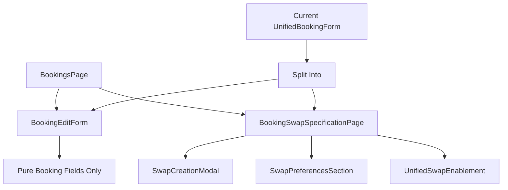

# Design Document

## Overview

This design separates the booking edit functionality from swap creation to provide a cleaner, more focused user experience. The current `UnifiedBookingForm` component combines both booking editing and swap creation in a single interface, which can be confusing for users who simply want to edit their booking details. This design creates two distinct interfaces:

1. **Focused Booking Edit Interface** - A streamlined form for editing booking details only
2. **Dedicated Swap Specification Screen** - A separate interface specifically for creating and managing swap proposals

The separation maintains all existing functionality while providing clearer user flows and better separation of concerns in the codebase.

## Architecture

### Current State Analysis

The current implementation uses:
- `UnifiedBookingForm` component that handles both booking editing and swap creation
- `SwapPreferencesSection` component embedded within the booking form
- `UnifiedSwapEnablement` component for swap-related functionality
- Navigation between BookingsPage and SwapsPage for different contexts

### Proposed Architecture Changes



### Component Hierarchy

```
BookingsPage
├── BookingEditForm (NEW - focused on booking only)
│   ├── Basic booking fields
│   ├── Validation for booking data only
│   └── "Enable Swapping" button → navigate to swap specification
├── BookingCard
│   ├── Edit button → BookingEditForm
│   └── Enable Swapping button → BookingSwapSpecificationPage
└── BookingDetailsModal

BookingSwapSpecificationPage (NEW - dedicated swap interface)
├── Booking context display (read-only)
├── SwapPreferencesSection
├── UnifiedSwapEnablement
└── SwapCreationModal integration
```

## Components and Interfaces

### 1. BookingEditForm Component (NEW)

**Purpose**: Focused form for editing booking details only, extracted from UnifiedBookingForm

**Props Interface**:
```typescript
interface BookingEditFormProps {
  isOpen: boolean;
  onClose: () => void;
  onSubmit: (data: BookingData) => Promise<void>;
  onNavigateToSwapSpec: (booking: Booking) => void;
  booking?: Booking;
  loading?: boolean;
}

interface BookingData {
  type: BookingType;
  title: string;
  description: string;
  location: BookingLocation;
  dateRange: BookingDateRange;
  originalPrice: number;
  swapValue: number;
  providerDetails: BookingProviderDetails;
  // Note: No swap-related fields
}
```

**Key Features**:
- Contains only booking-related fields (no swap preferences)
- Validation focused on booking data integrity
- "Enable Swapping" button that saves current changes and navigates to swap specification
- Clear visual distinction from swap-related interfaces
- Maintains all current booking validation logic

### 2. BookingSwapSpecificationPage Component (NEW)

**Purpose**: Dedicated page for creating and managing swap proposals for a specific booking

**Props Interface**:
```typescript
interface BookingSwapSpecificationPageProps {
  bookingId: string; // From URL params
}

interface SwapSpecificationState {
  booking: Booking | null;
  swapPreferences: SwapPreferencesData | null;
  loading: boolean;
  error: string | null;
  hasExistingSwap: boolean;
}
```

**Key Features**:
- Pre-populated with booking information (read-only context)
- Full swap creation and management interface
- Integration with existing SwapPreferencesSection
- Navigation breadcrumbs back to booking management
- Handles both new swap creation and existing swap management

### 3. Enhanced BookingCard Component

**Purpose**: Update existing BookingCard to support separated navigation

**Changes**:
```typescript
interface BookingCardProps {
  // ... existing props
  onEdit: (booking: Booking) => void; // Navigate to BookingEditForm
  onEnableSwapping: (booking: Booking) => void; // Navigate to SwapSpecificationPage
  // Separate the two actions clearly
}
```

### 4. Navigation and Routing Updates

**New Routes**:
```typescript
// New route for swap specification
/bookings/:bookingId/swap-specification

// Existing routes remain the same
/bookings (BookingsPage)
/bookings/new (BookingsPage with create modal)
/swaps (SwapsPage)
```

**URL Structure**:
- `/bookings/:bookingId/edit` - Direct link to booking edit (optional)
- `/bookings/:bookingId/swap-specification` - Direct link to swap specification
- Query parameters for state preservation: `?returnTo=/bookings`

## Data Models

### 1. Separated Data Interfaces

```typescript
// Pure booking data (no swap fields)
interface BookingEditData {
  type: BookingType;
  title: string;
  description: string;
  location: BookingLocation;
  dateRange: BookingDateRange;
  originalPrice: number;
  swapValue: number;
  providerDetails: BookingProviderDetails;
}

// Swap specification data (separate from booking)
interface SwapSpecificationData {
  bookingId: string;
  swapPreferences: SwapPreferencesData;
  swapEnabled: boolean;
}

// Combined interface for API calls when needed
interface BookingWithSwapUpdate {
  bookingData: BookingEditData;
  swapData?: SwapSpecificationData;
}
```

### 2. State Management Updates

```typescript
// Redux slice updates
interface BookingState {
  bookings: Booking[];
  editingBooking: Booking | null;
  // Remove swap-related state from booking slice
}

interface SwapState {
  // Move swap-related state here
  swapSpecification: SwapSpecificationData | null;
  activeSwapBooking: Booking | null;
}
```

## Error Handling

### 1. Booking Edit Error Handling

```typescript
interface BookingEditErrors {
  title?: string;
  description?: string;
  location?: string;
  dateRange?: string;
  originalPrice?: string;
  providerDetails?: string;
  // No swap-related errors
}
```

### 2. Swap Specification Error Handling

```typescript
interface SwapSpecificationErrors {
  paymentTypes?: string;
  minCashAmount?: string;
  maxCashAmount?: string;
  acceptanceStrategy?: string;
  auctionEndDate?: string;
  swapConditions?: string;
  walletConnection?: string;
}
```

### 3. Navigation Error Handling

- Unsaved changes detection and user prompts
- Graceful handling of invalid booking IDs in URLs
- Fallback navigation when swap specification fails to load
- Clear error messages with recovery options

## Testing Strategy

### 1. Unit Testing

**BookingEditForm Tests**:
- Booking field validation
- Form submission with booking data only
- Navigation to swap specification
- Error handling and display

**BookingSwapSpecificationPage Tests**:
- Booking context loading and display
- Swap preference management
- Integration with existing swap components
- Navigation and URL handling

### 2. Integration Testing

**User Flow Tests**:
- Complete booking edit workflow
- Booking edit → swap specification workflow
- Navigation between interfaces
- Data persistence across navigation

**API Integration Tests**:
- Separated API calls for booking vs swap updates
- Error handling for partial failures
- Data consistency validation

### 3. E2E Testing

**Critical User Journeys**:
1. Edit booking details only (no swap changes)
2. Edit booking and then create swap
3. Edit existing booking with active swap
4. Navigate between edit and swap interfaces
5. Handle unsaved changes during navigation

## Implementation Phases

### Phase 1: Component Separation
1. Extract BookingEditForm from UnifiedBookingForm
2. Create BookingSwapSpecificationPage component
3. Update BookingCard component with separated actions
4. Add new routing configuration

### Phase 2: State Management Updates
1. Separate booking and swap state management
2. Update Redux slices and actions
3. Implement navigation state preservation
4. Add error handling for separated concerns

### Phase 3: Integration and Testing
1. Integrate components with existing pages
2. Update API service calls for separated data
3. Implement comprehensive testing suite
4. Add accessibility enhancements

### Phase 4: User Experience Enhancements
1. Add visual distinctions between interfaces
2. Implement breadcrumb navigation
3. Add contextual help and guidance
4. Optimize mobile experience for separated interfaces

## Migration Strategy

### 1. Backward Compatibility

- Maintain existing UnifiedBookingForm as deprecated component
- Gradual migration of existing bookings to new interface
- Support for existing URLs and deep links
- Data migration for any structural changes

### 2. Feature Flags

```typescript
interface FeatureFlags {
  separatedBookingEdit: boolean; // Enable new separated interface
  legacyUnifiedForm: boolean;    // Keep old interface available
}
```

### 3. Rollback Plan

- Keep UnifiedBookingForm component available for rollback
- Database schema remains compatible
- Feature flag to switch between old and new interfaces
- Monitoring and error tracking for new components

## Performance Considerations

### 1. Code Splitting

- Lazy load BookingSwapSpecificationPage component
- Separate bundles for booking edit vs swap functionality
- Optimize component loading based on user actions

### 2. State Management Optimization

- Reduce unnecessary re-renders with separated state
- Optimize API calls by separating booking and swap updates
- Cache booking data when navigating to swap specification

### 3. Mobile Performance

- Optimize touch interactions for separated interfaces
- Reduce memory usage with focused components
- Improve loading times with component separation

## Security Considerations

### 1. Data Validation

- Separate validation rules for booking vs swap data
- Prevent swap data injection into booking updates
- Validate user permissions for both booking edit and swap creation

### 2. Navigation Security

- Validate booking ownership before allowing edit access
- Secure URL parameters and prevent unauthorized access
- Audit trail for separated booking and swap operations

### 3. API Security

- Separate API endpoints maintain existing security
- Rate limiting for both booking and swap operations
- Input sanitization for separated data models