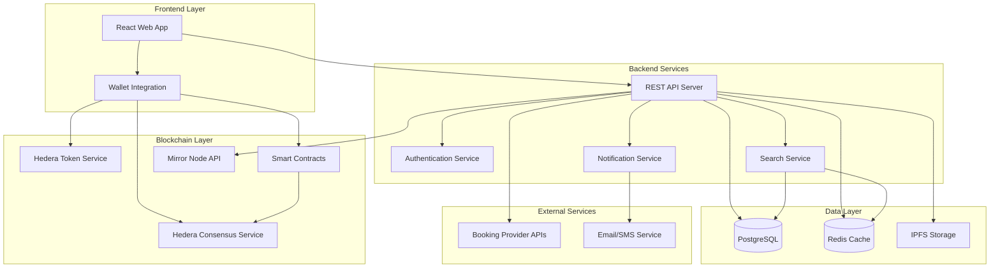

# Design Document

## Overview

The Booking Swap Platform is a decentralized application built on Hedera blockchain that enables secure peer-to-peer booking exchanges. The platform leverages Hedera's unique features including low transaction costs, fast finality, and energy efficiency to create a trustless marketplace for booking swaps.

The system architecture follows a hybrid approach, combining traditional web application patterns with blockchain integration for transaction security and immutability.

## Architecture

### High-Level Architecture



### Technology Stack

- **Frontend**: React.js with TypeScript, Hedera Wallet Connect
- **Backend**: Node.js with Express, TypeScript
- **Blockchain**: Hedera Hashgraph (HCS, HTS, Smart Contracts)
- **Database**: PostgreSQL for off-chain data, Redis for caching
- **Storage**: IPFS for booking documents and metadata
- **Authentication**: JWT with Hedera wallet signatures

## Components and Interfaces

### Core Components

#### 1. Booking Management Service

- **Purpose**: Handles booking validation, listing, and metadata management
- **Key Methods**:
  - `validateBooking(bookingData)`: Verifies booking authenticity with provider APIs
  - `createListing(booking, terms)`: Creates blockchain record and database entry
  - `updateBookingStatus(bookingId, status)`: Updates booking availability

#### 2. Swap Engine

- **Purpose**: Manages swap proposals, matching, and execution
- **Key Methods**:
  - `proposeSwap(sourceBooking, targetBooking, terms)`: Creates swap proposal
  - `executeSwap(swapId)`: Performs atomic swap on blockchain
  - `cancelSwap(swapId)`: Cancels pending swap and releases locks

#### 3. Blockchain Integration Service

- **Purpose**: Interfaces with Hedera services
- **Key Methods**:
  - `recordTransaction(transactionData)`: Submits to HCS
  - `createEscrow(swapDetails)`: Creates smart contract escrow
  - `verifyTransaction(transactionId)`: Queries Mirror Node for verification

#### 4. Search and Discovery Service

- **Purpose**: Enables efficient booking search and filtering
- **Key Methods**:
  - `searchBookings(criteria)`: Returns matching available bookings
  - `getRecommendations(userProfile)`: Suggests relevant swaps
  - `indexBooking(booking)`: Updates search indices

### API Interfaces

#### REST API Endpoints

```typescript
// Booking Management
POST /api/bookings - Create new booking listing
GET /api/bookings - Search available bookings
GET /api/bookings/:id - Get booking details
PUT /api/bookings/:id - Update booking
DELETE /api/bookings/:id - Remove booking

// Swap Operations
POST /api/swaps - Propose new swap
GET /api/swaps - Get user's swaps
PUT /api/swaps/:id/accept - Accept swap proposal
PUT /api/swaps/:id/reject - Reject swap proposal
GET /api/swaps/:id/status - Get swap status

// User Management
GET /api/users/profile - Get user profile
PUT /api/users/profile - Update user profile
GET /api/users/history - Get transaction history
GET /api/users/dashboard - Get dashboard data
```

#### Hedera Integration Interface

```typescript
interface HederaService {
  submitTransaction(data: TransactionData): Promise<TransactionId>;
  queryTransaction(id: TransactionId): Promise<TransactionRecord>;
  createSmartContract(bytecode: string): Promise<ContractId>;
  executeContract(
    contractId: ContractId,
    params: any[]
  ): Promise<TransactionResult>;
}
```

## Data Models

### Core Data Structures

#### Booking Model

```typescript
interface Booking {
  id: string;
  userId: string;
  type: 'hotel' | 'event' | 'flight' | 'rental';
  title: string;
  description: string;
  location: {
    city: string;
    country: string;
    coordinates?: [number, number];
  };
  dateRange: {
    checkIn: Date;
    checkOut: Date;
  };
  originalPrice: number;
  swapValue: number;
  providerDetails: {
    provider: string;
    confirmationNumber: string;
    bookingReference: string;
  };
  verification: {
    status: 'pending' | 'verified' | 'failed';
    verifiedAt?: Date;
    documents: string[]; // IPFS hashes
  };
  blockchain: {
    transactionId?: string;
    consensusTimestamp?: string;
    topicId: string;
  };
  status: 'available' | 'locked' | 'swapped' | 'cancelled';
  createdAt: Date;
  updatedAt: Date;
}
```

#### Swap Model

```typescript
interface Swap {
  id: string;
  sourceBookingId: string;
  targetBookingId: string;
  proposerId: string;
  ownerId: string;
  status: 'pending' | 'accepted' | 'rejected' | 'completed' | 'cancelled';
  terms: {
    additionalPayment?: number;
    conditions: string[];
    expiresAt: Date;
  };
  blockchain: {
    proposalTransactionId: string;
    executionTransactionId?: string;
    escrowContractId?: string;
  };
  timeline: {
    proposedAt: Date;
    respondedAt?: Date;
    completedAt?: Date;
  };
}
```

#### User Model

```typescript
interface User {
  id: string;
  walletAddress: string;
  profile: {
    displayName?: string;
    email?: string;
    phone?: string;
    preferences: {
      notifications: boolean;
      autoAcceptCriteria?: SwapCriteria;
    };
  };
  verification: {
    level: 'basic' | 'verified' | 'premium';
    documents: string[]; // IPFS hashes
    verifiedAt?: Date;
  };
  reputation: {
    score: number;
    completedSwaps: number;
    cancelledSwaps: number;
    reviews: Review[];
  };
  createdAt: Date;
  lastActiveAt: Date;
}
```

## Error Handling

### Error Categories

1. **Validation Errors**: Invalid booking data, expired bookings, insufficient permissions
2. **Blockchain Errors**: Transaction failures, network issues, insufficient balance
3. **Integration Errors**: Booking provider API failures, verification timeouts
4. **Business Logic Errors**: Double-spending attempts, invalid swap proposals

### Error Handling Strategy

```typescript
class SwapPlatformError extends Error {
  constructor(
    public code: string,
    public message: string,
    public category: 'validation' | 'blockchain' | 'integration' | 'business',
    public retryable: boolean = false
  ) {
    super(message);
  }
}

// Error handling middleware
const errorHandler = (
  error: SwapPlatformError,
  req: Request,
  res: Response
) => {
  const response = {
    error: {
      code: error.code,
      message: error.message,
      category: error.category,
      retryable: error.retryable,
      timestamp: new Date().toISOString(),
    },
  };

  // Log to monitoring system
  logger.error('Platform error', { error, requestId: req.id });

  // Return appropriate HTTP status
  const statusCode = getStatusCodeForError(error);
  res.status(statusCode).json(response);
};
```

### Blockchain Error Recovery

- **Transaction Failures**: Implement retry logic with exponential backoff
- **Network Partitions**: Queue transactions for later submission
- **Smart Contract Failures**: Automatic rollback and user notification
- **Consensus Delays**: Provide real-time status updates to users

## Testing Strategy

### Testing Pyramid

#### Unit Tests (70%)

- Individual service methods
- Data model validation
- Utility functions
- Blockchain integration helpers

#### Integration Tests (20%)

- API endpoint testing
- Database operations
- External service mocking
- Hedera testnet integration

#### End-to-End Tests (10%)

- Complete user workflows
- Cross-service interactions
- Blockchain transaction verification
- UI automation testing

### Test Environments

1. **Local Development**: Mock Hedera services, local database
2. **Integration Testing**: Hedera testnet, staging database
3. **Staging**: Mirror of production with test data
4. **Production**: Live Hedera mainnet with monitoring

### Blockchain Testing Approach

```typescript
// Mock Hedera service for unit tests
class MockHederaService implements HederaService {
  private transactions: Map<string, TransactionRecord> = new Map()

  async submitTransaction(data: TransactionData): Promise<TransactionId> {
    const txId = generateMockTransactionId()
    this.transactions.set(txId, createMockRecord(data))
    return txId
  }

  async queryTransaction(id: TransactionId): Promise<TransactionRecord> {
    return this.transactions.get(id) || throw new Error('Transaction not found')
  }
}

// Integration tests with testnet
describe('Swap Execution Integration', () => {
  it('should complete swap on Hedera testnet', async () => {
    const swap = await createTestSwap()
    const result = await swapEngine.executeSwap(swap.id)

    // Verify on blockchain
    const txRecord = await hederaService.queryTransaction(result.transactionId)
    expect(txRecord.receipt.status).toBe('SUCCESS')
  })
})
```

### Performance Testing

- **Load Testing**: Simulate high booking volume and concurrent swaps
- **Stress Testing**: Test system limits and failure modes
- **Blockchain Performance**: Measure transaction throughput and latency
- **Database Performance**: Query optimization and indexing validation
