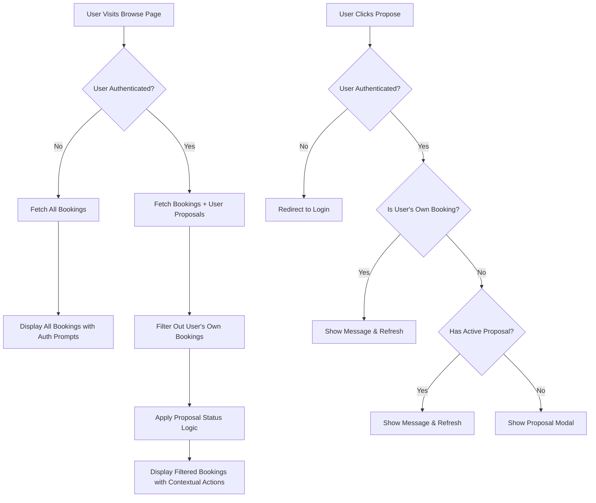

# Design Document

## Overview

This design implements intelligent filtering and proposal management for the browse page to enhance user experience by hiding irrelevant bookings and managing proposal interactions based on user authentication and proposal history. The solution ensures users only see actionable content while providing clear feedback for edge cases.

## Architecture

### Data Flow Architecture



### Component Architecture

The design follows a layered approach:

1. **Data Layer**: Enhanced API calls with user context
2. **Business Logic Layer**: Filtering and proposal status logic
3. **Presentation Layer**: Conditional UI rendering based on user state
4. **Interaction Layer**: Smart proposal handling with feedback

## Components and Interfaces

### 1. Enhanced Browse Page Hook

**File**: `apps/frontend/src/hooks/useBrowseData.ts`

**Design**: Create a custom hook that manages browse page data with user-aware filtering

```typescript
interface BrowseDataHook {
  bookings: BookingWithProposalStatus[];
  loading: boolean;
  error: string | null;
  refreshData: () => Promise<void>;
}

interface BookingWithProposalStatus extends Booking {
  userProposalStatus?: 'none' | 'pending' | 'rejected' | 'accepted';
  canPropose: boolean;
  isOwnBooking: boolean;
}

const useBrowseData = (): BrowseDataHook => {
  const { user, isAuthenticated } = useAuth();
  const [bookings, setBookings] = useState<BookingWithProposalStatus[]>([]);
  const [loading, setLoading] = useState(true);
  const [error, setError] = useState<string | null>(null);

  const fetchBrowseData = useCallback(async () => {
    try {
      setLoading(true);
      
      if (!isAuthenticated) {
        // Fetch all bookings for unauthenticated users
        const allBookings = await bookingService.getAllBookings();
        const bookingsWithStatus = allBookings.map(booking => ({
          ...booking,
          canPropose: true, // Will prompt for auth
          isOwnBooking: false,
        }));
        setBookings(bookingsWithStatus);
      } else {
        // Fetch bookings and user proposals for authenticated users
        const [allBookings, userProposals] = await Promise.all([
          bookingService.getAllBookings(),
          proposalService.getUserProposals(user.id)
        ]);

        // Filter out user's own bookings and apply proposal status
        const filteredBookings = allBookings
          .filter(booking => booking.userId !== user.id)
          .map(booking => {
            const userProposal = userProposals.find(p => p.bookingId === booking.id);
            const proposalStatus = userProposal?.status || 'none';
            
            return {
              ...booking,
              userProposalStatus: proposalStatus,
              canPropose: proposalStatus !== 'pending',
              isOwnBooking: false,
            };
          });

        setBookings(filteredBookings);
      }
    } catch (err) {
      setError(err instanceof Error ? err.message : 'Failed to load bookings');
    } finally {
      setLoading(false);
    }
  }, [isAuthenticated, user?.id]);

  useEffect(() => {
    fetchBrowseData();
  }, [fetchBrowseData]);

  return {
    bookings,
    loading,
    error,
    refreshData: fetchBrowseData,
  };
};
```

### 2. Enhanced Browse Page Component

**File**: `apps/frontend/src/pages/BrowsePage.tsx`

**Design**: Update the browse page to use the new hook and handle proposal interactions

```typescript
const BrowsePage: React.FC = () => {
  const { isAuthenticated, user } = useAuth();
  const { bookings, loading, error, refreshData } = useBrowseData();
  const [showMessage, setShowMessage] = useState<string | null>(null);
  const navigate = useNavigate();

  const handleProposalAttempt = async (booking: BookingWithProposalStatus) => {
    if (!isAuthenticated) {
      navigate('/login', { 
        state: { 
          from: '/browse', 
          action: 'make-proposal',
          context: { bookingId: booking.id }
        } 
      });
      return;
    }

    // Check if it's user's own booking
    if (booking.userId === user?.id) {
      setShowMessage("You cannot propose on your own booking");
      await refreshData(); // Refresh to ensure filtering is applied
      setTimeout(() => setShowMessage(null), 3000);
      return;
    }

    // Check if user already has an active proposal
    if (booking.userProposalStatus === 'pending') {
      setShowMessage("You already have a pending proposal for this booking");
      await refreshData(); // Refresh to update UI state
      setTimeout(() => setShowMessage(null), 3000);
      return;
    }

    // Proceed with proposal creation
    setSelectedBookingId(booking.id);
    setShowProposalModal(true);
  };

  const handleProposalSuccess = async () => {
    setShowProposalModal(false);
    setSelectedBookingId(null);
    await refreshData(); // Refresh to update proposal status
  };

  if (loading) return <LoadingSpinner />;
  if (error) return <ErrorDisplay error={error} onRetry={refreshData} />;

  return (
    <div className="browse-page">
      {showMessage && (
        <MessageBanner 
          message={showMessage} 
          type="info" 
          onDismiss={() => setShowMessage(null)} 
        />
      )}
      
      {!isAuthenticated && (
        <CallToActionBanner 
          message="Sign up to create proposals and manage your swaps"
          primaryAction={{ label: "Sign Up", path: "/register" }}
          secondaryAction={{ label: "Login", path: "/login" }}
        />
      )}
      
      <BookingGrid 
        bookings={bookings}
        onPropose={handleProposalAttempt}
        isAuthenticated={isAuthenticated}
      />
      
      {showProposalModal && selectedBookingId && (
        <ProposalModal
          bookingId={selectedBookingId}
          onSuccess={handleProposalSuccess}
          onCancel={() => {
            setShowProposalModal(false);
            setSelectedBookingId(null);
          }}
        />
      )}
    </div>
  );
};
```

### 3. Enhanced Booking Card Component

**File**: `apps/frontend/src/components/BookingCard.tsx`

**Design**: Update booking cards to show contextual actions based on proposal status

```typescript
interface BookingCardProps {
  booking: BookingWithProposalStatus;
  onPropose: (booking: BookingWithProposalStatus) => void;
  isAuthenticated: boolean;
}

const BookingCard: React.FC<BookingCardProps> = ({ 
  booking, 
  onPropose, 
  isAuthenticated 
}) => {
  const getActionButton = () => {
    if (!isAuthenticated) {
      return (
        <Button 
          onClick={() => onPropose(booking)}
          variant="primary"
        >
          Propose Swap
        </Button>
      );
    }

    // For authenticated users
    switch (booking.userProposalStatus) {
      case 'pending':
        return (
          <Button 
            disabled 
            variant="secondary"
            title="You have a pending proposal for this booking"
          >
            Proposal Pending
          </Button>
        );
      
      case 'accepted':
        return (
          <Button 
            disabled 
            variant="success"
            title="Your proposal was accepted"
          >
            Proposal Accepted
          </Button>
        );
      
      case 'rejected':
        return (
          <Button 
            onClick={() => onPropose(booking)}
            variant="primary"
            title="Your previous proposal was rejected. You can propose again."
          >
            Propose Again
          </Button>
        );
      
      default:
        return (
          <Button 
            onClick={() => onPropose(booking)}
            variant="primary"
          >
            Propose Swap
          </Button>
        );
    }
  };

  const getProposalStatusIndicator = () => {
    if (!isAuthenticated || booking.userProposalStatus === 'none') {
      return null;
    }

    const statusConfig = {
      pending: { color: 'orange', text: 'Proposal Pending' },
      accepted: { color: 'green', text: 'Proposal Accepted' },
      rejected: { color: 'red', text: 'Previous Proposal Rejected' },
    };

    const config = statusConfig[booking.userProposalStatus];
    if (!config) return null;

    return (
      <div className={`proposal-status proposal-status--${config.color}`}>
        {config.text}
      </div>
    );
  };

  return (
    <div className="booking-card">
      <div className="booking-card__header">
        <h3>{booking.title}</h3>
        {getProposalStatusIndicator()}
      </div>
      
      <div className="booking-card__content">
        <p>{booking.description}</p>
        <div className="booking-details">
          <span>Location: {booking.location}</span>
          <span>Dates: {formatDateRange(booking.startDate, booking.endDate)}</span>
        </div>
      </div>
      
      <div className="booking-card__actions">
        {getActionButton()}
      </div>
    </div>
  );
};
```

### 4. Enhanced API Services

**File**: `apps/frontend/src/services/proposalService.ts`

**Design**: Add methods to fetch user proposal status

```typescript
interface UserProposal {
  id: string;
  bookingId: string;
  userId: string;
  status: 'pending' | 'accepted' | 'rejected';
  createdAt: string;
  updatedAt: string;
}

class ProposalService {
  async getUserProposals(userId: string): Promise<UserProposal[]> {
    const response = await apiClient.get(`/api/proposals/user/${userId}`);
    return response.data;
  }

  async getProposalStatus(bookingId: string, userId: string): Promise<UserProposal | null> {
    try {
      const response = await apiClient.get(`/api/proposals/status`, {
        params: { bookingId, userId }
      });
      return response.data;
    } catch (error) {
      if (error.response?.status === 404) {
        return null; // No proposal exists
      }
      throw error;
    }
  }

  async createProposal(proposalData: CreateProposalRequest): Promise<UserProposal> {
    const response = await apiClient.post('/api/proposals', proposalData);
    return response.data;
  }
}

export const proposalService = new ProposalService();
```

**File**: `apps/frontend/src/services/bookingService.ts`

**Design**: Enhance booking service to support filtering

```typescript
class BookingService {
  async getAllBookings(): Promise<Booking[]> {
    const response = await apiClient.get('/api/bookings');
    return response.data;
  }

  async getBookingsExcludingUser(userId: string): Promise<Booking[]> {
    const response = await apiClient.get('/api/bookings', {
      params: { excludeUserId: userId }
    });
    return response.data;
  }

  async getBrowseBookings(userId?: string): Promise<Booking[]> {
    if (userId) {
      return this.getBookingsExcludingUser(userId);
    }
    return this.getAllBookings();
  }
}

export const bookingService = new BookingService();
```

## Data Models

### Enhanced Booking Interface

```typescript
interface Booking {
  id: string;
  userId: string;
  title: string;
  description: string;
  location: string;
  startDate: string;
  endDate: string;
  createdAt: string;
  updatedAt: string;
  // ... other booking properties
}

interface BookingWithProposalStatus extends Booking {
  userProposalStatus?: 'none' | 'pending' | 'rejected' | 'accepted';
  canPropose: boolean;
  isOwnBooking: boolean;
}
```

### Proposal Status Management

```typescript
interface ProposalStatus {
  bookingId: string;
  userId: string;
  status: 'none' | 'pending' | 'rejected' | 'accepted';
  lastProposalId?: string;
  lastUpdated?: string;
}

interface ProposalInteractionResult {
  success: boolean;
  action: 'blocked' | 'allowed' | 'refresh_required';
  message?: string;
  shouldRefresh?: boolean;
}
```

## Error Handling

### User Experience Error Handling

1. **Own Booking Detection**: Show informative message and refresh page
2. **Duplicate Proposal Prevention**: Display status message and update UI
3. **Network Errors**: Graceful fallback with retry options
4. **Authentication Errors**: Redirect to login with context preservation

### Error Recovery Strategies

```typescript
const ErrorRecoveryStrategies = {
  NETWORK_ERROR: {
    action: 'retry',
    maxRetries: 3,
    fallback: 'show_cached_data'
  },
  
  AUTH_ERROR: {
    action: 'redirect_login',
    preserveContext: true
  },
  
  PROPOSAL_CONFLICT: {
    action: 'refresh_and_notify',
    showMessage: true
  },
  
  OWN_BOOKING_ATTEMPT: {
    action: 'refresh_and_notify',
    showMessage: true,
    autoFilter: true
  }
};
```

## Testing Strategy

### Unit Testing

1. **useBrowseData Hook**
   - Test filtering logic for authenticated/unauthenticated users
   - Test proposal status mapping
   - Test error handling and loading states

2. **Proposal Interaction Logic**
   - Test own booking detection
   - Test duplicate proposal prevention
   - Test proposal status evaluation

3. **BookingCard Component**
   - Test button rendering based on proposal status
   - Test action handlers for different scenarios
   - Test status indicator display

### Integration Testing

1. **Browse Page Flow**
   - Test complete user journey from unauthenticated to authenticated
   - Test proposal creation and status updates
   - Test page refresh and data synchronization

2. **API Integration**
   - Test booking filtering with user context
   - Test proposal status fetching
   - Test error handling for API failures

### End-to-End Testing

1. **User Scenarios**
   - Unauthenticated user browsing → login → filtered view
   - User attempting to propose on own booking
   - User with existing proposals viewing browse page
   - User with rejected proposals re-proposing

## Performance Considerations

### Data Fetching Optimization

1. **Parallel Requests**: Fetch bookings and proposals simultaneously
2. **Caching Strategy**: Cache user proposal status for session duration
3. **Incremental Updates**: Update only changed proposal statuses

### UI Performance

1. **Memoization**: Memoize booking cards and proposal status calculations
2. **Virtual Scrolling**: Implement for large booking lists
3. **Optimistic Updates**: Update UI immediately for user actions

### Network Optimization

```typescript
const OptimizationStrategies = {
  BATCH_REQUESTS: {
    combineBookingsAndProposals: true,
    maxBatchSize: 50
  },
  
  CACHING: {
    proposalStatus: '5m',
    bookingList: '2m',
    userBookings: '10m'
  },
  
  PREFETCHING: {
    nextPageBookings: true,
    userProposalHistory: true
  }
};
```

## Security Considerations

### Data Access Control

1. **Server-side Filtering**: Ensure backend validates user access to proposal data
2. **Proposal Privacy**: Only show user's own proposal status, not others'
3. **Booking Ownership**: Verify ownership server-side for all operations

### Client-side Security

1. **Input Validation**: Validate all user inputs before API calls
2. **State Management**: Prevent client-side manipulation of proposal status
3. **Authentication Checks**: Verify user authentication before sensitive operations

## Migration Strategy

### Phase 1: Data Layer Enhancement
1. Add proposal status API endpoints
2. Enhance booking service with filtering
3. Create useBrowseData hook

### Phase 2: UI Component Updates
1. Update BookingCard with proposal status
2. Enhance BrowsePage with new interaction logic
3. Add message components for user feedback

### Phase 3: Integration and Testing
1. Connect all components
2. Add comprehensive error handling
3. Implement performance optimizations

### Rollback Plan

Each phase can be rolled back independently:
- **Phase 1**: Revert to original API calls
- **Phase 2**: Restore original component behavior
- **Phase 3**: Remove enhancements while maintaining core functionality