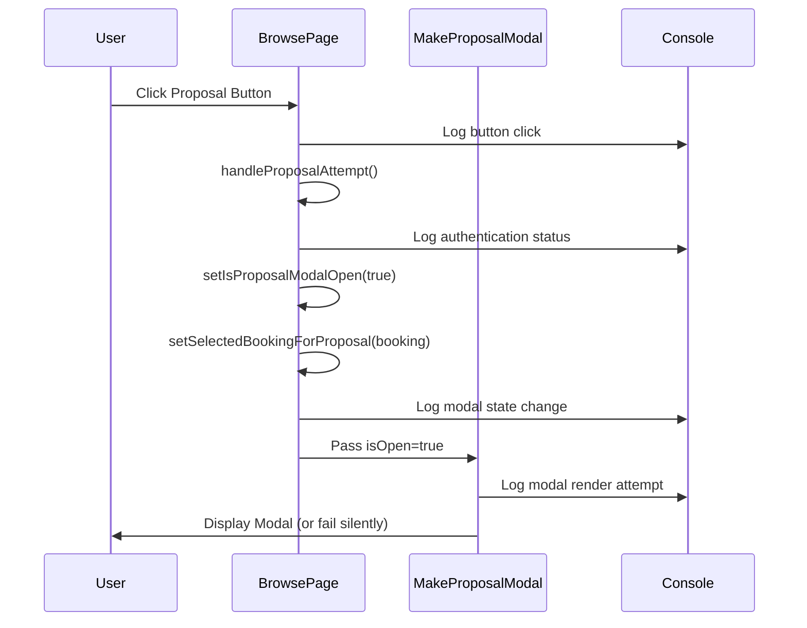

# Design Document

## Overview

This design outlines a systematic approach to diagnose and fix the regression where the MakeProposalModal is not appearing when users click proposal buttons. The approach focuses on tracing the execution flow, identifying the failure point, and implementing a targeted fix.

## Architecture

### Diagnostic Flow Architecture

```mermaid
graph TD
    A[User Clicks Proposal Button] --> B[handleProposalAttempt Called]
    B --> C{Authentication Check}
    C -->|Pass| D{Validation Checks}
    C -->|Fail| E[Redirect to Login]
    D -->|Pass| F[Set Modal State]
    D -->|Fail| G[Show Error Message]
    F --> H[setIsProposalModalOpen(true)]
    H --> I[setSelectedBookingForProposal(booking)]
    I --> J{Modal Renders?}
    J -->|Yes| K[Modal Displays Successfully]
    J -->|No| L[Identify Rendering Issue]
    L --> M[Fix and Restore Functionality]
```

### Component Interaction Flow



## Components and Interfaces

### Diagnostic Components

#### 1. Button Click Tracer
- **Purpose**: Verify that button clicks are being registered
- **Location**: BrowsePage proposal buttons
- **Implementation**: Enhanced console logging in onClick handlers

#### 2. State Change Monitor
- **Purpose**: Track modal state transitions
- **Location**: BrowsePage useState hooks
- **Implementation**: useEffect hooks to log state changes

#### 3. Modal Render Validator
- **Purpose**: Confirm modal component is attempting to render
- **Location**: MakeProposalModal component
- **Implementation**: Console logs in component lifecycle methods

#### 4. Props Validator
- **Purpose**: Ensure correct props are passed to modal
- **Location**: BrowsePage modal JSX
- **Implementation**: Prop validation and logging

### Interface Definitions

```typescript
interface DiagnosticData {
  buttonClicked: boolean;
  authenticationPassed: boolean;
  validationPassed: boolean;
  modalStateSet: boolean;
  bookingDataSet: boolean;
  modalRendered: boolean;
  propsValid: boolean;
  errors: string[];
}

interface ModalStateDebug {
  isProposalModalOpen: boolean;
  selectedBookingForProposal: BookingWithProposalStatus | null;
  timestamp: string;
  userAuthenticated: boolean;
}
```

## Data Models

### Diagnostic Log Entry
```typescript
interface DiagnosticLogEntry {
  timestamp: string;
  component: 'BrowsePage' | 'MakeProposalModal';
  action: string;
  data: any;
  success: boolean;
  error?: string;
}
```

### Modal State Snapshot
```typescript
interface ModalStateSnapshot {
  isOpen: boolean;
  targetSwap: any;
  userEligibleSwaps: any[];
  loading: boolean;
  renderAttempted: boolean;
  renderSuccessful: boolean;
}
```

## Error Handling

### Error Categories

1. **Button Click Failures**
   - Event handler not attached
   - JavaScript errors in onClick
   - Event propagation issues

2. **State Management Failures**
   - useState not updating
   - State updates not triggering re-renders
   - Race conditions in state updates

3. **Modal Rendering Failures**
   - Component import issues
   - Props validation failures
   - CSS/styling hiding modal
   - React rendering errors

4. **Data Flow Failures**
   - Incorrect prop passing
   - Missing required data
   - Type mismatches

### Error Recovery Strategies

```typescript
const errorRecoveryStrategies = {
  buttonClickFailure: {
    detection: 'No console log after button click',
    fix: 'Verify event handler attachment and fix JavaScript errors'
  },
  stateUpdateFailure: {
    detection: 'State not changing after button click',
    fix: 'Check useState implementation and re-render triggers'
  },
  modalRenderFailure: {
    detection: 'Modal state true but no visual modal',
    fix: 'Verify component import, props, and CSS visibility'
  },
  dataFlowFailure: {
    detection: 'Modal renders but with incorrect/missing data',
    fix: 'Validate prop passing and data transformation'
  }
};
```

## Testing Strategy

### Diagnostic Test Plan

1. **Button Visibility Test**
   - Verify proposal buttons are visible on BrowsePage
   - Check button text and styling
   - Confirm buttons are not disabled inappropriately

2. **Click Handler Test**
   - Add console.log to button onClick
   - Verify handleProposalAttempt is called
   - Check event object and parameters

3. **Authentication Flow Test**
   - Log authentication status
   - Verify user object exists
   - Check authentication-related redirects

4. **State Management Test**
   - Log before and after state updates
   - Verify isProposalModalOpen changes to true
   - Confirm selectedBookingForProposal is set

5. **Modal Rendering Test**
   - Add console.log to MakeProposalModal constructor/render
   - Verify modal receives isOpen=true prop
   - Check for React rendering errors

6. **Visual Inspection Test**
   - Check if modal is rendered but hidden by CSS
   - Verify z-index and positioning
   - Check for overlay/backdrop issues

### Implementation Phases

#### Phase 1: Add Comprehensive Logging
- Add detailed console logs to all relevant functions
- Log state changes and prop passing
- Capture any JavaScript errors

#### Phase 2: Execute Diagnostic Flow
- Click proposal button and trace execution
- Identify the exact point where the flow breaks
- Document findings

#### Phase 3: Implement Targeted Fix
- Fix the identified issue
- Remove or reduce diagnostic logging
- Verify functionality is restored

#### Phase 4: Prevent Regression
- Add error boundaries if needed
- Improve error handling
- Document the fix for future reference

## Design Decisions

### Logging Strategy
- **Decision**: Use console.log for immediate debugging
- **Rationale**: Quick to implement and provides real-time feedback
- **Alternative**: Could use a logging service, but console is sufficient for this diagnostic

### Diagnostic Approach
- **Decision**: Trace execution flow step by step
- **Rationale**: Most efficient way to identify the exact failure point
- **Alternative**: Could rewrite components, but that's overkill for a regression

### Fix Scope
- **Decision**: Implement minimal targeted fix
- **Rationale**: Preserve existing functionality and minimize risk
- **Alternative**: Could refactor entire modal system, but unnecessary

## Integration Points

### BrowsePage Integration
- Button click handlers
- State management hooks
- Modal rendering JSX

### MakeProposalModal Integration
- Component lifecycle methods
- Prop validation
- Rendering logic

### Console Integration
- Structured logging format
- Error capture and reporting
- Performance impact considerations