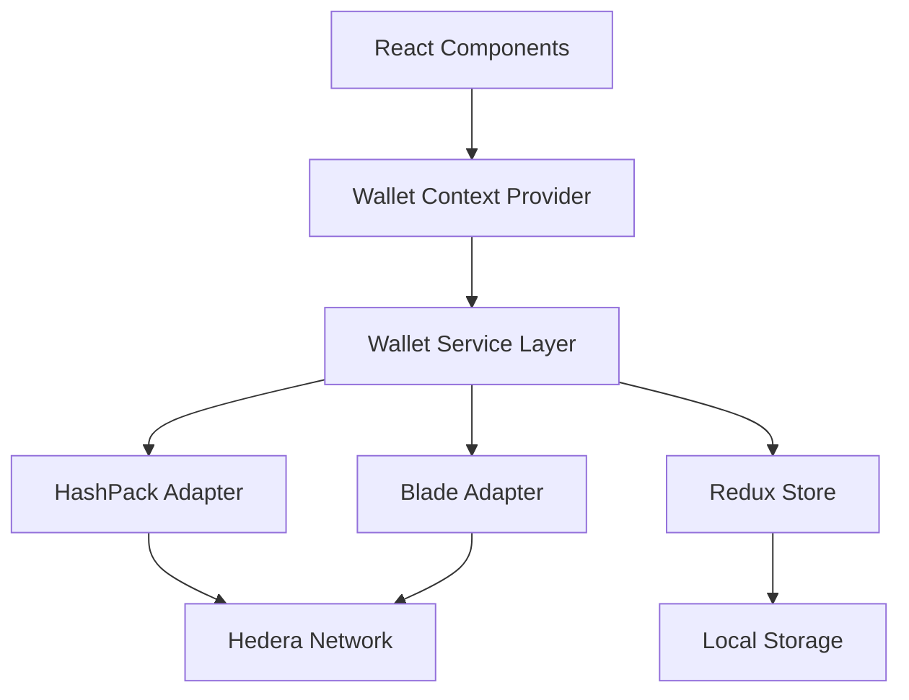

# Design Document

## Overview

The Hedera wallet integration will provide secure wallet connectivity for the booking swap platform, enabling users to authenticate and interact with the Hedera blockchain through their preferred wallet providers. The design leverages the existing React/Redux architecture and builds upon the already included `@hashgraph/hedera-wallet-connect` library.

The integration will support multiple wallet providers (HashPack, Blade) through a unified interface, providing consistent user experience regardless of the chosen wallet. The system will handle connection state management, error handling, and session persistence.

## Architecture

### High-Level Architecture



### Component Architecture

The wallet integration will follow a layered architecture:

1. **Presentation Layer**: React components for wallet UI
2. **Context Layer**: React Context for wallet state management
3. **Service Layer**: Wallet service abstractions and adapters
4. **State Layer**: Redux store for global wallet state
5. **Persistence Layer**: Local storage for connection preferences

## Components and Interfaces

### Core Interfaces

```typescript
interface WalletProvider {
  id: string;
  name: string;
  icon: string;
  isAvailable(): Promise<boolean>;
  connect(): Promise<WalletConnection>;
  disconnect(): Promise<void>;
  getAccountInfo(): Promise<AccountInfo>;
  getBalance(): Promise<string>;
}

interface WalletConnection {
  accountId: string;
  network: 'mainnet' | 'testnet';
  isConnected: boolean;
}

interface AccountInfo {
  accountId: string;
  balance: string;
  network: string;
}

interface WalletState {
  isConnected: boolean;
  currentProvider: string | null;
  accountInfo: AccountInfo | null;
  connectionStatus: 'idle' | 'connecting' | 'connected' | 'error';
  error: string | null;
}
```

### React Components

#### WalletConnectButton
- Primary entry point for wallet connection
- Displays connection status and account info when connected
- Handles wallet selection modal

#### WalletSelectionModal
- Lists available wallet providers
- Shows installation status for each provider
- Handles provider selection and connection initiation

#### WalletInfo
- Displays connected wallet information
- Shows account ID, balance, and network
- Provides disconnect functionality

#### WalletStatusIndicator
- Shows current connection status
- Displays loading states during connection
- Shows error states with appropriate messaging

### Service Layer

#### WalletService
- Central service for wallet operations
- Manages provider registration and selection
- Handles connection lifecycle
- Provides unified API for wallet operations

#### Provider Adapters
- **HashPackAdapter**: Implements HashPack wallet integration
- **BladeAdapter**: Implements Blade wallet integration
- **BaseWalletAdapter**: Abstract base class for wallet adapters

### Context Provider

#### WalletContextProvider
- Provides wallet state and actions to React components
- Manages wallet service initialization
- Handles connection restoration on app load

## Data Models

### Wallet State Management

The wallet state will be managed through Redux with the following structure:

```typescript
interface WalletSliceState {
  providers: WalletProvider[];
  currentConnection: WalletConnection | null;
  connectionStatus: ConnectionStatus;
  accountInfo: AccountInfo | null;
  error: WalletError | null;
  preferences: {
    lastUsedProvider: string | null;
    autoConnect: boolean;
  };
}
```

### Local Storage Schema

```typescript
interface WalletPreferences {
  lastUsedProvider: string | null;
  autoConnect: boolean;
  connectionTimestamp: number;
}
```

## Error Handling

### Error Types

```typescript
enum WalletErrorType {
  PROVIDER_NOT_FOUND = 'PROVIDER_NOT_FOUND',
  CONNECTION_REJECTED = 'CONNECTION_REJECTED',
  WALLET_LOCKED = 'WALLET_LOCKED',
  WRONG_NETWORK = 'WRONG_NETWORK',
  NETWORK_ERROR = 'NETWORK_ERROR',
  UNKNOWN_ERROR = 'UNKNOWN_ERROR'
}

interface WalletError {
  type: WalletErrorType;
  message: string;
  details?: any;
}
```

### Error Handling Strategy

1. **Provider Detection Errors**: Show installation instructions
2. **Connection Errors**: Display retry options with clear messaging
3. **Network Errors**: Prompt network switching when possible
4. **Authentication Errors**: Guide users through wallet unlock process
5. **Unknown Errors**: Provide general troubleshooting guidance

### Error Recovery

- Automatic retry for transient network errors
- Graceful fallback to disconnected state
- Clear error state on successful operations
- User-initiated retry mechanisms

## Testing Strategy

### Unit Tests

1. **Wallet Service Tests**
   - Provider registration and detection
   - Connection lifecycle management
   - Error handling scenarios
   - State management operations

2. **Component Tests**
   - Wallet button interaction flows
   - Modal behavior and provider selection
   - Error state rendering
   - Connection status display

3. **Adapter Tests**
   - HashPack integration functionality
   - Blade integration functionality
   - Provider availability detection
   - Connection and disconnection flows

### Integration Tests

1. **Wallet Flow Tests**
   - End-to-end connection process
   - Provider switching scenarios
   - Session persistence behavior
   - Error recovery flows

2. **State Management Tests**
   - Redux store integration
   - Context provider behavior
   - Local storage persistence
   - State synchronization

### E2E Tests

1. **User Journey Tests**
   - Complete wallet connection flow
   - Wallet switching scenarios
   - Session restoration on page reload
   - Error handling user experience

2. **Cross-Browser Tests**
   - Wallet extension compatibility
   - Local storage behavior
   - Provider detection across browsers

### Security Tests

1. **Connection Security**
   - Secure storage of connection data
   - Prevention of unauthorized access
   - Proper session cleanup on disconnect

2. **Input Validation**
   - Account ID format validation
   - Network parameter validation
   - Error message sanitization

## Implementation Phases

### Phase 1: Core Infrastructure
- Wallet service architecture
- Base adapter implementation
- Redux store setup
- Basic React context

### Phase 2: HashPack Integration
- HashPack adapter implementation
- Connection flow implementation
- Error handling for HashPack

### Phase 3: UI Components
- Wallet connect button
- Provider selection modal
- Wallet info display
- Status indicators

### Phase 4: Blade Integration
- Blade adapter implementation
- Multi-provider support
- Provider switching functionality

### Phase 5: Persistence & Polish
- Local storage integration
- Session restoration
- Error recovery mechanisms
- Performance optimizations