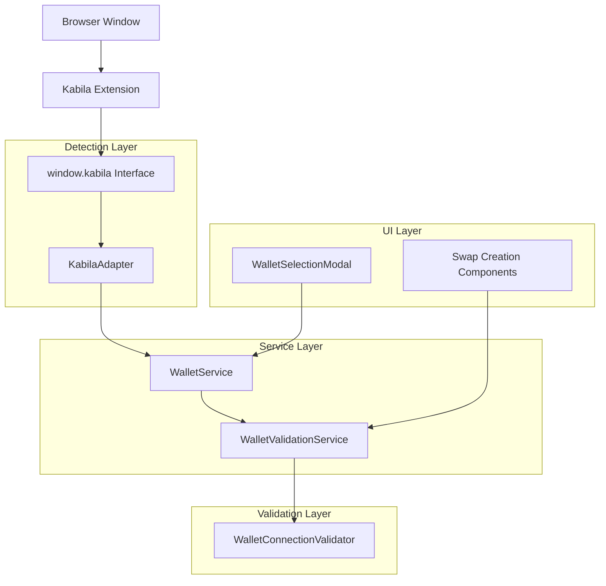

# Design Document

## Overview

The Kabila wallet detection fix addresses the complete integration flow from wallet detection through connection to validation. The current system has issues where the Kabila wallet extension is not properly detected as available, connection attempts fail, or successful connections are not recognized by the validation system. This design provides a comprehensive solution that enhances the existing KabilaAdapter, improves the WalletService integration, and fixes the validation logic.

## Architecture

The solution builds upon the existing wallet architecture with targeted improvements:



## Components and Interfaces

### 1. Enhanced Kabila Detection

**KabilaAdapter Improvements:**
- Enhanced `isAvailable()` method with retry logic and timeout handling
- Improved error detection and categorization
- Better handling of extension loading delays
- Connection state persistence and restoration

**Key Changes:**
```typescript
// Enhanced availability detection
public async isAvailable(): Promise<boolean> {
  return this.checkAvailabilityWithRetry(3, 1000);
}

private async checkAvailabilityWithRetry(maxRetries: number, delay: number): Promise<boolean> {
  // Implementation with exponential backoff and proper error handling
}
```

### 2. WalletService Integration Fixes

**Connection Management:**
- Improved provider registration and availability checking
- Enhanced connection state synchronization
- Better error propagation and handling
- Automatic connection restoration improvements

**Key Enhancements:**
- Fix `getAvailableProviders()` to properly detect Kabila wallet
- Improve `connect()` method error handling for Kabila-specific issues
- Enhanced connection state persistence

### 3. Validation System Improvements

**WalletConnectionValidator Updates:**
- Kabila-specific validation checks
- Improved connection state detection
- Better error categorization and messaging
- Enhanced stability analysis for chrome extensions

**WalletValidationService Enhancements:**
- Fix fallback validation logic to properly check Kabila connections
- Improve connection object validation
- Better integration with KabilaAdapter state

### 4. UI Component Updates

**WalletSelectionModal Improvements:**
- Better availability detection display
- Improved error messaging for Kabila-specific issues
- Enhanced installation guidance
- Real-time availability status updates

## Data Models

### Enhanced Connection State

```typescript
interface EnhancedWalletConnection extends WalletConnection {
  // Additional metadata for better state tracking
  connectionTimestamp?: number;
  lastValidated?: number;
  providerVersion?: string;
  extensionId?: string;
}
```

### Kabila-Specific Diagnostics

```typescript
interface KabilaDiagnostics {
  extensionDetected: boolean;
  extensionVersion?: string;
  isAvailable: boolean;
  isConnected: boolean;
  accountInfo?: {
    accountId: string;
    network: string;
  };
  lastError?: string;
  connectionAttempts: number;
  lastConnectionAttempt?: number;
}
```

### Validation Enhancement

```typescript
interface KabilaValidationResult extends DetailedConnectionValidation {
  kabilaSpecific: {
    extensionStatus: 'not_installed' | 'installed' | 'locked' | 'available';
    connectionMethod: 'direct' | 'fallback';
    validationPath: string[];
  };
}
```

## Error Handling

### Error Categories

1. **Extension Not Installed**
   - Detection: `window.kabila` is undefined
   - Message: Clear installation instructions with direct link
   - Action: Show install button with proper URL

2. **Extension Locked**
   - Detection: `window.kabila.isAvailable` is false
   - Message: Prompt to unlock wallet
   - Action: Retry button with guidance

3. **Connection Rejected**
   - Detection: User rejects connection in extension
   - Message: Explain connection requirement
   - Action: Retry with clearer instructions

4. **Network Issues**
   - Detection: API timeouts or network errors
   - Message: Network connectivity guidance
   - Action: Retry with exponential backoff

5. **Validation Failures**
   - Detection: Connection exists but validation fails
   - Message: Specific diagnostic information
   - Action: Detailed troubleshooting steps

### Error Recovery Strategies

```typescript
class KabilaErrorRecovery {
  async handleConnectionError(error: WalletError): Promise<RecoveryAction> {
    switch (error.type) {
      case WalletErrorType.PROVIDER_NOT_FOUND:
        return this.handleNotInstalled();
      case WalletErrorType.WALLET_LOCKED:
        return this.handleLocked();
      case WalletErrorType.CONNECTION_REJECTED:
        return this.handleRejected();
      default:
        return this.handleGenericError(error);
    }
  }
}
```

## Testing Strategy

### Unit Tests

1. **KabilaAdapter Tests**
   - Availability detection with various window.kabila states
   - Connection flow with mocked extension responses
   - Error handling for all error types
   - Network change detection

2. **WalletService Integration Tests**
   - Provider registration and availability checking
   - Connection state management
   - Error propagation and handling

3. **Validation Tests**
   - Connection validation with various states
   - Error categorization and messaging
   - Stability analysis and recommendations

### Integration Tests

1. **End-to-End Wallet Flow**
   - Complete flow from detection to successful connection
   - Error scenarios and recovery
   - Connection persistence and restoration

2. **UI Integration**
   - Wallet selection modal behavior
   - Error display and user guidance
   - Real-time status updates

### Manual Testing Scenarios

1. **Extension States**
   - Extension not installed
   - Extension installed but locked
   - Extension available and unlocked
   - Extension connected to different network

2. **Connection Scenarios**
   - First-time connection
   - Reconnection after browser restart
   - Connection after extension update
   - Multiple account switching

## Implementation Plan

### Phase 1: Core Detection Fixes
- Enhance KabilaAdapter availability detection
- Fix WalletService provider availability checking
- Improve error handling and categorization

### Phase 2: Validation System Updates
- Update WalletConnectionValidator for Kabila-specific checks
- Fix WalletValidationService fallback logic
- Enhance connection state validation

### Phase 3: UI and UX Improvements
- Update WalletSelectionModal with better error messaging
- Add real-time availability status updates
- Improve installation and troubleshooting guidance

### Phase 4: Testing and Optimization
- Comprehensive testing across all scenarios
- Performance optimization for detection and validation
- Documentation and user guidance updates

## Technical Considerations

### Browser Extension Timing
- Chrome extensions load asynchronously
- `window.kabila` may not be immediately available
- Need retry logic with appropriate timeouts

### State Synchronization
- Multiple components need consistent wallet state
- Event-driven updates for state changes
- Proper cleanup on disconnection

### Error Recovery
- Graceful degradation when extension is unavailable
- Clear user guidance for each error scenario
- Automatic retry with exponential backoff

### Performance
- Minimize repeated availability checks
- Cache connection state appropriately
- Efficient validation without blocking UI

## Security Considerations

### Extension Validation
- Verify `window.kabila` interface matches expected structure
- Validate responses from extension APIs
- Handle malicious or modified extensions gracefully

### Connection Security
- Ensure secure communication with extension
- Validate account information format
- Protect against injection attacks through extension interface

### Error Information
- Avoid exposing sensitive information in error messages
- Log detailed diagnostics securely
- Provide user-friendly error messages without technical details

## Monitoring and Diagnostics

### Connection Metrics
- Track connection success/failure rates
- Monitor validation performance
- Measure user experience metrics

### Error Tracking
- Categorize and track error types
- Monitor error recovery success rates
- Identify common user issues

### Performance Monitoring
- Track detection and connection timing
- Monitor validation performance
- Measure UI responsiveness during wallet operations