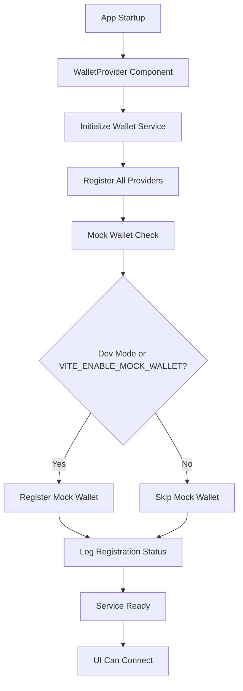

# Mock Wallet Connection Fix - Design Document

## Overview

The mock wallet connection failure is caused by a timing issue in the wallet service initialization process. The wallet providers are not being registered before the UI attempts to connect, resulting in the "No wallet providers available, Wallet service not initialized" error. This design addresses the initialization sequence, provider registration reliability, and debugging capabilities.

## Architecture

### Current Issue Analysis

Based on the error logs and code analysis, the problem stems from:

1. **Initialization Timing**: The `initializeWalletProviders()` function is called in `WalletContext.tsx`, but the wallet service may not be fully initialized when connection attempts occur
2. **Provider Registration**: The mock wallet registration depends on environment variable checks that may not be working correctly
3. **Service State**: The `ConnectionValidator` checks for provider availability but the service reports no providers registered

### Proposed Solution Architecture



## Components and Interfaces

### 1. Enhanced Wallet Service Initialization

**File**: `apps/frontend/src/services/wallet/WalletService.ts`

**Changes**:
- Add initialization state tracking
- Add provider registration validation
- Enhance logging for debugging

```typescript
interface WalletServiceState {
  isInitialized: boolean;
  providerCount: number;
  initializationTimestamp: number;
  registeredProviders: string[];
}
```

### 2. Improved Provider Registration

**File**: `apps/frontend/src/services/wallet/providers.ts`

**Changes**:
- Add comprehensive logging
- Add environment variable validation
- Add registration verification
- Add fallback registration for mock wallet

```typescript
interface ProviderRegistrationResult {
  success: boolean;
  providerId: string;
  error?: string;
  environmentChecks: {
    isDev: boolean;
    mockWalletEnabled: boolean;
    finalDecision: boolean;
  };
}
```

### 3. Enhanced Connection Validator

**File**: `apps/frontend/src/services/wallet/ConnectionValidator.ts`

**Changes**:
- Add detailed service initialization checks
- Improve error messages with specific guidance
- Add mock wallet specific validation

### 4. Wallet Context Improvements

**File**: `apps/frontend/src/contexts/WalletContext.tsx`

**Changes**:
- Add initialization completion waiting
- Add provider registration verification
- Add detailed error logging

## Data Models

### Initialization Status Model

```typescript
interface WalletInitializationStatus {
  isComplete: boolean;
  providersRegistered: number;
  mockWalletEnabled: boolean;
  errors: string[];
  timestamp: number;
  environmentInfo: {
    isDevelopment: boolean;
    mockWalletEnvVar: string | undefined;
    nodeEnv: string;
  };
}
```

### Provider Registration Log

```typescript
interface ProviderRegistrationLog {
  providerId: string;
  success: boolean;
  timestamp: number;
  environmentChecks: Record<string, boolean>;
  error?: string;
}
```

## Error Handling

### 1. Initialization Errors

- **Service Not Ready**: Clear error message with initialization status
- **Provider Registration Failed**: Specific error for each provider with retry mechanism
- **Environment Variable Issues**: Detailed logging of environment checks

### 2. Connection Errors

- **No Providers Available**: Enhanced error with registration status and suggestions
- **Mock Wallet Specific**: Clear indication if mock wallet should be available but isn't

### 3. Debugging Support

- **Console Logging**: Structured logging for all initialization steps
- **State Inspection**: Methods to check service and provider status
- **Environment Validation**: Clear reporting of environment variable states

## Testing Strategy

### 1. Unit Tests

- **Provider Registration**: Test mock wallet registration under different environment conditions
- **Service Initialization**: Test initialization sequence and state tracking
- **Connection Validation**: Test enhanced validation logic

### 2. Integration Tests

- **Full Initialization Flow**: Test complete startup sequence
- **Environment Scenarios**: Test different environment variable combinations
- **Error Recovery**: Test error handling and recovery mechanisms

### 3. Development Testing

- **Console Logging**: Verify detailed logging appears in development
- **Mock Wallet Availability**: Verify mock wallet appears in selection modal
- **Connection Success**: Verify mock wallet connects successfully

## Implementation Plan

### Phase 1: Service Initialization Enhancement
1. Add initialization state tracking to WalletService
2. Enhance provider registration logging
3. Add service readiness validation

### Phase 2: Provider Registration Improvements
1. Improve environment variable checking
2. Add registration verification
3. Enhance error reporting

### Phase 3: Connection Validation Updates
1. Update ConnectionValidator with better error messages
2. Add mock wallet specific validation
3. Improve debugging information

### Phase 4: Context and UI Integration
1. Update WalletContext to wait for initialization
2. Add error handling improvements
3. Enhance user feedback

## Configuration Changes

### Environment Variables
- Ensure `VITE_ENABLE_MOCK_WALLET` is properly configured
- Add validation for environment variable parsing
- Add fallback behavior for missing variables

### Development Setup
- Add initialization status logging
- Add provider registration verification
- Add connection debugging tools

## Monitoring and Debugging

### Console Logging Structure
```typescript
interface WalletDebugLog {
  timestamp: string;
  level: 'info' | 'warn' | 'error';
  category: 'initialization' | 'registration' | 'connection';
  message: string;
  data?: any;
}
```

### Status Inspection Methods
- `walletService.getInitializationStatus()`
- `walletService.getProviderRegistrationLogs()`
- `walletService.validateServiceState()`

This design ensures reliable mock wallet availability in development while providing comprehensive debugging capabilities to prevent similar issues in the future.