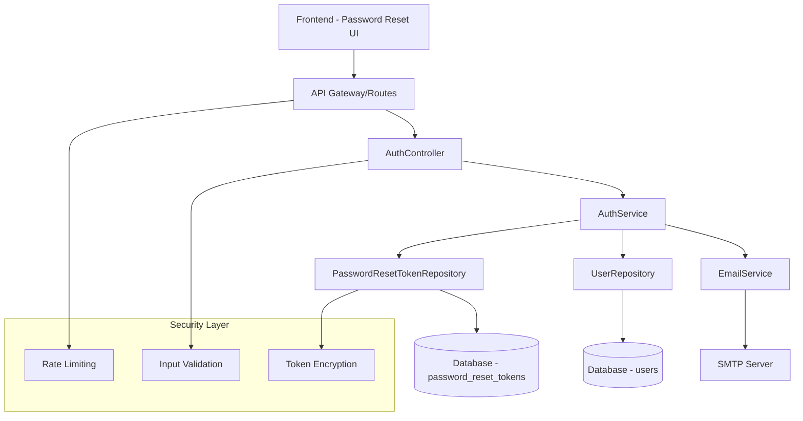
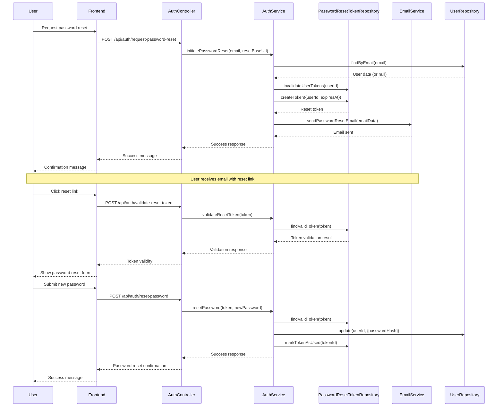

# Design Document

## Overview

The password recovery system is designed as a secure, user-friendly feature that allows users to reset their forgotten passwords through email verification. The system integrates with the existing authentication infrastructure and follows security best practices including rate limiting, secure token generation, and proper session management.

The implementation leverages the existing backend architecture with controllers, services, repositories, and middleware, while providing a seamless frontend experience through React components.

## Architecture

### High-Level Architecture



### Component Interaction Flow



## Components and Interfaces

### Backend Components

#### 1. AuthController
**Location**: `apps/backend/src/controllers/AuthController.ts`

**Responsibilities**:
- Handle HTTP requests for password reset operations
- Validate input data using Joi schemas
- Coordinate with AuthService for business logic
- Return appropriate HTTP responses

**Key Methods**:
- `requestPasswordReset`: Initiate password reset process
- `resetPassword`: Complete password reset with new password
- `validatePasswordResetToken`: Validate reset token before showing form

#### 2. AuthService
**Location**: `apps/backend/src/services/auth/AuthService.ts`

**Responsibilities**:
- Implement password reset business logic
- Coordinate between repositories and email service
- Handle security validations and token management
- Manage user authentication state

**Key Methods**:
- `initiatePasswordReset`: Create reset token and send email
- `resetPassword`: Validate token and update password
- `validateResetToken`: Check token validity

#### 3. PasswordResetTokenRepository
**Location**: `apps/backend/src/database/repositories/PasswordResetTokenRepository.ts`

**Responsibilities**:
- Manage password reset tokens in database
- Handle token creation, validation, and cleanup
- Implement security measures for token handling

**Key Methods**:
- `createToken`: Generate secure reset token
- `findValidToken`: Find unexpired, unused tokens
- `markTokenAsUsed`: Invalidate used tokens
- `invalidateUserTokens`: Clean up existing tokens

#### 4. EmailService
**Location**: `apps/backend/src/services/email/EmailService.ts`

**Responsibilities**:
- Send password reset emails
- Generate HTML and text email templates
- Handle SMTP configuration and delivery

**Key Methods**:
- `sendPasswordResetEmail`: Send formatted reset email
- `generatePasswordResetHtml`: Create HTML email template
- `generatePasswordResetText`: Create plain text email template

### Frontend Components

#### 1. PasswordResetRequest Component
**Location**: `apps/frontend/src/components/auth/PasswordResetRequest.tsx`

**Responsibilities**:
- Provide UI for requesting password reset
- Handle email input and validation
- Display success/error messages
- Integrate with backend API

#### 2. PasswordReset Component
**Location**: `apps/frontend/src/components/auth/PasswordReset.tsx`

**Responsibilities**:
- Validate reset tokens on page load
- Provide secure password input form
- Handle password strength validation
- Complete password reset process

### API Endpoints

#### Password Reset Request
```
POST /api/auth/request-password-reset
Content-Type: application/json

{
  "email": "user@example.com",
  "resetBaseUrl": "https://app.example.com/auth/reset-password"
}

Response:
{
  "success": true,
  "message": "Password reset link has been sent to your email address."
}
```

#### Password Reset Completion
```
POST /api/auth/reset-password
Content-Type: application/json

{
  "token": "secure-reset-token",
  "newPassword": "newSecurePassword123"
}

Response:
{
  "success": true,
  "message": "Password has been reset successfully."
}
```

#### Token Validation
```
POST /api/auth/validate-reset-token
Content-Type: application/json

{
  "token": "secure-reset-token"
}

Response:
{
  "valid": true,
  "expiresAt": "2024-01-01T12:00:00Z"
}
```

## Data Models

### PasswordResetToken
```typescript
interface PasswordResetToken {
  id: string;
  userId: string;
  token: string;        // 64-character hex string
  expiresAt: Date;      // 1 hour from creation
  usedAt?: Date;        // Timestamp when token was used
  createdAt: Date;
}
```

### Database Schema
```sql
CREATE TABLE password_reset_tokens (
  id UUID PRIMARY KEY DEFAULT gen_random_uuid(),
  user_id UUID NOT NULL REFERENCES users(id) ON DELETE CASCADE,
  token VARCHAR(64) NOT NULL UNIQUE,
  expires_at TIMESTAMP WITH TIME ZONE NOT NULL,
  used_at TIMESTAMP WITH TIME ZONE,
  created_at TIMESTAMP WITH TIME ZONE DEFAULT NOW()
);

CREATE INDEX idx_password_reset_tokens_token ON password_reset_tokens(token);
CREATE INDEX idx_password_reset_tokens_user_id ON password_reset_tokens(user_id);
CREATE INDEX idx_password_reset_tokens_expires_at ON password_reset_tokens(expires_at);
```

## Error Handling

### Security-First Error Handling
- **Email Enumeration Prevention**: Always return success message regardless of email existence
- **Token Validation**: Provide generic error messages for invalid/expired tokens
- **Rate Limiting**: Implement per-email and per-IP rate limiting
- **Input Validation**: Comprehensive validation using Joi schemas

### Error Categories
1. **Validation Errors**: Invalid input format or missing required fields
2. **Authentication Errors**: Invalid or expired tokens
3. **Rate Limiting Errors**: Too many requests from same source
4. **System Errors**: Database or email service failures

### Error Response Format
```typescript
interface ErrorResponse {
  error: {
    code: string;
    message: string;
    category: 'validation' | 'authentication' | 'rate_limit' | 'system';
  }
}
```

## Testing Strategy

### Unit Tests
- **AuthService**: Test password reset logic, token validation, security measures
- **PasswordResetTokenRepository**: Test token CRUD operations, cleanup functions
- **EmailService**: Test email generation and sending (with mocks)
- **AuthController**: Test request handling, validation, error responses

### Integration Tests
- **End-to-End Password Reset Flow**: Complete user journey from request to completion
- **Email Integration**: Verify email sending with real SMTP service
- **Database Integration**: Test token persistence and cleanup
- **API Integration**: Test all endpoints with various scenarios

### Security Tests
- **Rate Limiting**: Verify protection against abuse
- **Token Security**: Test token generation, expiration, and invalidation
- **Email Enumeration**: Ensure no information leakage
- **Input Validation**: Test against malicious inputs

### Test Scenarios
1. **Happy Path**: Successful password reset flow
2. **Invalid Email**: Non-existent email addresses
3. **Expired Tokens**: Tokens past expiration time
4. **Used Tokens**: Previously used tokens
5. **Rate Limiting**: Multiple requests from same source
6. **Malformed Requests**: Invalid input data
7. **System Failures**: Database and email service errors

### Performance Tests
- **Load Testing**: Multiple concurrent password reset requests
- **Database Performance**: Token cleanup and query performance
- **Email Service**: Bulk email sending capabilities

## Security Considerations

### Token Security
- **Cryptographically Secure**: Using `crypto.randomBytes(32)` for token generation
- **One-Time Use**: Tokens are invalidated after use
- **Time-Limited**: 1-hour expiration window
- **Unique Constraints**: Database-level uniqueness enforcement

### Rate Limiting
- **Per-Email Limiting**: Maximum 3 requests per email per hour
- **Per-IP Limiting**: Prevent abuse from single source
- **Exponential Backoff**: Increasing delays for repeated attempts

### Email Security
- **No Information Leakage**: Generic responses for non-existent emails
- **Secure Templates**: Clear warnings about link sharing
- **HTTPS Enforcement**: All reset links use HTTPS

### Session Management
- **Session Invalidation**: All user sessions invalidated after password reset
- **Token Cleanup**: Automatic cleanup of expired tokens
- **Audit Logging**: Security events logged for monitoring

## Monitoring and Observability

### Metrics to Track
- Password reset request rate
- Success/failure ratios
- Token usage patterns
- Email delivery rates
- Rate limiting triggers

### Logging Strategy
- Security events (failed attempts, rate limiting)
- Successful password resets
- Email sending status
- Token lifecycle events

### Alerts
- Unusual password reset patterns
- High failure rates
- Email service failures
- Database performance issues