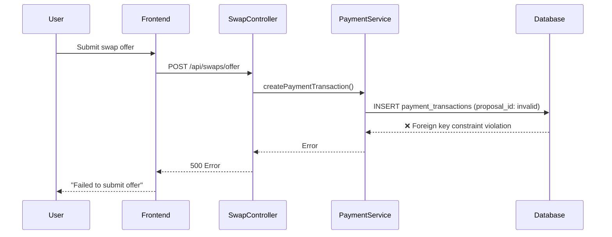
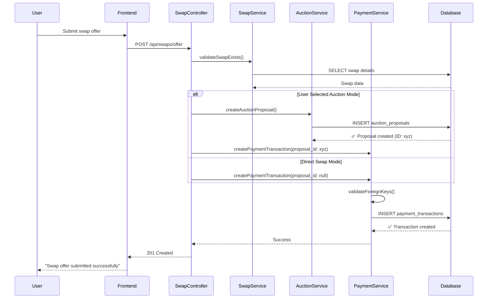

# Design Document

## Overview

The Payment Transaction Foreign Key Fix addresses a critical database integrity issue where swap offer submissions fail due to foreign key constraint violations. The error occurs when the system attempts to create payment transaction records with proposal_id values that don't exist in the auction_proposals table. This can happen for both cash offers and regular booking swap offers. This design provides a comprehensive solution that handles both auction and direct swap scenarios while maintaining data consistency and providing proper error handling.

The fix involves updating the swap offer submission workflow to properly handle the relationship between auction proposals and payment transactions, implementing robust validation, and ensuring proper transaction rollback mechanisms. Crucially, auction proposals should only be created when users explicitly choose auction mode, not based on swap configuration alone.

## Architecture

### Current Problem Flow



### Fixed Solution Flow



## Components and Interfaces

### Enhanced Swap Offer Workflow Service

```typescript
interface SwapOfferWorkflowService {
  // Main workflow orchestration
  submitSwapOffer(request: SwapOfferRequest): Promise<SwapOfferResult>;
  
  // Validation methods
  validateSwapForOffer(swapId: string): Promise<SwapValidationResult>;
  validateForeignKeyReferences(request: PaymentTransactionRequest): Promise<ValidationResult>;
  
  // Scenario detection based on user choice
  determineOfferMode(userSelectedMode: OfferMode): OfferMode;
  
  // Rollback methods
  rollbackSwapOfferSubmission(transactionId: string): Promise<void>;
}

interface SwapOfferRequest {
  swapId: string;
  userId: string;
  offerMode: OfferMode; // User explicitly selects auction or direct
  amount?: number; // For cash offers
  currency?: string; // For cash offers
  paymentMethodId?: string; // For cash offers
  bookingId?: string; // For booking swap offers
  message?: string;
  conditions?: string[];
}

interface SwapOfferResult {
  success: boolean;
  paymentTransaction: PaymentTransaction;
  auctionProposal?: AuctionProposal;
  offerMode: OfferMode;
  validationWarnings?: string[];
}

type OfferMode = 'auction' | 'direct';

interface SwapValidationResult {
  isValid: boolean;
  swap: EnhancedSwap;
  scenario: SwapScenario;
  acceptsCashOffers: boolean;
  errors: string[];
  warnings: string[];
}
```

### Enhanced Payment Transaction Service

```typescript
interface EnhancedPaymentTransactionService {
  // Core transaction methods with validation
  createPaymentTransaction(request: ValidatedPaymentTransactionRequest): Promise<PaymentTransaction>;
  validatePaymentTransactionRequest(request: PaymentTransactionRequest): Promise<ValidationResult>;
  
  // Foreign key validation
  validateProposalReference(proposalId: string | null): Promise<boolean>;
  validateSwapReference(swapId: string): Promise<boolean>;
  validateUserReferences(payerId: string, recipientId: string): Promise<boolean>;
  
  // Transaction management
  rollbackPaymentTransaction(transactionId: string): Promise<void>;
  getPaymentTransactionStatus(transactionId: string): Promise<PaymentTransactionStatus>;
}

interface PaymentTransactionRequest {
  swapId: string;
  proposalId?: string | null; // Optional for first-match swaps
  payerId: string;
  recipientId: string;
  amount: number;
  currency: string;
  gatewayTransactionId: string;
  platformFee: number;
  blockchainTransactionId: string;
}

interface ValidatedPaymentTransactionRequest extends PaymentTransactionRequest {
  validationMetadata: {
    swapExists: boolean;
    proposalExists: boolean | null; // null when not applicable
    usersExist: boolean;
    scenario: SwapScenario;
    validatedAt: Date;
  };
}
```

### Enhanced Auction Proposal Service

```typescript
interface EnhancedAuctionProposalService {
  // Proposal creation with validation
  createCashProposal(request: CashProposalRequest): Promise<AuctionProposal>;
  validateAuctionExists(auctionId: string): Promise<boolean>;
  
  // Proposal management
  getProposalById(proposalId: string): Promise<AuctionProposal | null>;
  deleteProposal(proposalId: string): Promise<void>;
  
  // Integration with payment transactions
  linkPaymentTransaction(proposalId: string, transactionId: string): Promise<void>;
}

interface CashProposalRequest {
  auctionId: string;
  proposerId: string;
  cashOffer: {
    amount: number;
    currency: string;
    paymentMethodId: string;
    escrowRequired: boolean;
  };
  message?: string;
  conditions: string[];
  blockchainTransactionId: string;
}
```

## Data Models

### Enhanced Payment Transaction Model

```typescript
interface PaymentTransaction {
  id: string;
  swapId: string;
  proposalId: string | null; // NULL for first-match swaps, UUID for auction swaps
  payerId: string;
  recipientId: string;
  amount: number;
  currency: string;
  status: PaymentTransactionStatus;
  escrowId?: string;
  gatewayTransactionId: string;
  platformFee: number;
  netAmount: number;
  completedAt?: Date;
  blockchainTransactionId: string;
  createdAt: Date;
  updatedAt: Date;
  
  // Metadata for tracking scenario and validation
  metadata: {
    scenario: SwapScenario;
    validationPassed: boolean;
    rollbackAvailable: boolean;
    createdVia: 'auction_proposal' | 'direct_cash_offer';
  };
}

type PaymentTransactionStatus = 
  | 'pending' 
  | 'processing' 
  | 'completed' 
  | 'failed' 
  | 'refunded' 
  | 'rolled_back';
```

### Validation Result Models

```typescript
interface ValidationResult {
  isValid: boolean;
  errors: ValidationError[];
  warnings: ValidationWarning[];
  metadata: {
    validatedAt: Date;
    validationType: string;
    scenario?: SwapScenario;
  };
}

interface ValidationError {
  code: string;
  message: string;
  field?: string;
  constraint?: string;
  suggestedFix?: string;
}

interface ValidationWarning {
  code: string;
  message: string;
  severity: 'low' | 'medium' | 'high';
  field?: string;
}

// Specific validation error codes
const VALIDATION_ERROR_CODES = {
  SWAP_NOT_FOUND: 'SWAP_NOT_FOUND',
  PROPOSAL_NOT_FOUND: 'PROPOSAL_NOT_FOUND',
  USER_NOT_FOUND: 'USER_NOT_FOUND',
  INVALID_PROPOSAL_REFERENCE: 'INVALID_PROPOSAL_REFERENCE',
  SCENARIO_MISMATCH: 'SCENARIO_MISMATCH',
  CASH_OFFERS_NOT_ACCEPTED: 'CASH_OFFERS_NOT_ACCEPTED',
  AUCTION_NOT_ACTIVE: 'AUCTION_NOT_ACTIVE',
  FOREIGN_KEY_VIOLATION: 'FOREIGN_KEY_VIOLATION'
} as const;
```

## Error Handling

### Enhanced Error Handling Strategy

```typescript
class CashOfferErrorHandler {
  handleForeignKeyViolation(error: DatabaseError, context: CashOfferContext): CashOfferError {
    if (error.constraint === 'payment_transactions_proposal_id_fkey') {
      return new CashOfferError(
        'INVALID_PROPOSAL_REFERENCE',
        'The auction proposal reference is invalid. This may indicate a timing issue or data inconsistency.',
        {
          proposalId: context.proposalId,
          swapId: context.swapId,
          scenario: context.scenario,
          suggestedAction: context.scenario === 'auction' 
            ? 'Retry the submission to create a new auction proposal'
            : 'Submit as a direct cash offer without auction proposal reference'
        }
      );
    }
    
    if (error.constraint === 'payment_transactions_swap_id_fkey') {
      return new CashOfferError(
        'INVALID_SWAP_REFERENCE',
        'The referenced swap does not exist or has been deleted.',
        {
          swapId: context.swapId,
          suggestedAction: 'Verify the swap still exists and try again'
        }
      );
    }
    
    return new CashOfferError(
      'DATABASE_CONSTRAINT_VIOLATION',
      'A database constraint was violated during cash offer submission.',
      { constraint: error.constraint, context }
    );
  }
  
  handleRollbackFailure(error: Error, context: RollbackContext): void {
    logger.critical('Cash offer rollback failed', {
      error: error.message,
      transactionId: context.transactionId,
      proposalId: context.proposalId,
      swapId: context.swapId,
      rollbackSteps: context.completedSteps,
      failedStep: context.failedStep
    });
    
    // Send alert to administrators
    this.alertService.sendCriticalAlert({
      type: 'ROLLBACK_FAILURE',
      message: 'Cash offer rollback failed - manual intervention required',
      context,
      severity: 'critical'
    });
  }
}

class CashOfferError extends Error {
  constructor(
    public code: string,
    message: string,
    public context: Record<string, any> = {}
  ) {
    super(message);
    this.name = 'CashOfferError';
  }
}
```

### Database Transaction Management

```typescript
class CashOfferTransactionManager {
  async executeCashOfferWorkflow(request: CashOfferRequest): Promise<CashOfferResult> {
    const transaction = await this.database.beginTransaction();
    const rollbackSteps: RollbackStep[] = [];
    
    try {
      // Step 1: Validate swap and determine scenario
      const swapValidation = await this.validateSwapForCashOffer(request.swapId);
      if (!swapValidation.isValid) {
        throw new CashOfferError('SWAP_VALIDATION_FAILED', 'Swap validation failed', {
          errors: swapValidation.errors
        });
      }
      
      let proposalId: string | null = null;
      
      // Step 2: Create auction proposal if needed
      if (swapValidation.scenario === 'auction') {
        const auctionProposal = await this.createAuctionProposal(request, transaction);
        proposalId = auctionProposal.id;
        rollbackSteps.push({
          type: 'delete_auction_proposal',
          data: { proposalId }
        });
      }
      
      // Step 3: Create payment transaction
      const paymentTransaction = await this.createPaymentTransaction({
        ...request,
        proposalId,
        scenario: swapValidation.scenario
      }, transaction);
      
      rollbackSteps.push({
        type: 'delete_payment_transaction',
        data: { transactionId: paymentTransaction.id }
      });
      
      // Step 4: Record on blockchain
      const blockchainResult = await this.recordOnBlockchain({
        type: 'cash_offer_submitted',
        swapId: request.swapId,
        proposalId,
        transactionId: paymentTransaction.id,
        scenario: swapValidation.scenario
      });
      
      // Step 5: Commit transaction
      await transaction.commit();
      
      return {
        success: true,
        paymentTransaction,
        auctionProposal: proposalId ? await this.getAuctionProposal(proposalId) : undefined,
        scenario: swapValidation.scenario
      };
      
    } catch (error) {
      // Rollback database transaction
      await transaction.rollback();
      
      // Execute application-level rollback steps
      await this.executeRollbackSteps(rollbackSteps);
      
      throw error;
    }
  }
  
  private async executeRollbackSteps(steps: RollbackStep[]): Promise<void> {
    for (const step of steps.reverse()) {
      try {
        switch (step.type) {
          case 'delete_auction_proposal':
            await this.auctionService.deleteProposal(step.data.proposalId);
            break;
          case 'delete_payment_transaction':
            await this.paymentService.deleteTransaction(step.data.transactionId);
            break;
        }
      } catch (rollbackError) {
        logger.error('Rollback step failed', {
          step,
          error: rollbackError.message
        });
      }
    }
  }
}

interface RollbackStep {
  type: 'delete_auction_proposal' | 'delete_payment_transaction';
  data: Record<string, any>;
}
```

## Testing Strategy

### Unit Testing

```typescript
describe('CashOfferWorkflowService', () => {
  describe('Foreign Key Validation', () => {
    it('should validate proposal_id exists for auction scenarios', async () => {
      const mockSwap = createMockSwap({ acceptanceStrategy: { type: 'auction' } });
      const mockProposal = createMockAuctionProposal();
      
      mockSwapRepository.findById.mockResolvedValue(mockSwap);
      mockAuctionRepository.findProposalById.mockResolvedValue(mockProposal);
      
      const result = await service.validateForeignKeyReferences({
        swapId: mockSwap.id,
        proposalId: mockProposal.id,
        payerId: 'user1',
        recipientId: 'user2'
      });
      
      expect(result.isValid).toBe(true);
      expect(result.errors).toHaveLength(0);
    });
    
    it('should allow null proposal_id for first-match scenarios', async () => {
      const mockSwap = createMockSwap({ acceptanceStrategy: { type: 'first_match' } });
      
      mockSwapRepository.findById.mockResolvedValue(mockSwap);
      
      const result = await service.validateForeignKeyReferences({
        swapId: mockSwap.id,
        proposalId: null,
        payerId: 'user1',
        recipientId: 'user2'
      });
      
      expect(result.isValid).toBe(true);
      expect(result.errors).toHaveLength(0);
    });
    
    it('should reject invalid proposal_id for auction scenarios', async () => {
      const mockSwap = createMockSwap({ acceptanceStrategy: { type: 'auction' } });
      
      mockSwapRepository.findById.mockResolvedValue(mockSwap);
      mockAuctionRepository.findProposalById.mockResolvedValue(null);
      
      const result = await service.validateForeignKeyReferences({
        swapId: mockSwap.id,
        proposalId: 'invalid-proposal-id',
        payerId: 'user1',
        recipientId: 'user2'
      });
      
      expect(result.isValid).toBe(false);
      expect(result.errors).toContainEqual(
        expect.objectContaining({
          code: 'PROPOSAL_NOT_FOUND',
          constraint: 'payment_transactions_proposal_id_fkey'
        })
      );
    });
  });
  
  describe('Transaction Rollback', () => {
    it('should rollback auction proposal when payment transaction fails', async () => {
      const mockSwap = createMockSwap({ acceptanceStrategy: { type: 'auction' } });
      const mockProposal = createMockAuctionProposal();
      
      mockAuctionService.createCashProposal.mockResolvedValue(mockProposal);
      mockPaymentService.createPaymentTransaction.mockRejectedValue(
        new Error('Payment processing failed')
      );
      
      await expect(
        service.submitCashOffer({
          swapId: mockSwap.id,
          userId: 'user1',
          amount: 100,
          currency: 'USD',
          paymentMethodId: 'pm1'
        })
      ).rejects.toThrow('Payment processing failed');
      
      expect(mockAuctionService.deleteProposal).toHaveBeenCalledWith(mockProposal.id);
    });
  });
});
```

### Integration Testing

```typescript
describe('Cash Offer Integration Tests', () => {
  it('should complete full auction cash offer workflow', async () => {
    // Setup auction swap
    const swap = await createTestSwap({
      acceptanceStrategy: { type: 'auction' },
      paymentTypes: { cashPayment: true, minimumCashAmount: 50 }
    });
    
    const auction = await createTestAuction({ swapId: swap.id });
    
    // Submit cash offer
    const result = await request(app)
      .post('/api/swaps/cash-offer')
      .set('Authorization', `Bearer ${userToken}`)
      .send({
        swapId: swap.id,
        amount: 100,
        currency: 'USD',
        paymentMethodId: 'pm_test_123'
      })
      .expect(201);
    
    // Verify auction proposal was created
    const proposal = await auctionRepository.findById(result.body.data.auctionProposal.id);
    expect(proposal).toBeDefined();
    expect(proposal.proposalType).toBe('cash');
    
    // Verify payment transaction was created with correct proposal_id
    const transaction = await paymentRepository.findById(result.body.data.paymentTransaction.id);
    expect(transaction).toBeDefined();
    expect(transaction.proposalId).toBe(proposal.id);
    expect(transaction.swapId).toBe(swap.id);
  });
  
  it('should complete full first-match cash offer workflow', async () => {
    // Setup first-match swap
    const swap = await createTestSwap({
      acceptanceStrategy: { type: 'first_match' },
      paymentTypes: { cashPayment: true, minimumCashAmount: 50 }
    });
    
    // Submit cash offer
    const result = await request(app)
      .post('/api/swaps/cash-offer')
      .set('Authorization', `Bearer ${userToken}`)
      .send({
        swapId: swap.id,
        amount: 100,
        currency: 'USD',
        paymentMethodId: 'pm_test_123'
      })
      .expect(201);
    
    // Verify no auction proposal was created
    expect(result.body.data.auctionProposal).toBeUndefined();
    
    // Verify payment transaction was created with null proposal_id
    const transaction = await paymentRepository.findById(result.body.data.paymentTransaction.id);
    expect(transaction).toBeDefined();
    expect(transaction.proposalId).toBeNull();
    expect(transaction.swapId).toBe(swap.id);
  });
});
```

## Security Considerations

### Data Integrity Protection

```typescript
interface DataIntegrityService {
  // Pre-flight validation
  validateDataConsistency(operation: DatabaseOperation): Promise<ConsistencyResult>;
  
  // Post-operation verification
  verifyForeignKeyIntegrity(tableNames: string[]): Promise<IntegrityReport>;
  
  // Cleanup operations
  cleanupOrphanedRecords(tableName: string): Promise<CleanupResult>;
  
  // Monitoring
  monitorConstraintViolations(): Promise<ViolationReport>;
}

class DatabaseIntegrityMonitor {
  async checkPaymentTransactionIntegrity(): Promise<IntegrityReport> {
    const orphanedTransactions = await this.database.query(`
      SELECT pt.id, pt.proposal_id, pt.swap_id
      FROM payment_transactions pt
      LEFT JOIN auction_proposals ap ON pt.proposal_id = ap.id
      LEFT JOIN swaps s ON pt.swap_id = s.id
      WHERE (pt.proposal_id IS NOT NULL AND ap.id IS NULL)
         OR s.id IS NULL
    `);
    
    return {
      tableName: 'payment_transactions',
      totalRecords: await this.getRecordCount('payment_transactions'),
      orphanedRecords: orphanedTransactions.length,
      issues: orphanedTransactions.map(record => ({
        recordId: record.id,
        issue: record.s_id ? 'missing_proposal' : 'missing_swap',
        severity: 'high'
      }))
    };
  }
}
```

### Access Control and Validation

```typescript
class CashOfferSecurityService {
  async validateCashOfferPermissions(
    userId: string, 
    swapId: string
  ): Promise<PermissionResult> {
    const swap = await this.swapRepository.findById(swapId);
    
    if (!swap) {
      return { allowed: false, reason: 'SWAP_NOT_FOUND' };
    }
    
    if (swap.ownerId === userId) {
      return { allowed: false, reason: 'CANNOT_OFFER_ON_OWN_SWAP' };
    }
    
    if (!swap.paymentTypes.cashPayment) {
      return { allowed: false, reason: 'CASH_OFFERS_NOT_ACCEPTED' };
    }
    
    return { allowed: true };
  }
  
  async validatePaymentMethod(
    userId: string, 
    paymentMethodId: string
  ): Promise<PaymentMethodValidation> {
    const paymentMethod = await this.paymentMethodRepository.findByUserAndId(
      userId, 
      paymentMethodId
    );
    
    if (!paymentMethod) {
      return { valid: false, reason: 'PAYMENT_METHOD_NOT_FOUND' };
    }
    
    if (!paymentMethod.isVerified) {
      return { valid: false, reason: 'PAYMENT_METHOD_NOT_VERIFIED' };
    }
    
    return { valid: true, paymentMethod };
  }
}
```

## Performance Optimization

### Database Query Optimization

```typescript
class OptimizedCashOfferService {
  async validateAllReferencesInSingleQuery(
    request: CashOfferRequest
  ): Promise<ValidationResult> {
    // Single query to validate all foreign key references
    const validationQuery = `
      WITH validation_data AS (
        SELECT 
          s.id as swap_id,
          s.acceptance_strategy,
          s.payment_types,
          s.owner_id as swap_owner_id,
          u1.id as payer_exists,
          u2.id as recipient_exists,
          CASE 
            WHEN s.acceptance_strategy->>'type' = 'auction' THEN sa.id
            ELSE NULL
          END as auction_id
        FROM swaps s
        LEFT JOIN users u1 ON u1.id = $2
        LEFT JOIN users u2 ON u2.id = s.owner_id
        LEFT JOIN swap_auctions sa ON sa.swap_id = s.id AND sa.status = 'active'
        WHERE s.id = $1
      )
      SELECT * FROM validation_data
    `;
    
    const result = await this.database.query(validationQuery, [
      request.swapId,
      request.userId
    ]);
    
    if (result.rows.length === 0) {
      return {
        isValid: false,
        errors: [{ code: 'SWAP_NOT_FOUND', message: 'Swap not found' }]
      };
    }
    
    const data = result.rows[0];
    const errors: ValidationError[] = [];
    
    if (!data.payer_exists) {
      errors.push({ code: 'USER_NOT_FOUND', message: 'Payer not found' });
    }
    
    if (!data.recipient_exists) {
      errors.push({ code: 'USER_NOT_FOUND', message: 'Recipient not found' });
    }
    
    if (data.acceptance_strategy.type === 'auction' && !data.auction_id) {
      errors.push({ code: 'AUCTION_NOT_FOUND', message: 'Active auction not found' });
    }
    
    return {
      isValid: errors.length === 0,
      errors,
      metadata: {
        scenario: data.acceptance_strategy.type,
        auctionId: data.auction_id,
        validatedAt: new Date()
      }
    };
  }
}
```

The design ensures robust handling of both auction and first-match scenarios while maintaining data integrity and providing comprehensive error handling and rollback mechanisms.