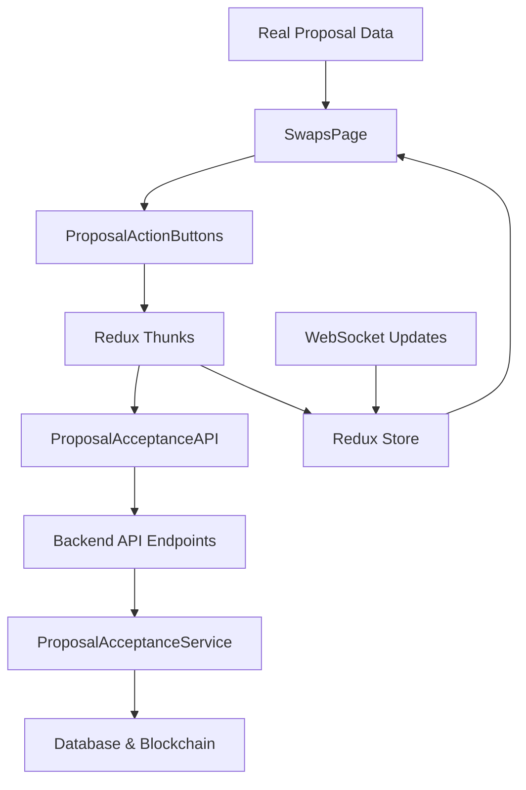

# Design Document

## Overview

This design integrates the existing frontend proposal acceptance components with the backend API endpoints. The backend ProposalAcceptanceService and REST API are fully functional, and the frontend components (ProposalActionButtons, ReceivedProposals, Redux slices) exist but are not connected. This integration will replace mock API calls and placeholder alerts with real backend communication.

## Architecture

### Current State Analysis

**Existing Backend Components:**
- ✅ ProposalAcceptanceService with accept/reject methods
- ✅ ProposalController with REST endpoints
- ✅ API routes registered at `/api/proposals/:proposalId/accept` and `/api/proposals/:proposalId/reject`
- ✅ Database integration with transaction management
- ✅ Blockchain recording via HederaService
- ✅ Payment processing for financial proposals

**Existing Frontend Components:**
- ✅ ProposalActionButtons component with UI logic
- ✅ ProposalAcceptanceAPI service with retry logic
- ✅ Redux slice (proposalAcceptanceSlice) with state management
- ✅ Redux thunks (proposalAcceptanceThunks) with mock API calls
- ✅ ReceivedProposals component for displaying proposals

**Integration Points:**
- ❌ SwapsPage uses placeholder alerts instead of real API calls
- ❌ Redux thunks use mock API instead of proposalAcceptanceAPI service
- ❌ No real proposal data loading from backend
- ❌ No connection between UI components and actual proposal data

### Integration Architecture



## Components and Interfaces

### 1. Updated Redux Thunks Integration

Replace mock API calls in `proposalAcceptanceThunks.ts`:

```typescript
// Current (Mock)
const proposalAcceptanceAPI = {
  async acceptProposal(request): Promise<ProposalResponseResult> {
    // Mock implementation
  }
};

// Updated (Real API)
import { proposalAcceptanceAPI } from '../../services/proposalAcceptanceAPI';

export const acceptProposal = createAsyncThunk(
  'proposalAcceptance/acceptProposal',
  async ({ proposalId, userId }, { dispatch }) => {
    // Use real API service
    const result = await proposalAcceptanceAPI.acceptProposal({
      proposalId,
      userId,
      autoProcessPayment: true
    });
    
    return result;
  }
);
```

### 2. SwapsPage API Integration

Replace placeholder alerts with real API calls:

```typescript
// Current (Placeholder)
onAcceptProposal={async (proposalId) => {
  alert('Proposal acceptance functionality will be implemented with the backend API');
}}

// Updated (Real Integration)
onAcceptProposal={async (proposalId) => {
  try {
    await dispatch(acceptProposal({ proposalId, userId: user.id })).unwrap();
    // Success handled by Redux state updates
  } catch (error) {
    // Error handled by Redux error state
  }
}}
```

### 3. Proposal Data Loading Service

Create new service for loading proposal data:

```typescript
export interface ProposalDataService {
  getUserProposals(userId: string): Promise<SwapProposal[]>;
  getProposalDetails(proposalId: string): Promise<SwapProposal>;
  subscribeToProposalUpdates(userId: string, callback: (update: ProposalUpdate) => void): void;
}

export class ProposalDataServiceImpl implements ProposalDataService {
  async getUserProposals(userId: string): Promise<SwapProposal[]> {
    const response = await apiClient.get(`/users/${userId}/proposals`);
    return response.data;
  }
  
  async getProposalDetails(proposalId: string): Promise<SwapProposal> {
    const response = await apiClient.get(`/proposals/${proposalId}`);
    return response.data;
  }
  
  subscribeToProposalUpdates(userId: string, callback: (update: ProposalUpdate) => void): void {
    // WebSocket subscription for real-time updates
    webSocketService.subscribe(`user:${userId}:proposals`, callback);
  }
}
```
#
## 4. Enhanced SwapsPage with Real Data

Update SwapsPage to load and display real proposal data:

```typescript
export const SwapsPage: React.FC = () => {
  const dispatch = useAppDispatch();
  const { user } = useAuth();
  const [proposals, setProposals] = useState<SwapProposal[]>([]);
  const [loading, setLoading] = useState(true);
  
  // Load real proposal data
  useEffect(() => {
    if (user?.id) {
      loadUserProposals();
    }
  }, [user?.id]);
  
  const loadUserProposals = async () => {
    try {
      setLoading(true);
      const userProposals = await proposalDataService.getUserProposals(user.id);
      setProposals(userProposals);
    } catch (error) {
      console.error('Failed to load proposals:', error);
    } finally {
      setLoading(false);
    }
  };
  
  const handleAcceptProposal = async (proposalId: string) => {
    try {
      await dispatch(acceptProposal({ proposalId, userId: user.id })).unwrap();
      await loadUserProposals(); // Refresh data
    } catch (error) {
      // Error handling via Redux state
    }
  };
  
  const handleRejectProposal = async (proposalId: string, reason?: string) => {
    try {
      await dispatch(rejectProposal({ proposalId, userId: user.id, reason })).unwrap();
      await loadUserProposals(); // Refresh data
    } catch (error) {
      // Error handling via Redux state
    }
  };
  
  return (
    <div>
      {/* Display real proposal data */}
      <ReceivedProposals
        proposals={proposals}
        onAcceptProposal={handleAcceptProposal}
        onRejectProposal={handleRejectProposal}
        isProcessing={loading}
      />
    </div>
  );
};
```

### 5. Real-time Updates Integration

Integrate WebSocket updates for real-time proposal status changes:

```typescript
export const useProposalUpdates = (userId: string) => {
  const dispatch = useAppDispatch();
  
  useEffect(() => {
    const handleProposalUpdate = (update: ProposalUpdate) => {
      // Update Redux store with real-time changes
      dispatch(updateProposalStatus({
        proposalId: update.proposalId,
        status: update.status,
        updatedAt: update.updatedAt
      }));
    };
    
    // Subscribe to WebSocket updates
    proposalDataService.subscribeToProposalUpdates(userId, handleProposalUpdate);
    
    return () => {
      // Cleanup subscription
      webSocketService.unsubscribe(`user:${userId}:proposals`);
    };
  }, [userId, dispatch]);
};
```

## Data Models

### Enhanced Proposal Data Structure

Ensure frontend models match backend response format:

```typescript
export interface SwapProposal {
  id: string;
  sourceSwapId: string;
  targetSwapId?: string;
  proposerId: string;
  targetUserId: string;
  proposalType: 'booking' | 'cash';
  status: 'pending' | 'accepted' | 'rejected' | 'expired';
  
  // Financial proposal fields
  cashOffer?: {
    amount: number;
    currency: string;
    escrowAccountId?: string;
    paymentMethodId: string;
  };
  
  // Response tracking
  respondedAt?: Date;
  respondedBy?: string;
  rejectionReason?: string;
  
  // Blockchain tracking
  blockchain: {
    proposalTransactionId?: string;
    responseTransactionId?: string;
  };
  
  createdAt: Date;
  updatedAt: Date;
}

export interface ProposalActionResponse {
  success: boolean;
  proposal: SwapProposal;
  swap?: {
    id: string;
    status: string;
  };
  paymentTransaction?: {
    id: string;
    status: string;
    amount: number;
    currency: string;
  };
  blockchainTransaction: {
    transactionId: string;
    consensusTimestamp?: string;
  };
}
```

## Error Handling

### Comprehensive Error Management

```typescript
export const handleProposalError = (error: any, proposalId: string) => {
  let userMessage: string;
  let shouldRetry: boolean = false;
  
  if (!error.response) {
    userMessage = 'Network error. Please check your connection.';
    shouldRetry = true;
  } else {
    switch (error.response.status) {
      case 400:
        userMessage = 'Invalid request. Please refresh and try again.';
        break;
      case 401:
        userMessage = 'Please log in to continue.';
        // Redirect to login
        break;
      case 404:
        userMessage = 'Proposal not found. It may have been removed.';
        break;
      case 409:
        userMessage = 'This proposal has already been responded to.';
        break;
      case 422:
        userMessage = 'Payment processing failed. Please try again.';
        shouldRetry = true;
        break;
      default:
        userMessage = 'An error occurred. Please try again.';
        shouldRetry = true;
    }
  }
  
  return { userMessage, shouldRetry };
};
```

## Testing Strategy

### Integration Testing Approach

1. **API Integration Tests**
   - Test real API calls from Redux thunks
   - Verify error handling for different response codes
   - Test retry logic and timeout handling

2. **Component Integration Tests**
   - Test SwapsPage with real proposal data
   - Verify ProposalActionButtons trigger correct API calls
   - Test loading states and error displays

3. **End-to-End Flow Tests**
   - Test complete accept proposal flow
   - Test complete reject proposal flow
   - Test real-time updates via WebSocket

### Mock Strategy for Development

```typescript
// Development mock toggle
const USE_MOCK_API = process.env.NODE_ENV === 'development' && 
                     process.env.REACT_APP_USE_MOCK_API === 'true';

export const proposalAcceptanceAPI = USE_MOCK_API 
  ? mockProposalAcceptanceAPI 
  : realProposalAcceptanceAPI;
```

## Performance Optimization

### Optimistic Updates

Maintain existing optimistic update strategy:

```typescript
export const acceptProposal = createAsyncThunk(
  'proposalAcceptance/acceptProposal',
  async ({ proposalId, userId }, { dispatch }) => {
    // Optimistic update
    dispatch(addOptimisticAcceptance(proposalId));
    
    try {
      const result = await proposalAcceptanceAPI.acceptProposal({
        proposalId,
        userId,
        autoProcessPayment: true
      });
      
      // Confirm optimistic update
      dispatch(completeProposalOperation({ proposalId, result }));
      return result;
    } catch (error) {
      // Revert optimistic update
      dispatch(removeOptimisticUpdate(proposalId));
      throw error;
    }
  }
);
```

### Caching Strategy

```typescript
export const proposalCacheService = {
  cache: new Map<string, { data: SwapProposal[], timestamp: number }>(),
  
  getCachedProposals(userId: string): SwapProposal[] | null {
    const cached = this.cache.get(userId);
    if (cached && Date.now() - cached.timestamp < 30000) { // 30 second cache
      return cached.data;
    }
    return null;
  },
  
  setCachedProposals(userId: string, proposals: SwapProposal[]): void {
    this.cache.set(userId, { data: proposals, timestamp: Date.now() });
  },
  
  invalidateCache(userId: string): void {
    this.cache.delete(userId);
  }
};
```

## Security Considerations

### Authentication Integration

```typescript
export const authenticatedProposalAPI = {
  async acceptProposal(request: AcceptProposalRequest): Promise<ProposalActionResponse> {
    const token = authService.getToken();
    if (!token) {
      throw new Error('Authentication required');
    }
    
    return proposalAcceptanceAPI.acceptProposal(request);
  }
};
```

### Input Validation

```typescript
export const validateProposalAction = (proposalId: string, userId: string): void => {
  if (!proposalId || !isValidUUID(proposalId)) {
    throw new Error('Invalid proposal ID');
  }
  
  if (!userId || !isValidUUID(userId)) {
    throw new Error('Invalid user ID');
  }
};
```

## Deployment Considerations

### Feature Flag Integration

```typescript
export const useProposalAcceptance = () => {
  const featureEnabled = useFeatureFlag('proposal-acceptance-integration');
  
  return {
    acceptProposal: featureEnabled ? realAcceptProposal : mockAcceptProposal,
    rejectProposal: featureEnabled ? realRejectProposal : mockRejectProposal,
  };
};
```

### Rollback Strategy

```typescript
export const rollbackToMockAPI = () => {
  // Switch back to mock implementation if real API fails
  localStorage.setItem('use-mock-proposal-api', 'true');
  window.location.reload();
};
```