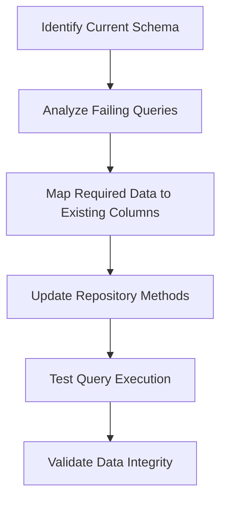
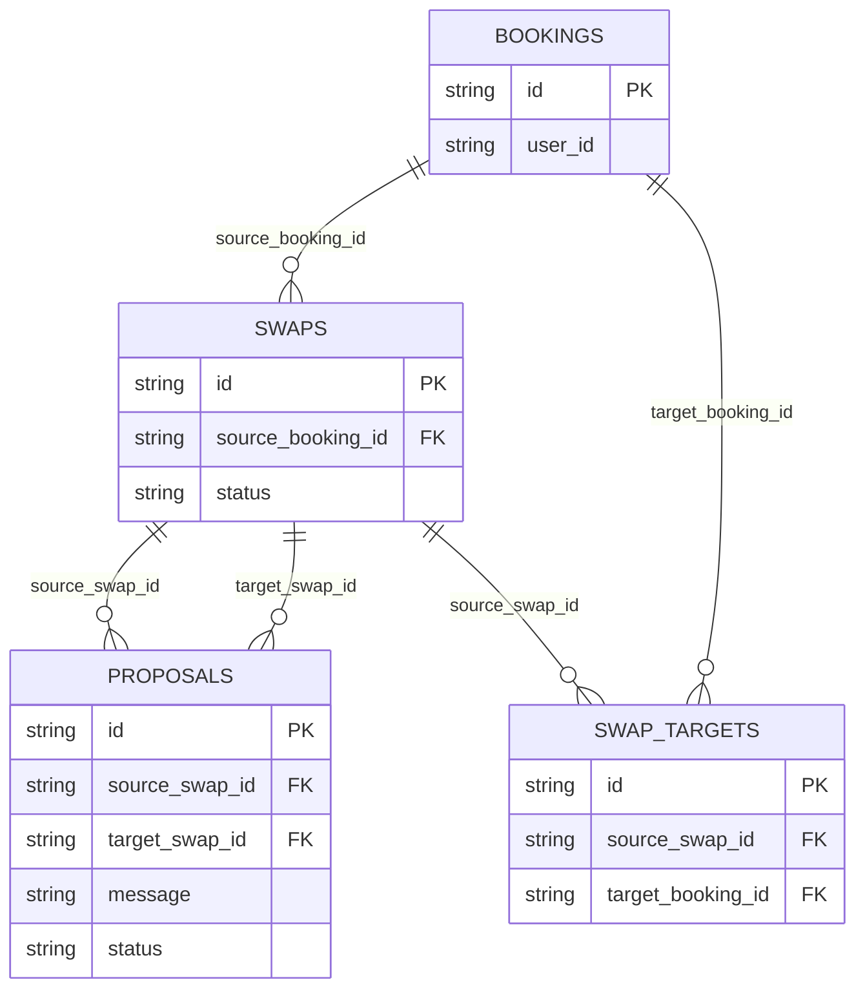

# Design Document

## Overview

This design addresses the database column reference errors in the proposal repository by analyzing the current database schema, identifying the problematic queries, and updating them to use the correct column names and relationships. The solution involves examining the actual database structure, updating repository methods to use existing columns, and ensuring proper JOIN operations for derived data.

## Architecture

### Current Problem Analysis

The error occurs at position 517 in a SQL query within the proposal repository, indicating that a column reference is invalid. Based on the error pattern and existing schema simplification specs, the likely issues are:

1. **Removed Foreign Key Columns**: Previous schema simplifications removed redundant columns like `owner_id`, `proposer_id`, and `target_booking_id`
2. **Outdated Query Structure**: Repository queries still reference these removed columns
3. **Missing JOIN Operations**: Queries need to derive user information from booking relationships

### Database Schema Alignment Strategy



## Components and Interfaces

### 1. Database Schema Investigation

**Purpose**: Determine the current structure of proposal-related tables

**Implementation**:
- Examine the `swaps` table structure
- Examine the `swap_targets` table structure  
- Examine the `bookings` table structure
- Identify available columns and relationships
- Document the current foreign key constraints

### 2. Query Analysis and Correction

**Purpose**: Identify and fix problematic SQL queries in the proposal repository

**Key Areas to Address**:
- **Proposal Retrieval Queries**: Update SELECT statements to use existing columns
- **JOIN Operations**: Add proper JOINs to derive user information from bookings
- **WHERE Clauses**: Update filtering conditions to use available columns
- **ORDER BY Clauses**: Ensure sorting uses existing column references

### 3. Repository Method Updates

**Purpose**: Update all proposal repository methods to work with current schema

**Methods to Update**:
- `getProposalById()`: Fix column references in proposal retrieval
- `getProposalsBySwapId()`: Update swap-based proposal queries
- `getProposalsByUserId()`: Derive user proposals through booking relationships
- `createProposal()`: Ensure creation uses correct column structure
- `updateProposal()`: Update modification queries

### 4. Data Derivation Strategy

**Purpose**: Obtain required information through table relationships

**Derivation Patterns**:
```sql
-- Instead of direct owner_id reference:
-- OLD: SELECT * FROM swaps WHERE owner_id = ?
-- NEW: SELECT s.* FROM swaps s 
--      JOIN bookings b ON s.source_booking_id = b.id 
--      WHERE b.user_id = ?

-- Instead of direct proposer_id reference:
-- OLD: SELECT * FROM proposals WHERE proposer_id = ?
-- NEW: SELECT p.* FROM proposals p
--      JOIN swaps s ON p.source_swap_id = s.id
--      JOIN bookings b ON s.source_booking_id = b.id
--      WHERE b.user_id = ?
```

## Data Models

### Current Schema Structure (Expected)

```typescript
interface Swap {
  id: string;
  source_booking_id: string;  // Links to bookings table
  status: string;
  created_at: Date;
  updated_at: Date;
  // Removed: owner_id, target_booking_id, proposer_id
}

interface SwapTarget {
  id: string;
  source_swap_id: string;     // Links to swaps table
  target_booking_id: string;  // Links to target booking
  // Removed: proposal_id
}

interface Booking {
  id: string;
  user_id: string;           // The actual owner reference
  // ... other booking fields
}

interface Proposal {
  id: string;
  source_swap_id: string;    // Links to the proposing swap
  target_swap_id: string;    // Links to the target swap
  message: string;
  status: string;
  created_at: Date;
  // Derived: proposer_id (from source_swap -> booking -> user)
  // Derived: owner_id (from target_swap -> booking -> user)
}
```

### Query Relationship Mapping



## Error Handling

### Database Query Error Recovery

1. **Column Reference Errors**: Catch PostgreSQL 42703 errors and provide meaningful error messages
2. **Missing Relationship Data**: Handle cases where JOIN operations don't find related records
3. **Performance Monitoring**: Log slow queries that result from complex JOINs
4. **Fallback Strategies**: Provide alternative query paths if primary queries fail

### Validation Strategy

```typescript
interface QueryValidation {
  validateColumnExists(tableName: string, columnName: string): boolean;
  validateJoinPath(fromTable: string, toTable: string): boolean;
  logQueryPerformance(query: string, executionTime: number): void;
}
```

## Testing Strategy

### 1. Database Schema Verification

**Purpose**: Ensure current schema matches expectations

**Tests**:
- Verify table structures match expected schema
- Confirm removed columns are actually removed
- Validate foreign key relationships exist
- Check index availability for performance

### 2. Repository Method Testing

**Purpose**: Verify all repository methods work with updated queries

**Test Cases**:
- Test proposal retrieval by ID with valid proposal
- Test proposal retrieval with non-existent proposal
- Test proposal queries that require user derivation
- Test proposal creation with current schema
- Test proposal updates and deletions

### 3. Performance Testing

**Purpose**: Ensure query performance is acceptable with JOINs

**Metrics**:
- Query execution time for proposal retrieval
- Memory usage for complex JOIN operations
- Database connection pool impact
- Concurrent query performance

### 4. Integration Testing

**Purpose**: Verify proposal operations work end-to-end

**Scenarios**:
- Complete proposal creation flow
- Proposal acceptance workflow
- Proposal rejection handling
- Multi-user proposal scenarios

## Implementation Approach

### Phase 1: Schema Investigation
1. Connect to database and examine current table structures
2. Document actual column names and relationships
3. Identify specific queries causing the 42703 error
4. Map required data to available columns

### Phase 2: Query Updates
1. Update proposal repository SELECT queries
2. Add necessary JOIN operations for derived data
3. Update WHERE clauses to use existing columns
4. Test individual query components

### Phase 3: Repository Integration
1. Update all repository method implementations
2. Ensure consistent error handling across methods
3. Add logging for debugging future issues
4. Update any cached query patterns

### Phase 4: Validation and Testing
1. Run comprehensive test suite
2. Verify performance meets requirements
3. Test error scenarios and edge cases
4. Document the updated repository patterns

## Security Considerations

- **SQL Injection Prevention**: Ensure all updated queries use parameterized statements
- **Access Control**: Verify that derived user relationships maintain proper authorization
- **Data Exposure**: Ensure JOINs don't inadvertently expose unauthorized data
- **Audit Trail**: Maintain proper logging of proposal operations for security monitoring