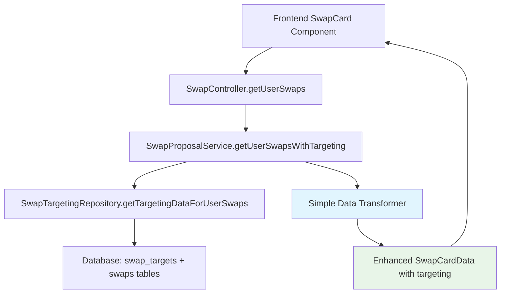

# Design Document

## Overview

The proposal view targeting display issue stems from a disconnect between the comprehensive backend targeting infrastructure and the frontend display logic. While the `SwapTargetingRepository.getTargetingDataForUserSwaps()` method correctly retrieves targeting relationships from both the `swap_targets` table and regular swap proposals, the data is not being properly transformed and displayed in the user interface.

The core problem is that the existing `getUserSwapsWithTargeting()` method in `SwapProposalService` has complex transformation logic that may be failing silently, causing targeting information to be lost before reaching the frontend components.

## Architecture

The solution focuses on creating a simplified, debuggable data flow from the database to the UI:



## Components and Interfaces

### 1. Simplified Data Transformer

Instead of the complex `TargetingDataTransformer` class, we'll create a simple, focused transformer:

```typescript
interface SimpleTargetingData {
  swapId: string;
  incomingTargets: Array<{
    id: string;
    sourceSwapId: string;
    ownerName: string;
    bookingTitle: string;
    status: string;
  }>;
  outgoingTarget?: {
    id: string;
    targetSwapId: string;
    ownerName: string;
    bookingTitle: string;
    status: string;
  };
}

class SimpleTargetingTransformer {
  static transform(rawData: any): SimpleTargetingData[] {
    // Simple, linear transformation with extensive logging
  }
}
```

### 2. Enhanced SwapCardData Structure

Extend the existing `SwapCardData` with minimal targeting information:

```typescript
interface EnhancedSwapCardData extends SwapCardData {
  targeting: {
    incomingCount: number;
    incomingTargets: SimpleTargetInfo[];
    outgoingTarget?: SimpleTargetInfo;
    hasTargeting: boolean;
  };
}

interface SimpleTargetInfo {
  id: string;
  ownerName: string;
  bookingTitle: string;
  status: string;
}
```

### 3. Debugging and Logging Strategy

Add comprehensive logging at each step:

```typescript
class TargetingDebugLogger {
  static logDataRetrievalStep(step: string, data: any): void;
  static logTransformationStep(input: any, output: any): void;
  static logValidationResults(results: any): void;
}
```

## Data Models

### Database Query Results
The existing `getTargetingDataForUserSwaps()` method returns:
- `incomingTargets[]` - Swaps targeting the user's swaps
- `outgoingTargets[]` - User's swaps targeting other swaps

### Transformed Data Structure
```typescript
interface ProcessedTargetingData {
  userId: string;
  swapTargetingMap: Map<string, {
    incomingTargets: SimpleTargetInfo[];
    outgoingTarget?: SimpleTargetInfo;
  }>;
  totalIncoming: number;
  totalOutgoing: number;
}
```

## Error Handling

### 1. Graceful Degradation
- If targeting data retrieval fails, return basic swap cards without targeting info
- Log all failures with detailed context
- Provide fallback empty targeting data structure

### 2. Data Validation
- Validate each step of data transformation
- Check for missing required fields
- Ensure data consistency between steps

### 3. Error Recovery
```typescript
class TargetingErrorHandler {
  static handleRetrievalError(error: Error, userId: string): SwapCardData[];
  static handleTransformationError(error: Error, rawData: any): SimpleTargetingData[];
  static logErrorWithContext(error: Error, context: any): void;
}
```

## Testing Strategy

### 1. Unit Tests
- Test `SimpleTargetingTransformer` with various data scenarios
- Test error handling paths
- Test data validation logic

### 2. Integration Tests
- Test complete data flow from repository to frontend
- Test with real database data
- Test error scenarios and fallback behavior

### 3. Debug Utilities
- Create debug endpoint to inspect targeting data at each step
- Add debug logging that can be enabled in production
- Create data consistency validation tools