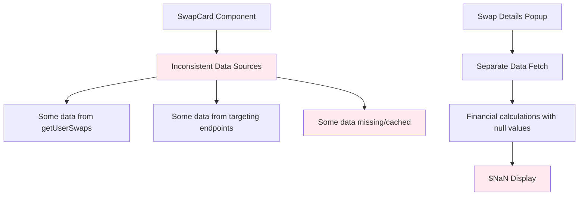
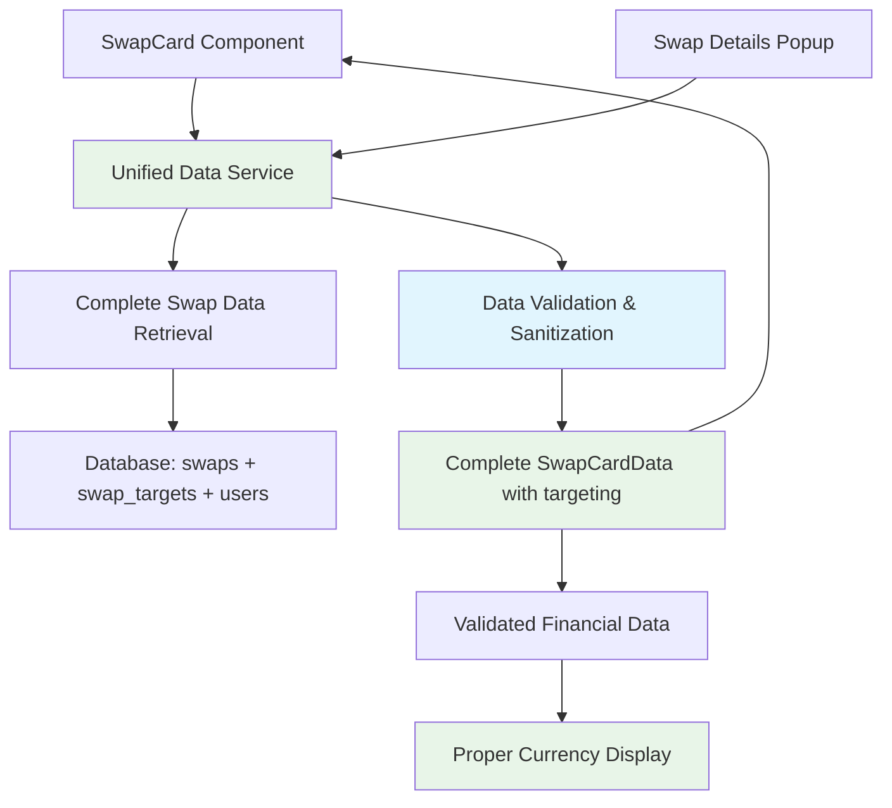

# Design Document

## Overview

The swap card display accuracy issues stem from multiple disconnected problems in the data flow from database to UI. The core issues are:

1. **Incomplete data retrieval** - Not all targeting and proposal data is being fetched
2. **Poor error handling** - Null/undefined values causing $NaN displays
3. **Inconsistent data sources** - Different UI elements pulling from different data
4. **Unnecessary UI elements** - "Offline" labels and non-functional proposal sections
5. **Missing proposal details** - Insufficient information for accept/reject decisions

The solution focuses on creating a unified, comprehensive data flow that ensures all UI elements display accurate, complete information from the database.

## Architecture

### Current Problematic Flow


### Improved Unified Flow


## Components and Interfaces

### 1. Unified Swap Data Service

Create a comprehensive service that retrieves all necessary data in one call:

```typescript
interface CompleteSwapData {
  // Basic swap information
  id: string;
  title: string;
  description: string;
  ownerId: string;
  ownerName: string;
  status: string;
  
  // Financial information (validated)
  pricing: {
    amount: number | null;
    currency: string;
    formatted: string; // "€50.00" or "Price not set"
  };
  
  // Targeting information
  targeting: {
    incomingProposals: ProposalDetail[];
    outgoingTarget: TargetDetail | null;
    totalIncomingCount: number;
  };
  
  // Metadata
  createdAt: Date;
  updatedAt: Date;
}

interface ProposalDetail {
  id: string;
  proposerId: string;
  proposerName: string;
  proposerSwapId: string;
  proposerSwapTitle: string;
  proposerSwapDescription: string;
  proposedTerms: {
    pricing: {
      amount: number | null;
      currency: string;
      formatted: string;
    };
    message?: string;
  };
  status: 'pending' | 'accepted' | 'rejected';
  createdAt: Date;
}

interface TargetDetail {
  id: string;
  targetSwapId: string;
  targetOwnerName: string;
  targetSwapTitle: string;
  status: 'pending' | 'accepted' | 'rejected';
  createdAt: Date;
}
```

### 2. Data Validation and Sanitization Layer

```typescript
class SwapDataValidator {
  static validateAndSanitize(rawSwapData: any): CompleteSwapData {
    return {
      ...rawSwapData,
      pricing: this.sanitizePricing(rawSwapData.pricing),
      targeting: this.sanitizeTargeting(rawSwapData.targeting),
      ownerName: rawSwapData.ownerName || 'Unknown User'
    };
  }
  
  static sanitizePricing(pricing: any): CompleteSwapData['pricing'] {
    if (!pricing || pricing.amount === null || pricing.amount === undefined) {
      return {
        amount: null,
        currency: 'EUR',
        formatted: 'Price not set'
      };
    }
    
    const amount = parseFloat(pricing.amount);
    if (isNaN(amount)) {
      return {
        amount: null,
        currency: pricing.currency || 'EUR',
        formatted: 'Invalid price'
      };
    }
    
    return {
      amount,
      currency: pricing.currency || 'EUR',
      formatted: `${pricing.currency || '€'}${amount.toFixed(2)}`
    };
  }
  
  static sanitizeTargeting(targeting: any): CompleteSwapData['targeting'] {
    return {
      incomingProposals: (targeting?.incomingProposals || []).map(this.sanitizeProposal),
      outgoingTarget: targeting?.outgoingTarget ? this.sanitizeTarget(targeting.outgoingTarget) : null,
      totalIncomingCount: targeting?.incomingProposals?.length || 0
    };
  }
}
```

### 3. Enhanced SwapCard Component

Remove problematic elements and add comprehensive display:

```typescript
interface SwapCardProps {
  swapData: CompleteSwapData;
  onViewDetails: (swapId: string) => void;
  onAcceptProposal: (proposalId: string) => void;
  onRejectProposal: (proposalId: string) => void;
}

// Component structure:
// - Remove "Offline" label entirely
// - Replace "Proposals from others" with targeting count badge
// - Add proposal details section when proposals exist
// - Show validated pricing information
// - Display complete proposal information for decisions
```

### 4. Enhanced Swap Details Popup

```typescript
interface SwapDetailsPopupProps {
  swapData: CompleteSwapData;
  onClose: () => void;
  onAcceptProposal: (proposalId: string) => void;
  onRejectProposal: (proposalId: string) => void;
}

// Features:
// - Display validated financial information (no $NaN)
// - Show complete proposal details
// - Provide clear accept/reject actions
// - Display proposer information and swap details
```

## Data Models

### Database Query Strategy

Instead of multiple separate queries, use a single comprehensive query:

```sql
-- Single query to get complete swap data with targeting
SELECT 
  s.*,
  u.name as owner_name,
  -- Incoming proposals (others targeting this swap)
  JSON_AGG(
    DISTINCT JSONB_BUILD_OBJECT(
      'id', st_in.id,
      'proposerId', st_in.source_user_id,
      'proposerName', u_proposer.name,
      'proposerSwapId', st_in.source_swap_id,
      'proposerSwapTitle', s_proposer.title,
      'proposerSwapDescription', s_proposer.description,
      'status', st_in.status,
      'createdAt', st_in.created_at,
      'proposedTerms', JSONB_BUILD_OBJECT(
        'pricing', JSONB_BUILD_OBJECT(
          'amount', s_proposer.price_amount,
          'currency', s_proposer.price_currency
        )
      )
    )
  ) FILTER (WHERE st_in.id IS NOT NULL) as incoming_proposals,
  
  -- Outgoing target (this swap targeting another)
  JSON_BUILD_OBJECT(
    'id', st_out.id,
    'targetSwapId', st_out.target_swap_id,
    'targetOwnerName', u_target.name,
    'targetSwapTitle', s_target.title,
    'status', st_out.status,
    'createdAt', st_out.created_at
  ) as outgoing_target

FROM swaps s
LEFT JOIN users u ON s.user_id = u.id
LEFT JOIN swap_targets st_in ON s.id = st_in.target_swap_id
LEFT JOIN users u_proposer ON st_in.source_user_id = u_proposer.id
LEFT JOIN swaps s_proposer ON st_in.source_swap_id = s_proposer.id
LEFT JOIN swap_targets st_out ON s.id = st_out.source_swap_id
LEFT JOIN swaps s_target ON st_out.target_swap_id = s_target.id
LEFT JOIN users u_target ON s_target.user_id = u_target.id

WHERE s.user_id = $1
GROUP BY s.id, u.name, st_out.id, u_target.name, s_target.title, st_out.status, st_out.created_at
ORDER BY s.created_at DESC;
```

## Error Handling

### 1. Financial Data Validation

```typescript
class FinancialDataHandler {
  static formatCurrency(amount: any, currency: string = 'EUR'): string {
    if (amount === null || amount === undefined || amount === '') {
      return 'Price not set';
    }
    
    const numericAmount = parseFloat(amount);
    if (isNaN(numericAmount)) {
      return 'Invalid price';
    }
    
    const currencySymbol = currency === 'EUR' ? '€' : currency;
    return `${currencySymbol}${numericAmount.toFixed(2)}`;
  }
  
  static validateAmount(amount: any): number | null {
    if (amount === null || amount === undefined || amount === '') {
      return null;
    }
    
    const numericAmount = parseFloat(amount);
    return isNaN(numericAmount) ? null : numericAmount;
  }
}
```

### 2. Data Consistency Checks

```typescript
class DataConsistencyValidator {
  static validateSwapData(data: any): ValidationResult {
    const errors: string[] = [];
    
    if (!data.id) errors.push('Missing swap ID');
    if (!data.title) errors.push('Missing swap title');
    if (!data.ownerName) errors.push('Missing owner name');
    
    // Validate targeting data consistency
    if (data.targeting?.totalIncomingCount !== data.targeting?.incomingProposals?.length) {
      errors.push('Inconsistent proposal count');
    }
    
    return {
      isValid: errors.length === 0,
      errors,
      sanitizedData: this.sanitizeData(data)
    };
  }
}
```

### 3. Graceful Fallbacks

```typescript
class FallbackDataProvider {
  static getEmptySwapData(swapId: string): CompleteSwapData {
    return {
      id: swapId,
      title: 'Swap data unavailable',
      description: '',
      ownerId: '',
      ownerName: 'Unknown',
      status: 'unknown',
      pricing: {
        amount: null,
        currency: 'EUR',
        formatted: 'Price not available'
      },
      targeting: {
        incomingProposals: [],
        outgoingTarget: null,
        totalIncomingCount: 0
      },
      createdAt: new Date(),
      updatedAt: new Date()
    };
  }
}
```

## Testing Strategy

### 1. Data Validation Tests
- Test financial data sanitization with various invalid inputs
- Test targeting data consistency validation
- Test fallback data generation

### 2. UI Component Tests
- Test SwapCard component with complete data
- Test SwapCard component with missing/invalid data
- Test proposal display and action buttons
- Test currency formatting in all scenarios

### 3. Integration Tests
- Test complete data flow from database to UI
- Test proposal accept/reject workflows
- Test data consistency across page refreshes

### 4. Edge Case Testing
- Test with null/undefined pricing data
- Test with missing user names
- Test with corrupted targeting relationships
- Test with very large proposal counts