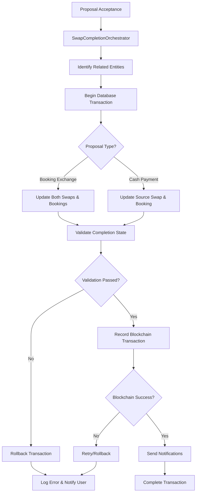

# Design Document

## Overview

This design implements a comprehensive swap completion system that ensures atomic updates across all related entities when a swap proposal is accepted. The system extends the existing ProposalAcceptanceService to include robust completion workflows that maintain data consistency across swaps, bookings, proposals, and blockchain records.

## Architecture

### High-Level Flow



### Service Layer Architecture

The design integrates with existing services while adding new completion-specific components:

- **SwapCompletionOrchestrator**: New service for managing completion workflows
- **CompletionTransactionManager**: New service for atomic database operations
- **CompletionValidationService**: New service for validating completion consistency
- **ProposalAcceptanceService**: Enhanced existing service
- **HederaService**: Existing service for blockchain recording
- **NotificationService**: Existing service for user notifications

## Components and Interfaces

### 1. SwapCompletionOrchestrator

New orchestration service that manages the complete swap completion workflow:

```typescript
export interface SwapCompletionRequest {
  proposalId: string;
  acceptingUserId: string;
  proposalType: 'booking' | 'cash';
  sourceSwapId: string;
  targetSwapId?: string; // For booking exchanges
  paymentTransactionId?: string; // For cash payments
}

export interface SwapCompletionResult {
  completedSwaps: CompletedSwapInfo[];
  updatedBookings: CompletedBookingInfo[];
  proposal: SwapProposal;
  blockchainTransaction: {
    transactionId: string;
    consensusTimestamp?: string;
  };
  completionTimestamp: Date;
}

export interface CompletedSwapInfo {
  swapId: string;
  previousStatus: SwapStatus;
  newStatus: SwapStatus;
  completedAt: Date;
}

export interface CompletedBookingInfo {
  bookingId: string;
  previousStatus: BookingStatus;
  newStatus: BookingStatus;
  swappedAt: Date;
  newOwnerId?: string; // For ownership transfers
}

export class SwapCompletionOrchestrator {
  async completeSwapExchange(request: SwapCompletionRequest): Promise<SwapCompletionResult>
  async completeCashSwap(request: SwapCompletionRequest): Promise<SwapCompletionResult>
  private async identifyRelatedEntities(proposalId: string): Promise<RelatedEntities>
  private async validateCompletionEligibility(entities: RelatedEntities): Promise<ValidationResult>
  private async executeCompletionWorkflow(entities: RelatedEntities, request: SwapCompletionRequest): Promise<SwapCompletionResult>
}
```

### 2. CompletionTransactionManager

New service for managing atomic database transactions:

```typescript
export interface RelatedEntities {
  proposal: SwapProposal;
  sourceSwap: Swap;
  sourceBooking: Booking;
  targetSwap?: Swap;
  targetBooking?: Booking;
  paymentTransaction?: PaymentTransaction;
}

export interface CompletionTransactionData {
  swapUpdates: Array<{
    swapId: string;
    status: SwapStatus;
    completedAt: Date;
    blockchainTransactionId?: string;
  }>;
  bookingUpdates: Array<{
    bookingId: string;
    status: BookingStatus;
    swappedAt: Date;
    newOwnerId?: string;
  }>;
  proposalUpdate: {
    proposalId: string;
    status: 'accepted';
    respondedAt: Date;
    respondedBy: string;
  };
}

export class CompletionTransactionManager {
  async executeCompletionTransaction(
    entities: RelatedEntities,
    transactionData: CompletionTransactionData
  ): Promise<{
    updatedSwaps: Swap[];
    updatedBookings: Booking[];
    updatedProposal: SwapProposal;
  }>
  
  async rollbackCompletionTransaction(
    transactionId: string,
    originalStates: RelatedEntities
  ): Promise<void>
  
  private async updateSwapStatuses(swapUpdates: CompletionTransactionData['swapUpdates']): Promise<Swap[]>
  private async updateBookingStatuses(bookingUpdates: CompletionTransactionData['bookingUpdates']): Promise<Booking[]>
  private async updateProposalStatus(proposalUpdate: CompletionTransactionData['proposalUpdate']): Promise<SwapProposal>
}
```

### 3. CompletionValidationService

New service for validating completion consistency:

```typescript
export interface CompletionValidationResult {
  isValid: boolean;
  errors: string[];
  warnings: string[];
  inconsistentEntities: string[];
  correctionAttempts?: CorrectionAttempt[];
}

export interface CorrectionAttempt {
  entityType: 'swap' | 'booking' | 'proposal';
  entityId: string;
  expectedStatus: string;
  actualStatus: string;
  correctionApplied: boolean;
  correctionError?: string;
}

export class CompletionValidationService {
  async validatePreCompletion(entities: RelatedEntities): Promise<CompletionValidationResult>
  async validatePostCompletion(
    completedSwaps: CompletedSwapInfo[],
    updatedBookings: CompletedBookingInfo[],
    proposal: SwapProposal
  ): Promise<CompletionValidationResult>
  
  async attemptAutomaticCorrection(
    inconsistencies: string[],
    entities: RelatedEntities
  ): Promise<CorrectionAttempt[]>
  
  private async validateSwapCompletionConsistency(swaps: Swap[]): Promise<ValidationResult>
  private async validateBookingSwapConsistency(bookings: Booking[]): Promise<ValidationResult>
  private async validateProposalAcceptanceConsistency(proposal: SwapProposal): Promise<ValidationResult>
}
```

### 4. Enhanced ProposalAcceptanceService

Extend existing service to integrate with completion workflow:

```typescript
// Add to existing ProposalAcceptanceService class:
export class ProposalAcceptanceService {
  // Existing methods...
  
  async acceptProposalWithCompletion(request: ProposalAcceptanceRequest): Promise<ProposalAcceptanceResult & SwapCompletionResult>
  
  private async orchestrateSwapCompletion(
    proposal: SwapProposal,
    acceptingUserId: string
  ): Promise<SwapCompletionResult>
  
  private async handleCompletionFailure(
    proposalId: string,
    error: Error,
    partialResults?: Partial<SwapCompletionResult>
  ): Promise<void>
}
```

## Data Models

### Enhanced Swap Model

Extend existing Swap model to support completion tracking:

```typescript
export interface SwapCompletion {
  completedAt?: Date;
  completedBy?: string;
  completionTransactionId?: string;
  relatedSwapCompletions?: string[]; // IDs of other swaps completed in same transaction
  blockchainCompletionId?: string;
}

export interface EnhancedSwap extends Swap {
  completion?: SwapCompletion;
}
```

### Enhanced Booking Model

Extend existing Booking model to support swap completion tracking:

```typescript
export interface BookingSwapCompletion {
  swappedAt?: Date;
  swapTransactionId?: string;
  originalOwnerId?: string; // For tracking ownership transfers
  swapCompletionId?: string;
  relatedBookingSwaps?: string[]; // IDs of other bookings swapped in same transaction
}

export interface EnhancedBooking extends Booking {
  swapCompletion?: BookingSwapCompletion;
}
```

### Completion Audit Trail

New model for tracking completion operations:

```typescript
export interface SwapCompletionAudit extends BaseEntity {
  proposalId: string;
  completionType: 'booking_exchange' | 'cash_payment';
  initiatedBy: string;
  completedAt: Date;
  
  // Entities involved
  affectedSwaps: string[];
  affectedBookings: string[];
  
  // Transaction details
  databaseTransactionId: string;
  blockchainTransactionId?: string;
  
  // Status tracking
  status: 'initiated' | 'completed' | 'failed' | 'rolled_back';
  errorDetails?: string;
  
  // Validation results
  preValidationResult?: CompletionValidationResult;
  postValidationResult?: CompletionValidationResult;
}
```

## Error Handling

### Error Types

```typescript
export enum SwapCompletionErrorCodes {
  INVALID_PROPOSAL_STATE = 'INVALID_PROPOSAL_STATE',
  MISSING_RELATED_ENTITIES = 'MISSING_RELATED_ENTITIES',
  COMPLETION_VALIDATION_FAILED = 'COMPLETION_VALIDATION_FAILED',
  DATABASE_TRANSACTION_FAILED = 'DATABASE_TRANSACTION_FAILED',
  BLOCKCHAIN_RECORDING_FAILED = 'BLOCKCHAIN_RECORDING_FAILED',
  INCONSISTENT_ENTITY_STATES = 'INCONSISTENT_ENTITY_STATES',
  AUTOMATIC_CORRECTION_FAILED = 'AUTOMATIC_CORRECTION_FAILED',
  ROLLBACK_FAILED = 'ROLLBACK_FAILED'
}

export class SwapCompletionError extends Error {
  constructor(
    public code: SwapCompletionErrorCodes,
    public message: string,
    public affectedEntities?: string[],
    public details?: Record<string, any>
  ) {
    super(message);
    this.name = 'SwapCompletionError';
  }
}
```

### Rollback Strategy

```typescript
export class CompletionRollbackManager {
  async rollbackCompletionWorkflow(
    auditId: string,
    originalStates: RelatedEntities,
    partialResults?: Partial<SwapCompletionResult>
  ): Promise<RollbackResult>
  
  async rollbackDatabaseChanges(
    transactionId: string,
    originalStates: RelatedEntities
  ): Promise<void>
  
  async rollbackBlockchainTransaction(
    blockchainTransactionId: string
  ): Promise<void>
  
  private async restoreEntityStates(
    entities: RelatedEntities
  ): Promise<void>
}

export interface RollbackResult {
  success: boolean;
  restoredEntities: string[];
  failedRestorations: string[];
  requiresManualIntervention: boolean;
  errorDetails?: string;
}
```

## Testing Strategy

### Unit Tests

1. **SwapCompletionOrchestrator Tests**
   - Test booking exchange completion workflow
   - Test cash payment completion workflow
   - Test entity identification and validation
   - Test error handling and rollback scenarios

2. **CompletionTransactionManager Tests**
   - Test atomic transaction execution
   - Test rollback on failure
   - Test concurrent completion handling
   - Test database constraint validation

3. **CompletionValidationService Tests**
   - Test pre-completion validation
   - Test post-completion consistency checks
   - Test automatic correction attempts
   - Test inconsistency detection

### Integration Tests

1. **End-to-End Completion Flows**
   - Create proposal → Accept → Verify all entities completed
   - Test with both booking exchange and cash payment scenarios
   - Test concurrent completion attempts

2. **Error Recovery Tests**
   - Test partial failure scenarios
   - Test rollback effectiveness
   - Test system recovery after failures
   - Test manual intervention workflows

3. **Blockchain Integration Tests**
   - Test blockchain recording with completion
   - Test blockchain failure handling
   - Test blockchain transaction consistency

### Performance Tests

1. **Concurrent Completion Processing**
   - Test multiple users completing swaps simultaneously
   - Test database locking and transaction isolation
   - Test completion throughput under load

2. **Large-Scale Completion Operations**
   - Test completion with multiple related entities
   - Test validation performance with complex relationships
   - Test rollback performance for large transactions

## API Endpoints

### Enhanced Proposal Acceptance

```typescript
// Enhanced existing endpoint
POST /api/proposals/{proposalId}/accept
{
  "userId": "string",
  "ensureCompletion": boolean, // New flag for completion workflow
  "validationLevel": "basic" | "comprehensive" // New validation option
}

// Response includes completion details
{
  "proposal": SwapProposal,
  "completion": SwapCompletionResult,
  "validation": CompletionValidationResult
}
```

### Completion Status Endpoints

```typescript
// Get completion status for a swap
GET /api/swaps/{swapId}/completion-status

// Get completion audit trail
GET /api/completions/{completionId}/audit

// Validate completion consistency
POST /api/completions/validate
{
  "swapIds": string[],
  "bookingIds": string[],
  "proposalIds": string[]
}
```

### WebSocket Events

```typescript
// Real-time completion updates
interface SwapCompletionUpdate {
  completionId: string;
  status: 'initiated' | 'completed' | 'failed';
  affectedSwaps: string[];
  affectedBookings: string[];
  completedAt?: Date;
  errorDetails?: string;
}
```

## Security Considerations

### Authorization

- Verify user has permission to accept the proposal
- Validate user owns the source swap/booking
- Ensure completion doesn't violate business rules
- Implement rate limiting for completion operations

### Data Integrity

- Use database transactions with appropriate isolation levels
- Implement optimistic locking for concurrent updates
- Validate entity relationships before completion
- Audit all completion operations

### Blockchain Security

- Use existing HederaService security patterns
- Validate completion transaction signatures
- Implement replay attack protection for completion records
- Secure completion transaction metadata

## Deployment Considerations

### Database Migrations

1. Add completion tracking columns to existing tables:
   - `swaps.completed_at`, `swaps.completion_transaction_id`
   - `bookings.swapped_at`, `bookings.swap_transaction_id`
   - `swap_proposals.completion_audit_id`

2. Create new tables:
   - `swap_completion_audits`
   - `completion_validation_results`

3. Add indexes for performance:
   - Completion status queries
   - Audit trail lookups
   - Validation result searches

### Configuration

```typescript
export interface SwapCompletionConfig {
  maxConcurrentCompletions: number;
  completionTimeoutMs: number;
  validationLevel: 'basic' | 'comprehensive';
  automaticCorrectionEnabled: boolean;
  rollbackTimeoutMs: number;
  blockchainRetryAttempts: number;
}
```

### Monitoring

- Track completion success/failure rates
- Monitor completion processing times
- Alert on validation failures
- Track rollback frequency and causes
- Monitor blockchain recording success rates

## Integration Points

### Existing Services

1. **ProposalAcceptanceService**: Enhanced with completion workflow
2. **SwapResponseService**: Integration for completion notifications
3. **HederaService**: Use for blockchain completion recording
4. **NotificationService**: Enhanced with completion notifications
5. **PaymentProcessingService**: Integration for cash payment completions

### External Dependencies

1. **Database**: PostgreSQL with transaction support
2. **Hedera Network**: For blockchain completion recording
3. **Message Queue**: For async completion processing
4. **Monitoring**: For completion workflow tracking

## Performance Optimization

### Caching Strategy

- Cache entity relationship mappings
- Cache validation results for repeated operations
- Cache completion status for frequently accessed swaps

### Async Processing

- Process completion notifications asynchronously
- Queue blockchain transactions for batch processing
- Implement background completion validation

### Database Optimization

- Use connection pooling for completion transactions
- Implement read replicas for completion status queries
- Optimize indexes for completion-related queries
- Use database partitioning for audit tables

## Rollout Strategy

### Phase 1: Core Completion Infrastructure
- Implement SwapCompletionOrchestrator
- Add CompletionTransactionManager
- Create basic validation service

### Phase 2: Enhanced Validation and Recovery
- Implement CompletionValidationService
- Add automatic correction capabilities
- Implement comprehensive rollback mechanisms

### Phase 3: Monitoring and Optimization
- Add completion audit trails
- Implement performance monitoring
- Optimize for high-volume scenarios

### Phase 4: Advanced Features
- Add completion analytics
- Implement completion scheduling
- Add advanced validation rules