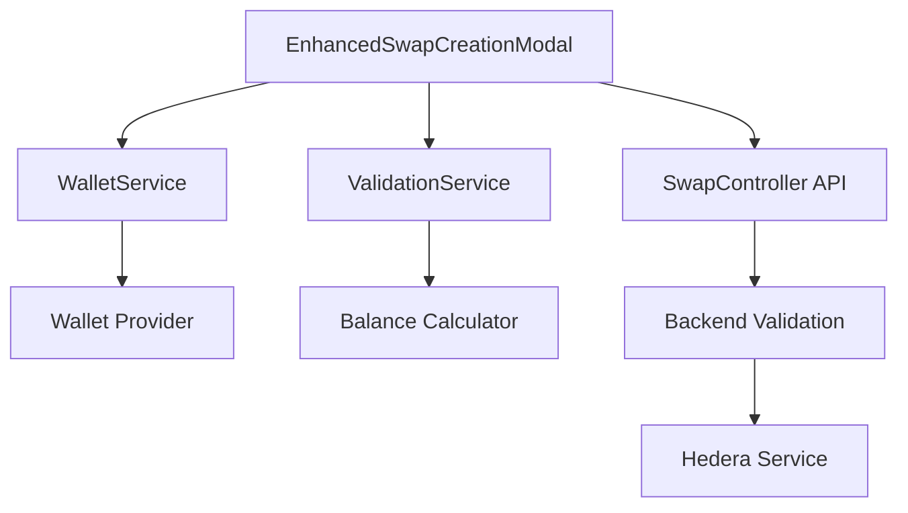

# Design Document

## Overview

The swap creation wallet validation system ensures users have connected wallets with sufficient balances before creating swaps. This design builds upon the existing wallet service infrastructure and validation types to provide comprehensive validation at both frontend and backend levels.

## Architecture

### High-Level Flow
```
User clicks "Create Swap" → Frontend Validation → Backend Validation → Swap Creation
                              ↓                    ↓
                         Wallet Check         Server-side Check
                         Balance Check        Balance Verification
                              ↓                    ↓
                         Show Errors          Return Errors
```

### Component Interaction


## Components and Interfaces

### 1. Frontend Validation Layer

#### WalletValidationService
**Location:** `apps/frontend/src/services/wallet/WalletValidationService.ts`

```typescript
interface WalletValidationService {
  validateSwapCreation(swapData: EnhancedCreateSwapRequest): Promise<SwapWalletValidation>
  validateWalletConnection(): WalletConnectionValidation
  validateWalletBalance(requirements: WalletBalanceRequirement): Promise<WalletBalanceValidation>
  calculateBalanceRequirements(swapData: EnhancedCreateSwapRequest): WalletBalanceRequirement
}
```

**Responsibilities:**
- Orchestrate wallet connection and balance validation
- Calculate required amounts based on swap configuration
- Provide detailed validation results with error messages
- Cache validation results to avoid redundant checks

#### Enhanced Swap Creation Modal Updates
**Location:** `apps/frontend/src/components/swap/EnhancedSwapCreationModal.tsx`

**New validation integration points:**
- Pre-submission validation hook
- Real-time balance checking
- Error display with actionable guidance
- Wallet connection status indicator

### 2. Backend Validation Layer

#### SwapController Enhancements
**Location:** `apps/backend/src/controllers/SwapController.ts`

**Enhanced `createEnhancedSwap` method:**
- Wallet address validation (existing)
- Server-side balance verification (new)
- Comprehensive error responses
- Audit logging for validation failures

#### Hedera Balance Service
**Location:** `apps/backend/src/services/HederaBalanceService.ts`

```typescript
interface HederaBalanceService {
  getAccountBalance(accountId: string): Promise<number>
  validateSufficientBalance(accountId: string, required: WalletBalanceRequirement): Promise<WalletBalanceValidation>
  cacheBalance(accountId: string, balance: number, ttl: number): void
}
```

### 3. Shared Validation Logic

#### Balance Calculator
**Location:** `packages/shared/src/utils/BalanceCalculator.ts`

```typescript
interface BalanceCalculator {
  calculateSwapRequirements(swapData: EnhancedCreateSwapRequest): WalletBalanceRequirement
  calculateTransactionFee(): number
  calculatePlatformFee(escrowAmount: number): number
  calculateTotalRequired(transactionFee: number, escrowAmount: number, platformFee: number): number
}
```

## Data Models

### Enhanced Validation Types

#### SwapValidationContext
```typescript
interface SwapValidationContext {
  swapData: EnhancedCreateSwapRequest;
  userWalletAddress: string;
  currentBalance?: number;
  validationTimestamp: Date;
}
```

#### ValidationResult
```typescript
interface ValidationResult {
  isValid: boolean;
  errors: ValidationError[];
  warnings: ValidationWarning[];
  requirements?: WalletBalanceRequirement;
}

interface ValidationError {
  code: string;
  message: string;
  field?: string;
  severity: 'error' | 'warning';
}
```

### Fee Structure Configuration
```typescript
interface FeeConfiguration {
  transactionFee: number; // 0.1 HBAR
  platformFeePercentage: number; // 5%
  minimumBalance: number; // 0.01 HBAR buffer
  currency: 'HBAR';
}
```

## Error Handling

### Error Categories

#### 1. Connection Errors
- **WALLET_NOT_CONNECTED**: No wallet connected
- **WALLET_DISCONNECTED**: Wallet disconnected during process
- **WALLET_LOCKED**: Wallet is locked and needs unlock

#### 2. Balance Errors
- **INSUFFICIENT_BALANCE**: Not enough funds for transaction
- **BALANCE_CHECK_FAILED**: Unable to retrieve balance
- **NETWORK_ERROR**: Blockchain network unavailable

#### 3. Validation Errors
- **INVALID_WALLET_ADDRESS**: Malformed wallet address
- **UNSUPPORTED_NETWORK**: Wrong network selected
- **VALIDATION_TIMEOUT**: Validation took too long

### Error Response Format
```typescript
interface ValidationErrorResponse {
  error: {
    code: string;
    message: string;
    category: 'connection' | 'balance' | 'validation';
    details?: {
      currentBalance?: number;
      requiredAmount?: number;
      shortfall?: number;
      breakdown?: WalletBalanceRequirement;
    };
    suggestions?: string[];
  };
}
```

### User-Friendly Error Messages

#### Connection Errors
```
⚠️ Wallet Connection Required

You must connect a wallet before creating a swap.
This is required for blockchain transaction fees and escrow.

[Connect Wallet Button]
```

#### Balance Errors
```
⚠️ Insufficient Wallet Balance

Your wallet does not have enough funds to create this swap.

Current Balance: 50.00 HBAR
Required Amount: 105.10 HBAR
  - Transaction Fee: 0.10 HBAR
  - Escrow Amount: 100.00 HBAR
  - Platform Fee: 5.00 HBAR

Shortfall: 55.10 HBAR

Please add funds to your wallet before creating this swap.
```

## Testing Strategy

### Unit Tests

#### Frontend Tests
- **WalletValidationService**: Test validation logic with mocked wallet states
- **BalanceCalculator**: Test fee calculations for different swap types
- **EnhancedSwapCreationModal**: Test UI behavior with validation errors

#### Backend Tests
- **SwapController**: Test validation middleware and error responses
- **HederaBalanceService**: Test balance checking with mocked Hedera responses
- **Validation utilities**: Test edge cases and error conditions

### Integration Tests

#### End-to-End Validation Flow
1. **Connected wallet with sufficient balance**: Should allow swap creation
2. **Connected wallet with insufficient balance**: Should show detailed error
3. **No wallet connected**: Should show connection error
4. **Network errors**: Should handle gracefully with retry options

#### Cross-Component Tests
- **Frontend-Backend validation consistency**: Ensure same validation rules
- **Error message accuracy**: Verify error details match actual requirements
- **Real-time updates**: Test wallet state changes during form interaction

### Performance Tests

#### Balance Check Performance
- **Response time**: Balance checks should complete within 2 seconds
- **Caching effectiveness**: Repeated checks should use cached results
- **Network resilience**: Handle slow or failed blockchain responses

#### User Experience Tests
- **Form responsiveness**: Validation shouldn't block UI interactions
- **Error recovery**: Users can fix issues and retry without page refresh
- **Accessibility**: Error messages are screen reader compatible

## Implementation Phases

### Phase 1: Enhanced Frontend Validation
1. Create WalletValidationService
2. Enhance EnhancedSwapCreationModal with validation
3. Implement real-time balance checking
4. Add comprehensive error display

### Phase 2: Backend Validation Integration
1. Implement HederaBalanceService
2. Enhance SwapController validation
3. Add server-side balance verification
4. Implement validation caching

### Phase 3: User Experience Improvements
1. Add wallet connection prompts
2. Implement balance monitoring
3. Add validation progress indicators
4. Enhance error recovery flows

### Phase 4: Advanced Features
1. Dynamic fee calculation
2. Multi-currency support
3. Balance prediction for pending transactions
4. Proactive low balance warnings

## Security Considerations

### Validation Security
- **Server-side verification**: Never trust frontend-only validation
- **Balance verification**: Always check actual blockchain balance
- **Rate limiting**: Prevent excessive balance check requests
- **Input sanitization**: Validate all wallet addresses and amounts

### Privacy Protection
- **Balance privacy**: Don't log actual balance amounts
- **Address protection**: Hash wallet addresses in logs
- **Error information**: Don't expose sensitive blockchain details

### Network Security
- **HTTPS enforcement**: All wallet communications over secure channels
- **API authentication**: Validate user sessions for all requests
- **Request validation**: Sanitize and validate all input parameters