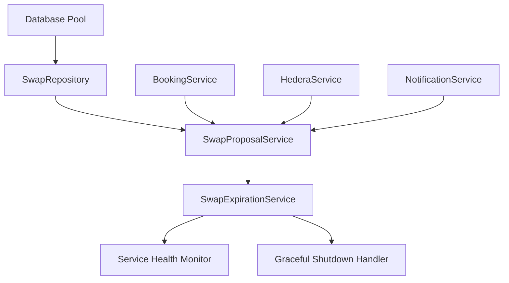

# SwapExpirationService Startup Design

## Overview

This design ensures the SwapExpirationService is properly initialized and started during application startup, and gracefully stopped during shutdown. The service already exists and functions correctly, but is not currently being started in the main application, causing expired swaps to remain in pending state instead of being automatically cancelled.

## Architecture

### Service Integration Points

1. **Initialization Phase**: Add SwapExpirationService to the service initialization sequence in `index.ts`
2. **Startup Phase**: Start the service after all dependencies are ready
3. **Health Monitoring**: Include the service in health checks
4. **Shutdown Phase**: Stop the service during graceful shutdown

### Service Dependencies



## Components and Interfaces

### Service Factory Integration

```typescript
// Add to existing factory.ts
export function createSwapExpirationService(
  swapProposalService: SwapProposalService,
  checkIntervalMinutes?: number
): SwapExpirationService {
  const intervalMinutes = checkIntervalMinutes || 
    parseInt(process.env.SWAP_EXPIRATION_CHECK_INTERVAL_MINUTES || '5');
  
  return new SwapExpirationService(swapProposalService, intervalMinutes);
}
```

### Configuration Interface

```typescript
interface SwapExpirationConfig {
  enabled: boolean;
  checkIntervalMinutes: number;
  startupDelayMs: number;
  shutdownTimeoutMs: number;
}

const getSwapExpirationConfig = (): SwapExpirationConfig => ({
  enabled: process.env.SWAP_EXPIRATION_ENABLED !== 'false',
  checkIntervalMinutes: parseInt(process.env.SWAP_EXPIRATION_CHECK_INTERVAL_MINUTES || '5'),
  startupDelayMs: parseInt(process.env.SWAP_EXPIRATION_STARTUP_DELAY_MS || '10000'),
  shutdownTimeoutMs: parseInt(process.env.SWAP_EXPIRATION_SHUTDOWN_TIMEOUT_MS || '30000')
});
```

### Health Check Integration

```typescript
// Add to existing health checks in index.ts
healthMonitor.registerHealthCheck('swap_expiration', async () => {
  const startTime = Date.now();
  try {
    const status = swapExpirationService.getStatus();
    return {
      status: status.isRunning ? 'healthy' : 'unhealthy',
      responseTime: Date.now() - startTime,
      lastCheck: new Date().toISOString(),
      details: {
        isRunning: status.isRunning,
        checkIntervalMs: status.checkIntervalMs,
        nextCheckIn: status.nextCheckIn
      }
    };
  } catch (error) {
    return {
      status: 'unhealthy',
      responseTime: Date.now() - startTime,
      lastCheck: new Date().toISOString(),
      error: error.message
    };
  }
});
```

## Data Models

### Service Status Tracking

```typescript
interface SwapExpirationServiceStatus {
  isRunning: boolean;
  startedAt?: Date;
  lastCheckAt?: Date;
  totalChecksPerformed: number;
  totalSwapsProcessed: number;
  lastError?: {
    message: string;
    timestamp: Date;
  };
}
```

### Startup Integration Points

```typescript
interface ServiceStartupPhase {
  name: string;
  dependencies: string[];
  startupFunction: () => Promise<void>;
  shutdownFunction: () => Promise<void>;
  healthCheckName?: string;
  required: boolean;
}
```

## Error Handling

### Startup Error Scenarios

1. **Dependency Missing**: SwapProposalService not initialized
2. **Configuration Invalid**: Invalid interval configuration
3. **Service Already Running**: Attempting to start when already running
4. **Resource Constraints**: Insufficient system resources

### Error Recovery Strategies

```typescript
class SwapExpirationServiceManager {
  private service?: SwapExpirationService;
  private config: SwapExpirationConfig;
  private retryCount = 0;
  private maxRetries = 3;

  async startWithRetry(): Promise<void> {
    while (this.retryCount < this.maxRetries) {
      try {
        await this.startService();
        return;
      } catch (error) {
        this.retryCount++;
        logger.warn(`SwapExpirationService start attempt ${this.retryCount} failed`, {
          error: error.message,
          retryCount: this.retryCount,
          maxRetries: this.maxRetries
        });
        
        if (this.retryCount < this.maxRetries) {
          await this.delay(5000 * this.retryCount); // Exponential backoff
        }
      }
    }
    
    throw new Error(`Failed to start SwapExpirationService after ${this.maxRetries} attempts`);
  }

  private async startService(): Promise<void> {
    if (!this.config.enabled) {
      logger.info('SwapExpirationService disabled by configuration');
      return;
    }

    this.service = createSwapExpirationService(
      swapProposalService,
      this.config.checkIntervalMinutes
    );

    // Add startup delay to ensure all dependencies are ready
    await this.delay(this.config.startupDelayMs);
    
    this.service.start();
    logger.info('SwapExpirationService started successfully', {
      checkIntervalMinutes: this.config.checkIntervalMinutes
    });
  }

  async stopService(): Promise<void> {
    if (!this.service) {
      return;
    }

    return new Promise((resolve, reject) => {
      const timeout = setTimeout(() => {
        reject(new Error('SwapExpirationService shutdown timeout'));
      }, this.config.shutdownTimeoutMs);

      try {
        this.service!.stop();
        clearTimeout(timeout);
        logger.info('SwapExpirationService stopped successfully');
        resolve();
      } catch (error) {
        clearTimeout(timeout);
        reject(error);
      }
    });
  }

  private delay(ms: number): Promise<void> {
    return new Promise(resolve => setTimeout(resolve, ms));
  }
}
```

## Testing Strategy

### Unit Tests

1. **Service Manager Tests**
   - Startup with valid configuration
   - Startup with invalid configuration
   - Retry logic on startup failure
   - Graceful shutdown handling

2. **Integration Tests**
   - Service starts during application startup
   - Service stops during application shutdown
   - Health check reports correct status
   - Configuration loading from environment

### Integration Points Testing

```typescript
describe('SwapExpirationService Integration', () => {
  it('should start during application startup', async () => {
    // Test that service starts when app starts
    const app = await createApp();
    
    // Verify service is running
    const healthStatus = await app.healthMonitor.getHealthStatus();
    expect(healthStatus.checks.swap_expiration.status).toBe('healthy');
  });

  it('should stop during graceful shutdown', async () => {
    // Test that service stops when app shuts down
    const app = await createApp();
    
    // Trigger shutdown
    await app.gracefulShutdown('SIGTERM');
    
    // Verify service is stopped
    // This would be verified through logs or service status
  });
});
```

## Implementation Considerations

### Startup Sequence

1. **Phase 1**: Initialize all repositories and basic services
2. **Phase 2**: Initialize SwapProposalService (dependency)
3. **Phase 3**: Initialize SwapExpirationService
4. **Phase 4**: Start SwapExpirationService with delay
5. **Phase 5**: Register health checks

### Configuration Management

```typescript
// Environment variables for configuration
const DEFAULT_CONFIG = {
  SWAP_EXPIRATION_ENABLED: 'true',
  SWAP_EXPIRATION_CHECK_INTERVAL_MINUTES: '5',
  SWAP_EXPIRATION_STARTUP_DELAY_MS: '10000',
  SWAP_EXPIRATION_SHUTDOWN_TIMEOUT_MS: '30000'
};
```

### Monitoring and Observability

1. **Startup Metrics**: Track service startup time and success rate
2. **Runtime Metrics**: Monitor check frequency and processed swaps
3. **Error Metrics**: Track startup failures and runtime errors
4. **Health Metrics**: Include in overall application health

### Performance Considerations

1. **Startup Delay**: Allow time for dependencies to stabilize
2. **Resource Usage**: Monitor memory and CPU usage of background service
3. **Database Load**: Ensure expiration checks don't impact performance
4. **Graceful Degradation**: Continue operation if service fails to start

## Security Considerations

1. **Configuration Validation**: Validate all configuration parameters
2. **Resource Limits**: Prevent excessive resource consumption
3. **Error Information**: Avoid exposing sensitive information in logs
4. **Service Isolation**: Ensure service failures don't affect other components

## Deployment Considerations

### Environment-Specific Configuration

```typescript
// Development
SWAP_EXPIRATION_CHECK_INTERVAL_MINUTES=1  // More frequent for testing

// Production
SWAP_EXPIRATION_CHECK_INTERVAL_MINUTES=5  // Standard interval
SWAP_EXPIRATION_STARTUP_DELAY_MS=30000    // Longer delay for stability
```

### Rollback Strategy

1. **Feature Flag**: Allow disabling via environment variable
2. **Graceful Degradation**: System continues without automatic expiration
3. **Manual Cleanup**: Provide admin tools for manual expiration processing
4. **Monitoring Alerts**: Alert when service is not running

### Health Check Integration

The service will be included in the existing health check system:

```typescript
// Health check endpoint will include:
{
  "status": "healthy",
  "checks": {
    "swap_expiration": {
      "status": "healthy",
      "details": {
        "isRunning": true,
        "checkIntervalMs": 300000,
        "lastCheckAt": "2024-01-01T12:00:00Z"
      }
    }
  }
}
```