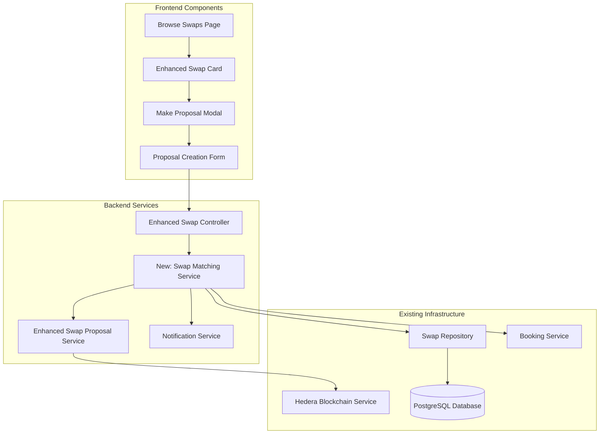

# Design Document

## Overview

The Swap Matching Proposals feature enables users to propose their own swaps as matches when browsing other users' swap listings. This design builds upon the existing React/TypeScript frontend and Node.js/Express backend architecture, integrating with the current swap system and extending the existing SwapController and SwapProposalService.

The feature introduces a streamlined proposal creation workflow that allows users to:
1. **Browse Available Swaps**: View swaps created by other users on the browse page
2. **Propose Matches**: Select one of their own available swaps to propose as a match
3. **Track Proposals**: Monitor the status of their proposals and receive notifications

## Architecture

### System Architecture Integration



### Integration with Existing Services

The design leverages and extends existing services:
- **SwapController**: Enhanced with new endpoints for proposal creation from browse page
- **SwapProposalService**: Extended to support browse-initiated proposals
- **SwapRepository**: Enhanced with methods for finding eligible user swaps
- **NotificationService**: Used for proposal notifications
- **HederaService**: Records proposal transactions on blockchain

## Components and Interfaces

### Frontend Components

#### 1. Enhanced Swap Card Component
```typescript
interface EnhancedSwapCardProps {
  swap: Swap | EnhancedSwap;
  mode: 'browse' | 'own' | 'manage';
  currentUserId: string;
  onMakeProposal?: (swapId: string) => void;
  onViewDetails?: (swapId: string) => void;
}

interface SwapCardActions {
  canMakeProposal: boolean;
  canViewDetails: boolean;
  hasEligibleSwaps: boolean;
  proposalButtonText: string;
}
```

#### 2. Make Proposal Modal Component
```typescript
interface MakeProposalModalProps {
  isOpen: boolean;
  targetSwap: Swap | EnhancedSwap;
  userEligibleSwaps: EligibleSwap[];
  onClose: () => void;
  onSubmit: (proposalData: CreateProposalFromBrowseRequest) => void;
  loading?: boolean;
}

interface EligibleSwap {
  id: string;
  sourceBookingId: string;
  title: string;
  description: string;
  bookingDetails: {
    location: string;
    dateRange: DateRange;
    accommodationType: string;
    guests: number;
    estimatedValue: number;
  };
  status: SwapStatus;
  createdAt: Date;
  isCompatible: boolean;
  compatibilityScore?: number;
}
```

#### 3. Proposal Creation Form Component
```typescript
interface ProposalCreationFormProps {
  targetSwap: Swap | EnhancedSwap;
  eligibleSwaps: EligibleSwap[];
  onSubmit: (data: ProposalFormData) => void;
  onCancel: () => void;
  loading?: boolean;
}

interface ProposalFormData {
  selectedSwapId: string;
  message?: string;
  conditions: string[];
  agreedToTerms: boolean;
}

interface ProposalPreview {
  targetSwap: SwapSummary;
  proposedSwap: SwapSummary;
  compatibility: CompatibilityAnalysis;
  estimatedTimeline: ProposalTimeline;
}
```

### Backend Services

#### 1. Enhanced Swap Controller
```typescript
interface SwapController {
  // Existing methods...
  
  // New methods for browse-initiated proposals
  createProposalFromBrowse(req: Request, res: Response): Promise<void>;
  getUserEligibleSwaps(req: Request, res: Response): Promise<void>;
  getSwapCompatibility(req: Request, res: Response): Promise<void>;
}
```

#### 2. Swap Matching Service
```typescript
interface SwapMatchingService {
  // Core matching functionality
  getUserEligibleSwaps(userId: string, targetSwapId: string): Promise<EligibleSwap[]>;
  createProposalFromBrowse(request: CreateProposalFromBrowseRequest): Promise<ProposalResult>;
  
  // Compatibility analysis
  analyzeSwapCompatibility(sourceSwapId: string, targetSwapId: string): Promise<CompatibilityAnalysis>;
  calculateCompatibilityScore(sourceSwap: Swap, targetSwap: Swap): Promise<number>;
  
  // Validation
  validateProposalEligibility(userId: string, sourceSwapId: string, targetSwapId: string): Promise<ValidationResult>;
  checkForExistingProposals(sourceSwapId: string, targetSwapId: string): Promise<boolean>;
}
```

#### 3. Enhanced Swap Proposal Service
```typescript
interface EnhancedSwapProposalService {
  // Existing methods...
  
  // New methods for browse-initiated proposals
  createProposalFromBrowse(request: CreateProposalFromBrowseRequest): Promise<SwapProposalResult>;
  findEligibleUserSwaps(userId: string, excludeSwapId?: string): Promise<Swap[]>;
  validateBrowseProposal(request: CreateProposalFromBrowseRequest): Promise<ValidationResult>;
}
```

## Data Models

### Request/Response Types
```typescript
interface CreateProposalFromBrowseRequest {
  targetSwapId: string;
  sourceSwapId: string;
  proposerId: string;
  message?: string;
  conditions: string[];
  agreedToTerms: boolean;
}

interface ProposalResult {
  proposalId: string;
  swap: Swap;
  status: 'created' | 'pending_review';
  blockchainTransaction: {
    transactionId: string;
    consensusTimestamp?: string;
  };
  estimatedResponseTime: string;
  nextSteps: string[];
}

interface ValidationResult {
  isValid: boolean;
  errors: string[];
  warnings: string[];
  eligibilityChecks: {
    userOwnsSourceSwap: boolean;
    sourceSwapAvailable: boolean;
    targetSwapAvailable: boolean;
    noExistingProposal: boolean;
    swapsAreCompatible: boolean;
  };
}
```

### Compatibility Analysis
```typescript
interface CompatibilityAnalysis {
  overallScore: number; // 0-100
  factors: {
    locationCompatibility: CompatibilityFactor;
    dateCompatibility: CompatibilityFactor;
    valueCompatibility: CompatibilityFactor;
    accommodationCompatibility: CompatibilityFactor;
    guestCompatibility: CompatibilityFactor;
  };
  recommendations: string[];
  potentialIssues: string[];
}

interface CompatibilityFactor {
  score: number; // 0-100
  weight: number; // Importance weight
  details: string;
  status: 'excellent' | 'good' | 'fair' | 'poor';
}
```

### Enhanced Database Schema
```typescript
// Extension to existing swap table
interface SwapProposal {
  id: string;
  sourceSwapId: string; // The swap being proposed
  targetSwapId: string; // The swap being proposed to
  proposerId: string;
  targetOwnerId: string;
  status: ProposalStatus;
  message?: string;
  conditions: string[];
  compatibilityScore?: number;
  createdAt: Date;
  respondedAt?: Date;
  expiresAt: Date;
  blockchainTransactionId: string;
}

type ProposalStatus = 'pending' | 'accepted' | 'rejected' | 'expired' | 'withdrawn';
```

## API Endpoints

### New Endpoints
```typescript
// Create proposal from browse page
POST /api/swaps/:targetSwapId/proposals/from-browse
{
  sourceSwapId: string;
  message?: string;
  conditions: string[];
  agreedToTerms: boolean;
}

// Get user's eligible swaps for proposing
GET /api/swaps/user/eligible?targetSwapId=:targetSwapId
Response: {
  eligibleSwaps: EligibleSwap[];
  totalCount: number;
  compatibilityAnalysis: CompatibilityAnalysis[];
}

// Get compatibility analysis between two swaps
GET /api/swaps/:sourceSwapId/compatibility/:targetSwapId
Response: {
  compatibility: CompatibilityAnalysis;
  recommendation: 'highly_recommended' | 'recommended' | 'possible' | 'not_recommended';
}

// Get user's proposal history
GET /api/swaps/user/proposals?status=:status&limit=:limit&offset=:offset
Response: {
  proposals: ProposalSummary[];
  pagination: PaginationInfo;
}
```

### Enhanced Existing Endpoints
```typescript
// Enhanced swap details to include proposal information
GET /api/swaps/:id
Response: {
  swap: Swap;
  proposalCount: number;
  userCanPropose: boolean;
  userEligibleSwapsCount: number;
}
```

## Business Logic

### Eligibility Determination
```typescript
class SwapEligibilityService {
  async determineEligibility(userId: string, targetSwapId: string): Promise<EligibleSwap[]> {
    // 1. Get all user's active swaps
    const userSwaps = await this.swapRepository.findActiveByUserId(userId);
    
    // 2. Filter out ineligible swaps
    const eligibleSwaps = userSwaps.filter(swap => {
      return this.isSwapEligible(swap, targetSwapId);
    });
    
    // 3. Calculate compatibility scores
    const swapsWithCompatibility = await Promise.all(
      eligibleSwaps.map(async (swap) => {
        const compatibility = await this.analyzeCompatibility(swap.id, targetSwapId);
        return {
          ...swap,
          compatibilityScore: compatibility.overallScore,
          isCompatible: compatibility.overallScore >= 60, // Threshold for compatibility
        };
      })
    );
    
    // 4. Sort by compatibility score
    return swapsWithCompatibility.sort((a, b) => b.compatibilityScore - a.compatibilityScore);
  }

  private isSwapEligible(swap: Swap, targetSwapId: string): boolean {
    return (
      swap.id !== targetSwapId && // Not the same swap
      swap.status === 'active' && // Swap is active
      !this.hasExistingProposal(swap.id, targetSwapId) && // No existing proposal
      this.isBookingAvailable(swap.sourceBookingId) // Booking is available
    );
  }
}
```

### Compatibility Analysis Algorithm
```typescript
class CompatibilityAnalysisService {
  async analyzeCompatibility(sourceSwapId: string, targetSwapId: string): Promise<CompatibilityAnalysis> {
    const sourceSwap = await this.getSwapWithBookingDetails(sourceSwapId);
    const targetSwap = await this.getSwapWithBookingDetails(targetSwapId);
    
    const factors = {
      locationCompatibility: this.analyzeLocationCompatibility(sourceSwap, targetSwap),
      dateCompatibility: this.analyzeDateCompatibility(sourceSwap, targetSwap),
      valueCompatibility: this.analyzeValueCompatibility(sourceSwap, targetSwap),
      accommodationCompatibility: this.analyzeAccommodationCompatibility(sourceSwap, targetSwap),
      guestCompatibility: this.analyzeGuestCompatibility(sourceSwap, targetSwap),
    };
    
    const overallScore = this.calculateOverallScore(factors);
    
    return {
      overallScore,
      factors,
      recommendations: this.generateRecommendations(factors),
      potentialIssues: this.identifyPotentialIssues(factors),
    };
  }

  private calculateOverallScore(factors: Record<string, CompatibilityFactor>): number {
    const weightedSum = Object.values(factors).reduce((sum, factor) => {
      return sum + (factor.score * factor.weight);
    }, 0);
    
    const totalWeight = Object.values(factors).reduce((sum, factor) => sum + factor.weight, 0);
    
    return Math.round(weightedSum / totalWeight);
  }
}
```

### Proposal Creation Workflow
```typescript
class ProposalCreationWorkflow {
  async createProposalFromBrowse(request: CreateProposalFromBrowseRequest): Promise<ProposalResult> {
    // 1. Validate request
    const validation = await this.validateRequest(request);
    if (!validation.isValid) {
      throw new ValidationError(validation.errors);
    }
    
    // 2. Lock both swaps temporarily
    await this.lockSwaps([request.sourceSwapId, request.targetSwapId]);
    
    try {
      // 3. Create traditional swap proposal
      const swapProposalRequest: CreateSwapProposalRequest = {
        sourceBookingId: await this.getBookingIdFromSwap(request.sourceSwapId),
        targetBookingId: await this.getBookingIdFromSwap(request.targetSwapId),
        proposerId: request.proposerId,
        terms: {
          additionalPayment: 0,
          conditions: request.conditions,
          expiresAt: new Date(Date.now() + 7 * 24 * 60 * 60 * 1000), // 7 days
        },
      };
      
      // 4. Create the swap proposal
      const result = await this.swapProposalService.createSwapProposal(swapProposalRequest);
      
      // 5. Record additional metadata for browse-initiated proposals
      await this.recordBrowseProposalMetadata({
        proposalId: result.swap.id,
        sourceSwapId: request.sourceSwapId,
        targetSwapId: request.targetSwapId,
        message: request.message,
        compatibilityScore: await this.getCompatibilityScore(request.sourceSwapId, request.targetSwapId),
      });
      
      // 6. Send enhanced notifications
      await this.sendBrowseProposalNotifications(result.swap, request);
      
      return {
        proposalId: result.swap.id,
        swap: result.swap,
        status: 'pending_review',
        blockchainTransaction: result.blockchainTransaction,
        estimatedResponseTime: '2-3 business days',
        nextSteps: [
          'The swap owner will review your proposal',
          'You will receive a notification when they respond',
          'Check your proposals page for status updates',
        ],
      };
    } finally {
      // 7. Unlock swaps
      await this.unlockSwaps([request.sourceSwapId, request.targetSwapId]);
    }
  }
}
```

## Error Handling

### Validation Errors
```typescript
interface ProposalValidationError extends Error {
  code: 'INVALID_SOURCE_SWAP' | 'INVALID_TARGET_SWAP' | 'EXISTING_PROPOSAL' | 'SWAP_NOT_AVAILABLE' | 'USER_NOT_AUTHORIZED';
  details: {
    sourceSwapId?: string;
    targetSwapId?: string;
    userId?: string;
    reason: string;
  };
}

class ProposalErrorHandler {
  handleValidationError(error: ProposalValidationError): ErrorResponse {
    switch (error.code) {
      case 'EXISTING_PROPOSAL':
        return {
          message: 'You have already made a proposal for this swap',
          suggestion: 'Check your proposals page to view the status of your existing proposal',
          allowedActions: ['view_existing_proposal', 'browse_other_swaps'],
        };
      case 'SWAP_NOT_AVAILABLE':
        return {
          message: 'One or both swaps are no longer available',
          suggestion: 'Please refresh the page and try again with available swaps',
          allowedActions: ['refresh_page', 'browse_other_swaps'],
        };
      case 'USER_NOT_AUTHORIZED':
        return {
          message: 'You are not authorized to make this proposal',
          suggestion: 'Please ensure you own the swap you are trying to propose',
          allowedActions: ['login', 'view_own_swaps'],
        };
      default:
        return this.handleGenericError(error);
    }
  }
}
```

## Testing Strategy

### Unit Testing
```typescript
describe('SwapMatchingService', () => {
  describe('getUserEligibleSwaps', () => {
    it('should return only eligible swaps for the user', async () => {
      const userId = 'user-123';
      const targetSwapId = 'swap-456';
      
      const eligibleSwaps = await swapMatchingService.getUserEligibleSwaps(userId, targetSwapId);
      
      expect(eligibleSwaps).toHaveLength(2);
      expect(eligibleSwaps.every(swap => swap.id !== targetSwapId)).toBe(true);
      expect(eligibleSwaps.every(swap => swap.status === 'active')).toBe(true);
    });

    it('should exclude swaps with existing proposals', async () => {
      const userId = 'user-123';
      const targetSwapId = 'swap-456';
      
      // Create existing proposal
      await createExistingProposal('swap-789', targetSwapId);
      
      const eligibleSwaps = await swapMatchingService.getUserEligibleSwaps(userId, targetSwapId);
      
      expect(eligibleSwaps.find(swap => swap.id === 'swap-789')).toBeUndefined();
    });
  });

  describe('analyzeSwapCompatibility', () => {
    it('should calculate compatibility score correctly', async () => {
      const sourceSwapId = 'swap-123';
      const targetSwapId = 'swap-456';
      
      const compatibility = await swapMatchingService.analyzeSwapCompatibility(sourceSwapId, targetSwapId);
      
      expect(compatibility.overallScore).toBeGreaterThanOrEqual(0);
      expect(compatibility.overallScore).toBeLessThanOrEqual(100);
      expect(compatibility.factors).toHaveProperty('locationCompatibility');
      expect(compatibility.factors).toHaveProperty('dateCompatibility');
    });
  });
});

describe('ProposalCreationWorkflow', () => {
  it('should create proposal successfully with valid data', async () => {
    const request: CreateProposalFromBrowseRequest = {
      targetSwapId: 'swap-456',
      sourceSwapId: 'swap-123',
      proposerId: 'user-789',
      message: 'Interested in swapping!',
      conditions: [],
      agreedToTerms: true,
    };
    
    const result = await proposalWorkflow.createProposalFromBrowse(request);
    
    expect(result.proposalId).toBeDefined();
    expect(result.status).toBe('pending_review');
    expect(result.blockchainTransaction.transactionId).toBeDefined();
  });

  it('should reject proposal with invalid source swap', async () => {
    const request: CreateProposalFromBrowseRequest = {
      targetSwapId: 'swap-456',
      sourceSwapId: 'invalid-swap',
      proposerId: 'user-789',
      message: 'Test',
      conditions: [],
      agreedToTerms: true,
    };
    
    await expect(proposalWorkflow.createProposalFromBrowse(request))
      .rejects.toThrow('INVALID_SOURCE_SWAP');
  });
});
```

### Integration Testing
```typescript
describe('Swap Proposal Integration', () => {
  it('should complete full proposal workflow from browse page', async () => {
    // 1. User browses swaps
    const swaps = await request(app)
      .get('/api/swaps/browse')
      .set('Authorization', `Bearer ${userToken}`)
      .expect(200);

    const targetSwap = swaps.body.data.swaps[0];

    // 2. User gets eligible swaps
    const eligibleSwaps = await request(app)
      .get(`/api/swaps/user/eligible?targetSwapId=${targetSwap.id}`)
      .set('Authorization', `Bearer ${userToken}`)
      .expect(200);

    expect(eligibleSwaps.body.data.eligibleSwaps).toHaveLength(1);

    // 3. User creates proposal
    const proposalData = {
      sourceSwapId: eligibleSwaps.body.data.eligibleSwaps[0].id,
      message: 'Great match!',
      conditions: [],
      agreedToTerms: true,
    };

    const proposal = await request(app)
      .post(`/api/swaps/${targetSwap.id}/proposals/from-browse`)
      .set('Authorization', `Bearer ${userToken}`)
      .send(proposalData)
      .expect(201);

    expect(proposal.body.data.proposalId).toBeDefined();
    expect(proposal.body.data.status).toBe('pending_review');
  });
});
```

### End-to-End Testing
```typescript
describe('Browse and Propose E2E', () => {
  it('should allow user to browse swaps and make proposal', async () => {
    // Navigate to browse page
    await page.goto('/swaps/browse');
    
    // Find a swap to propose to
    await page.waitForSelector('[data-testid="swap-card"]');
    const swapCards = await page.$$('[data-testid="swap-card"]');
    expect(swapCards.length).toBeGreaterThan(0);
    
    // Click "Make Proposal" button
    await page.click('[data-testid="make-proposal-btn"]');
    
    // Wait for modal to open
    await page.waitForSelector('[data-testid="make-proposal-modal"]');
    
    // Select a swap to propose
    await page.click('[data-testid="eligible-swap-option"]:first-child');
    
    // Add optional message
    await page.fill('[data-testid="proposal-message"]', 'This looks like a great match!');
    
    // Submit proposal
    await page.click('[data-testid="submit-proposal-btn"]');
    
    // Wait for success confirmation
    await page.waitForSelector('[data-testid="proposal-success"]');
    
    // Verify user is redirected back to browse page
    expect(page.url()).toContain('/swaps/browse');
    
    // Verify success message is displayed
    const successMessage = await page.textContent('[data-testid="success-message"]');
    expect(successMessage).toContain('Proposal submitted successfully');
  });
});
```

## Security Considerations

### Authorization and Access Control
```typescript
interface ProposalSecurityMeasures {
  // User Authorization
  validateUserOwnsSourceSwap(userId: string, swapId: string): Promise<boolean>;
  validateUserCanAccessTargetSwap(userId: string, swapId: string): Promise<boolean>;
  
  // Rate Limiting
  checkProposalRateLimit(userId: string): Promise<boolean>;
  enforceMaxProposalsPerDay(userId: string): Promise<void>;
  
  // Data Validation
  sanitizeProposalMessage(message: string): string;
  validateProposalConditions(conditions: string[]): boolean;
  
  // Fraud Prevention
  detectSuspiciousProposalActivity(userId: string): Promise<SecurityAlert[]>;
  validateProposalLegitimacy(request: CreateProposalFromBrowseRequest): Promise<boolean>;
}
```

### Data Protection
```typescript
interface DataProtectionMeasures {
  // PII Protection
  maskSensitiveSwapData(swap: Swap, requestingUserId: string): Swap;
  anonymizeProposalData(proposal: SwapProposal): AnonymizedProposal;
  
  // Audit Trail
  logProposalActivity(activity: ProposalActivity): Promise<void>;
  recordSecurityEvent(event: SecurityEvent): Promise<void>;
  
  // Data Integrity
  validateProposalDataIntegrity(proposal: SwapProposal): Promise<boolean>;
  checksumProposalData(data: any): string;
}
```

## Performance Optimization

### Caching Strategy
```typescript
interface ProposalCachingStrategy {
  // Eligible Swaps Caching
  cacheUserEligibleSwaps(userId: string, targetSwapId: string, swaps: EligibleSwap[]): Promise<void>;
  getCachedEligibleSwaps(userId: string, targetSwapId: string): Promise<EligibleSwap[] | null>;
  
  // Compatibility Analysis Caching
  cacheCompatibilityAnalysis(sourceSwapId: string, targetSwapId: string, analysis: CompatibilityAnalysis): Promise<void>;
  getCachedCompatibilityAnalysis(sourceSwapId: string, targetSwapId: string): Promise<CompatibilityAnalysis | null>;
  
  // Cache Invalidation
  invalidateUserSwapCache(userId: string): Promise<void>;
  invalidateSwapCompatibilityCache(swapId: string): Promise<void>;
}
```

### Database Optimization
```typescript
interface DatabaseOptimizations {
  // Indexing Strategy
  createProposalIndices(): Promise<void>;
  createCompatibilityIndices(): Promise<void>;
  
  // Query Optimization
  optimizeEligibleSwapsQuery(): Promise<void>;
  batchCompatibilityAnalysis(swapPairs: SwapPair[]): Promise<CompatibilityAnalysis[]>;
  
  // Connection Pooling
  optimizeConnectionPool(): void;
  implementReadReplicas(): Promise<void>;
}
```

## Accessibility

### Accessibility Features
```typescript
interface AccessibilityEnhancements {
  // Screen Reader Support
  provideSwapCardAccessibilityLabels(): void;
  announceProposalFormChanges(): void;
  describeCompatibilityScores(): void;
  
  // Keyboard Navigation
  implementKeyboardShortcuts(): void;
  ensureFocusManagement(): void;
  provideFocusIndicators(): void;
  
  // Visual Accessibility
  implementHighContrastMode(): void;
  provideAlternativeTextForImages(): void;
  ensureColorBlindFriendlyDesign(): void;
  
  // Cognitive Accessibility
  simplifyProposalWorkflow(): void;
  provideProgressIndicators(): void;
  offerHelpAndGuidance(): void;
}
```

The design ensures WCAG 2.1 AA compliance with:
- Proper ARIA labels for all interactive elements
- Keyboard navigation for the entire proposal workflow
- High contrast mode support for all visual elements
- Screen reader announcements for proposal status changes
- Clear focus indicators for form elements and buttons
- Alternative text for compatibility visualizations