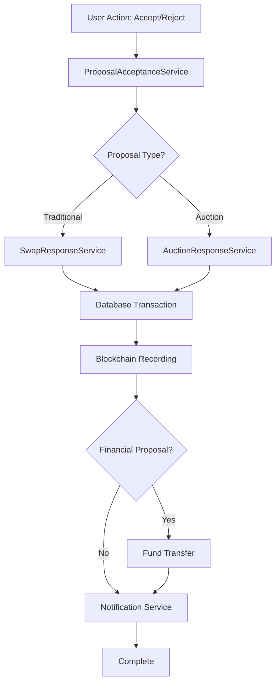

# Design Document

## Overview

This design implements the Accept/Reject functionality for swap proposals, building on the existing SwapResponseService architecture. The system will handle both traditional swap proposals and enhanced auction-based proposals, with integrated database and blockchain recording, plus automatic fund transfers for financial proposals.

## Architecture

### High-Level Flow



### Service Layer Architecture

The design extends the existing service architecture:

- **ProposalAcceptanceService**: New orchestration service
- **SwapResponseService**: Enhanced existing service
- **PaymentProcessingService**: Existing service for fund transfers
- **HederaService**: Existing service for blockchain recording
- **NotificationService**: Existing service for user notifications

## Components and Interfaces

### 1. ProposalAcceptanceService

New service that orchestrates the acceptance/rejection workflow:

```typescript
export interface ProposalAcceptanceRequest {
  proposalId: string;
  userId: string;
  action: 'accept' | 'reject';
  rejectionReason?: string;
}

export interface ProposalAcceptanceResult {
  proposal: SwapProposal;
  swap?: Swap;
  paymentTransaction?: PaymentTransaction;
  blockchainTransaction: {
    transactionId: string;
    consensusTimestamp?: string;
  };
}

export class ProposalAcceptanceService {
  async acceptProposal(request: ProposalAcceptanceRequest): Promise<ProposalAcceptanceResult>
  async rejectProposal(request: ProposalAcceptanceRequest): Promise<ProposalAcceptanceResult>
  private async processFinancialTransfer(proposal: SwapProposal): Promise<PaymentTransaction>
  private async recordBlockchainTransaction(action: string, proposal: SwapProposal): Promise<TransactionResult>
}
```

### 2. Enhanced SwapResponseService

Extend existing service with new methods:

```typescript
export interface EnhancedSwapResponseRequest extends SwapResponseRequest {
  proposalId?: string; // For auction proposals
  autoProcessPayment?: boolean;
}

// Add to existing SwapResponseService class:
async processProposalAcceptance(request: EnhancedSwapResponseRequest): Promise<SwapResponseResult>
async processProposalRejection(request: EnhancedSwapResponseRequest): Promise<SwapResponseResult>
private async handleFinancialProposal(proposal: SwapProposal): Promise<PaymentTransaction>
```

### 3. Database Transaction Manager

New component for ensuring atomicity:

```typescript
export class ProposalTransactionManager {
  async executeAcceptanceTransaction(
    proposalId: string,
    userId: string,
    paymentData?: PaymentTransactionData
  ): Promise<{
    proposal: SwapProposal;
    swap?: Swap;
    payment?: PaymentTransaction;
  }>
  
  async executeRejectionTransaction(
    proposalId: string,
    userId: string,
    reason?: string
  ): Promise<{
    proposal: SwapProposal;
  }>
}
```

## Data Models

### Enhanced SwapProposal Model

Extend existing model to support acceptance/rejection:

```typescript
export interface SwapProposal {
  id: string;
  sourceSwapId: string;
  targetSwapId?: string; // For booking proposals
  proposerId: string;
  targetUserId: string;
  proposalType: 'booking' | 'cash';
  status: 'pending' | 'accepted' | 'rejected' | 'expired';
  
  // Financial proposal fields
  cashOffer?: {
    amount: number;
    currency: string;
    escrowAccountId?: string;
    paymentMethodId: string;
  };
  
  // Acceptance/Rejection tracking
  respondedAt?: Date;
  respondedBy?: string;
  rejectionReason?: string;
  
  // Blockchain tracking
  blockchain: {
    proposalTransactionId?: string;
    responseTransactionId?: string;
  };
  
  createdAt: Date;
  updatedAt: Date;
}
```

### ProposalResponse Model

New model for tracking responses:

```typescript
export interface ProposalResponse {
  id: string;
  proposalId: string;
  responderId: string;
  action: 'accept' | 'reject';
  reason?: string;
  
  // Associated transactions
  swapId?: string;
  paymentTransactionId?: string;
  blockchainTransactionId: string;
  
  createdAt: Date;
}
```

## Error Handling

### Error Types

```typescript
export enum ProposalAcceptanceErrorCodes {
  PROPOSAL_NOT_FOUND = 'PROPOSAL_NOT_FOUND',
  UNAUTHORIZED_USER = 'UNAUTHORIZED_USER',
  INVALID_PROPOSAL_STATUS = 'INVALID_PROPOSAL_STATUS',
  PAYMENT_PROCESSING_FAILED = 'PAYMENT_PROCESSING_FAILED',
  BLOCKCHAIN_RECORDING_FAILED = 'BLOCKCHAIN_RECORDING_FAILED',
  DATABASE_TRANSACTION_FAILED = 'DATABASE_TRANSACTION_FAILED',
  ESCROW_TRANSFER_FAILED = 'ESCROW_TRANSFER_FAILED'
}

export class ProposalAcceptanceError extends Error {
  constructor(
    public code: ProposalAcceptanceErrorCodes,
    public message: string,
    public details?: Record<string, any>
  ) {
    super(message);
    this.name = 'ProposalAcceptanceError';
  }
}
```

### Rollback Strategy

```typescript
export class ProposalRollbackManager {
  async rollbackAcceptance(
    proposalId: string,
    rollbackData: {
      proposalStatus?: string;
      swapId?: string;
      paymentTransactionId?: string;
    }
  ): Promise<void>
  
  async rollbackRejection(proposalId: string): Promise<void>
}
```

## Testing Strategy

### Unit Tests

1. **ProposalAcceptanceService Tests**
   - Test acceptance workflow for booking proposals
   - Test acceptance workflow for financial proposals
   - Test rejection workflow
   - Test error handling and rollback scenarios

2. **Database Transaction Tests**
   - Test atomic operations
   - Test rollback on failure
   - Test concurrent access handling

3. **Payment Integration Tests**
   - Test escrow fund transfers
   - Test payment failure handling
   - Test refund scenarios

### Integration Tests

1. **End-to-End Acceptance Flow**
   - Create proposal → Accept → Verify database + blockchain + payment
   - Test with both booking and cash proposals

2. **End-to-End Rejection Flow**
   - Create proposal → Reject → Verify database + blockchain + notifications

3. **Error Recovery Tests**
   - Test partial failure scenarios
   - Test system recovery after failures

### Performance Tests

1. **Concurrent Proposal Processing**
   - Test multiple users accepting/rejecting simultaneously
   - Test database locking and transaction isolation

2. **Payment Processing Load**
   - Test high-volume financial proposal processing
   - Test escrow system under load

## API Endpoints

### REST API Design

```typescript
// Accept a proposal
POST /api/proposals/{proposalId}/accept
{
  "userId": "string",
  "autoProcessPayment": boolean
}

// Reject a proposal
POST /api/proposals/{proposalId}/reject
{
  "userId": "string",
  "reason": "string?"
}

// Get proposal status
GET /api/proposals/{proposalId}/status

// Get user's proposal responses
GET /api/users/{userId}/proposal-responses
```

### WebSocket Events

```typescript
// Real-time proposal updates
interface ProposalStatusUpdate {
  proposalId: string;
  status: 'accepted' | 'rejected';
  respondedBy: string;
  respondedAt: Date;
  paymentStatus?: 'processing' | 'completed' | 'failed';
}
```

## Security Considerations

### Authorization

- Verify user owns the target swap/booking
- Validate proposal is in acceptable state
- Ensure user has permission to process payments

### Payment Security

- Use existing PaymentSecurityService
- Validate escrow account ownership
- Implement fraud detection for large transfers
- Secure payment method validation

### Blockchain Security

- Use existing HederaService security patterns
- Validate transaction signatures
- Implement replay attack protection

## Deployment Considerations

### Database Migrations

1. Add new columns to existing `swap_proposals` table
2. Create new `proposal_responses` table
3. Add indexes for performance optimization

### Configuration

```typescript
export interface ProposalAcceptanceConfig {
  maxConcurrentProcessing: number;
  paymentTimeoutMs: number;
  blockchainRetryAttempts: number;
  rollbackTimeoutMs: number;
}
```

### Monitoring

- Track proposal acceptance/rejection rates
- Monitor payment processing success rates
- Alert on blockchain recording failures
- Track rollback frequency

## Integration Points

### Existing Services

1. **SwapResponseService**: Extend for enhanced proposal handling
2. **PaymentProcessingService**: Use for fund transfers
3. **HederaService**: Use for blockchain recording
4. **NotificationService**: Use for user notifications
5. **AuctionManagementService**: Integration for auction proposals

### External Dependencies

1. **Payment Gateway**: For processing financial transfers
2. **Hedera Network**: For blockchain transaction recording
3. **Database**: PostgreSQL for data persistence
4. **Message Queue**: For async notification processing

## Performance Optimization

### Caching Strategy

- Cache proposal validation results
- Cache user authorization data
- Cache payment method validation

### Async Processing

- Process notifications asynchronously
- Queue blockchain transactions for batch processing
- Implement background payment reconciliation

### Database Optimization

- Use connection pooling for high concurrency
- Implement read replicas for status queries
- Optimize indexes for proposal lookup patterns