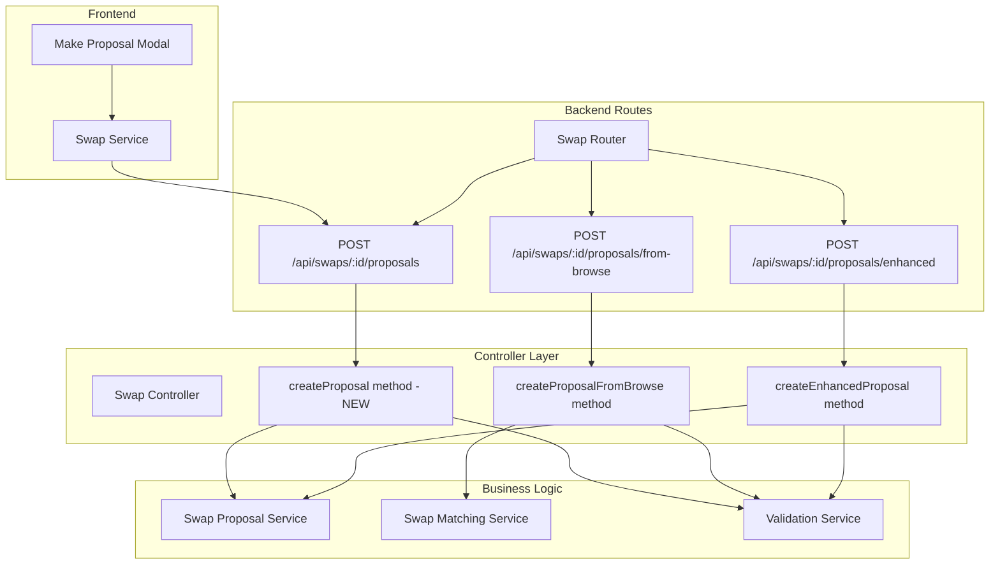

# Design Document

## Overview

This design addresses the critical routing mismatch between the frontend and backend for swap proposal creation. The frontend expects `POST /api/swaps/{swapId}/proposals` but the backend only implements `POST /api/swaps/{targetSwapId}/proposals/from-browse`. The solution involves adding the missing endpoint while reusing existing business logic and maintaining full compatibility with current functionality.

## Architecture

### Current State Analysis

The system currently has these proposal-related endpoints:
- `POST /api/swaps/{id}/proposals/enhanced` - For enhanced proposals (implemented)
- `POST /api/swaps/{targetSwapId}/proposals/from-browse` - For browse-initiated proposals (implemented but not registered)
- `POST /api/swaps/{swapId}/proposals` - Expected by frontend (missing)

### Proposed Solution Architecture



## Components and Interfaces

### New Controller Method

The new `createProposal` method will be added to the SwapController:

```typescript
interface SwapController {
  // Existing methods...
  createProposalFromBrowse: (req: Request, res: Response) => Promise<void>;
  createEnhancedProposal: (req: Request, res: Response) => Promise<void>;
  
  // New method
  createProposal: (req: Request, res: Response) => Promise<void>;
}
```

### Request/Response Interfaces

The new endpoint will use the existing interfaces that the frontend already expects:

```typescript
// Request interface (already defined in frontend)
interface CreateProposalRequest {
  sourceSwapId: string;
  message?: string;
  conditions: string[];
  agreedToTerms: boolean;
}

// Response interface (consistent with existing endpoints)
interface ProposalResponse {
  proposalId: string;
  status: 'pending' | 'submitted';
  swap: SwapProposal;
  blockchainTransaction?: {
    transactionId: string;
    consensusTimestamp?: string;
  };
  estimatedResponseTime?: string;
}
```

### Route Registration

The new route will be added to the swaps router:

```typescript
// In apps/backend/src/routes/swaps.ts
router.post('/:id/proposals', swapController.createProposal);
```

## Data Models

### Route Parameter Mapping

The endpoint will map the route parameter to the expected format:

```typescript
// Route: POST /api/swaps/:id/proposals
// Maps to: targetSwapId = req.params.id
// Request body contains: sourceSwapId, message, conditions, agreedToTerms
```

### Business Logic Integration

The new endpoint will integrate with existing services:

```typescript
interface ProposalCreationFlow {
  // 1. Extract and validate parameters
  targetSwapId: string; // from route params
  sourceSwapId: string; // from request body
  proposerId: string;   // from authenticated user
  
  // 2. Delegate to existing business logic
  // Option A: Use SwapMatchingService.createProposalFromBrowse
  // Option B: Use SwapProposalService.createSwapProposal
  // Option C: Create unified proposal creation method
}
```

## Implementation Strategy

### Option 1: Delegate to Existing Browse Method

```typescript
createProposal = async (req: Request, res: Response): Promise<void> => {
  try {
    const { id: targetSwapId } = req.params;
    const { sourceSwapId, message, conditions, agreedToTerms } = req.body;
    const userId = req.user?.id;

    // Transform request to match browse proposal format
    const browseRequest: CreateProposalFromBrowseRequest = {
      targetSwapId,
      sourceSwapId,
      proposerId: userId,
      message,
      conditions,
      agreedToTerms,
    };

    // Delegate to existing browse proposal logic
    const result = await this.swapMatchingService.createProposalFromBrowse(browseRequest);
    
    // Transform response to match expected format
    res.status(201).json({
      data: {
        proposalId: result.proposalId,
        status: result.status,
        swap: result.swap,
        blockchainTransaction: result.blockchainTransaction,
      },
    });
  } catch (error) {
    this.handleProposalError(error, res);
  }
};
```

### Option 2: Create Unified Proposal Method

```typescript
createProposal = async (req: Request, res: Response): Promise<void> => {
  try {
    const { id: targetSwapId } = req.params;
    const { sourceSwapId, message, conditions, agreedToTerms } = req.body;
    const userId = req.user?.id;

    // Validate request
    await this.validateProposalRequest(targetSwapId, sourceSwapId, userId);

    // Create proposal using core service
    const proposal = await this.swapProposalService.createSwapProposal({
      sourceBookingId: await this.getBookingIdFromSwap(sourceSwapId),
      targetBookingId: await this.getBookingIdFromSwap(targetSwapId),
      proposerId: userId,
      terms: {
        additionalPayment: 0,
        conditions,
        expiresAt: new Date(Date.now() + 7 * 24 * 60 * 60 * 1000),
      },
    });

    res.status(201).json({
      data: {
        proposalId: proposal.swap.id,
        status: 'pending',
        swap: proposal.swap,
        blockchainTransaction: proposal.blockchainTransaction,
      },
    });
  } catch (error) {
    this.handleProposalError(error, res);
  }
};
```

### Recommended Approach: Option 1 (Delegate to Browse Method)

Option 1 is recommended because:
1. **Reuses existing logic**: The browse proposal method already handles all the complexity
2. **Maintains consistency**: Same validation, error handling, and business rules
3. **Reduces duplication**: No need to duplicate complex proposal creation logic
4. **Faster implementation**: Minimal code changes required
5. **Lower risk**: Leverages already tested and working functionality

## Error Handling

### Error Response Format

The new endpoint will use the same error format as existing endpoints:

```typescript
interface ApiErrorResponse {
  error: {
    code: string;
    message: string;
    category: string;
    details?: Record<string, string[]>;
  };
  timestamp: string;
  requestId: string;
}
```

### Error Scenarios and Responses

```typescript
class ProposalErrorHandler {
  handleProposalError(error: any, res: Response): void {
    if (error.code === 'INVALID_SOURCE_SWAP') {
      res.status(400).json({
        error: {
          code: 'INVALID_SOURCE_SWAP',
          message: 'The source swap is not valid for proposing',
          category: 'validation',
        },
      });
    } else if (error.code === 'SWAP_NOT_FOUND') {
      res.status(404).json({
        error: {
          code: 'SWAP_NOT_FOUND',
          message: 'The target swap was not found',
          category: 'resource',
        },
      });
    } else if (error.code === 'UNAUTHORIZED') {
      res.status(401).json({
        error: {
          code: 'UNAUTHORIZED',
          message: 'Authentication required',
          category: 'authentication',
        },
      });
    } else {
      // Generic server error
      res.status(500).json({
        error: {
          code: 'INTERNAL_ERROR',
          message: 'An unexpected error occurred',
          category: 'server',
        },
      });
    }
  }
}
```

## Route Registration Strategy

### Route Order Considerations

The new route must be registered in the correct order to avoid conflicts:

```typescript
// In apps/backend/src/routes/swaps.ts
export function createSwapRoutes(
  swapController: SwapController,
  authMiddleware: AuthMiddleware
): Router {
  const router = Router();

  // Public routes first
  router.get('/browse', authMiddleware.optionalAuth(), swapController.browseAvailableSwaps);

  // Authentication required for all other routes
  router.use(authMiddleware.requireAuth());

  // User eligible swaps
  router.get('/user/eligible', swapController.getUserEligibleSwaps);

  // Specific proposal endpoints (more specific routes first)
  router.post('/:id/proposals/enhanced', swapController.createEnhancedProposal);
  router.post('/:id/proposals/from-browse', swapController.createProposalFromBrowse); // Add missing registration
  router.post('/:id/proposals', swapController.createProposal); // New endpoint

  // Other swap endpoints
  router.post('/enhanced', swapController.createEnhancedSwap);
  router.post('/listings', swapController.createSwapListing);
  router.post('/', swapController.createSwapProposal);
  
  // ... rest of routes
}
```

### Middleware Integration

The new endpoint will use the same middleware stack:

```typescript
interface MiddlewareStack {
  authentication: AuthMiddleware.requireAuth();
  errorHandling: ErrorHandlerMiddleware;
  requestLogging: RequestLoggingMiddleware;
  rateLimiting: RateLimitingMiddleware;
  validation: RequestValidationMiddleware;
}
```

## Validation Strategy

### Request Validation

```typescript
interface ProposalRequestValidation {
  // Route parameters
  targetSwapId: {
    required: true;
    type: 'uuid';
    validation: 'exists_in_database';
  };
  
  // Request body
  sourceSwapId: {
    required: true;
    type: 'uuid';
    validation: 'user_owns_swap';
  };
  
  message: {
    required: false;
    type: 'string';
    maxLength: 500;
    validation: 'sanitize_html';
  };
  
  conditions: {
    required: true;
    type: 'array';
    items: 'string';
    maxItems: 10;
  };
  
  agreedToTerms: {
    required: true;
    type: 'boolean';
    validation: 'must_be_true';
  };
}
```

### Business Logic Validation

```typescript
interface BusinessValidation {
  // Swap eligibility
  validateSwapEligibility(sourceSwapId: string, targetSwapId: string): Promise<boolean>;
  
  // User permissions
  validateUserCanPropose(userId: string, sourceSwapId: string): Promise<boolean>;
  
  // Duplicate prevention
  validateNoDuplicateProposal(sourceSwapId: string, targetSwapId: string): Promise<boolean>;
  
  // Swap availability
  validateSwapsAvailable(sourceSwapId: string, targetSwapId: string): Promise<boolean>;
}
```

## Testing Strategy

### Unit Tests

```typescript
describe('SwapController.createProposal', () => {
  it('should create proposal successfully with valid data', async () => {
    const req = mockRequest({
      params: { id: 'target-swap-id' },
      body: {
        sourceSwapId: 'source-swap-id',
        message: 'Test proposal',
        conditions: [],
        agreedToTerms: true,
      },
      user: { id: 'user-id' },
    });

    await swapController.createProposal(req, res);

    expect(res.status).toHaveBeenCalledWith(201);
    expect(res.json).toHaveBeenCalledWith({
      data: expect.objectContaining({
        proposalId: expect.any(String),
        status: 'pending',
      }),
    });
  });

  it('should return 400 for invalid source swap', async () => {
    const req = mockRequest({
      params: { id: 'target-swap-id' },
      body: {
        sourceSwapId: 'invalid-swap-id',
        conditions: [],
        agreedToTerms: true,
      },
      user: { id: 'user-id' },
    });

    await swapController.createProposal(req, res);

    expect(res.status).toHaveBeenCalledWith(400);
    expect(res.json).toHaveBeenCalledWith({
      error: expect.objectContaining({
        code: 'INVALID_SOURCE_SWAP',
      }),
    });
  });
});
```

### Integration Tests

```typescript
describe('POST /api/swaps/:id/proposals', () => {
  it('should create proposal through API endpoint', async () => {
    const targetSwap = await createTestSwap();
    const sourceSwap = await createTestSwap();
    const authToken = await getAuthToken();

    const response = await request(app)
      .post(`/api/swaps/${targetSwap.id}/proposals`)
      .set('Authorization', `Bearer ${authToken}`)
      .send({
        sourceSwapId: sourceSwap.id,
        message: 'Integration test proposal',
        conditions: [],
        agreedToTerms: true,
      })
      .expect(201);

    expect(response.body.data).toHaveProperty('proposalId');
    expect(response.body.data.status).toBe('pending');
  });
});
```

## Security Considerations

### Authentication and Authorization

```typescript
interface SecurityMeasures {
  // User authentication
  requireValidAuthToken(): void;
  
  // Ownership validation
  validateUserOwnsSourceSwap(userId: string, swapId: string): Promise<boolean>;
  
  // Rate limiting
  limitProposalCreationRate(userId: string): Promise<boolean>;
  
  // Input sanitization
  sanitizeProposalMessage(message: string): string;
  
  // Audit logging
  logProposalCreation(userId: string, targetSwapId: string, sourceSwapId: string): void;
}
```

### Data Protection

```typescript
interface DataProtection {
  // PII handling
  maskSensitiveData(proposal: any): any;
  
  // SQL injection prevention
  useParameterizedQueries(): void;
  
  // XSS prevention
  sanitizeUserInput(input: string): string;
  
  // CSRF protection
  validateCSRFToken(token: string): boolean;
}
```

## Performance Considerations

### Caching Strategy

```typescript
interface CachingStrategy {
  // Cache user's eligible swaps temporarily
  cacheEligibleSwaps(userId: string, swaps: any[]): Promise<void>;
  
  // Cache swap details to reduce database queries
  cacheSwapDetails(swapId: string, details: any): Promise<void>;
  
  // Invalidate cache when swaps are updated
  invalidateSwapCache(swapId: string): Promise<void>;
}
```

### Database Optimization

```typescript
interface DatabaseOptimization {
  // Use existing database connections
  reuseConnectionPool(): void;
  
  // Optimize queries with proper indexing
  ensureProperIndexing(): void;
  
  // Batch operations where possible
  batchValidationQueries(): Promise<void>;
}
```

## Deployment Strategy

### Rollout Plan

1. **Phase 1**: Add the missing route registration for `/proposals/from-browse`
2. **Phase 2**: Implement the new `createProposal` method
3. **Phase 3**: Register the new route in the router
4. **Phase 4**: Deploy and test the new endpoint
5. **Phase 5**: Monitor for any issues and optimize if needed

### Backward Compatibility

The implementation ensures:
- All existing endpoints continue to work
- No breaking changes to existing functionality
- Frontend code works without modifications
- Existing tests continue to pass

### Monitoring and Alerting

```typescript
interface MonitoringStrategy {
  // Track endpoint usage
  trackProposalCreationMetrics(): void;
  
  // Monitor error rates
  alertOnHighErrorRates(): void;
  
  // Track response times
  monitorPerformanceMetrics(): void;
  
  // Log business events
  logProposalBusinessEvents(): void;
}
```

This design provides a comprehensive solution to fix the routing mismatch while maintaining system integrity and ensuring a smooth user experience.