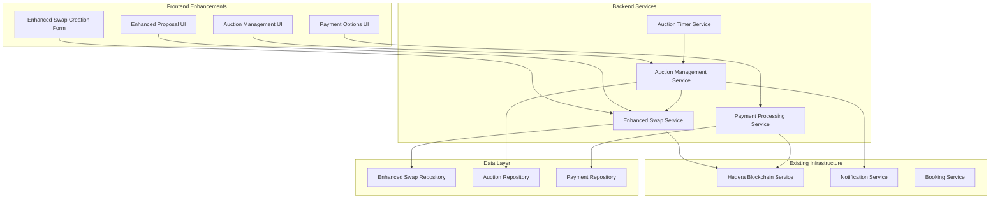

# Design Document

## Overview

The Swap Proposal Enhancements feature extends the existing booking swap system to support flexible payment options and auction mechanisms. This design builds upon the current React/TypeScript frontend and Node.js/Express backend architecture, integrating with the existing Hedera blockchain infrastructure for secure transaction processing.

The enhancement introduces two key capabilities:
1. **Payment Type Flexibility**: Users can specify whether they accept only booking exchanges or also cash payments
2. **Auction Mechanism**: Users can choose between immediate acceptance of first matching proposal or running an auction to collect multiple proposals

## Architecture

### Enhanced System Architecture



### Integration with Existing Services

The design leverages existing services and extends them:
- **SwapProposalService**: Enhanced to support payment types and auction modes
- **SwapResponseService**: Extended to handle auction proposal management
- **HederaService**: Used for blockchain recording of auction events and payment transactions
- **NotificationService**: Enhanced to support auction-specific notifications

## Components and Interfaces

### Enhanced Frontend Components

#### 1. Enhanced Swap Creation Form
```typescript
interface EnhancedSwapCreationFormProps {
  booking: Booking;
  onSubmit: (swapData: EnhancedCreateSwapRequest) => void;
  onCancel: () => void;
}

interface EnhancedCreateSwapRequest {
  sourceBookingId: string;
  title: string;
  description: string;
  paymentTypes: PaymentTypePreference;
  acceptanceStrategy: AcceptanceStrategy;
  auctionSettings?: AuctionSettings;
  swapPreferences: SwapPreferences;
  expirationDate: Date;
}

interface PaymentTypePreference {
  bookingExchange: boolean;
  cashPayment: boolean;
  minimumCashAmount?: number;
  preferredCashAmount?: number;
}

interface AcceptanceStrategy {
  type: 'first_match' | 'auction';
  auctionEndDate?: Date;
  autoSelectHighest?: boolean;
}

interface AuctionSettings {
  endDate: Date;
  allowBookingProposals: boolean;
  allowCashProposals: boolean;
  minimumCashOffer?: number;
  autoSelectAfterHours?: number; // Auto-select if owner doesn't respond
}
```

#### 2. Auction Management Dashboard
```typescript
interface AuctionDashboardProps {
  auction: SwapAuction;
  proposals: AuctionProposal[];
  onSelectWinner: (proposalId: string) => void;
  onExtendAuction?: (newEndDate: Date) => void;
  onCancelAuction: () => void;
}

interface AuctionProposal {
  id: string;
  proposerId: string;
  proposalType: 'booking' | 'cash';
  bookingDetails?: BookingDetails;
  cashOffer?: CashOfferDetails;
  submittedAt: Date;
  message?: string;
}

interface CashOfferDetails {
  amount: number;
  currency: string;
  paymentMethod: string;
  escrowRequired: boolean;
}
```

#### 3. Enhanced Proposal Creation Form
```typescript
interface EnhancedProposalFormProps {
  swap: EnhancedSwap;
  userBookings: Booking[];
  onSubmit: (proposal: CreateProposalRequest) => void;
  onCancel: () => void;
}

interface CreateProposalRequest {
  swapId: string;
  proposalType: 'booking' | 'cash';
  bookingId?: string; // For booking proposals
  cashOffer?: CashOfferRequest; // For cash proposals
  message?: string;
  conditions: string[];
}

interface CashOfferRequest {
  amount: number;
  currency: string;
  paymentMethodId: string;
  escrowAgreement: boolean;
}
```

### Enhanced Backend Services

#### 1. Enhanced Swap Service
```typescript
interface EnhancedSwapService {
  // Enhanced swap creation
  createEnhancedSwap(request: EnhancedCreateSwapRequest): Promise<EnhancedSwapResult>;
  
  // Auction management
  createAuction(swapId: string, settings: AuctionSettings): Promise<SwapAuction>;
  endAuction(auctionId: string): Promise<AuctionResult>;
  selectAuctionWinner(auctionId: string, proposalId: string, userId: string): Promise<SwapAuction>;
  
  // Enhanced proposal handling
  createEnhancedProposal(request: CreateEnhancedProposalRequest): Promise<ProposalResult>;
  getAuctionProposals(auctionId: string): Promise<AuctionProposal[]>;
  
  // Payment integration
  validateCashProposal(proposal: CashProposalRequest): Promise<ValidationResult>;
  initiateCashTransaction(proposalId: string): Promise<PaymentTransaction>;
}
```

#### 2. Auction Management Service
```typescript
interface AuctionManagementService {
  // Auction lifecycle
  createAuction(swapId: string, settings: AuctionSettings): Promise<SwapAuction>;
  getActiveAuctions(): Promise<SwapAuction[]>;
  endAuction(auctionId: string): Promise<AuctionResult>;
  
  // Proposal management
  addProposalToAuction(auctionId: string, proposal: AuctionProposal): Promise<void>;
  getAuctionProposals(auctionId: string): Promise<AuctionProposal[]>;
  selectWinningProposal(auctionId: string, proposalId: string): Promise<AuctionResult>;
  
  // Timer management
  scheduleAuctionEnd(auctionId: string, endDate: Date): Promise<void>;
  handleAuctionTimeout(auctionId: string): Promise<void>;
  
  // Validation
  validateAuctionTiming(eventDate: Date, auctionEndDate: Date): Promise<boolean>;
  checkLastMinuteRestrictions(eventDate: Date): Promise<boolean>;
}
```

#### 3. Payment Processing Service
```typescript
interface PaymentProcessingService {
  // Payment validation
  validatePaymentMethod(userId: string, paymentMethodId: string): Promise<PaymentMethod>;
  validateCashOffer(offer: CashOfferRequest): Promise<ValidationResult>;
  
  // Escrow management
  createEscrow(amount: number, currency: string, payerId: string): Promise<EscrowAccount>;
  releaseEscrow(escrowId: string, recipientId: string): Promise<PaymentTransaction>;
  refundEscrow(escrowId: string, reason: string): Promise<PaymentTransaction>;
  
  // Transaction processing
  processPayment(request: PaymentRequest): Promise<PaymentTransaction>;
  getTransactionStatus(transactionId: string): Promise<PaymentStatus>;
  generateReceipt(transactionId: string): Promise<PaymentReceipt>;
}
```

## Data Models

### Enhanced Swap Model
```typescript
interface EnhancedSwap extends Swap {
  paymentTypes: PaymentTypePreference;
  acceptanceStrategy: AcceptanceStrategy;
  auctionId?: string;
  cashDetails?: CashSwapConfiguration;
}

interface CashSwapConfiguration {
  enabled: boolean;
  minimumAmount: number;
  preferredAmount?: number;
  currency: string;
  escrowRequired: boolean;
  platformFeePercentage: number;
}

interface SwapAuction {
  id: string;
  swapId: string;
  ownerId: string;
  status: 'active' | 'ended' | 'cancelled';
  settings: AuctionSettings;
  proposals: AuctionProposal[];
  winningProposalId?: string;
  createdAt: Date;
  endedAt?: Date;
  blockchain: {
    creationTransactionId: string;
    endTransactionId?: string;
  };
}

interface AuctionProposal {
  id: string;
  auctionId: string;
  proposerId: string;
  proposalType: 'booking' | 'cash';
  bookingId?: string;
  cashOffer?: CashOffer;
  message?: string;
  conditions: string[];
  status: 'pending' | 'selected' | 'rejected';
  submittedAt: Date;
  blockchain: {
    transactionId: string;
  };
}

interface CashOffer {
  amount: number;
  currency: string;
  paymentMethodId: string;
  escrowAccountId?: string;
  escrowRequired: boolean;
}
```

### Payment Models
```typescript
interface PaymentMethod {
  id: string;
  userId: string;
  type: 'credit_card' | 'bank_transfer' | 'digital_wallet';
  displayName: string;
  isVerified: boolean;
  metadata: Record<string, any>;
  createdAt: Date;
}

interface PaymentTransaction {
  id: string;
  swapId: string;
  proposalId: string;
  payerId: string;
  recipientId: string;
  amount: number;
  currency: string;
  status: 'pending' | 'processing' | 'completed' | 'failed' | 'refunded';
  escrowId?: string;
  gatewayTransactionId: string;
  platformFee: number;
  netAmount: number;
  createdAt: Date;
  completedAt?: Date;
  blockchain: {
    transactionId: string;
  };
}

interface EscrowAccount {
  id: string;
  transactionId: string;
  amount: number;
  currency: string;
  status: 'created' | 'funded' | 'released' | 'refunded';
  createdAt: Date;
  releasedAt?: Date;
}
```

### Timing and Validation Models
```typescript
interface AuctionTimingValidation {
  eventDate: Date;
  auctionEndDate: Date;
  isValid: boolean;
  minimumEndDate: Date;
  isLastMinute: boolean;
  errors: string[];
}

interface ProposalValidation {
  isValid: boolean;
  errors: string[];
  warnings: string[];
  paymentMethodValid?: boolean;
  escrowRequired?: boolean;
}
```

## Error Handling

### Enhanced Error Types
```typescript
interface AuctionError extends Error {
  code: 'AUCTION_EXPIRED' | 'AUCTION_NOT_FOUND' | 'INVALID_AUCTION_TIMING' | 'LAST_MINUTE_RESTRICTION' | 'AUCTION_ALREADY_ENDED';
  auctionId?: string;
  eventDate?: Date;
}

interface PaymentError extends Error {
  code: 'PAYMENT_METHOD_INVALID' | 'INSUFFICIENT_FUNDS' | 'ESCROW_CREATION_FAILED' | 'PAYMENT_PROCESSING_FAILED' | 'REFUND_FAILED';
  transactionId?: string;
  paymentMethodId?: string;
}

interface TimingError extends Error {
  code: 'AUCTION_TOO_CLOSE_TO_EVENT' | 'EVENT_DATE_PASSED' | 'INVALID_AUCTION_DURATION';
  eventDate?: Date;
  auctionEndDate?: Date;
  minimumRequiredDate?: Date;
}
```

### Error Handling Strategy
```typescript
class EnhancedErrorHandler {
  handleAuctionError(error: AuctionError, context: AuctionContext): ErrorResponse {
    switch (error.code) {
      case 'LAST_MINUTE_RESTRICTION':
        return {
          message: 'Auctions are not allowed for events less than one week away',
          suggestion: 'Use first-match acceptance instead',
          allowedActions: ['switch_to_first_match']
        };
      case 'AUCTION_TOO_CLOSE_TO_EVENT':
        return {
          message: 'Auction must end at least one week before the event',
          suggestion: `Set auction end date before ${error.minimumRequiredDate}`,
          allowedActions: ['adjust_end_date', 'switch_to_first_match']
        };
      default:
        return this.handleGenericError(error);
    }
  }

  handlePaymentError(error: PaymentError, context: PaymentContext): ErrorResponse {
    switch (error.code) {
      case 'PAYMENT_METHOD_INVALID':
        return {
          message: 'Selected payment method is not valid or verified',
          suggestion: 'Please verify your payment method or select a different one',
          allowedActions: ['verify_payment_method', 'select_different_method']
        };
      case 'ESCROW_CREATION_FAILED':
        return {
          message: 'Unable to create escrow account for this transaction',
          suggestion: 'Please try again or contact support',
          allowedActions: ['retry', 'contact_support']
        };
      default:
        return this.handleGenericError(error);
    }
  }
}
```

## Testing Strategy

### Unit Testing Enhancements
```typescript
describe('Enhanced Swap Service', () => {
  describe('Payment Type Validation', () => {
    it('should validate cash payment requirements', async () => {
      const request = createCashSwapRequest({ minimumAmount: 100 });
      const result = await swapService.validateCashSwapRequest(request);
      expect(result.isValid).toBe(true);
    });

    it('should reject cash proposals on booking-only swaps', async () => {
      const swap = createBookingOnlySwap();
      const cashProposal = createCashProposal({ amount: 200 });
      
      await expect(
        swapService.createProposal(swap.id, cashProposal)
      ).rejects.toThrow('Cash proposals not accepted');
    });
  });

  describe('Auction Timing Validation', () => {
    it('should prevent auctions for last-minute bookings', async () => {
      const booking = createBooking({ eventDate: addDays(new Date(), 5) });
      const auctionRequest = createAuctionRequest({ endDate: addDays(new Date(), 3) });
      
      await expect(
        auctionService.createAuction(booking.id, auctionRequest)
      ).rejects.toThrow('LAST_MINUTE_RESTRICTION');
    });

    it('should enforce one-week minimum before event', async () => {
      const eventDate = addDays(new Date(), 10);
      const auctionEndDate = addDays(new Date(), 8); // Only 2 days before event
      
      const validation = await auctionService.validateTiming(eventDate, auctionEndDate);
      expect(validation.isValid).toBe(false);
      expect(validation.errors).toContain('Auction must end at least one week before event');
    });
  });
});

describe('Payment Processing Service', () => {
  describe('Escrow Management', () => {
    it('should create escrow for cash transactions', async () => {
      const cashOffer = createCashOffer({ amount: 500, escrowRequired: true });
      const escrow = await paymentService.createEscrow(cashOffer);
      
      expect(escrow.amount).toBe(500);
      expect(escrow.status).toBe('created');
    });

    it('should release escrow on successful swap completion', async () => {
      const escrow = await createFundedEscrow({ amount: 300 });
      const result = await paymentService.releaseEscrow(escrow.id, 'recipient-123');
      
      expect(result.status).toBe('completed');
      expect(result.netAmount).toBe(285); // After platform fees
    });
  });
});
```

### Integration Testing
```typescript
describe('Auction Integration Tests', () => {
  it('should complete full auction workflow', async () => {
    // Create booking and auction
    const booking = await createTestBooking({ eventDate: addDays(new Date(), 20) });
    const auction = await auctionService.createAuction(booking.id, {
      endDate: addDays(new Date(), 10),
      allowCashProposals: true,
      minimumCashOffer: 100
    });

    // Add multiple proposals
    const bookingProposal = await addBookingProposal(auction.id);
    const cashProposal = await addCashProposal(auction.id, { amount: 150 });

    // End auction and select winner
    await auctionService.endAuction(auction.id);
    const result = await auctionService.selectWinner(auction.id, cashProposal.id);

    expect(result.winningProposalId).toBe(cashProposal.id);
    expect(result.status).toBe('ended');
  });

  it('should handle auction timeout with auto-selection', async () => {
    const auction = await createAuctionWithAutoSelect();
    await addMultipleCashProposals(auction.id);
    
    // Simulate timeout
    await auctionService.handleTimeout(auction.id);
    
    const result = await auctionService.getAuction(auction.id);
    expect(result.winningProposalId).toBeDefined();
    expect(result.status).toBe('ended');
  });
});
```

### End-to-End Testing
```typescript
describe('Enhanced Swap E2E Tests', () => {
  it('should create auction swap and complete with cash payment', async () => {
    // User creates auction swap
    await page.goto('/bookings');
    await page.click('[data-testid="create-swap-btn"]');
    await page.check('[data-testid="allow-cash-payments"]');
    await page.check('[data-testid="auction-mode"]');
    await page.fill('[data-testid="auction-end-date"]', futureDate);
    await page.click('[data-testid="create-swap"]');

    // Another user makes cash offer
    await loginAsUser2();
    await page.goto('/swaps');
    await page.click('[data-testid="make-cash-offer"]');
    await page.fill('[data-testid="cash-amount"]', '200');
    await page.click('[data-testid="submit-offer"]');

    // Original user selects winner
    await loginAsUser1();
    await page.goto('/my-auctions');
    await page.click('[data-testid="select-winner"]');
    
    // Verify payment processing
    await expect(page.locator('[data-testid="payment-processing"]')).toBeVisible();
  });
});
```

## Security Considerations

### Payment Security
```typescript
interface PaymentSecurityMeasures {
  // PCI DSS Compliance
  tokenizePaymentMethods(): Promise<void>;
  encryptSensitiveData(data: PaymentData): Promise<string>;
  
  // Fraud Detection
  validateTransactionLimits(amount: number, userId: string): Promise<boolean>;
  checkSuspiciousActivity(userId: string): Promise<RiskAssessment>;
  
  // Escrow Protection
  createSecureEscrow(amount: number, participants: string[]): Promise<EscrowAccount>;
  validateEscrowRelease(escrowId: string, releaseRequest: ReleaseRequest): Promise<boolean>;
}
```

### Auction Security
```typescript
interface AuctionSecurityMeasures {
  // Bid Manipulation Prevention
  validateProposalTiming(proposalTime: Date, auctionEnd: Date): boolean;
  detectSuspiciousBidding(auctionId: string): Promise<SecurityAlert[]>;
  
  // Access Control
  validateAuctionAccess(userId: string, auctionId: string): Promise<boolean>;
  enforceProposalLimits(userId: string, auctionId: string): Promise<boolean>;
  
  // Data Integrity
  recordAuctionEvents(event: AuctionEvent): Promise<void>;
  validateAuctionState(auctionId: string): Promise<ValidationResult>;
}
```

### Blockchain Security
```typescript
interface BlockchainSecurityEnhancements {
  // Transaction Validation
  validateAuctionTransaction(transaction: AuctionTransaction): Promise<boolean>;
  verifyPaymentTransaction(transaction: PaymentTransaction): Promise<boolean>;
  
  // Immutable Audit Trail
  recordAuctionCreation(auction: SwapAuction): Promise<string>;
  recordProposalSubmission(proposal: AuctionProposal): Promise<string>;
  recordAuctionCompletion(result: AuctionResult): Promise<string>;
  
  // Smart Contract Integration
  deployEscrowContract(terms: EscrowTerms): Promise<string>;
  executeEscrowRelease(contractId: string, conditions: ReleaseConditions): Promise<string>;
}
```

## Performance Optimization

### Auction Performance
```typescript
interface AuctionPerformanceOptimizations {
  // Efficient Proposal Storage
  indexProposalsByAuction(auctionId: string): Promise<void>;
  cacheActiveAuctions(): Promise<void>;
  
  // Real-time Updates
  optimizeWebSocketConnections(): void;
  batchNotificationDelivery(): Promise<void>;
  
  // Database Optimization
  createAuctionIndices(): Promise<void>;
  partitionAuctionData(): Promise<void>;
}
```

### Payment Performance
```typescript
interface PaymentPerformanceOptimizations {
  // Transaction Processing
  batchPaymentValidation(requests: PaymentRequest[]): Promise<ValidationResult[]>;
  optimizeEscrowCreation(): Promise<void>;
  
  // Caching Strategy
  cachePaymentMethods(userId: string): Promise<void>;
  preloadTransactionHistory(): Promise<void>;
}
```

## Accessibility

### Enhanced Accessibility Features
```typescript
interface AccessibilityEnhancements {
  // Auction Interface
  provideAuctionStatusAnnouncements(): void;
  implementTimerAccessibility(): void;
  ensureProposalFormAccessibility(): void;
  
  // Payment Interface
  makePaymentFormsAccessible(): void;
  providePaymentStatusUpdates(): void;
  implementSecurePaymentAccessibility(): void;
  
  // Screen Reader Support
  announceAuctionEvents(): void;
  describePaymentProcesses(): void;
  provideClearErrorMessages(): void;
}
```

The design ensures WCAG 2.1 AA compliance with:
- Proper ARIA labels for auction timers and payment forms
- Keyboard navigation for all auction and payment interactions
- High contrast mode support for financial information
- Screen reader announcements for auction status changes
- Clear focus indicators for payment security elements