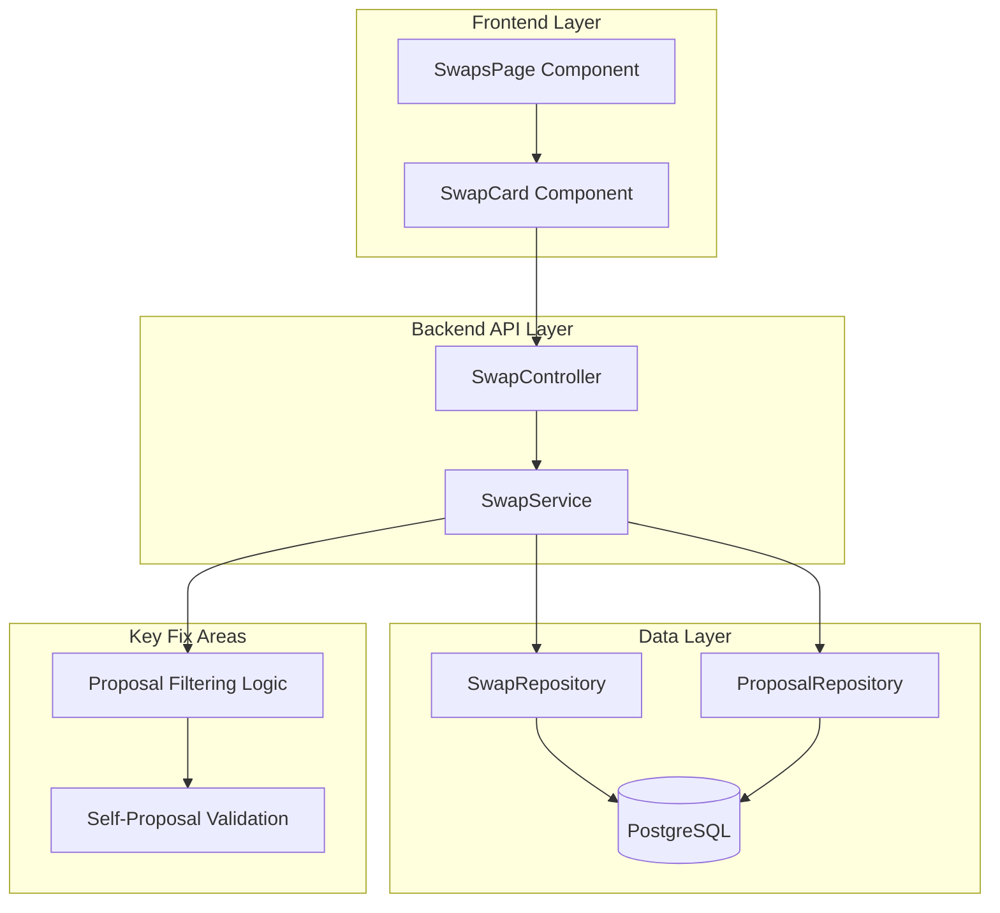

# Design Document

## Overview

This design addresses the logical bug where users see their own swaps appearing as proposals from themselves on swap cards. The solution involves implementing proper filtering at the data retrieval level to ensure that when displaying swap cards, the user's own swap appears on the left side and only genuine proposals from other users appear on the right side. The fix will be implemented in the backend API that serves swap data to the frontend, ensuring that self-proposals are filtered out before reaching the UI.

## Architecture

The fix follows the existing layered architecture with enhancements to the data filtering logic:



## Components and Interfaces

### 1. Enhanced Proposal Filtering Logic

**Repository Level Enhancement:**

The core fix will be implemented in the proposal retrieval logic to exclude self-proposals:

```typescript
// In ProposalRepository or SwapRepository
async getProposalsForUserSwaps(
  userId: string, 
  swapIds: string[]
): Promise<SwapProposal[]> {
  // Key fix: Add WHERE clause to exclude self-proposals
  const query = `
    SELECT p.*, s.owner_id as swap_owner_id
    FROM swap_proposals p
    JOIN swaps s ON p.swap_id = s.id
    WHERE p.swap_id = ANY($1)
    AND p.proposer_id != $2  -- Critical fix: exclude self-proposals
    AND s.owner_id = $2      -- Ensure we only get proposals for user's swaps
    ORDER BY p.created_at DESC
  `;
  
  return this.query(query, [swapIds, userId]);
}
```

### 2. Data Structure Clarification

**SwapCardData Interface:**

```typescript
interface SwapCardData {
  userSwap: {
    id: string;
    bookingDetails: BookingDetails;
    status: SwapStatus;
    createdAt: Date;
  };
  proposalsFromOthers: SwapProposal[]; // Only proposals from other users
  proposalCount: number; // Count of valid proposals from others
}

interface SwapProposal {
  id: string;
  proposerId: string; // Will never equal current user's ID
  proposerName: string;
  targetBookingDetails: BookingDetails;
  status: ProposalStatus;
  createdAt: Date;
}
```

### 3. Service Layer Logic

**SwapService Enhancement:**

```typescript
async getUserSwapsWithProposals(userId: string): Promise<SwapCardData[]> {
  // Get user's swaps
  const userSwaps = await this.swapRepository.findByOwnerId(userId);
  
  // Get proposals for these swaps, excluding self-proposals
  const swapIds = userSwaps.map(swap => swap.id);
  const proposals = await this.proposalRepository.getProposalsForUserSwaps(
    userId, 
    swapIds
  );
  
  // Group proposals by swap ID
  const proposalsBySwapId = this.groupProposalsBySwapId(proposals);
  
  // Build card data structure
  return userSwaps.map(swap => ({
    userSwap: {
      id: swap.id,
      bookingDetails: swap.bookingDetails,
      status: swap.status,
      createdAt: swap.createdAt
    },
    proposalsFromOthers: proposalsBySwapId[swap.id] || [],
    proposalCount: (proposalsBySwapId[swap.id] || []).length
  }));
}

private groupProposalsBySwapId(proposals: SwapProposal[]): Record<string, SwapProposal[]> {
  return proposals.reduce((acc, proposal) => {
    if (!acc[proposal.swapId]) {
      acc[proposal.swapId] = [];
    }
    acc[proposal.swapId].push(proposal);
    return acc;
  }, {} as Record<string, SwapProposal[]>);
}
```

### 4. Database Query Optimization

**Optimized Single Query Approach:**

For better performance, we can use a single query with proper JOINs:

```sql
SELECT 
  s.id as swap_id,
  s.owner_id,
  s.booking_id as user_booking_id,
  s.status as swap_status,
  s.created_at as swap_created_at,
  
  p.id as proposal_id,
  p.proposer_id,
  p.target_booking_id,
  p.status as proposal_status,
  p.created_at as proposal_created_at,
  
  ub.title as user_booking_title,
  ub.city as user_booking_city,
  ub.country as user_booking_country,
  
  pb.title as proposal_booking_title,
  pb.city as proposal_booking_city,
  pb.country as proposal_booking_country,
  
  u.name as proposer_name

FROM swaps s
LEFT JOIN swap_proposals p ON s.id = p.swap_id 
  AND p.proposer_id != s.owner_id  -- Critical filter: exclude self-proposals
LEFT JOIN bookings ub ON s.booking_id = ub.id
LEFT JOIN bookings pb ON p.target_booking_id = pb.id
LEFT JOIN users u ON p.proposer_id = u.id

WHERE s.owner_id = $1
ORDER BY s.created_at DESC, p.created_at DESC
```

### 5. Frontend Integration

**SwapCard Component Enhancement:**

The frontend component should be updated to handle the cleaner data structure:

```typescript
// SwapCard.tsx
interface SwapCardProps {
  swapData: SwapCardData;
}

const SwapCard: React.FC<SwapCardProps> = ({ swapData }) => {
  const { userSwap, proposalsFromOthers, proposalCount } = swapData;
  
  return (
    <div className="swap-card">
      {/* Left side: User's own swap */}
      <div className="user-swap-side">
        <BookingDisplay booking={userSwap.bookingDetails} />
        <SwapStatus status={userSwap.status} />
      </div>
      
      {/* Right side: Proposals from others */}
      <div className="proposals-side">
        {proposalCount === 0 ? (
          <div className="no-proposals">No proposals yet</div>
        ) : (
          <div className="proposals-list">
            {proposalsFromOthers.map(proposal => (
              <ProposalDisplay 
                key={proposal.id} 
                proposal={proposal} 
              />
            ))}
          </div>
        )}
      </div>
    </div>
  );
};
```

## Data Models

### Database Schema Considerations

No schema changes are required, but we need to ensure proper indexing for the filtering queries:

**Recommended Indexes:**
```sql
-- For efficient proposal filtering
CREATE INDEX IF NOT EXISTS idx_swap_proposals_swap_proposer 
ON swap_proposals(swap_id, proposer_id);

-- For efficient swap owner lookup
CREATE INDEX IF NOT EXISTS idx_swaps_owner_id 
ON swaps(owner_id);

-- Composite index for the main filtering query
CREATE INDEX IF NOT EXISTS idx_proposals_swap_not_self 
ON swap_proposals(swap_id, proposer_id) 
WHERE proposer_id IS NOT NULL;
```

### Data Validation Rules

**Self-Proposal Prevention:**
1. Database constraint to prevent self-proposals at insertion time
2. Application-level validation in the proposal creation endpoint
3. Filtering logic in data retrieval to handle any existing invalid data

```sql
-- Optional: Add database constraint to prevent future self-proposals
ALTER TABLE swap_proposals 
ADD CONSTRAINT no_self_proposals 
CHECK (
  proposer_id != (
    SELECT owner_id FROM swaps WHERE swaps.id = swap_proposals.swap_id
  )
);
```

## Error Handling

### Data Inconsistency Handling

**Existing Invalid Data:**
- Filter out any existing self-proposals in queries
- Log warnings when self-proposals are detected for monitoring
- Provide data cleanup scripts if needed

**Runtime Validation:**
```typescript
// Service layer validation
private validateProposalData(proposals: SwapProposal[], userId: string): SwapProposal[] {
  const validProposals = proposals.filter(proposal => {
    if (proposal.proposerId === userId) {
      console.warn(`Self-proposal detected and filtered: ${proposal.id}`);
      return false;
    }
    return true;
  });
  
  return validProposals;
}
```

### API Error Handling

**Controller Level:**
```typescript
async getUserSwapsWithProposals(req: Request, res: Response) {
  try {
    const userId = req.user.id;
    const swapData = await this.swapService.getUserSwapsWithProposals(userId);
    
    // Additional validation layer
    const validatedData = this.validateSwapCardData(swapData, userId);
    
    res.json({
      success: true,
      data: validatedData,
      metadata: {
        totalSwaps: validatedData.length,
        totalProposals: validatedData.reduce((sum, card) => sum + card.proposalCount, 0)
      }
    });
  } catch (error) {
    console.error('Error fetching user swaps with proposals:', error);
    res.status(500).json({
      success: false,
      error: 'Failed to fetch swap data'
    });
  }
}
```

## Testing Strategy

### Unit Tests

**Repository Level:**
- Test proposal filtering excludes self-proposals
- Test with multiple proposals per swap
- Test with no proposals scenario
- Test with mixed valid/invalid proposal data

**Service Level:**
- Test data grouping and structuring
- Test validation logic
- Test error handling scenarios

### Integration Tests

**API Endpoint Testing:**
- Test complete flow from database to API response
- Test with real data scenarios including edge cases
- Verify self-proposals are never returned
- Test performance with large datasets

### Data Migration Testing

**Existing Data Validation:**
- Identify any existing self-proposals in the database
- Test cleanup scripts if needed
- Verify filtering works with existing invalid data

### End-to-End Tests

**Frontend Integration:**
- Verify swap cards display correctly with filtered data
- Test multiple proposals display properly
- Test empty proposals state
- Verify no self-proposals appear in UI under any circumstances