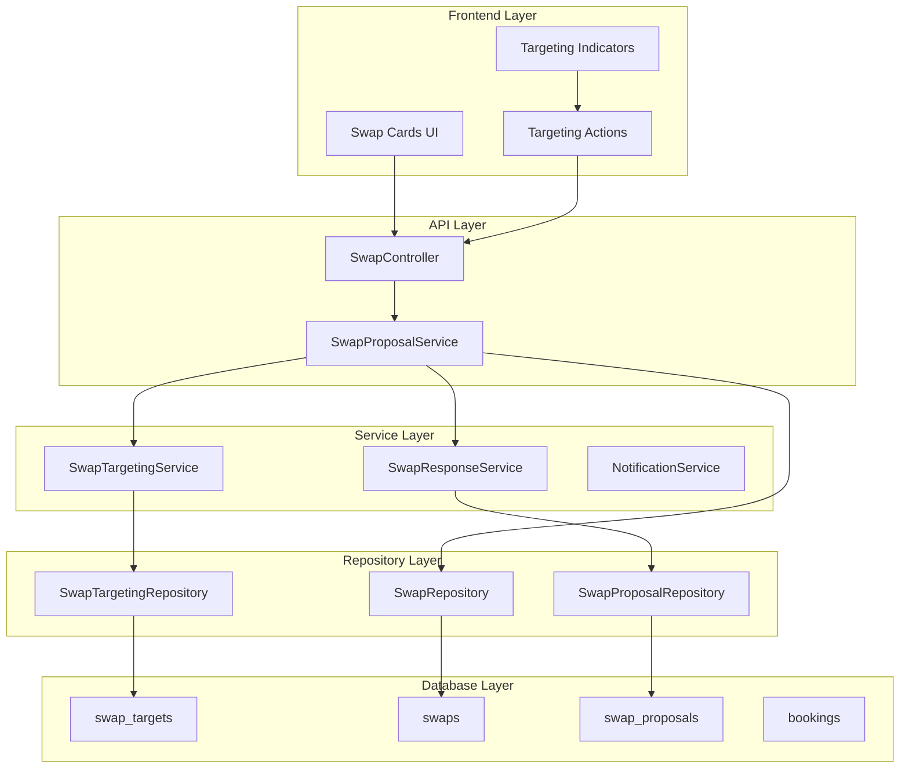
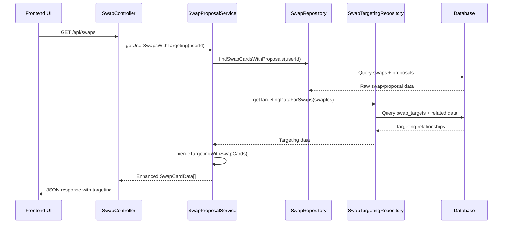

# Design Document

## Overview

This design addresses the gap between the existing comprehensive swap targeting infrastructure and the user-facing `/swaps` endpoint. While the system has a robust SwapTargetingService and swap_targets table, the current SwapCardData structure and getUserSwapsWithProposals method don't leverage this targeting data to provide users with complete visibility into their swap targeting relationships.

The solution enhances the existing SwapCardData structure to include targeting information and modifies the data retrieval methods to populate this information from the swap_targets table. This approach maintains backward compatibility while providing rich targeting context to users.

## Architecture

### High-Level Architecture



### Data Flow Architecture



## Components and Interfaces

### Enhanced Data Types

#### Enhanced SwapCardData

```typescript
export interface EnhancedSwapCardData extends SwapCardData {
  // Existing properties remain unchanged for backward compatibility
  userSwap: {
    id: string;
    bookingDetails: BookingDetails;
    status: SwapStatus;
    createdAt: Date;
    expiresAt?: Date;
  };
  proposalsFromOthers: SwapProposal[];
  proposalCount: number;
  
  // New targeting information
  targeting: {
    // Swaps targeting this user's swap (incoming)
    incomingTargets: IncomingTargetInfo[];
    incomingTargetCount: number;
    
    // This user's swap targeting another swap (outgoing)
    outgoingTarget?: OutgoingTargetInfo;
    
    // Targeting capabilities and restrictions
    canReceiveTargets: boolean;
    canTarget: boolean;
    targetingRestrictions?: TargetingRestriction[];
  };
}

export interface IncomingTargetInfo {
  targetId: string;
  sourceSwapId: string;
  sourceSwap: {
    id: string;
    bookingDetails: BookingDetails;
    ownerId: string;
    ownerName: string;
    ownerAvatar?: string;
  };
  proposalId: string;
  status: SwapTargetStatus;
  createdAt: Date;
  updatedAt: Date;
  
  // Auction context if applicable
  auctionInfo?: {
    isAuction: boolean;
    endDate?: Date;
    currentProposalCount: number;
  };
}

export interface OutgoingTargetInfo {
  targetId: string;
  targetSwapId: string;
  targetSwap: {
    id: string;
    bookingDetails: BookingDetails;
    ownerId: string;
    ownerName: string;
    ownerAvatar?: string;
  };
  proposalId: string;
  status: SwapTargetStatus;
  createdAt: Date;
  updatedAt: Date;
  
  // Target swap context
  targetSwapInfo: {
    acceptanceStrategy: AcceptanceStrategy;
    auctionInfo?: {
      isAuction: boolean;
      endDate?: Date;
      currentProposalCount: number;
    };
  };
}

export interface TargetingRestriction {
  type: 'auction_ended' | 'proposal_pending' | 'own_swap' | 'already_targeted' | 'swap_unavailable';
  message: string;
  severity: 'error' | 'warning' | 'info';
}
```

### Enhanced Repository Methods

#### SwapRepository Extensions

```typescript
export interface SwapRepositoryTargetingExtensions {
  /**
   * Find swap cards with proposals and targeting data
   */
  findSwapCardsWithTargetingData(
    userId: string, 
    limit: number, 
    offset: number
  ): Promise<SwapCardWithTargetingRow[]>;
  
  /**
   * Get targeting summary for multiple swaps
   */
  getTargetingSummaryForSwaps(swapIds: string[]): Promise<TargetingSummaryData[]>;
  
  /**
   * Get detailed targeting information for a specific swap
   */
  getDetailedTargetingInfo(swapId: string): Promise<DetailedTargetingInfo>;
}

export interface SwapCardWithTargetingRow {
  // Existing swap card fields
  swap_id: string;
  source_booking_id: string;
  swap_status: SwapStatus;
  swap_created_at: Date;
  swap_expires_at?: Date;
  
  // Booking details
  booking_title: string;
  booking_location: string;
  booking_check_in: Date;
  booking_check_out: Date;
  booking_price: number;
  
  // Proposal information (existing)
  proposal_id?: string;
  proposal_status?: SwapStatus;
  proposer_id?: string;
  proposer_name?: string;
  
  // Targeting information (new)
  incoming_target_id?: string;
  incoming_source_swap_id?: string;
  incoming_source_booking_title?: string;
  incoming_source_booking_location?: string;
  incoming_target_status?: SwapTargetStatus;
  incoming_target_created_at?: Date;
  incoming_proposer_id?: string;
  incoming_proposer_name?: string;
  
  outgoing_target_id?: string;
  outgoing_target_swap_id?: string;
  outgoing_target_booking_title?: string;
  outgoing_target_booking_location?: string;
  outgoing_target_status?: SwapTargetStatus;
  outgoing_target_created_at?: Date;
  outgoing_target_owner_id?: string;
  outgoing_target_owner_name?: string;
}
```

#### SwapTargetingRepository Extensions

```typescript
export interface SwapTargetingRepositoryExtensions {
  /**
   * Get all targeting relationships for user's swaps
   */
  getTargetingDataForUserSwaps(userId: string): Promise<UserTargetingData>;
  
  /**
   * Get incoming targets for specific swaps
   */
  getIncomingTargetsForSwaps(swapIds: string[]): Promise<IncomingTargetData[]>;
  
  /**
   * Get outgoing targets for specific swaps
   */
  getOutgoingTargetsForSwaps(swapIds: string[]): Promise<OutgoingTargetData[]>;
  
  /**
   * Get targeting restrictions for swaps
   */
  getTargetingRestrictionsForSwaps(
    swapIds: string[], 
    userId: string
  ): Promise<SwapTargetingRestrictions[]>;
}

export interface UserTargetingData {
  incomingTargets: IncomingTargetData[];
  outgoingTargets: OutgoingTargetData[];
  targetingCapabilities: TargetingCapabilities[];
}

export interface IncomingTargetData {
  targetId: string;
  targetSwapId: string; // User's swap being targeted
  sourceSwapId: string; // Other user's swap doing the targeting
  sourceSwapDetails: SwapBasicInfo;
  proposalId: string;
  status: SwapTargetStatus;
  createdAt: Date;
  updatedAt: Date;
}

export interface OutgoingTargetData {
  targetId: string;
  sourceSwapId: string; // User's swap doing the targeting
  targetSwapId: string; // Other user's swap being targeted
  targetSwapDetails: SwapBasicInfo;
  proposalId: string;
  status: SwapTargetStatus;
  createdAt: Date;
  updatedAt: Date;
}

export interface SwapBasicInfo {
  id: string;
  bookingDetails: BookingDetails;
  ownerId: string;
  ownerName: string;
  ownerAvatar?: string;
  acceptanceStrategy?: AcceptanceStrategy;
  auctionInfo?: AuctionInfo;
}
```

### Enhanced Service Methods

#### SwapProposalService Extensions

```typescript
export interface SwapProposalServiceTargetingExtensions {
  /**
   * Get user swaps with proposals and targeting data
   */
  getUserSwapsWithTargeting(
    userId: string, 
    limit: number = 100, 
    offset: number = 0
  ): Promise<EnhancedSwapCardData[]>;
  
  /**
   * Merge targeting data with existing swap card data
   */
  mergeTargetingWithSwapCards(
    swapCards: SwapCardData[], 
    targetingData: UserTargetingData
  ): Promise<EnhancedSwapCardData[]>;
  
  /**
   * Transform targeting data to display format
   */
  transformTargetingDataForDisplay(
    targetingData: UserTargetingData, 
    swapIds: string[]
  ): Promise<TargetingDisplayData>;
}

export interface TargetingDisplayData {
  incomingTargetsBySwap: Map<string, IncomingTargetInfo[]>;
  outgoingTargetsBySwap: Map<string, OutgoingTargetInfo>;
  targetingCapabilitiesBySwap: Map<string, TargetingCapabilities>;
}

export interface TargetingCapabilities {
  canReceiveTargets: boolean;
  canTarget: boolean;
  restrictions: TargetingRestriction[];
  maxIncomingTargets?: number;
  currentIncomingTargets: number;
}
```

## Data Models

### Database Query Optimizations

#### Enhanced Swap Cards Query

```sql
-- Optimized query to get swap cards with targeting data in a single query
WITH user_swaps AS (
  SELECT s.id, s.source_booking_id, s.status, s.created_at, s.expires_at,
         s.owner_id, s.acceptance_strategy
  FROM swaps s
  WHERE s.owner_id = $1 
    AND s.status IN ('pending', 'accepted', 'completed')
  ORDER BY s.created_at DESC
  LIMIT $2 OFFSET $3
),
swap_proposals AS (
  SELECT sp.id as proposal_id, sp.source_swap_id, sp.target_booking_id,
         sp.proposer_id, sp.status as proposal_status, sp.created_at as proposal_created_at,
         u.name as proposer_name, u.avatar as proposer_avatar
  FROM swap_proposals sp
  JOIN users u ON sp.proposer_id = u.id
  WHERE sp.source_swap_id IN (SELECT id FROM user_swaps)
    AND sp.proposer_id != $1  -- Exclude self-proposals
    AND sp.status IN ('pending', 'accepted')
),
incoming_targets AS (
  SELECT st.id as target_id, st.target_swap_id, st.source_swap_id,
         st.proposal_id, st.status as target_status, st.created_at as target_created_at,
         s.source_booking_id as source_booking_id,
         u.id as source_owner_id, u.name as source_owner_name, u.avatar as source_owner_avatar
  FROM swap_targets st
  JOIN swaps s ON st.source_swap_id = s.id
  JOIN users u ON s.owner_id = u.id
  WHERE st.target_swap_id IN (SELECT id FROM user_swaps)
    AND st.status = 'active'
),
outgoing_targets AS (
  SELECT st.id as target_id, st.source_swap_id, st.target_swap_id,
         st.proposal_id, st.status as target_status, st.created_at as target_created_at,
         s.source_booking_id as target_booking_id,
         u.id as target_owner_id, u.name as target_owner_name, u.avatar as target_owner_avatar
  FROM swap_targets st
  JOIN swaps s ON st.target_swap_id = s.id
  JOIN users u ON s.owner_id = u.id
  WHERE st.source_swap_id IN (SELECT id FROM user_swaps)
    AND st.status = 'active'
)
SELECT 
  -- User swap data
  us.id as swap_id,
  us.source_booking_id,
  us.status as swap_status,
  us.created_at as swap_created_at,
  us.expires_at as swap_expires_at,
  us.acceptance_strategy,
  
  -- Booking details
  b.title as booking_title,
  b.location as booking_location,
  b.check_in_date as booking_check_in,
  b.check_out_date as booking_check_out,
  b.price as booking_price,
  
  -- Proposal data (existing)
  sp.proposal_id,
  sp.proposer_id,
  sp.proposer_name,
  sp.proposal_status,
  sp.proposal_created_at,
  
  -- Incoming targeting data
  it.target_id as incoming_target_id,
  it.source_swap_id as incoming_source_swap_id,
  it.target_status as incoming_target_status,
  it.target_created_at as incoming_target_created_at,
  it.source_owner_id as incoming_proposer_id,
  it.source_owner_name as incoming_proposer_name,
  it.source_owner_avatar as incoming_proposer_avatar,
  ib.title as incoming_source_booking_title,
  ib.location as incoming_source_booking_location,
  ib.check_in_date as incoming_source_booking_check_in,
  ib.check_out_date as incoming_source_booking_check_out,
  ib.price as incoming_source_booking_price,
  
  -- Outgoing targeting data
  ot.target_id as outgoing_target_id,
  ot.target_swap_id as outgoing_target_swap_id,
  ot.target_status as outgoing_target_status,
  ot.target_created_at as outgoing_target_created_at,
  ot.target_owner_id as outgoing_target_owner_id,
  ot.target_owner_name as outgoing_target_owner_name,
  ot.target_owner_avatar as outgoing_target_owner_avatar,
  ob.title as outgoing_target_booking_title,
  ob.location as outgoing_target_booking_location,
  ob.check_in_date as outgoing_target_booking_check_in,
  ob.check_out_date as outgoing_target_booking_check_out,
  ob.price as outgoing_target_booking_price

FROM user_swaps us
LEFT JOIN bookings b ON us.source_booking_id = b.id
LEFT JOIN swap_proposals sp ON us.id = sp.source_swap_id
LEFT JOIN incoming_targets it ON us.id = it.target_swap_id
LEFT JOIN bookings ib ON it.source_booking_id = ib.id
LEFT JOIN outgoing_targets ot ON us.id = ot.source_swap_id
LEFT JOIN bookings ob ON ot.target_booking_id = ob.id

ORDER BY us.created_at DESC, sp.proposal_created_at DESC, it.target_created_at DESC;
```

### Database Indexes for Performance

```sql
-- Indexes for targeting queries
CREATE INDEX IF NOT EXISTS idx_swap_targets_target_swap_active 
ON swap_targets(target_swap_id) WHERE status = 'active';

CREATE INDEX IF NOT EXISTS idx_swap_targets_source_swap_active 
ON swap_targets(source_swap_id) WHERE status = 'active';

CREATE INDEX IF NOT EXISTS idx_swap_targets_composite_active 
ON swap_targets(target_swap_id, source_swap_id, status) WHERE status = 'active';

-- Indexes for swap cards with targeting
CREATE INDEX IF NOT EXISTS idx_swaps_owner_status_created 
ON swaps(owner_id, status, created_at DESC) 
WHERE status IN ('pending', 'accepted', 'completed');

-- Composite index for efficient joins
CREATE INDEX IF NOT EXISTS idx_swap_proposals_source_proposer_status 
ON swap_proposals(source_swap_id, proposer_id, status) 
WHERE status IN ('pending', 'accepted');
```

## Error Handling

### Targeting Data Errors

```typescript
export enum TargetingDisplayErrorCodes {
  TARGETING_DATA_UNAVAILABLE = 'TARGETING_DATA_UNAVAILABLE',
  TARGETING_QUERY_FAILED = 'TARGETING_QUERY_FAILED',
  TARGETING_TRANSFORMATION_FAILED = 'TARGETING_TRANSFORMATION_FAILED',
  TARGETING_AUTHORIZATION_FAILED = 'TARGETING_AUTHORIZATION_FAILED'
}

export class TargetingDisplayError extends Error {
  constructor(
    public code: TargetingDisplayErrorCodes,
    public message: string,
    public details?: Record<string, any>
  ) {
    super(message);
    this.name = 'TargetingDisplayError';
  }
}

// Error handling strategy
export interface TargetingErrorHandling {
  // Graceful degradation - show swap cards without targeting data
  fallbackToBasicSwapCards: boolean;
  
  // Retry strategy for transient failures
  retryAttempts: number;
  retryDelay: number;
  
  // Partial data handling
  allowPartialTargetingData: boolean;
  
  // User notification strategy
  notifyUserOfTargetingIssues: boolean;
}
```

### Fallback Strategies

1. **Targeting Data Unavailable**: Return basic SwapCardData without targeting information
2. **Partial Targeting Data**: Show available targeting data with indicators for missing information
3. **Query Performance Issues**: Implement query timeout and fallback to cached data
4. **Authorization Failures**: Filter out unauthorized targeting data rather than failing entire request

## Testing Strategy

### Unit Tests

1. **Enhanced SwapProposalService Tests**
   - Test getUserSwapsWithTargeting method with various targeting scenarios
   - Verify targeting data transformation and merging logic
   - Test error handling and fallback mechanisms

2. **Repository Extension Tests**
   - Test enhanced query performance with large datasets
   - Verify targeting data accuracy and completeness
   - Test database constraint enforcement

3. **Data Transformation Tests**
   - Test conversion from database rows to EnhancedSwapCardData
   - Verify targeting relationship mapping accuracy
   - Test edge cases with missing or invalid data

### Integration Tests

1. **End-to-End Targeting Display**
   - Test complete flow from API request to frontend display
   - Verify targeting data consistency across multiple users
   - Test real-time updates when targeting relationships change

2. **Performance Tests**
   - Test query performance with large numbers of swaps and targets
   - Verify response times meet performance requirements
   - Test concurrent user access to targeting data

3. **Backward Compatibility Tests**
   - Ensure existing SwapCardData consumers continue to work
   - Test API versioning and graceful degradation
   - Verify no breaking changes to existing interfaces

## Performance Optimizations

### Database Optimizations

1. **Query Optimization**
   - Use single complex query instead of multiple round trips
   - Implement proper indexing for targeting relationships
   - Use query result caching for frequently accessed data

2. **Data Loading Strategy**
   - Implement lazy loading for detailed targeting information
   - Use pagination for large targeting datasets
   - Cache targeting data with appropriate TTL

### Frontend Optimizations

1. **Data Structure Optimization**
   - Minimize payload size by excluding unnecessary fields
   - Use efficient data structures for targeting relationships
   - Implement client-side caching for targeting data

2. **UI Performance**
   - Use virtual scrolling for large swap lists
   - Implement progressive loading of targeting details
   - Optimize re-rendering when targeting data updates

## Security Considerations

### Authorization

1. **Targeting Data Access**: Users can only see targeting data for their own swaps
2. **Privacy Protection**: Limit exposure of other users' personal information
3. **Data Filtering**: Ensure targeting data is properly filtered by user permissions

### Data Protection

1. **Input Validation**: Validate all targeting-related inputs and parameters
2. **SQL Injection Prevention**: Use parameterized queries for all targeting operations
3. **Rate Limiting**: Implement rate limiting for targeting data requests

## Migration Strategy

### Backward Compatibility

1. **API Versioning**: Maintain existing `/swaps` endpoint behavior while adding targeting data
2. **Gradual Rollout**: Implement feature flags for targeting display functionality
3. **Fallback Support**: Ensure system works without targeting data for legacy clients

### Data Migration

1. **No Schema Changes**: Leverage existing swap_targets table without modifications
2. **Index Creation**: Add performance indexes during low-traffic periods
3. **Cache Warming**: Pre-populate caches with targeting data for active users

### Deployment Strategy

1. **Phased Deployment**: Deploy backend changes first, then frontend updates
2. **Monitoring**: Implement comprehensive monitoring for targeting query performance
3. **Rollback Plan**: Maintain ability to disable targeting features if issues arise