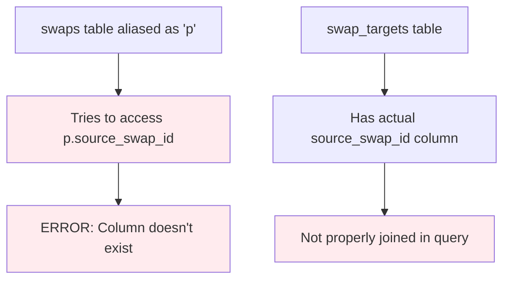
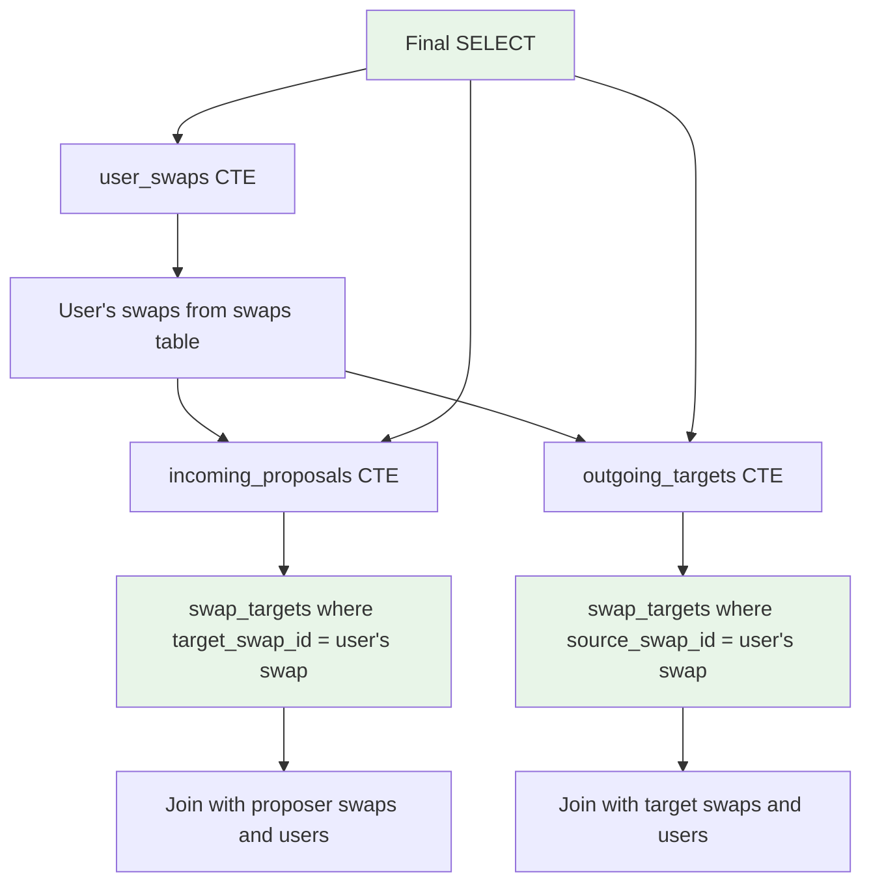

# Design Document

## Overview

The database query error occurs because the `findCompleteSwapDataWithTargeting` method incorrectly references `p.source_swap_id` on the `swaps` table, which doesn't have this column. The targeting relationships are actually managed through the `swap_targets` table, which has `source_swap_id` and `target_swap_id` columns that reference the `swaps` table.

The core issue is a fundamental misunderstanding of the database schema in the query design:

1. **Incorrect assumption**: The query assumes `swaps` table has a `source_swap_id` column
2. **Actual schema**: Targeting relationships are in the `swap_targets` table
3. **Missing joins**: The query doesn't properly join with `swap_targets` to get targeting information
4. **Wrong table aliases**: The query uses confusing aliases that don't match the actual data flow

## Architecture

### Current Problematic Query Structure


### Corrected Query Structure


## Components and Interfaces

### 1. Corrected Database Schema Understanding

The actual schema relationships are:

```sql
-- swaps table (main swap records)
swaps {
    id UUID PRIMARY KEY,
    source_booking_id UUID,  -- User's booking they want to swap
    target_booking_id UUID,  -- Booking they want in return
    proposer_id UUID,        -- User who created the swap
    owner_id UUID,           -- User who owns the target booking
    status VARCHAR(20),
    -- No source_swap_id column exists here!
}

-- swap_targets table (targeting relationships)
swap_targets {
    id UUID PRIMARY KEY,
    source_swap_id UUID,     -- Swap that is targeting another
    target_swap_id UUID,     -- Swap being targeted
    proposal_id UUID,        -- The proposal created from targeting
    status VARCHAR(20)
}
```

### 2. Corrected Query Logic

The query should work as follows:

1. **User Swaps**: Get all swaps owned by the user
2. **Incoming Proposals**: Find swap_targets where `target_swap_id` matches user's swaps
3. **Outgoing Targets**: Find swap_targets where `source_swap_id` matches user's swaps

### 3. Fixed Query Structure

```sql
WITH user_swaps AS (
  -- Get user's swaps (swaps where they own the target booking)
  SELECT s.*, u.display_name as owner_name
  FROM swaps s
  LEFT JOIN users u ON s.owner_id = u.id
  WHERE s.owner_id = $1 
    AND s.status IN ('pending', 'accepted', 'completed')
),

incoming_proposals AS (
  -- Get proposals targeting user's swaps
  SELECT 
    st.id as targeting_id,
    st.source_swap_id as proposer_swap_id,
    st.target_swap_id,
    st.status as targeting_status,
    st.created_at as targeting_created_at,
    -- Proposer swap details
    ps.id as proposal_id,
    ps.proposer_id,
    ps.additional_payment,
    ps.conditions,
    ps.created_at as proposal_created_at,
    -- Proposer user details
    u_proposer.display_name as proposer_name,
    -- Proposer booking details
    pb.title as proposer_booking_title,
    pb.original_price as proposer_booking_price
  FROM swap_targets st
  JOIN swaps ps ON st.source_swap_id = ps.id  -- The swap doing the targeting
  JOIN users u_proposer ON ps.proposer_id = u_proposer.id
  LEFT JOIN bookings pb ON ps.source_booking_id = pb.id
  JOIN user_swaps us ON st.target_swap_id = us.id  -- Link to user's swaps
  WHERE st.status = 'active'
),

outgoing_targets AS (
  -- Get swaps that user is targeting
  SELECT 
    st.id as targeting_id,
    st.source_swap_id,
    st.target_swap_id,
    st.status as targeting_status,
    st.created_at as targeting_created_at,
    -- Target swap details
    ts.owner_id as target_owner_id,
    ts.status as target_swap_status,
    -- Target user details
    u_target.display_name as target_owner_name,
    -- Target booking details
    tb.title as target_booking_title,
    tb.original_price as target_booking_price
  FROM swap_targets st
  JOIN swaps ts ON st.target_swap_id = ts.id  -- The swap being targeted
  JOIN users u_target ON ts.owner_id = u_target.id
  LEFT JOIN bookings tb ON ts.source_booking_id = tb.id
  JOIN user_swaps us ON st.source_swap_id = us.id  -- Link to user's swaps
  WHERE st.status = 'active'
)

SELECT 
  us.*,
  -- Aggregate incoming proposals
  COALESCE(
    JSON_AGG(
      DISTINCT JSONB_BUILD_OBJECT(
        'id', ip.proposal_id,
        'proposerId', ip.proposer_id,
        'proposerName', ip.proposer_name,
        'proposerSwapId', ip.proposer_swap_id,
        'proposerSwapTitle', ip.proposer_booking_title,
        'proposedTerms', JSONB_BUILD_OBJECT(
          'pricing', JSONB_BUILD_OBJECT(
            'amount', ip.additional_payment,
            'currency', 'EUR'
          )
        ),
        'status', ip.targeting_status,
        'createdAt', ip.targeting_created_at
      )
    ) FILTER (WHERE ip.proposal_id IS NOT NULL),
    '[]'::json
  ) as incoming_proposals,
  
  -- Single outgoing target (if any)
  CASE 
    WHEN ot.targeting_id IS NOT NULL THEN
      JSON_BUILD_OBJECT(
        'id', ot.targeting_id,
        'targetSwapId', ot.target_swap_id,
        'targetOwnerName', ot.target_owner_name,
        'targetSwapTitle', ot.target_booking_title,
        'status', ot.targeting_status,
        'createdAt', ot.targeting_created_at
      )
    ELSE NULL
  END as outgoing_target

FROM user_swaps us
LEFT JOIN incoming_proposals ip ON ip.target_swap_id = us.id
LEFT JOIN outgoing_targets ot ON ot.source_swap_id = us.id
GROUP BY 
  us.id, us.source_booking_id, us.target_booking_id, us.proposer_id, us.owner_id,
  us.status, us.additional_payment, us.conditions, us.created_at, us.updated_at,
  us.owner_name,
  ot.targeting_id, ot.target_swap_id, ot.target_owner_name, ot.target_booking_title,
  ot.targeting_status, ot.targeting_created_at
ORDER BY us.created_at DESC;
```

## Data Models

### 1. Corrected Interface Definitions

```typescript
interface SwapTargetingRelationship {
  id: string;
  sourceSwapId: string;  // Swap doing the targeting
  targetSwapId: string;  // Swap being targeted
  proposalId: string;    // Associated proposal
  status: 'active' | 'cancelled' | 'accepted' | 'rejected';
  createdAt: Date;
}

interface IncomingProposal {
  id: string;                    // targeting relationship id
  proposerId: string;            // User who created the proposing swap
  proposerName: string;          // Display name of proposer
  proposerSwapId: string;        // ID of the swap doing the targeting
  proposerSwapTitle: string;     // Title of proposer's booking
  proposedTerms: {
    pricing: {
      amount: number | null;
      currency: string;
    };
    message?: string;
  };
  status: string;
  createdAt: Date;
}

interface OutgoingTarget {
  id: string;                    // targeting relationship id
  targetSwapId: string;          // ID of swap being targeted
  targetOwnerName: string;       // Name of target swap owner
  targetSwapTitle: string;       // Title of target booking
  status: string;
  createdAt: Date;
}
```

### 2. Repository Method Signature

```typescript
class SwapRepository {
  async findCompleteSwapDataWithTargeting(
    userId: string, 
    limit: number = 100, 
    offset: number = 0
  ): Promise<CompleteSwapData[]> {
    // Implementation with corrected query
  }
}
```

## Error Handling

### 1. Query Validation

```typescript
class QueryValidator {
  static validateTableColumns(query: string, tableSchemas: Map<string, string[]>): ValidationResult {
    // Parse query and validate all column references exist in their respective tables
    // Return specific errors about missing columns
  }
  
  static validateJoinConditions(query: string): ValidationResult {
    // Ensure all JOIN conditions use valid foreign key relationships
  }
}
```

### 2. Schema Consistency Checks

```typescript
class SchemaConsistencyChecker {
  static async verifySwapTargetsSchema(pool: Pool): Promise<boolean> {
    const result = await pool.query(`
      SELECT column_name 
      FROM information_schema.columns 
      WHERE table_name = 'swap_targets' 
      AND column_name IN ('source_swap_id', 'target_swap_id', 'proposal_id')
    `);
    
    return result.rows.length === 3; // All required columns exist
  }
  
  static async verifySwapsSchema(pool: Pool): Promise<boolean> {
    const result = await pool.query(`
      SELECT column_name 
      FROM information_schema.columns 
      WHERE table_name = 'swaps' 
      AND column_name = 'source_swap_id'
    `);
    
    // Should return 0 rows - this column shouldn't exist in swaps table
    return result.rows.length === 0;
  }
}
```

### 3. Graceful Fallback Strategy

```typescript
class SwapDataFallbackHandler {
  static async handleQueryFailure(
    userId: string, 
    originalError: Error
  ): Promise<CompleteSwapData[]> {
    // Log the specific error
    console.error('Swap targeting query failed:', originalError);
    
    // Try a simpler query without targeting data
    try {
      return await this.getBasicSwapData(userId);
    } catch (fallbackError) {
      // Return empty array with proper error logging
      console.error('Fallback query also failed:', fallbackError);
      return [];
    }
  }
  
  static async getBasicSwapData(userId: string): Promise<CompleteSwapData[]> {
    // Simple query that only gets basic swap info without targeting
    const query = `
      SELECT s.*, u.display_name as owner_name
      FROM swaps s
      LEFT JOIN users u ON s.owner_id = u.id
      WHERE s.owner_id = $1
      ORDER BY s.created_at DESC
    `;
    
    // Transform to CompleteSwapData with empty targeting info
  }
}
```

## Testing Strategy

### 1. Schema Validation Tests
- Verify that all referenced columns exist in their respective tables
- Test JOIN conditions against actual foreign key constraints
- Validate that table aliases are used consistently

### 2. Query Correctness Tests
- Test the corrected query with sample data
- Verify that incoming proposals are correctly identified
- Verify that outgoing targets are correctly identified
- Test edge cases (no proposals, no targets, multiple proposals)

### 3. Error Handling Tests
- Test behavior when swap_targets table is missing
- Test behavior when foreign key constraints are violated
- Test fallback query execution when main query fails

### 4. Integration Tests
- Test complete data flow from corrected query to UI
- Verify that targeting counts match actual database state
- Test that proposal details are correctly retrieved and formatted