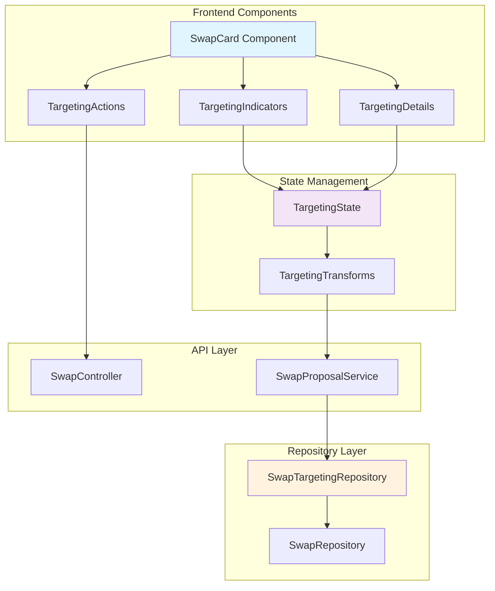
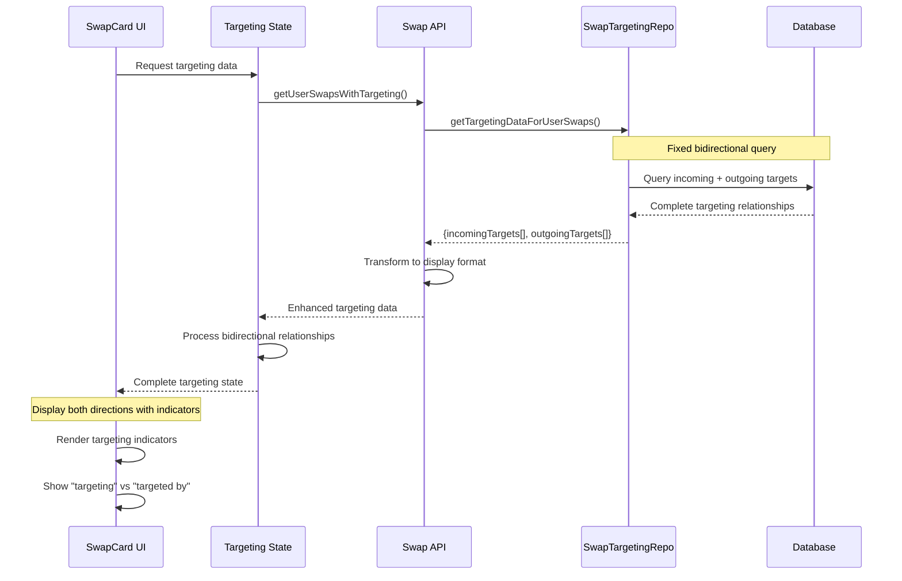

# Design Document

## Overview

This design addresses critical display issues in the swap targeting functionality where the UI is not properly showing bidirectional targeting relationships. The analysis reveals that while the backend `SwapTargetingRepository` has comprehensive methods like `getTargetingDataForUserSwaps()`, the frontend is only displaying one side of targeting relationships and missing key visual indicators.

The core issues identified are:
1. **Incomplete Bidirectional Display**: Only showing outgoing OR incoming targets, not both
2. **Missing Visual Indicators**: No clear distinction between "targeting" vs "targeted by" relationships  
3. **Query Logic Gaps**: The existing queries may not be properly handling both directions of targeting relationships
4. **UI State Management**: Frontend components not properly handling the complete targeting data structure

## Architecture

### Current State Analysis

Based on the existing code, the system has:
- A robust `SwapTargetingRepository` with `getTargetingDataForUserSwaps()` method
- Enhanced `SwapCardData` structure that includes targeting information
- Complex SQL queries that union both `swap_targets` table and regular proposals

However, the display issues suggest problems in:
- Query result processing and transformation
- Frontend component rendering logic
- State management of targeting relationships

### Target Architecture



### Data Flow Fixes



## Components and Interfaces

### Enhanced Frontend Data Types

```typescript
// Fixed targeting display data structure
export interface TargetingDisplayData {
  swapId: string;
  
  // Incoming targets (others targeting this swap)
  incomingTargets: IncomingTargetDisplay[];
  incomingCount: number;
  
  // Outgoing targets (this swap targeting others)
  outgoingTargets: OutgoingTargetDisplay[];
  outgoingCount: number;
  
  // Display state
  hasTargeting: boolean;
  displayMode: 'compact' | 'detailed';
  
  // Visual indicators
  indicators: TargetingIndicator[];
}

export interface IncomingTargetDisplay {
  targetId: string;
  sourceSwapId: string;
  sourceSwapDetails: {
    id: string;
    bookingTitle: string;
    bookingLocation: string;
    checkIn: Date;
    checkOut: Date;
    price: number;
    ownerName: string;
    ownerAvatar?: string;
  };
  status: SwapTargetStatus;
  createdAt: Date;
  
  // Display properties
  displayLabel: string; // "John's Paris Apartment is targeting your London Hotel"
  statusIcon: string;
  statusColor: string;
  actionable: boolean;
}

export interface OutgoingTargetDisplay {
  targetId: string;
  targetSwapId: string;
  targetSwapDetails: {
    id: string;
    bookingTitle: string;
    bookingLocation: string;
    checkIn: Date;
    checkOut: Date;
    price: number;
    ownerName: string;
    ownerAvatar?: string;
  };
  status: SwapTargetStatus;
  createdAt: Date;
  
  // Display properties
  displayLabel: string; // "Your London Hotel is targeting Sarah's Rome Villa"
  statusIcon: string;
  statusColor: string;
  actionable: boolean;
}

export interface TargetingIndicator {
  type: 'incoming' | 'outgoing' | 'bidirectional';
  count: number;
  icon: string;
  color: string;
  tooltip: string;
  priority: number; // For display ordering
}
```

### Fixed Repository Query Logic

```typescript
// Enhanced query to ensure bidirectional relationships are captured
export interface FixedTargetingQueries {
  /**
   * Fixed query that properly captures both directions
   * Addresses the issue where only one side was being displayed
   */
  getCompleteBidirectionalTargeting(userId: string): Promise<BidirectionalTargetingData>;
  
  /**
   * Separate queries for debugging and verification
   */
  getIncomingTargetsOnly(userId: string): Promise<IncomingTargetData[]>;
  getOutgoingTargetsOnly(userId: string): Promise<OutgoingTargetData[]>;
  
  /**
   * Validation query to ensure data consistency
   */
  validateTargetingRelationships(userId: string): Promise<TargetingValidationResult>;
}

export interface BidirectionalTargetingData {
  userId: string;
  incomingTargets: IncomingTargetData[];
  outgoingTargets: OutgoingTargetData[];
  
  // Validation data
  totalRelationships: number;
  duplicateCheck: boolean;
  dataConsistency: boolean;
}

export interface TargetingValidationResult {
  isValid: boolean;
  issues: TargetingIssue[];
  recommendations: string[];
}

export interface TargetingIssue {
  type: 'missing_bidirectional' | 'duplicate_relationship' | 'orphaned_target' | 'status_mismatch';
  description: string;
  affectedSwapIds: string[];
  severity: 'low' | 'medium' | 'high';
}
```

### Fixed UI Component Structure

```typescript
// SwapCard component with proper targeting display
export interface SwapCardProps {
  swapData: EnhancedSwapCardData;
  targetingData: TargetingDisplayData;
  onTargetingAction: (action: TargetingAction) => void;
}

// Targeting indicators component
export interface TargetingIndicatorsProps {
  indicators: TargetingIndicator[];
  displayMode: 'badge' | 'detailed';
  onClick?: () => void;
}

// Targeting details component  
export interface TargetingDetailsProps {
  incomingTargets: IncomingTargetDisplay[];
  outgoingTargets: OutgoingTargetDisplay[];
  expanded: boolean;
  onToggle: () => void;
  onAction: (action: TargetingAction) => void;
}

export interface TargetingAction {
  type: 'accept_target' | 'reject_target' | 'retarget' | 'cancel_targeting' | 'view_details';
  targetId?: string;
  swapId: string;
  metadata?: Record<string, any>;
}
```

## Data Models

### Fixed Database Query Implementation

```sql
-- Fixed bidirectional targeting query that addresses display issues
WITH user_swaps AS (
  SELECT id, source_booking_id, owner_id, status, acceptance_strategy
  FROM swaps 
  WHERE owner_id = $1 AND status IN ('pending', 'accepted')
),
-- INCOMING TARGETS: Others targeting user's swaps
incoming_targets AS (
  SELECT DISTINCT
    st.id as target_id,
    st.target_swap_id,
    st.source_swap_id,
    st.proposal_id,
    st.status,
    st.created_at,
    st.updated_at,
    
    -- Source swap details (the swap targeting user's swap)
    ss.source_booking_id as source_booking_id,
    ss.owner_id as source_owner_id,
    
    -- Source booking details
    sb.title as source_booking_title,
    sb.city as source_booking_city,
    sb.country as source_booking_country,
    sb.check_in_date as source_check_in,
    sb.check_out_date as source_check_out,
    sb.original_price as source_price,
    
    -- Source owner details
    su.display_name as source_owner_name,
    su.email as source_owner_email,
    
    'swap_targets' as data_source
  FROM swap_targets st
  JOIN user_swaps us ON st.target_swap_id = us.id  -- User's swap being targeted
  JOIN swaps ss ON st.source_swap_id = ss.id       -- Other user's swap doing targeting
  JOIN bookings sb ON ss.source_booking_id = sb.id
  JOIN users su ON ss.owner_id = su.id
  WHERE st.status = 'active'
  
  UNION ALL
  
  -- Also include regular proposals as incoming targets
  SELECT DISTINCT
    p.id as target_id,
    ts.id as target_swap_id,  -- User's swap
    p.id as source_swap_id,   -- Proposal swap
    p.id as proposal_id,
    CASE WHEN p.status = 'pending' THEN 'active' ELSE p.status END as status,
    p.created_at,
    p.updated_at,
    
    -- Proposer's booking details
    p.source_booking_id,
    p.proposer_id as source_owner_id,
    
    pb.title as source_booking_title,
    pb.city as source_booking_city,
    pb.country as source_booking_country,
    pb.check_in_date as source_check_in,
    pb.check_out_date as source_check_out,
    pb.original_price as source_price,
    
    pu.display_name as source_owner_name,
    pu.email as source_owner_email,
    
    'proposals' as data_source
  FROM swaps p
  JOIN bookings pb ON p.source_booking_id = pb.id
  JOIN users pu ON p.proposer_id = pu.id
  JOIN bookings tb ON p.target_booking_id = tb.id
  JOIN user_swaps ts ON tb.id = ts.source_booking_id  -- Find user's swap by booking
  WHERE p.status IN ('pending', 'accepted')
    AND p.proposer_id != $1  -- Not user's own proposal
),
-- OUTGOING TARGETS: User's swaps targeting others
outgoing_targets AS (
  SELECT DISTINCT
    st.id as target_id,
    st.source_swap_id,
    st.target_swap_id,
    st.proposal_id,
    st.status,
    st.created_at,
    st.updated_at,
    
    -- Target swap details (the swap being targeted)
    ts.source_booking_id as target_booking_id,
    ts.owner_id as target_owner_id,
    ts.acceptance_strategy,
    
    -- Target booking details
    tb.title as target_booking_title,
    tb.city as target_booking_city,
    tb.country as target_booking_country,
    tb.check_in_date as target_check_in,
    tb.check_out_date as target_check_out,
    tb.original_price as target_price,
    
    -- Target owner details
    tu.display_name as target_owner_name,
    tu.email as target_owner_email,
    
    'swap_targets' as data_source
  FROM swap_targets st
  JOIN user_swaps us ON st.source_swap_id = us.id  -- User's swap doing targeting
  JOIN swaps ts ON st.target_swap_id = ts.id       -- Other user's swap being targeted
  JOIN bookings tb ON ts.source_booking_id = tb.id
  JOIN users tu ON ts.owner_id = tu.id
  WHERE st.status = 'active'
  
  UNION ALL
  
  -- Also include user's proposals as outgoing targets
  SELECT DISTINCT
    p.id as target_id,
    p.id as source_swap_id,   -- User's proposal swap
    ts.id as target_swap_id,  -- Target swap (if exists)
    p.id as proposal_id,
    CASE WHEN p.status = 'pending' THEN 'active' ELSE p.status END as status,
    p.created_at,
    p.updated_at,
    
    -- Target booking details
    p.target_booking_id as target_booking_id,
    tb.user_id as target_owner_id,
    NULL as acceptance_strategy,  -- Not available for proposals
    
    tb.title as target_booking_title,
    tb.city as target_booking_city,
    tb.country as target_booking_country,
    tb.check_in_date as target_check_in,
    tb.check_out_date as target_check_out,
    tb.original_price as target_price,
    
    tu.display_name as target_owner_name,
    tu.email as target_owner_email,
    
    'proposals' as data_source
  FROM swaps p
  JOIN bookings tb ON p.target_booking_id = tb.id
  JOIN users tu ON tb.user_id = tu.id
  LEFT JOIN swaps ts ON tb.id = ts.source_booking_id AND ts.owner_id = tb.user_id
  WHERE p.proposer_id = $1  -- User's proposals
    AND p.target_booking_id IS NOT NULL
    AND p.status IN ('pending', 'accepted')
    AND tb.user_id != $1  -- Not targeting own booking
)
-- Return both incoming and outgoing with clear labeling
SELECT 
  'incoming' as direction,
  target_id,
  target_swap_id,
  source_swap_id,
  proposal_id,
  status,
  created_at,
  updated_at,
  source_booking_title as booking_title,
  source_booking_city as booking_city,
  source_booking_country as booking_country,
  source_check_in as check_in,
  source_check_out as check_out,
  source_price as price,
  source_owner_name as owner_name,
  source_owner_email as owner_email,
  data_source
FROM incoming_targets

UNION ALL

SELECT 
  'outgoing' as direction,
  target_id,
  source_swap_id as target_swap_id,  -- Swap the IDs for consistent structure
  target_swap_id as source_swap_id,
  proposal_id,
  status,
  created_at,
  updated_at,
  target_booking_title as booking_title,
  target_booking_city as booking_city,
  target_booking_country as booking_country,
  target_check_in as check_in,
  target_check_out as check_out,
  target_price as price,
  target_owner_name as owner_name,
  target_owner_email as owner_email,
  data_source
FROM outgoing_targets

ORDER BY direction, created_at DESC;
```

### Data Transformation Logic

```typescript
// Fixed data transformation that ensures both directions are processed
export class TargetingDataTransformer {
  
  /**
   * Transform raw query results into display-ready format
   * Fixes the issue where only one direction was being shown
   */
  static transformBidirectionalData(
    queryResults: BidirectionalQueryResult[]
  ): TargetingDisplayData[] {
    const swapTargetingMap = new Map<string, TargetingDisplayData>();
    
    // Process each result and group by swap ID
    queryResults.forEach(result => {
      const swapId = result.direction === 'incoming' 
        ? result.target_swap_id 
        : result.source_swap_id;
      
      if (!swapTargetingMap.has(swapId)) {
        swapTargetingMap.set(swapId, {
          swapId,
          incomingTargets: [],
          incomingCount: 0,
          outgoingTargets: [],
          outgoingCount: 0,
          hasTargeting: false,
          displayMode: 'compact',
          indicators: []
        });
      }
      
      const targetingData = swapTargetingMap.get(swapId)!;
      
      if (result.direction === 'incoming') {
        targetingData.incomingTargets.push(
          this.transformIncomingTarget(result)
        );
        targetingData.incomingCount++;
      } else {
        targetingData.outgoingTargets.push(
          this.transformOutgoingTarget(result)
        );
        targetingData.outgoingCount++;
      }
      
      targetingData.hasTargeting = true;
    });
    
    // Generate indicators for each swap
    swapTargetingMap.forEach(data => {
      data.indicators = this.generateTargetingIndicators(data);
    });
    
    return Array.from(swapTargetingMap.values());
  }
  
  /**
   * Generate visual indicators based on targeting data
   */
  static generateTargetingIndicators(data: TargetingDisplayData): TargetingIndicator[] {
    const indicators: TargetingIndicator[] = [];
    
    if (data.incomingCount > 0) {
      indicators.push({
        type: 'incoming',
        count: data.incomingCount,
        icon: 'arrow-down-circle',
        color: '#10b981', // green
        tooltip: `${data.incomingCount} swap${data.incomingCount > 1 ? 's' : ''} targeting this`,
        priority: 1
      });
    }
    
    if (data.outgoingCount > 0) {
      indicators.push({
        type: 'outgoing',
        count: data.outgoingCount,
        icon: 'arrow-up-circle',
        color: '#3b82f6', // blue
        tooltip: `Targeting ${data.outgoingCount} other swap${data.outgoingCount > 1 ? 's' : ''}`,
        priority: 2
      });
    }
    
    if (data.incomingCount > 0 && data.outgoingCount > 0) {
      indicators.push({
        type: 'bidirectional',
        count: data.incomingCount + data.outgoingCount,
        icon: 'arrows-up-down',
        color: '#8b5cf6', // purple
        tooltip: 'Both targeting and being targeted',
        priority: 0
      });
    }
    
    return indicators.sort((a, b) => a.priority - b.priority);
  }
}
```

## Error Handling

### Display Error Recovery

```typescript
export class TargetingDisplayErrorHandler {
  
  /**
   * Handle cases where targeting data is incomplete or missing
   */
  static handlePartialTargetingData(
    swapData: SwapCardData[],
    targetingData: Partial<TargetingDisplayData>[]
  ): EnhancedSwapCardData[] {
    return swapData.map(swap => {
      const targeting = targetingData.find(t => t.swapId === swap.userSwap.id);
      
      return {
        ...swap,
        targeting: targeting ? {
          incomingTargets: targeting.incomingTargets || [],
          incomingTargetCount: targeting.incomingCount || 0,
          outgoingTarget: targeting.outgoingTargets?.[0] || undefined,
          canReceiveTargets: true,
          canTarget: true,
          targetingRestrictions: []
        } : {
          incomingTargets: [],
          incomingTargetCount: 0,
          outgoingTarget: undefined,
          canReceiveTargets: true,
          canTarget: true,
          targetingRestrictions: [{
            type: 'targeting_data_unavailable',
            message: 'Targeting information temporarily unavailable',
            severity: 'info'
          }]
        }
      };
    });
  }
  
  /**
   * Validate targeting data consistency
   */
  static validateTargetingConsistency(
    targetingData: TargetingDisplayData[]
  ): TargetingValidationResult {
    const issues: TargetingIssue[] = [];
    
    targetingData.forEach(data => {
      // Check for orphaned relationships
      const totalTargets = data.incomingCount + data.outgoingCount;
      const actualTargets = data.incomingTargets.length + data.outgoingTargets.length;
      
      if (totalTargets !== actualTargets) {
        issues.push({
          type: 'missing_bidirectional',
          description: `Count mismatch for swap ${data.swapId}: expected ${totalTargets}, got ${actualTargets}`,
          affectedSwapIds: [data.swapId],
          severity: 'medium'
        });
      }
      
      // Check for duplicate relationships
      const incomingIds = new Set(data.incomingTargets.map(t => t.targetId));
      const outgoingIds = new Set(data.outgoingTargets.map(t => t.targetId));
      
      if (incomingIds.size !== data.incomingTargets.length) {
        issues.push({
          type: 'duplicate_relationship',
          description: `Duplicate incoming targets found for swap ${data.swapId}`,
          affectedSwapIds: [data.swapId],
          severity: 'high'
        });
      }
      
      if (outgoingIds.size !== data.outgoingTargets.length) {
        issues.push({
          type: 'duplicate_relationship',
          description: `Duplicate outgoing targets found for swap ${data.swapId}`,
          affectedSwapIds: [data.swapId],
          severity: 'high'
        });
      }
    });
    
    return {
      isValid: issues.length === 0,
      issues,
      recommendations: this.generateRecommendations(issues)
    };
  }
  
  private static generateRecommendations(issues: TargetingIssue[]): string[] {
    const recommendations: string[] = [];
    
    if (issues.some(i => i.type === 'missing_bidirectional')) {
      recommendations.push('Review database query logic to ensure both directions are captured');
    }
    
    if (issues.some(i => i.type === 'duplicate_relationship')) {
      recommendations.push('Add DISTINCT clauses to targeting queries to prevent duplicates');
    }
    
    if (issues.some(i => i.severity === 'high')) {
      recommendations.push('Consider implementing data consistency checks in the repository layer');
    }
    
    return recommendations;
  }
}
```

## Testing Strategy

### Unit Tests for Fixed Logic

```typescript
describe('TargetingDisplayFixes', () => {
  
  describe('BidirectionalDataTransformation', () => {
    it('should properly transform both incoming and outgoing targets', () => {
      const mockQueryResults = [
        { direction: 'incoming', target_swap_id: 'swap1', source_swap_id: 'swap2', /* ... */ },
        { direction: 'outgoing', source_swap_id: 'swap1', target_swap_id: 'swap3', /* ... */ }
      ];
      
      const result = TargetingDataTransformer.transformBidirectionalData(mockQueryResults);
      
      expect(result).toHaveLength(1);
      expect(result[0].swapId).toBe('swap1');
      expect(result[0].incomingCount).toBe(1);
      expect(result[0].outgoingCount).toBe(1);
      expect(result[0].hasTargeting).toBe(true);
    });
    
    it('should generate appropriate visual indicators', () => {
      const targetingData = {
        swapId: 'swap1',
        incomingCount: 2,
        outgoingCount: 1,
        /* ... */
      };
      
      const indicators = TargetingDataTransformer.generateTargetingIndicators(targetingData);
      
      expect(indicators).toHaveLength(3); // incoming, outgoing, bidirectional
      expect(indicators.find(i => i.type === 'bidirectional')).toBeDefined();
    });
  });
  
  describe('ErrorHandling', () => {
    it('should handle missing targeting data gracefully', () => {
      const swapData = [{ userSwap: { id: 'swap1' }, /* ... */ }];
      const partialTargeting = []; // Empty targeting data
      
      const result = TargetingDisplayErrorHandler.handlePartialTargetingData(
        swapData, 
        partialTargeting
      );
      
      expect(result[0].targeting.targetingRestrictions).toHaveLength(1);
      expect(result[0].targeting.targetingRestrictions[0].type).toBe('targeting_data_unavailable');
    });
  });
});
```

### Integration Tests

```typescript
describe('TargetingDisplayIntegration', () => {
  
  it('should display both directions of targeting relationships', async () => {
    // Create test data with bidirectional targeting
    const user1 = await createTestUser();
    const user2 = await createTestUser();
    
    const swap1 = await createTestSwap(user1.id);
    const swap2 = await createTestSwap(user2.id);
    
    // Create bidirectional targeting
    await createSwapTarget(swap1.id, swap2.id);
    await createSwapTarget(swap2.id, swap1.id);
    
    // Test API response
    const response = await request(app)
      .get(`/api/swaps?userId=${user1.id}`)
      .expect(200);
    
    const swapCard = response.body.find(s => s.userSwap.id === swap1.id);
    
    expect(swapCard.targeting.incomingTargetCount).toBe(1);
    expect(swapCard.targeting.outgoingTarget).toBeDefined();
    expect(swapCard.targeting.indicators).toContain(
      expect.objectContaining({ type: 'bidirectional' })
    );
  });
});
```

## Performance Optimizations

### Query Performance Fixes

1. **Optimized Indexes**:
   ```sql
   -- Ensure proper indexes for bidirectional queries
   CREATE INDEX CONCURRENTLY IF NOT EXISTS idx_swap_targets_bidirectional 
   ON swap_targets(target_swap_id, source_swap_id, status) 
   WHERE status = 'active';
   
   CREATE INDEX CONCURRENTLY IF NOT EXISTS idx_swaps_targeting_lookup
   ON swaps(owner_id, status, target_booking_id)
   WHERE status IN ('pending', 'accepted');
   ```

2. **Query Result Caching**:
   ```typescript
   // Cache targeting data with appropriate TTL
   const TARGETING_CACHE_TTL = 300; // 5 minutes
   
   async getCachedTargetingData(userId: string): Promise<TargetingDisplayData[]> {
     const cacheKey = `targeting:${userId}`;
     const cached = await this.cache.get(cacheKey);
     
     if (cached) {
       return JSON.parse(cached);
     }
     
     const data = await this.getTargetingDataForUserSwaps(userId);
     await this.cache.setex(cacheKey, TARGETING_CACHE_TTL, JSON.stringify(data));
     
     return data;
   }
   ```

### Frontend Performance

1. **Efficient Re-rendering**:
   ```typescript
   // Use React.memo and proper dependency arrays
   const TargetingIndicators = React.memo(({ indicators }: TargetingIndicatorsProps) => {
     return (
       <div className="targeting-indicators">
         {indicators.map(indicator => (
           <TargetingBadge key={indicator.type} indicator={indicator} />
         ))}
       </div>
     );
   });
   ```

2. **Lazy Loading**:
   ```typescript
   // Load detailed targeting information on demand
   const [targetingDetails, setTargetingDetails] = useState(null);
   const [isExpanded, setIsExpanded] = useState(false);
   
   const loadTargetingDetails = useCallback(async () => {
     if (!targetingDetails && isExpanded) {
       const details = await api.getDetailedTargetingInfo(swapId);
       setTargetingDetails(details);
     }
   }, [swapId, isExpanded, targetingDetails]);
   ```

## Migration and Deployment

### Deployment Strategy

1. **Backend Fixes First**: Deploy the fixed repository queries and data transformation logic
2. **Frontend Updates**: Update UI components to properly handle bidirectional data
3. **Gradual Rollout**: Use feature flags to enable the fixes for specific users first
4. **Monitoring**: Track targeting display accuracy and performance metrics

### Rollback Plan

1. **Database Queries**: Keep original queries as fallback methods
2. **Frontend Components**: Maintain backward compatibility with existing data structure
3. **Feature Flags**: Quick disable mechanism for targeting display fixes

### Success Metrics

1. **Display Accuracy**: 100% of bidirectional relationships shown correctly
2. **Performance**: No degradation in swap list loading times
3. **User Engagement**: Increased interaction with targeting features
4. **Error Rates**: Reduced targeting-related support tickets