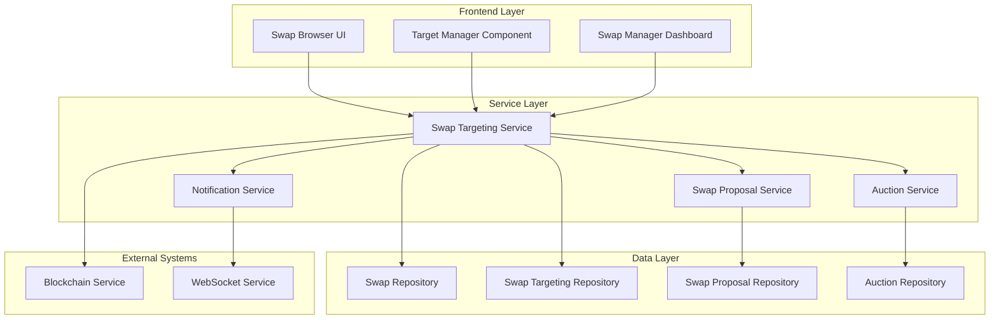

# Design Document

## Overview

This design addresses the core issue where users end up with multiple swaps when making proposals. The solution introduces a swap targeting system that allows users to redirect their existing swap to target other swaps directly, rather than creating new swap instances. This maintains a one-swap-per-user-per-booking model while enabling flexible targeting and retargeting capabilities.

The design integrates with the existing auction mode and one-for-one proposal systems, ensuring that targeting respects the different proposal rules for each mode.

## Architecture

### High-Level Architecture



### Core Components

1. **Swap Targeting Service**: Manages the targeting and retargeting of swaps
2. **Swap Targeting Repository**: Handles data persistence for targeting relationships
3. **Enhanced Swap Proposal Service**: Updated to work with targeting system
4. **Target Manager Component**: UI component for managing swap targets
5. **Auction Mode Integration**: Ensures targeting respects auction rules

## Components and Interfaces

### Backend Components

#### SwapTargetingService

```typescript
interface SwapTargetingService {
  // Core targeting operations
  targetSwap(sourceSwapId: string, targetSwapId: string, userId: string): Promise<TargetingResult>;
  retargetSwap(sourceSwapId: string, newTargetSwapId: string, userId: string): Promise<TargetingResult>;
  removeTarget(sourceSwapId: string, userId: string): Promise<void>;
  
  // Validation and eligibility
  validateTargeting(sourceSwapId: string, targetSwapId: string): Promise<ValidationResult>;
  canTargetSwap(targetSwapId: string, userId: string): Promise<boolean>;
  
  // Query operations
  getSwapTarget(swapId: string): Promise<SwapTarget | null>;
  getTargetingHistory(swapId: string): Promise<TargetingHistory[]>;
  getSwapsTargetingMe(userId: string): Promise<SwapTarget[]>;
}

interface TargetingResult {
  success: boolean;
  targetId?: string;
  proposalId?: string;
  error?: string;
  warnings?: string[];
}

interface SwapTarget {
  id: string;
  sourceSwapId: string;
  targetSwapId: string;
  proposalId: string;
  status: 'active' | 'cancelled' | 'accepted' | 'rejected';
  createdAt: Date;
  updatedAt: Date;
}

interface TargetingHistory {
  id: string;
  sourceSwapId: string;
  targetSwapId: string;
  action: 'targeted' | 'retargeted' | 'removed' | 'accepted' | 'rejected';
  timestamp: Date;
  metadata?: Record<string, any>;
}
```

#### Enhanced SwapProposalService

```typescript
interface EnhancedSwapProposalService extends SwapProposalService {
  // Enhanced proposal creation that works with targeting
  createProposalFromTargeting(targetingRequest: TargetingRequest): Promise<SwapProposalResult>;
  
  // Proposal management with targeting awareness
  cancelProposalFromRetargeting(proposalId: string, reason: string): Promise<void>;
  validateProposalWithAuctionMode(targetSwapId: string, proposerId: string): Promise<ValidationResult>;
  
  // Auction mode integration
  checkAuctionEligibility(targetSwapId: string): Promise<AuctionEligibilityResult>;
  enforceOneForOneRules(targetSwapId: string): Promise<OneForOneValidationResult>;
}

interface TargetingRequest {
  sourceSwapId: string;
  targetSwapId: string;
  userId: string;
  message?: string;
  conditions?: string[];
}

interface AuctionEligibilityResult {
  canTarget: boolean;
  auctionActive: boolean;
  auctionEndDate?: Date;
  currentProposalCount: number;
  reason?: string;
}

interface OneForOneValidationResult {
  canTarget: boolean;
  hasExistingProposal: boolean;
  existingProposalId?: string;
  mustWaitForResolution: boolean;
  reason?: string;
}
```

#### SwapTargetingRepository

```typescript
interface SwapTargetingRepository {
  // CRUD operations
  createTarget(target: CreateSwapTargetRequest): Promise<SwapTarget>;
  updateTarget(targetId: string, updates: Partial<SwapTarget>): Promise<SwapTarget>;
  deleteTarget(targetId: string): Promise<void>;
  
  // Query operations
  findBySourceSwap(sourceSwapId: string): Promise<SwapTarget | null>;
  findByTargetSwap(targetSwapId: string): Promise<SwapTarget[]>;
  findActiveTargets(userId: string): Promise<SwapTarget[]>;
  
  // History and audit
  createHistoryEntry(entry: CreateTargetingHistoryRequest): Promise<TargetingHistory>;
  getTargetingHistory(swapId: string): Promise<TargetingHistory[]>;
  
  // Validation queries
  hasActiveTarget(sourceSwapId: string): Promise<boolean>;
  countTargetsForSwap(targetSwapId: string): Promise<number>;
  findCircularTargeting(sourceSwapId: string, targetSwapId: string): Promise<boolean>;
}

interface CreateSwapTargetRequest {
  sourceSwapId: string;
  targetSwapId: string;
  proposalId: string;
  status: 'active';
}

interface CreateTargetingHistoryRequest {
  sourceSwapId: string;
  targetSwapId: string;
  action: string;
  metadata?: Record<string, any>;
}
```

### Frontend Components

#### TargetManagerComponent

```typescript
interface TargetManagerProps {
  userSwap: Swap;
  currentTarget?: SwapTarget;
  onTargetChange: (targetSwapId: string | null) => void;
  onRetarget: (newTargetSwapId: string) => void;
}

interface TargetManagerState {
  isTargeting: boolean;
  targetSwap?: Swap;
  targetingHistory: TargetingHistory[];
  availableTargets: Swap[];
  loading: boolean;
  error?: string;
}
```

#### Enhanced SwapCard Component

```typescript
interface EnhancedSwapCardProps extends SwapCardProps {
  // Targeting-specific props
  canTarget: boolean;
  targetingRestriction?: 'auction_ended' | 'proposal_pending' | 'own_swap' | 'already_targeted';
  auctionInfo?: {
    isAuction: boolean;
    endDate?: Date;
    proposalCount: number;
  };
  
  // Action handlers
  onTargetSwap?: (targetSwapId: string) => void;
  onViewTargetingDetails?: (swapId: string) => void;
}
```

#### SwapBrowserEnhanced Component

```typescript
interface SwapBrowserEnhancedProps {
  userSwap?: Swap; // Current user's active swap
  onSwapTarget: (targetSwapId: string) => void;
  targetingFilters: TargetingFilters;
}

interface TargetingFilters {
  showOnlyTargetable: boolean;
  excludeAuctionEnded: boolean;
  excludeWithPendingProposals: boolean;
  auctionModeOnly?: boolean;
  oneForOneOnly?: boolean;
}
```

## Data Models

### Database Schema Extensions

#### swap_targets Table

```sql
CREATE TABLE swap_targets (
  id UUID PRIMARY KEY DEFAULT gen_random_uuid(),
  source_swap_id UUID NOT NULL REFERENCES swaps(id) ON DELETE CASCADE,
  target_swap_id UUID NOT NULL REFERENCES swaps(id) ON DELETE CASCADE,
  proposal_id UUID NOT NULL REFERENCES swap_proposals(id) ON DELETE CASCADE,
  status VARCHAR(20) NOT NULL DEFAULT 'active',
  created_at TIMESTAMP WITH TIME ZONE DEFAULT NOW(),
  updated_at TIMESTAMP WITH TIME ZONE DEFAULT NOW(),
  
  -- Constraints
  UNIQUE(source_swap_id), -- One target per source swap
  CHECK (source_swap_id != target_swap_id), -- Prevent self-targeting
  CHECK (status IN ('active', 'cancelled', 'accepted', 'rejected'))
);

CREATE INDEX idx_swap_targets_source ON swap_targets(source_swap_id);
CREATE INDEX idx_swap_targets_target ON swap_targets(target_swap_id);
CREATE INDEX idx_swap_targets_status ON swap_targets(status);
```

#### swap_targeting_history Table

```sql
CREATE TABLE swap_targeting_history (
  id UUID PRIMARY KEY DEFAULT gen_random_uuid(),
  source_swap_id UUID NOT NULL REFERENCES swaps(id) ON DELETE CASCADE,
  target_swap_id UUID REFERENCES swaps(id) ON DELETE SET NULL,
  action VARCHAR(50) NOT NULL,
  timestamp TIMESTAMP WITH TIME ZONE DEFAULT NOW(),
  metadata JSONB,
  
  -- Indexes for efficient querying
  INDEX idx_targeting_history_source (source_swap_id),
  INDEX idx_targeting_history_timestamp (timestamp DESC)
);
```

#### Enhanced swaps Table

```sql
-- Add targeting-related columns to existing swaps table
ALTER TABLE swaps ADD COLUMN IF NOT EXISTS is_targeted BOOLEAN DEFAULT FALSE;
ALTER TABLE swaps ADD COLUMN IF NOT EXISTS target_count INTEGER DEFAULT 0;
ALTER TABLE swaps ADD COLUMN IF NOT EXISTS last_targeted_at TIMESTAMP WITH TIME ZONE;

-- Indexes for targeting queries
CREATE INDEX IF NOT EXISTS idx_swaps_is_targeted ON swaps(is_targeted);
CREATE INDEX IF NOT EXISTS idx_swaps_target_count ON swaps(target_count);
```

### Enhanced Data Types

```typescript
// Enhanced Swap type with targeting information
interface SwapWithTargeting extends Swap {
  targeting?: {
    isTargeting: boolean;
    targetSwapId?: string;
    targetSwap?: Swap;
    targetedAt?: Date;
  };
  targetedBy?: {
    count: number;
    recentTargets: SwapTarget[];
  };
  auctionInfo?: {
    isAuction: boolean;
    endDate?: Date;
    proposalCount: number;
    canReceiveMoreProposals: boolean;
  };
}

// Targeting validation result
interface TargetingValidation {
  canTarget: boolean;
  restrictions: TargetingRestriction[];
  warnings: string[];
  auctionInfo?: AuctionInfo;
}

interface TargetingRestriction {
  type: 'own_swap' | 'auction_ended' | 'proposal_pending' | 'circular_targeting' | 'swap_unavailable';
  message: string;
  severity: 'error' | 'warning';
}
```

## Error Handling

### Targeting-Specific Errors

```typescript
enum TargetingErrorCodes {
  SWAP_NOT_FOUND = 'SWAP_NOT_FOUND',
  CANNOT_TARGET_OWN_SWAP = 'CANNOT_TARGET_OWN_SWAP',
  AUCTION_ENDED = 'AUCTION_ENDED',
  PROPOSAL_PENDING = 'PROPOSAL_PENDING',
  CIRCULAR_TARGETING = 'CIRCULAR_TARGETING',
  SWAP_ALREADY_TARGETED = 'SWAP_ALREADY_TARGETED',
  TARGET_SWAP_UNAVAILABLE = 'TARGET_SWAP_UNAVAILABLE',
  CONCURRENT_TARGETING = 'CONCURRENT_TARGETING'
}

class TargetingError extends Error {
  constructor(
    public code: TargetingErrorCodes,
    public message: string,
    public details?: Record<string, any>
  ) {
    super(message);
    this.name = 'TargetingError';
  }
}
```

### Error Recovery Strategies

1. **Concurrent Targeting**: Use database locks and retry mechanisms
2. **Stale Data**: Implement optimistic locking with version checks
3. **Network Failures**: Provide retry with exponential backoff
4. **Validation Failures**: Clear error messages with suggested actions

## Testing Strategy

### Unit Tests

1. **SwapTargetingService Tests**
   - Targeting validation logic
   - Auction mode rule enforcement
   - One-for-one proposal restrictions
   - Circular targeting prevention

2. **Repository Tests**
   - CRUD operations for targeting data
   - Query performance with large datasets
   - Constraint enforcement
   - Transaction rollback scenarios

3. **Component Tests**
   - TargetManager component interactions
   - SwapCard targeting button states
   - Error handling and user feedback

### Integration Tests

1. **End-to-End Targeting Workflow**
   - Complete targeting process from UI to database
   - Auction mode integration
   - Notification delivery
   - Blockchain recording

2. **Concurrent Operations**
   - Multiple users targeting same swap
   - Retargeting during proposal processing
   - Auction ending during targeting

3. **Data Consistency**
   - Targeting relationship integrity
   - Proposal state synchronization
   - History audit trail accuracy

### Performance Tests

1. **Targeting Query Performance**
   - Large-scale targeting relationship queries
   - Complex filtering with targeting data
   - Real-time targeting status updates

2. **Concurrent User Load**
   - Multiple simultaneous targeting operations
   - Database lock contention
   - WebSocket notification delivery

## Security Considerations

### Authorization

1. **Targeting Permissions**: Users can only target swaps they own
2. **Target Validation**: Prevent targeting of unavailable or restricted swaps
3. **Audit Trail**: Complete history of all targeting actions

### Data Protection

1. **Input Validation**: Sanitize all targeting-related inputs
2. **SQL Injection Prevention**: Use parameterized queries
3. **Rate Limiting**: Prevent targeting spam or abuse

### Blockchain Integration

1. **Targeting Transaction Recording**: Record targeting events on blockchain
2. **Proposal Authenticity**: Verify targeting-based proposals
3. **Dispute Resolution**: Immutable targeting history for disputes

## Performance Optimizations

### Database Optimizations

1. **Indexing Strategy**: Optimize queries for targeting relationships
2. **Query Optimization**: Efficient joins for targeting data
3. **Caching Layer**: Cache frequently accessed targeting information

### Frontend Optimizations

1. **Lazy Loading**: Load targeting data on demand
2. **Real-time Updates**: WebSocket for targeting status changes
3. **Optimistic Updates**: Immediate UI feedback with rollback capability

### API Optimizations

1. **Batch Operations**: Group related targeting operations
2. **Response Compression**: Minimize targeting data payload
3. **Connection Pooling**: Efficient database connection management