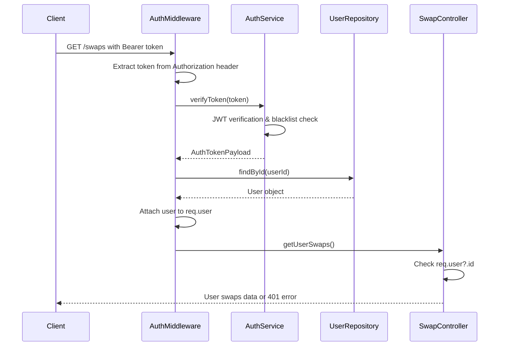

# Design Document

## Overview

The 401 Unauthorized error on the `/swaps` endpoint occurs despite users having valid authentication tokens. Based on code analysis, the authentication flow appears correctly implemented, but there may be issues with:

1. Token format or extraction in the middleware
2. JWT secret configuration mismatch
3. Token blacklisting or session invalidation
4. User data not being properly attached to the request
5. Database connectivity issues during user lookup

The authentication middleware uses a Bearer token format and validates tokens through the AuthService, which checks JWT signature, expiration, and blacklist status before attaching user data to the request object.

## Architecture

### Current Authentication Flow



### Problem Areas Identified

1. **Token Extraction**: Authorization header parsing in middleware
2. **JWT Verification**: Secret mismatch or token format issues
3. **User Lookup**: Database query failures or user not found
4. **Request Context**: User data not properly attached to request

## Components and Interfaces

### AuthMiddleware Enhancement

```typescript
interface AuthMiddlewareDebugInfo {
  hasAuthHeader: boolean;
  tokenFormat: string;
  tokenLength: number;
  verificationResult: 'success' | 'failed' | 'error';
  userFound: boolean;
  errorDetails?: string;
}

interface EnhancedAuthMiddleware extends AuthMiddleware {
  // Add debug logging for troubleshooting
  debugAuthentication(req: Request): AuthMiddlewareDebugInfo;
  
  // Validate token format before processing
  validateTokenFormat(authHeader: string): boolean;
  
  // Enhanced error responses with more context
  createAuthErrorResponse(code: string, message: string, debug?: any): object;
}
```

### AuthService Debugging

```typescript
interface TokenValidationResult {
  isValid: boolean;
  payload?: AuthTokenPayload;
  error?: string;
  debugInfo: {
    jwtSecretLength: number;
    tokenStructure: 'valid' | 'malformed';
    isExpired: boolean;
    isBlacklisted: boolean;
    userExists: boolean;
  };
}

interface EnhancedAuthService extends AuthService {
  // Debug version of token verification
  debugVerifyToken(token: string): Promise<TokenValidationResult>;
  
  // Validate JWT secret configuration
  validateJwtSecret(): boolean;
}
```

## Data Models

### Debug Logging Structure

```typescript
interface AuthenticationLog {
  timestamp: Date;
  endpoint: string;
  userId?: string;
  tokenPresent: boolean;
  tokenValid: boolean;
  userFound: boolean;
  errorCode?: string;
  errorMessage?: string;
  debugDetails: {
    authHeaderFormat: string;
    jwtSecretConfigured: boolean;
    databaseConnected: boolean;
    tokenPayload?: Partial<AuthTokenPayload>;
  };
}
```

### Error Response Enhancement

```typescript
interface AuthErrorResponse {
  error: {
    code: string;
    message: string;
    category: 'authentication';
    timestamp: Date;
    debugInfo?: {
      step: 'token_extraction' | 'token_verification' | 'user_lookup' | 'request_attachment';
      details: string;
    };
  };
}
```

## Error Handling

### Systematic Debugging Approach

1. **Token Extraction Validation**
   - Log presence and format of Authorization header
   - Validate Bearer token format
   - Check token length and structure

2. **JWT Verification Debugging**
   - Verify JWT secret configuration
   - Log specific JWT verification errors
   - Check token expiration and blacklist status

3. **User Lookup Validation**
   - Verify database connectivity
   - Log user repository query results
   - Check user existence and status

4. **Request Context Verification**
   - Confirm user data attachment to request
   - Validate req.user object structure
   - Log controller access to user data

### Enhanced Error Messages

```typescript
const AUTH_ERROR_MESSAGES = {
  MISSING_TOKEN: {
    code: 'MISSING_TOKEN',
    message: 'Authorization header missing or invalid format',
    debug: 'Expected format: "Authorization: Bearer <token>"'
  },
  INVALID_TOKEN_FORMAT: {
    code: 'INVALID_TOKEN_FORMAT', 
    message: 'Token format is invalid',
    debug: 'Token should be a valid JWT structure'
  },
  JWT_VERIFICATION_FAILED: {
    code: 'JWT_VERIFICATION_FAILED',
    message: 'Token signature verification failed',
    debug: 'Check JWT secret configuration'
  },
  USER_NOT_FOUND: {
    code: 'USER_NOT_FOUND',
    message: 'User associated with token not found',
    debug: 'User may have been deleted or token contains invalid userId'
  },
  DATABASE_ERROR: {
    code: 'DATABASE_ERROR',
    message: 'Database connection error during authentication',
    debug: 'Check database connectivity and user repository'
  }
};
```

## Testing Strategy

### Authentication Flow Testing

1. **Token Format Tests**
   - Valid Bearer token format
   - Missing Authorization header
   - Malformed Authorization header
   - Invalid token structure

2. **JWT Verification Tests**
   - Valid token with correct secret
   - Token with wrong secret
   - Expired token
   - Blacklisted token

3. **User Lookup Tests**
   - Valid user ID in token
   - Non-existent user ID
   - Database connection failure
   - User repository error handling

4. **Integration Tests**
   - End-to-end authentication flow
   - Multiple concurrent requests
   - Token refresh scenarios
   - Error response validation

### Debug Logging Tests

```typescript
describe('Authentication Debug Logging', () => {
  it('should log token extraction details', async () => {
    // Test logging of Authorization header parsing
  });
  
  it('should log JWT verification steps', async () => {
    // Test logging of token validation process
  });
  
  it('should log user lookup results', async () => {
    // Test logging of database queries
  });
  
  it('should provide actionable error messages', async () => {
    // Test error message clarity and debug info
  });
});
```

### Production Debugging Tools

1. **Authentication Health Check Endpoint**
   - Validate JWT secret configuration
   - Test database connectivity
   - Verify middleware registration

2. **Token Validation Utility**
   - Decode token without verification
   - Check token structure and claims
   - Validate against current configuration

3. **User Session Diagnostics**
   - Check user existence and status
   - Validate token-user relationship
   - Test authentication flow components