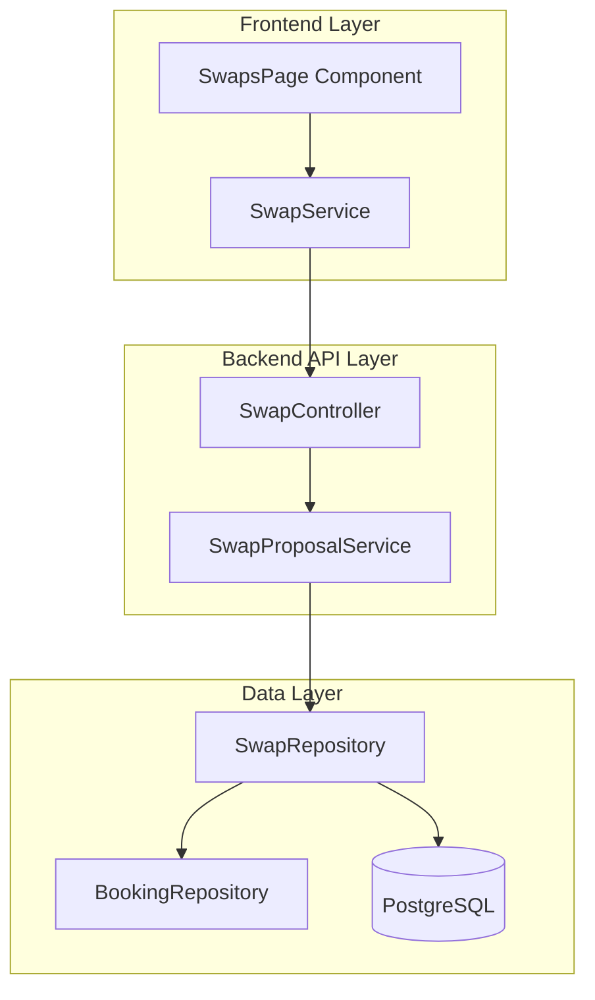

# Design Document

## Overview

This design enhances the user swaps endpoint to include complete booking details, addressing the current issue where users cannot see location, dates, and amounts for their swaps. The solution involves creating a new repository method that joins swap and booking data, updating the service layer to use this enhanced method, and ensuring the frontend receives properly formatted booking information.

## Architecture

The enhancement follows the existing layered architecture:



## Components and Interfaces

### 1. Enhanced SwapRepository Method

**New Method: `findByUserIdWithBookingDetails`**

```typescript
async findByUserIdWithBookingDetails(
  userId: string, 
  limit: number = 100, 
  offset: number = 0
): Promise<SwapWithBookingDetails[]>
```

This method will:
- Join the swaps table with bookings table for both source and target bookings
- Return enriched swap data with embedded booking details
- Handle cases where target booking might be null (for open swaps)
- Use LEFT JOINs to ensure swaps are returned even if booking details are missing

**Database Query Structure:**
```sql
SELECT 
  s.*,
  sb.id as source_booking_id,
  sb.title as source_booking_title,
  sb.city as source_booking_city,
  sb.country as source_booking_country,
  sb.check_in_date as source_booking_check_in,
  sb.check_out_date as source_booking_check_out,
  sb.original_price as source_booking_original_price,
  sb.swap_value as source_booking_swap_value,
  tb.id as target_booking_id,
  tb.title as target_booking_title,
  tb.city as target_booking_city,
  tb.country as target_booking_country,
  tb.check_in_date as target_booking_check_in,
  tb.check_out_date as target_booking_check_out,
  tb.original_price as target_booking_original_price,
  tb.swap_value as target_booking_swap_value
FROM swaps s
LEFT JOIN bookings sb ON s.source_booking_id = sb.id
LEFT JOIN bookings tb ON s.target_booking_id = tb.id
WHERE s.proposer_id = $1 OR s.owner_id = $1
ORDER BY s.created_at DESC
LIMIT $2 OFFSET $3
```

### 2. Enhanced Data Types

**SwapWithBookingDetails Interface:**
```typescript
interface SwapWithBookingDetails extends Swap {
  sourceBooking: BookingDetails | null;
  targetBooking: BookingDetails | null;
}

interface BookingDetails {
  id: string;
  title: string;
  location: {
    city: string;
    country: string;
  };
  dateRange: {
    checkIn: Date;
    checkOut: Date;
  };
  originalPrice: number;
  swapValue: number;
}
```

### 3. Service Layer Updates

**SwapProposalService Enhancement:**

```typescript
async getUserSwapProposalsWithBookingDetails(
  userId: string, 
  limit: number = 100, 
  offset: number = 0
): Promise<SwapWithBookingDetails[]>
```

This method will:
- Call the new repository method
- Apply any business logic transformations
- Handle error cases gracefully
- Maintain backward compatibility

### 4. Controller Layer Updates

**SwapController Enhancement:**

The existing `getUserSwaps` method will be updated to:
- Use the new service method when booking details are needed
- Maintain the same API contract for the frontend
- Add proper error handling for booking detail retrieval failures
- Include performance logging for monitoring

### 5. Frontend Integration

The existing frontend code in `SwapsPage.tsx` already expects booking details in the response, so minimal changes are needed:

- The `loadSwaps()` method will receive properly formatted data
- Remove the client-side `enrichSwapsWithBookingDetails()` method as it will be redundant
- Simplify the data transformation logic since booking details will come from the backend

## Data Models

### Database Schema Considerations

No schema changes are required as we're using existing tables:
- `swaps` table (existing)
- `bookings` table (existing)

The enhancement uses JOINs to combine data from these existing tables.

### Response Format

The API response will maintain the same structure but with enriched data:

```json
{
  "success": true,
  "data": {
    "swaps": [
      {
        "id": "swap-123",
        "sourceBookingId": "booking-456",
        "targetBookingId": "booking-789",
        "status": "pending",
        "sourceBooking": {
          "id": "booking-456",
          "title": "Paris Hotel Suite",
          "location": {
            "city": "Paris",
            "country": "France"
          },
          "dateRange": {
            "checkIn": "2024-06-15T00:00:00Z",
            "checkOut": "2024-06-20T00:00:00Z"
          },
          "originalPrice": 1200,
          "swapValue": 1200
        },
        "targetBooking": {
          "id": "booking-789",
          "title": "London Apartment",
          "location": {
            "city": "London",
            "country": "UK"
          },
          "dateRange": {
            "checkIn": "2024-06-15T00:00:00Z",
            "checkOut": "2024-06-20T00:00:00Z"
          },
          "originalPrice": 1100,
          "swapValue": 1100
        }
      }
    ],
    "pagination": {
      "limit": 100,
      "offset": 0,
      "total": 1
    }
  }
}
```

## Error Handling

### Database Level
- Handle cases where bookings are soft-deleted or missing
- Use LEFT JOINs to ensure swaps are returned even with missing booking data
- Provide null values for missing booking details rather than failing the query

### Service Level
- Log warnings when booking details cannot be retrieved
- Provide fallback values for missing booking information
- Maintain partial functionality when some booking details are unavailable

### API Level
- Return partial data with indicators for missing information
- Include error details in response metadata when appropriate
- Maintain consistent response format even with partial failures

### Frontend Level
- Display fallback text for missing booking details
- Show loading states appropriately
- Handle cases where booking details are null or incomplete

## Testing Strategy

### Unit Tests
- Test the new repository method with various scenarios
- Test service layer with mocked repository responses
- Test controller with mocked service responses
- Test error handling at each layer

### Integration Tests
- Test the complete flow from API endpoint to database
- Test with real database data including edge cases
- Test performance with large datasets
- Test error scenarios with missing or corrupted data

### End-to-End Tests
- Test the complete user flow from frontend to backend
- Verify that booking details display correctly in the UI
- Test various swap states and booking combinations
- Verify consistent formatting across different scenarios

### Performance Tests
- Measure query performance with the new JOIN operations
- Test with large numbers of swaps and bookings
- Verify response times meet the 2-second requirement
- Monitor database query execution plans