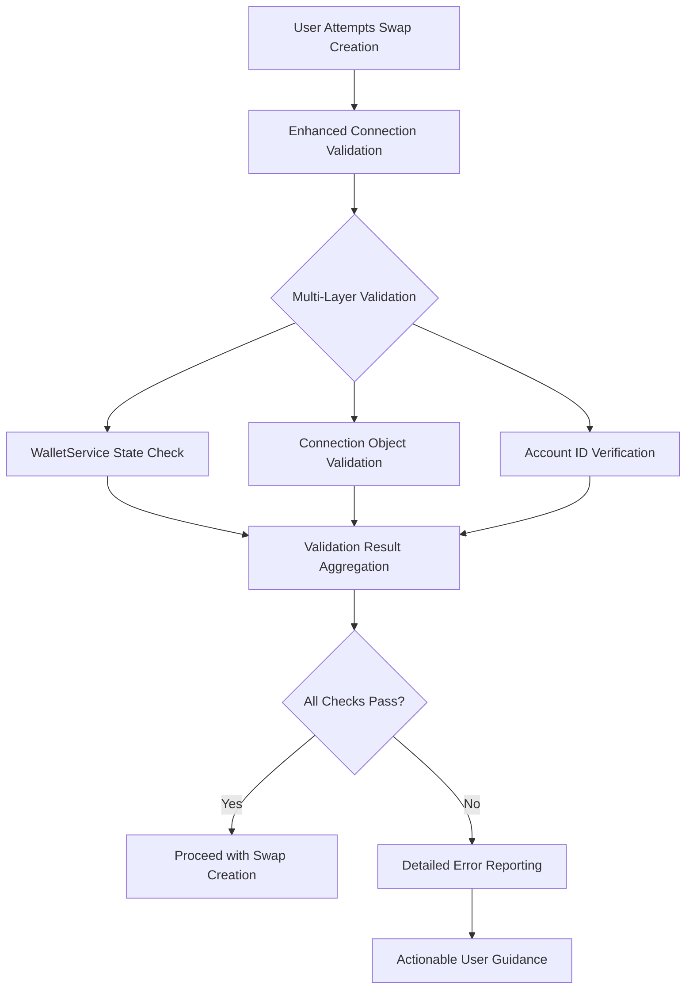

# Design Document

## Overview

This design addresses the wallet validation failure issue by implementing robust connection detection, improved error handling, and better synchronization between wallet service state and validation logic. The solution focuses on fixing the existing validation service rather than rebuilding it, ensuring compatibility with the current implementation.

## Architecture

### Problem Analysis
The current issue stems from several factors:
1. **Inconsistent Connection Checking**: Multiple validation points that may not align
2. **Mock Service Limitations**: The mock wallet service may not properly simulate connection states
3. **State Synchronization Issues**: UI state and validation state may be out of sync
4. **Insufficient Error Diagnostics**: Limited visibility into why validation fails

### Solution Approach


## Components and Interfaces

### 1. Enhanced Wallet Connection Validator

#### WalletConnectionValidator
**Location:** `apps/frontend/src/services/wallet/WalletConnectionValidator.ts`

```typescript
interface WalletConnectionValidator {
  validateConnection(): Promise<DetailedConnectionValidation>
  performHealthCheck(): Promise<ConnectionHealthStatus>
  getDiagnostics(): ConnectionDiagnostics
  isConnectionStable(): boolean
}

interface DetailedConnectionValidation {
  isValid: boolean
  checks: ValidationCheck[]
  primaryError?: string
  diagnostics: ConnectionDiagnostics
  recommendations: string[]
}

interface ValidationCheck {
  name: string
  passed: boolean
  details: string
  critical: boolean
}
```

**Validation Checks:**
1. **Service State Check**: Verify `walletService.isConnected()` returns true
2. **Connection Object Check**: Ensure `getConnection()` returns valid object
3. **Account ID Check**: Verify account ID is present and properly formatted
4. **Connection Stability Check**: Ensure connection hasn't recently changed state

### 2. Enhanced WalletValidationService

#### Updated validateWalletConnection Method
**Location:** `apps/frontend/src/services/wallet/WalletValidationService.ts`

```typescript
async validateWalletConnection(): Promise<WalletConnectionValidation> {
  const validator = new WalletConnectionValidator()
  const detailedValidation = await validator.validateConnection()
  
  // Enhanced logging for debugging
  console.log('Detailed wallet validation:', detailedValidation)
  
  if (!detailedValidation.isValid) {
    return {
      isConnected: false,
      errorMessage: this.formatConnectionError(detailedValidation),
      diagnostics: detailedValidation.diagnostics
    }
  }
  
  return {
    isConnected: true,
    walletAddress: detailedValidation.diagnostics.accountId
  }
}
```

### 3. Connection State Monitor

#### WalletStateMonitor
**Location:** `apps/frontend/src/services/wallet/WalletStateMonitor.ts`

```typescript
interface WalletStateMonitor {
  startMonitoring(): void
  stopMonitoring(): void
  getCurrentState(): WalletState
  onStateChange(callback: (state: WalletState) => void): void
}

interface WalletState {
  isConnected: boolean
  accountId?: string
  lastValidated: Date
  stateChanges: StateChange[]
  isStable: boolean
}
```

**Responsibilities:**
- Monitor wallet connection state changes
- Detect connection instability
- Provide state history for debugging
- Trigger validation updates when state changes

## Data Models

### Enhanced Validation Types

#### ConnectionDiagnostics
```typescript
interface ConnectionDiagnostics {
  timestamp: Date
  walletServiceConnected: boolean
  connectionObjectExists: boolean
  accountId?: string
  connectionType: 'mock' | 'real'
  lastStateChange?: Date
  validationHistory: ValidationAttempt[]
}

interface ValidationAttempt {
  timestamp: Date
  success: boolean
  error?: string
  checks: ValidationCheck[]
}
```

#### Enhanced Error Information
```typescript
interface WalletConnectionValidation {
  isConnected: boolean
  walletAddress?: string
  errorMessage?: string
  diagnostics?: ConnectionDiagnostics
  recommendations?: string[]
  canRetry: boolean
}
```

## Error Handling

### Enhanced Error Categories

#### 1. Service State Errors
- **SERVICE_NOT_INITIALIZED**: Wallet service not properly initialized
- **SERVICE_DISCONNECTED**: Service reports disconnected state
- **SERVICE_ERROR**: Service encountered an error

#### 2. Connection Object Errors
- **CONNECTION_NULL**: Connection object is null or undefined
- **CONNECTION_INVALID**: Connection object exists but is malformed
- **ACCOUNT_MISSING**: Connection exists but no account information

#### 3. State Synchronization Errors
- **STATE_MISMATCH**: UI state doesn't match service state
- **RECENT_STATE_CHANGE**: Connection state changed recently and may be unstable
- **VALIDATION_TIMEOUT**: Validation took too long to complete

### Detailed Error Messages

#### Service State Error
```
🔗 Wallet Service Connection Issue

The wallet service is not reporting a proper connection state.

Diagnostic Details:
- Service Connected: false
- Connection Object: exists
- Account ID: missing

This usually indicates a wallet provider issue or incomplete connection process.

Recommendations:
1. Try disconnecting and reconnecting your wallet
2. Refresh the page and reconnect
3. Check if your wallet extension is unlocked
```

#### Connection Object Error
```
⚠️ Wallet Connection Data Issue

Your wallet appears connected but connection information is incomplete.

Diagnostic Details:
- Service Connected: true
- Connection Object: invalid
- Account ID: 0.0.123456
- Last Validation: 2 seconds ago

This may be a temporary issue with wallet data synchronization.

Recommendations:
1. Wait a moment and try again
2. Refresh your wallet connection
3. Check your wallet extension status
```

## Implementation Strategy

### Phase 1: Enhanced Connection Validation

#### 1.1 Create WalletConnectionValidator
- Implement multi-layer validation checks
- Add comprehensive diagnostics collection
- Create detailed error reporting

#### 1.2 Update WalletValidationService
- Integrate new validator into existing service
- Enhance error messages with diagnostics
- Add retry logic for temporary failures

#### 1.3 Add Connection State Monitoring
- Implement state change detection
- Add connection stability checking
- Create validation history tracking

### Phase 2: Improved Error Handling

#### 2.1 Enhanced Error Display
- Update WalletValidationErrorDisplay with new error types
- Add diagnostic information display
- Implement actionable recommendations

#### 2.2 Debug Information
- Add detailed logging for troubleshooting
- Create diagnostic export functionality
- Implement validation attempt history

### Phase 3: Mock Service Improvements

#### 3.1 Enhanced Mock Behavior
- Improve mock wallet service to better simulate real connections
- Add configurable connection states for testing
- Implement proper state transitions

#### 3.2 Testing Infrastructure
- Create test scenarios for different connection states
- Add validation testing with various error conditions
- Implement automated connection state testing

## Testing Strategy

### Unit Tests

#### WalletConnectionValidator Tests
- Test each validation check independently
- Test error condition handling
- Test diagnostic information collection

#### Enhanced WalletValidationService Tests
- Test integration with new validator
- Test error message formatting
- Test retry logic and timeout handling

### Integration Tests

#### Connection State Scenarios
1. **Normal Connection**: Wallet properly connected and stable
2. **Recent Connection**: Wallet just connected, may be unstable
3. **Partial Connection**: Service connected but missing account data
4. **Mock vs Real**: Different behavior between mock and real implementations

#### Error Recovery Testing
- Test automatic retry after connection issues
- Test user-initiated retry functionality
- Test connection recovery after temporary failures

### User Experience Tests

#### Error Message Clarity
- Verify error messages provide actionable guidance
- Test diagnostic information usefulness
- Ensure recommendations are relevant to actual issues

#### Connection Flow Testing
- Test wallet connection and validation flow
- Verify state synchronization across components
- Test real-time validation updates

## Security Considerations

### Validation Security
- **Multiple Validation Layers**: Don't rely on single validation point
- **State Verification**: Verify connection state through multiple methods
- **Timeout Protection**: Prevent hanging validation attempts

### Privacy Protection
- **Diagnostic Data**: Ensure diagnostic logs don't expose sensitive information
- **Account Information**: Hash or truncate account IDs in logs
- **Error Details**: Balance helpful information with privacy protection

## Monitoring and Debugging

### Diagnostic Information
- **Connection State History**: Track connection state changes over time
- **Validation Attempt Log**: Record all validation attempts with results
- **Error Pattern Detection**: Identify common validation failure patterns

### Debug Tools
- **Validation Status Panel**: Show current validation state and history
- **Connection Diagnostics Export**: Export diagnostic data for support
- **Real-time Validation Monitoring**: Live view of validation checks

## Backward Compatibility

### Existing Integration Points
- **EnhancedSwapCreationModal**: Maintain existing validation integration
- **WalletValidationErrorDisplay**: Enhance without breaking existing functionality
- **Validation Service API**: Extend rather than replace existing methods

### Migration Strategy
- **Gradual Enhancement**: Add new validation alongside existing logic
- **Fallback Behavior**: Maintain existing behavior if new validation fails
- **Configuration Options**: Allow enabling/disabling enhanced validation

This design provides a comprehensive solution to the wallet validation issues while maintaining compatibility with the existing system and providing better debugging capabilities for future issues.