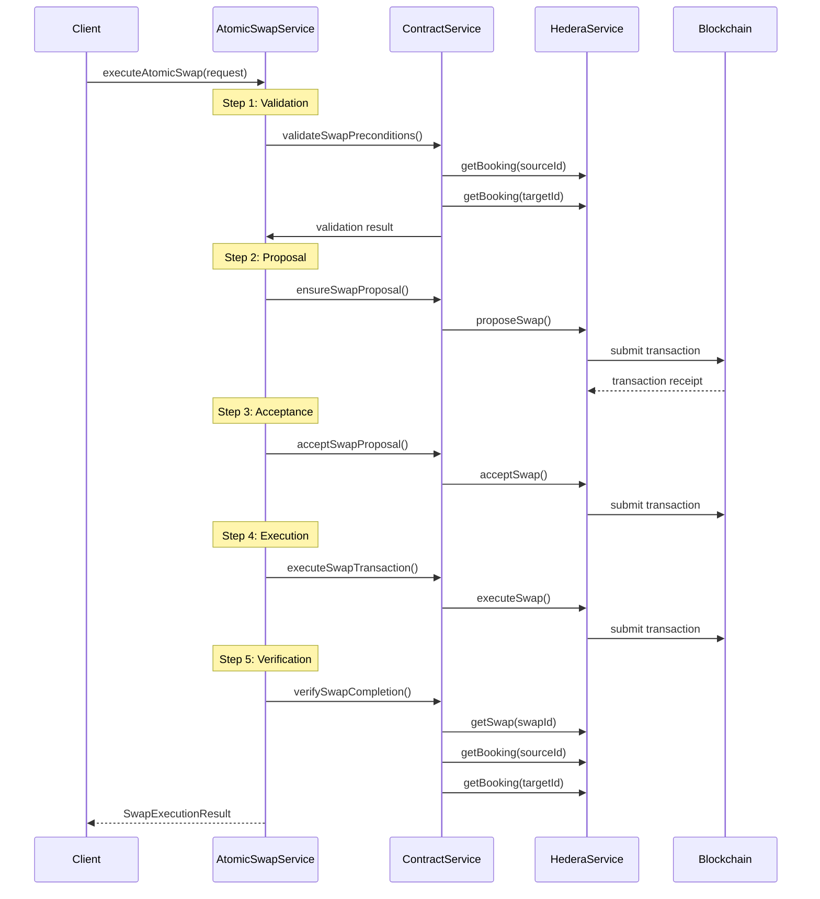

# Atomic Swap Service

The Atomic Swap Service orchestrates complete booking swap transactions with comprehensive error handling, rollback mechanisms, and blockchain verification. This service ensures that booking swaps are executed atomically - either both bookings are successfully exchanged, or the entire transaction is rolled back to the original state.

## Overview

The atomic swap implementation provides:

- **Atomic Execution**: All-or-nothing swap transactions
- **Comprehensive Validation**: Pre-execution validation of all swap conditions
- **Automatic Rollback**: Failed swaps are automatically rolled back
- **Blockchain Verification**: All transactions are verified on Hedera blockchain
- **Error Recovery**: Robust error handling and recovery mechanisms
- **Execution Monitoring**: Real-time tracking of swap execution progress

## Architecture

### Core Components

1. **AtomicSwapService**: Main orchestration service
2. **BlockchainVerificationService**: Transaction verification and monitoring
3. **ContractService**: Smart contract interaction layer
4. **HederaService**: Low-level Hedera blockchain integration

### Execution Flow



## Usage

### Basic Atomic Swap

```typescript
import { AtomicSwapService, SwapExecutionRequest } from '../services/swap';
import { HederaService, ContractService } from '../services/hedera';

// Initialize services
const hederaService = new HederaService('testnet', accountId, privateKey);
const contractService = new ContractService(hederaService, contractId);
const atomicSwapService = new AtomicSwapService(hederaService, contractService);

// Create swap request
const swapRequest: SwapExecutionRequest = {
  swapId: 'swap_123',
  sourceBookingId: 'booking_456',
  targetBookingId: 'booking_789',
  proposerAccountId: '0.0.123456',
  acceptorAccountId: '0.0.789012',
  additionalPayment: 1000000, // 1 HBAR in tinybars
  expirationTime: Math.floor(Date.now() / 1000) + 3600 // 1 hour
};

// Execute atomic swap
const result = await atomicSwapService.executeAtomicSwap(swapRequest);

if (result.success) {
  console.log('Swap completed:', result.transactionId);
} else {
  console.log('Swap failed:', result.error);
  if (result.rollbackTransactionId) {
    console.log('Rollback executed:', result.rollbackTransactionId);
  }
}
```

### Monitoring Swap Execution

```typescript
// Check active swaps
const activeSwaps = atomicSwapService.getActiveSwaps();
console.log(`Active swaps: ${activeSwaps.length}`);

// Get specific swap status
const swapStatus = atomicSwapService.getSwapExecutionStatus('swap_123');
if (swapStatus) {
  console.log(`Current step: ${swapStatus.currentStep}`);
  console.log(`Transaction IDs: ${swapStatus.transactionIds}`);
}

// Cancel active swap
const cancelled = await atomicSwapService.cancelSwapExecution('swap_123');
console.log(`Swap cancelled: ${cancelled}`);
```

### Blockchain Verification

```typescript
import { BlockchainVerificationService } from '../services/hedera';

const verificationService = new BlockchainVerificationService(hederaService);

// Verify single transaction
const verification = await verificationService.verifyTransaction('0.0.123456@1234567890.123456789');
console.log(`Transaction valid: ${verification.isValid}`);

// Verify complete swap
const swapVerification = await verificationService.verifySwapTransactions('swap_123', {
  proposalTxId: 'tx_1',
  acceptanceTxId: 'tx_2',
  executionTxId: 'tx_3'
});
console.log(`All transactions valid: ${swapVerification.allTransactionsValid}`);
```

## API Reference

### SwapExecutionRequest

```typescript
interface SwapExecutionRequest {
  swapId: string;                    // Unique swap identifier
  sourceBookingId: string;           // Proposer's booking ID
  targetBookingId: string;           // Target booking ID
  proposerAccountId: string;         // Proposer's Hedera account ID
  acceptorAccountId: string;         // Acceptor's Hedera account ID
  additionalPayment?: number;        // Additional payment in tinybars
  expirationTime: number;            // Unix timestamp for expiration
}
```

### SwapExecutionResult

```typescript
interface SwapExecutionResult {
  success: boolean;                  // Whether swap completed successfully
  swapId: string;                    // Swap identifier
  transactionId?: string;            // Final transaction ID
  consensusTimestamp?: string;       // Blockchain consensus timestamp
  error?: string;                    // Error message if failed
  rollbackTransactionId?: string;    // Rollback transaction ID if applicable
}
```

### SwapExecutionContext

```typescript
interface SwapExecutionContext {
  swapId: string;                    // Swap identifier
  currentStep: SwapExecutionStep;    // Current execution step
  transactionIds: string[];          // All transaction IDs
  startTime: Date;                   // Execution start time
  error?: Error;                     // Error if occurred
  rollbackRequired: boolean;         // Whether rollback is needed
}
```

## Error Handling

### Validation Errors

The service validates all preconditions before execution:

- Booking existence and ownership
- Booking lock status
- Account balances
- Expiration times
- Contract state

```typescript
// Validation errors are returned in the result
if (!result.success && result.error?.includes('validation failed')) {
  console.log('Swap validation failed - check booking details');
}
```

### Transaction Failures

Failed transactions trigger automatic rollback:

```typescript
if (!result.success && result.rollbackTransactionId) {
  console.log('Transaction failed, rollback executed');
  
  // Verify rollback success
  const rollbackVerification = await verificationService.verifyTransaction(
    result.rollbackTransactionId
  );
  console.log(`Rollback successful: ${rollbackVerification.isValid}`);
}
```

### Network Issues

Network connectivity problems are handled gracefully:

```typescript
try {
  const result = await atomicSwapService.executeAtomicSwap(request);
} catch (error) {
  if (error.message.includes('network')) {
    console.log('Network issue - retry later');
  }
}
```

## Execution Steps

### 1. Validation Phase

- Verify booking existence and ownership
- Check booking lock status
- Validate account balances
- Confirm expiration times
- Validate contract state

### 2. Proposal Phase

- Create swap proposal if not exists
- Lock both bookings
- Record proposal on blockchain
- Set expiration timer

### 3. Acceptance Phase

- Accept the swap proposal
- Update swap status to LOCKED
- Prepare for execution

### 4. Execution Phase

- Execute atomic swap transaction
- Transfer booking ownership
- Process additional payments
- Deduct platform fees
- Unlock bookings

### 5. Verification Phase

- Verify swap completion on blockchain
- Confirm ownership transfers
- Validate booking unlock status
- Check final swap state

## Rollback Mechanisms

### Automatic Rollback

Rollback is triggered automatically when:

- Transaction execution fails
- Network timeouts occur
- Contract state becomes invalid
- Validation fails after proposal

### Rollback Process

1. Cancel the swap proposal
2. Unlock both bookings
3. Refund additional payments
4. Record rollback transaction
5. Update swap status to CANCELLED

### Manual Rollback

```typescript
// Cancel active swap execution
const cancelled = await atomicSwapService.cancelSwapExecution('swap_123');

if (cancelled) {
  console.log('Swap execution cancelled and rolled back');
}
```

## Performance Considerations

### Gas Optimization

Default gas limits are optimized for each operation:

- Proposal: 400,000 gas
- Acceptance: 200,000 gas
- Execution: 500,000 gas
- Cancellation: 300,000 gas

### Caching

The verification service includes caching:

- Transaction results cached for 5 minutes
- Automatic cache cleanup
- Configurable cache size limits

### Batch Operations

For multiple swaps:

```typescript
// Process multiple swaps concurrently
const swapPromises = swapRequests.map(request => 
  atomicSwapService.executeAtomicSwap(request)
);

const results = await Promise.allSettled(swapPromises);
```

## Monitoring and Logging

### Execution Tracking

```typescript
// Monitor active executions
setInterval(() => {
  const activeSwaps = atomicSwapService.getActiveSwaps();
  console.log(`Active swaps: ${activeSwaps.length}`);
  
  activeSwaps.forEach(swap => {
    console.log(`${swap.swapId}: ${swap.currentStep}`);
  });
}, 10000); // Every 10 seconds
```

### Cleanup Tasks

```typescript
// Periodic cleanup of expired executions
setInterval(() => {
  const cleaned = atomicSwapService.cleanupExpiredExecutions(3600000); // 1 hour
  if (cleaned > 0) {
    console.log(`Cleaned up ${cleaned} expired swap executions`);
  }
}, 300000); // Every 5 minutes
```

### Logging

All operations are logged with structured data:

```json
{
  "level": "info",
  "message": "Atomic swap completed successfully",
  "swapId": "swap_123",
  "transactionId": "0.0.123456@1234567890.123456789",
  "duration": 45000,
  "timestamp": "2024-01-01T12:00:00.000Z"
}
```

## Testing

### Integration Tests

Run with Hedera testnet credentials:

```bash
export HEDERA_ACCOUNT_ID="0.0.123456"
export HEDERA_PRIVATE_KEY="302e020100..."
npm run test:integration -- AtomicSwapService
```

### Unit Tests

Run with mocked services:

```bash
npm run test -- AtomicSwapService
```

### Example Scripts

```bash
# Run complete example
tsx src/services/swap/examples/atomic-swap-example.ts

# Run validation example only
tsx src/services/swap/examples/atomic-swap-example.ts --validation

# Run monitoring example only
tsx src/services/swap/examples/atomic-swap-example.ts --monitoring
```

## Security Considerations

### Transaction Security

- All transactions signed with private keys
- Multi-step validation before execution
- Automatic rollback on failures
- Blockchain verification of all operations

### Access Control

- Swap participants verified by account ownership
- Booking ownership validated before operations
- Expiration times enforced
- Platform fee deduction secured

### Error Recovery

- Comprehensive error handling
- Automatic rollback mechanisms
- Transaction verification
- State consistency checks

## Future Enhancements

### Planned Features

- **Multi-party Swaps**: Support for complex multi-booking swaps
- **Partial Swaps**: Allow partial booking exchanges
- **Scheduled Swaps**: Time-delayed swap execution
- **Swap Templates**: Reusable swap configurations
- **Advanced Monitoring**: Real-time swap analytics
- **Batch Processing**: Efficient bulk swap operations

### Performance Improvements

- **Transaction Batching**: Combine multiple operations
- **Parallel Processing**: Concurrent swap execution
- **Optimistic Updates**: Faster UI feedback
- **Caching Strategies**: Improved response times