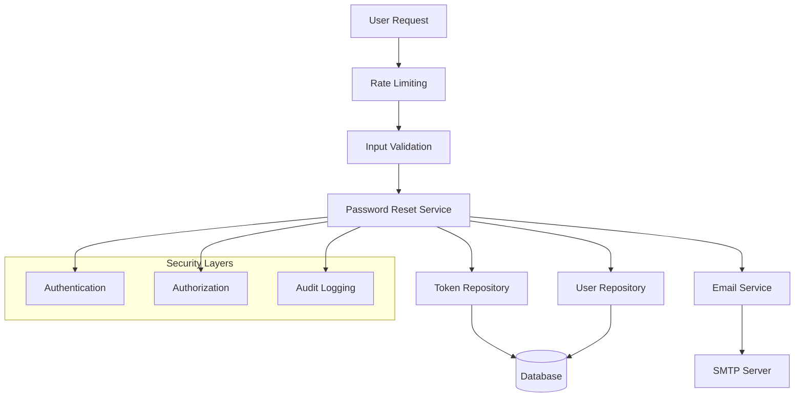

# Password Recovery System

## Overview

The Password Recovery System is a secure, production-ready implementation that allows users to reset their forgotten passwords through email verification. It implements industry best practices for security, user experience, and operational reliability.

## 🚀 Quick Start

### For Developers
1. **API Integration**: Start with the [API Documentation](./PASSWORD_RECOVERY_API.md)
2. **Configuration**: Review [Configuration Guide](./PASSWORD_RESET_CONFIGURATION.md)
3. **Security**: Understand [Security Requirements](./PASSWORD_RECOVERY_SECURITY.md)

### For DevOps/Operations
1. **Deployment**: Follow the [Deployment Guide](./PASSWORD_RECOVERY_DEPLOYMENT.md)
2. **Configuration**: Set up [Email Service Configuration](./PASSWORD_RECOVERY_DEPLOYMENT.md#step-3-email-service-configuration)
3. **Monitoring**: Implement [Monitoring and Alerting](./PASSWORD_RECOVERY_DEPLOYMENT.md#step-6-monitoring-and-logging)

### For Security Teams
1. **Security Review**: Read the [Security Guide](./PASSWORD_RECOVERY_SECURITY.md)
2. **Threat Model**: Review [Threat Assessment](./PASSWORD_RECOVERY_SECURITY.md#threat-model)
3. **Best Practices**: Follow [Security Best Practices](./PASSWORD_RECOVERY_BEST_PRACTICES.md#security-best-practices)

## 📋 Features

### Core Functionality
- ✅ **Secure Password Reset**: Email-based password reset with cryptographically secure tokens
- ✅ **Rate Limiting**: Multi-layer rate limiting to prevent abuse
- ✅ **Email Security**: SPF/DKIM/DMARC support with secure email templates
- ✅ **Session Management**: Automatic session invalidation after password reset
- ✅ **Token Security**: Single-use tokens with configurable expiration

### Security Features
- ✅ **Email Enumeration Prevention**: Consistent responses regardless of email existence
- ✅ **Brute Force Protection**: Rate limiting and account lockout mechanisms
- ✅ **Input Validation**: Comprehensive validation and sanitization
- ✅ **Audit Logging**: Security event logging and monitoring
- ✅ **HTTPS Enforcement**: Secure communication channels

### Operational Features
- ✅ **Monitoring**: Comprehensive metrics and alerting
- ✅ **Performance Optimization**: Database indexing and query optimization
- ✅ **Error Handling**: Graceful error handling and recovery
- ✅ **Configuration Validation**: Startup validation of all settings
- ✅ **Health Checks**: Application and dependency health monitoring

## 🏗️ Architecture



## 📚 Documentation

### Complete Documentation Index
See [Documentation Index](./PASSWORD_RECOVERY_DOCUMENTATION_INDEX.md) for a comprehensive overview of all available documentation.

### Core Documents
| Document | Purpose | Audience |
|----------|---------|----------|
| [API Documentation](./PASSWORD_RECOVERY_API.md) | Complete API reference | Developers |
| [Deployment Guide](./PASSWORD_RECOVERY_DEPLOYMENT.md) | Production deployment | DevOps |
| [Security Guide](./PASSWORD_RECOVERY_SECURITY.md) | Security implementation | Security Engineers |
| [Best Practices](./PASSWORD_RECOVERY_BEST_PRACTICES.md) | Development guidelines | Development Teams |
| [Configuration Guide](./PASSWORD_RESET_CONFIGURATION.md) | Environment setup | DevOps/Developers |

### Quick Reference
| Task | Documentation | Key Section |
|------|---------------|-------------|
| API Integration | [API Docs](./PASSWORD_RECOVERY_API.md) | [Endpoints](./PASSWORD_RECOVERY_API.md#endpoints) |
| Production Deploy | [Deployment](./PASSWORD_RECOVERY_DEPLOYMENT.md) | [Deployment Steps](./PASSWORD_RECOVERY_DEPLOYMENT.md#deployment-steps) |
| Email Setup | [Configuration](./PASSWORD_RESET_CONFIGURATION.md) | [Email Providers](./PASSWORD_RESET_CONFIGURATION.md#email-provider-examples) |
| Security Review | [Security](./PASSWORD_RECOVERY_SECURITY.md) | [Threat Model](./PASSWORD_RECOVERY_SECURITY.md#threat-model) |
| Troubleshooting | [Deployment](./PASSWORD_RECOVERY_DEPLOYMENT.md) | [Troubleshooting](./PASSWORD_RECOVERY_DEPLOYMENT.md#troubleshooting) |

## 🔧 Configuration

### Environment Variables
```bash
# Core Settings
NODE_ENV=production
JWT_SECRET=your-secure-jwt-secret-64-characters-minimum
FRONTEND_URL=https://your-domain.com

# Email Configuration
SMTP_HOST=smtp.your-provider.com
SMTP_PORT=587
SMTP_USER=your-smtp-username
SMTP_PASS=your-smtp-password
SMTP_FROM_EMAIL=noreply@your-domain.com

# Security Settings
PASSWORD_RESET_TOKEN_EXPIRATION_HOURS=1
PASSWORD_RESET_MAX_REQUESTS_PER_HOUR=3
```

For complete configuration options, see the [Configuration Guide](./PASSWORD_RESET_CONFIGURATION.md).

## 🔒 Security

### Security Highlights
- **Token Security**: 256-bit cryptographically secure tokens
- **Rate Limiting**: 3 requests per email per hour (configurable)
- **Email Security**: No enumeration attacks, secure templates
- **Session Security**: All sessions invalidated on password reset
- **Input Validation**: Comprehensive validation and sanitization

### Security Checklist
- [ ] HTTPS enforced for all reset links
- [ ] SMTP configured with STARTTLS/SSL
- [ ] Rate limiting configured and tested
- [ ] Email authentication (SPF/DKIM/DMARC) configured
- [ ] Security monitoring and alerting enabled
- [ ] Regular security audits scheduled

For detailed security information, see the [Security Guide](./PASSWORD_RECOVERY_SECURITY.md).

## 📊 Monitoring

### Key Metrics
- **Success Rate**: Password reset completion rate
- **Email Delivery**: Email delivery success rate
- **Response Time**: API response times
- **Security Events**: Rate limiting and security violations
- **Error Rate**: System error rates

### Health Checks
```bash
# Application health
GET /health

# Password reset specific health
GET /api/auth/password-reset/health

# Configuration validation
GET /api/monitoring/config-summary
```

For complete monitoring setup, see the [Deployment Guide](./PASSWORD_RECOVERY_DEPLOYMENT.md#step-6-monitoring-and-logging).

## 🧪 Testing

### Test Coverage
- ✅ **Unit Tests**: Service layer and business logic
- ✅ **Integration Tests**: End-to-end password reset flow
- ✅ **Security Tests**: Rate limiting, input validation, token security
- ✅ **Performance Tests**: Load testing and optimization
- ✅ **API Tests**: All endpoints and error conditions

### Running Tests
```bash
# Unit tests
npm test

# Integration tests
npm run test:integration

# Security tests
npm run test:security

# Performance tests
npm run test:performance
```

## 🚨 Troubleshooting

### Common Issues

#### Email Not Sending
1. Check SMTP configuration and credentials
2. Verify firewall allows SMTP traffic (port 587/465)
3. Check email service provider status
4. Review application logs for email errors

#### Rate Limiting Issues
1. Check rate limiting configuration
2. Verify Redis/cache connectivity
3. Review rate limiting logs
4. Adjust thresholds if needed

#### Token Validation Failures
1. Check token expiration settings
2. Verify database connectivity
3. Review token cleanup job status
4. Check for clock synchronization issues

For detailed troubleshooting, see the [Deployment Guide](./PASSWORD_RECOVERY_DEPLOYMENT.md#troubleshooting).

## 🔄 Maintenance

### Regular Tasks
- **Daily**: Monitor health checks and error rates
- **Weekly**: Review security logs and metrics
- **Monthly**: Update dependencies and security patches
- **Quarterly**: Security audit and performance review

### Backup and Recovery
- Database backups include password reset tokens table
- Email queue backup for failed deliveries
- Configuration backup and version control
- Disaster recovery procedures documented

## 📞 Support

### Getting Help
1. **Documentation**: Check relevant documentation first
2. **Logs**: Review application and security logs
3. **Health Checks**: Verify system health status
4. **Support**: Contact appropriate team based on issue type

### Support Contacts
- **Development Issues**: Development Team
- **Deployment Issues**: DevOps Team
- **Security Issues**: Security Team
- **Emergency**: On-call Engineer

## 🔄 Updates and Changelog

### Version 1.0.0 (Current)
- Initial production release
- Complete password reset functionality
- Comprehensive security implementation
- Full documentation suite
- Monitoring and alerting setup

### Planned Improvements
- Multi-factor authentication integration
- Advanced threat detection
- Performance optimizations
- Enhanced user experience features

## 📄 License and Compliance

### Security Standards
- OWASP Authentication Guidelines
- NIST Password Guidelines
- Industry security best practices

### Privacy Compliance
- GDPR compliance for EU users
- CCPA compliance for California users
- Data retention and deletion policies

### Audit Trail
- All security events logged
- Configuration changes tracked
- Access patterns monitored
- Compliance reports available

---

**Documentation Version**: 1.0  
**Last Updated**: December 2024  
**Maintained By**: Development Team

For the complete documentation index and all available guides, see [Password Recovery Documentation Index](./PASSWORD_RECOVERY_DOCUMENTATION_INDEX.md).