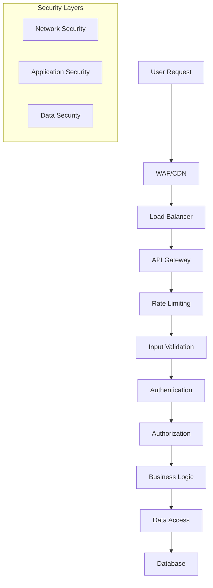

# Password Recovery Security Guide

## Overview

This document outlines comprehensive security considerations, best practices, and implementation guidelines for the password recovery system. It covers threat modeling, security controls, monitoring, and incident response procedures.

## Table of Contents

1. [Threat Model](#threat-model)
2. [Security Architecture](#security-architecture)
3. [Authentication Security](#authentication-security)
4. [Token Security](#token-security)
5. [Email Security](#email-security)
6. [Rate Limiting and Abuse Prevention](#rate-limiting-and-abuse-prevention)
7. [Input Validation and Sanitization](#input-validation-and-sanitization)
8. [Session Management](#session-management)
9. [Monitoring and Logging](#monitoring-and-logging)
10. [Incident Response](#incident-response)
11. [Compliance and Auditing](#compliance-and-auditing)
12. [Security Testing](#security-testing)

## Threat Model

### Threat Actors

#### External Attackers
- **Script Kiddies**: Automated attacks using common tools
- **Organized Criminals**: Sophisticated attacks for financial gain
- **Nation-State Actors**: Advanced persistent threats
- **Competitors**: Industrial espionage attempts

#### Internal Threats
- **Malicious Insiders**: Employees with malicious intent
- **Compromised Accounts**: Legitimate accounts under attacker control
- **Negligent Users**: Unintentional security violations

### Attack Vectors

#### 1. Email Enumeration Attacks
**Description**: Attackers attempt to discover valid email addresses by observing system responses.

**Mitigation**:
- Always return identical success messages regardless of email existence
- Implement consistent response timing
- Log enumeration attempts for monitoring

```javascript
// Secure implementation
async function requestPasswordReset(email) {
  const user = await userRepository.findByEmail(email);
  
  // Always perform the same operations regardless of user existence
  if (user) {
    await createResetToken(user.id);
    await sendResetEmail(email, token);
  } else {
    // Simulate token creation time to prevent timing attacks
    await simulateTokenCreation();
  }
  
  // Always return the same response
  return { 
    success: true, 
    message: "If an account with that email exists, a password reset link has been sent." 
  };
}
```

#### 2. Token Brute Force Attacks
**Description**: Attackers attempt to guess valid reset tokens.

**Mitigation**:
- Use cryptographically secure random token generation
- Implement token format that prevents guessing
- Add rate limiting for token validation attempts
- Use sufficiently long tokens (256 bits minimum)

```javascript
// Secure token generation
const crypto = require('crypto');

function generateSecureToken() {
  // Generate 32 random bytes (256 bits)
  const buffer = crypto.randomBytes(32);
  return buffer.toString('hex'); // 64-character hex string
}
```

#### 3. Timing Attacks
**Description**: Attackers analyze response times to infer information about system state.

**Mitigation**:
- Implement consistent response timing
- Use constant-time comparison for sensitive operations
- Add random delays where appropriate

```javascript
// Constant-time token comparison
const crypto = require('crypto');

function secureTokenCompare(tokenA, tokenB) {
  if (tokenA.length !== tokenB.length) {
    return false;
  }
  
  return crypto.timingSafeEqual(
    Buffer.from(tokenA, 'hex'),
    Buffer.from(tokenB, 'hex')
  );
}
```

#### 4. Rate Limiting Bypass
**Description**: Attackers attempt to bypass rate limiting using various techniques.

**Mitigation**:
- Implement multiple layers of rate limiting
- Use distributed rate limiting for scalability
- Monitor for bypass attempts
- Implement CAPTCHA for suspicious activity

```javascript
// Multi-layer rate limiting
const rateLimitLayers = [
  { key: 'global', limit: 1000, window: '1h' },
  { key: 'ip', limit: 10, window: '1h' },
  { key: 'email', limit: 3, window: '1h' }
];
```

#### 5. Session Hijacking
**Description**: Attackers attempt to hijack user sessions after password reset.

**Mitigation**:
- Invalidate all sessions on password reset
- Use secure session management
- Implement session binding
- Monitor for suspicious session activity

### Risk Assessment Matrix

| Threat | Likelihood | Impact | Risk Level | Mitigation Priority |
|--------|------------|--------|------------|-------------------|
| Email Enumeration | High | Medium | High | Critical |
| Token Brute Force | Medium | High | High | Critical |
| Timing Attacks | Low | Medium | Medium | High |
| Rate Limit Bypass | Medium | Medium | Medium | High |
| Session Hijacking | Low | High | Medium | High |
| SMTP Injection | Low | High | Medium | Medium |
| DoS Attacks | High | Medium | High | High |

## Security Architecture

### Defense in Depth



### Security Controls

#### Preventive Controls
- Input validation and sanitization
- Rate limiting and throttling
- Access controls and authorization
- Secure coding practices
- Encryption at rest and in transit

#### Detective Controls
- Security monitoring and logging
- Intrusion detection systems
- Anomaly detection
- Security information and event management (SIEM)
- Regular security assessments

#### Corrective Controls
- Incident response procedures
- Automated threat response
- Security patches and updates
- Account lockout mechanisms
- Token invalidation procedures

## Authentication Security

### Multi-Factor Authentication Integration

```javascript
// MFA-aware password reset
async function initiatePasswordReset(email, options = {}) {
  const user = await userRepository.findByEmail(email);
  
  if (user && user.mfaEnabled) {
    // Require MFA verification before sending reset email
    const mfaChallenge = await mfaService.createChallenge(user.id);
    return {
      requiresMFA: true,
      challengeId: mfaChallenge.id,
      message: "MFA verification required before password reset"
    };
  }
  
  // Standard password reset flow
  return await standardPasswordReset(email);
}
```

### Account Lockout Protection

```javascript
// Account lockout after failed attempts
const LOCKOUT_THRESHOLD = 5;
const LOCKOUT_DURATION = 30 * 60 * 1000; // 30 minutes

async function handleFailedReset(email) {
  const attempts = await getFailedAttempts(email);
  
  if (attempts >= LOCKOUT_THRESHOLD) {
    await lockAccount(email, LOCKOUT_DURATION);
    await notifySecurityTeam('Account locked due to failed reset attempts', { email });
  }
}
```

## Token Security

### Token Generation Best Practices

#### Cryptographic Requirements
- **Entropy**: Minimum 256 bits of entropy
- **Randomness**: Use cryptographically secure random number generator
- **Uniqueness**: Ensure global uniqueness across all tokens
- **Format**: Use URL-safe encoding

```javascript
const crypto = require('crypto');

class SecureTokenGenerator {
  static generate() {
    // Generate 32 random bytes (256 bits of entropy)
    const randomBytes = crypto.randomBytes(32);
    
    // Convert to URL-safe base64
    return randomBytes.toString('base64url');
  }
  
  static validate(token) {
    // Validate token format
    if (!token || typeof token !== 'string') {
      return false;
    }
    
    // Check length (base64url encoding of 32 bytes = 43 characters)
    if (token.length !== 43) {
      return false;
    }
    
    // Validate base64url format
    const base64urlRegex = /^[A-Za-z0-9_-]+$/;
    return base64urlRegex.test(token);
  }
}
```

### Token Lifecycle Management

#### Token States
1. **Created**: Token generated and stored
2. **Sent**: Token included in email
3. **Validated**: Token checked for validity
4. **Used**: Token consumed for password reset
5. **Expired**: Token past expiration time
6. **Invalidated**: Token manually invalidated

```javascript
class TokenLifecycleManager {
  async createToken(userId, expirationHours = 1) {
    const token = SecureTokenGenerator.generate();
    const expiresAt = new Date(Date.now() + expirationHours * 60 * 60 * 1000);
    
    // Invalidate existing tokens for user
    await this.invalidateUserTokens(userId);
    
    // Create new token
    const tokenRecord = await this.repository.create({
      id: crypto.randomUUID(),
      userId,
      token: await this.hashToken(token), // Store hashed version
      expiresAt,
      status: 'created',
      createdAt: new Date()
    });
    
    // Log token creation
    this.logger.info('Password reset token created', {
      userId,
      tokenId: tokenRecord.id,
      expiresAt
    });
    
    return { token, tokenId: tokenRecord.id };
  }
  
  async validateToken(token) {
    const hashedToken = await this.hashToken(token);
    const tokenRecord = await this.repository.findByToken(hashedToken);
    
    if (!tokenRecord) {
      this.logger.warn('Invalid token validation attempt', { token: token.substring(0, 8) + '...' });
      return { valid: false, reason: 'TOKEN_NOT_FOUND' };
    }
    
    if (tokenRecord.status === 'used') {
      this.logger.warn('Used token validation attempt', { tokenId: tokenRecord.id });
      return { valid: false, reason: 'TOKEN_ALREADY_USED' };
    }
    
    if (new Date() > tokenRecord.expiresAt) {
      this.logger.warn('Expired token validation attempt', { tokenId: tokenRecord.id });
      return { valid: false, reason: 'TOKEN_EXPIRED' };
    }
    
    // Update token status
    await this.repository.updateStatus(tokenRecord.id, 'validated');
    
    return { 
      valid: true, 
      tokenId: tokenRecord.id,
      userId: tokenRecord.userId,
      expiresAt: tokenRecord.expiresAt
    };
  }
  
  async hashToken(token) {
    // Use PBKDF2 for token hashing
    return crypto.pbkdf2Sync(token, process.env.TOKEN_SALT, 10000, 64, 'sha512').toString('hex');
  }
}
```

### Token Storage Security

#### Database Security
- Store only hashed tokens, never plaintext
- Use appropriate indexes for performance
- Implement proper access controls
- Regular cleanup of expired tokens

```sql
-- Secure token table with proper constraints
CREATE TABLE password_reset_tokens (
  id UUID PRIMARY KEY DEFAULT gen_random_uuid(),
  user_id UUID NOT NULL REFERENCES users(id) ON DELETE CASCADE,
  token_hash VARCHAR(128) NOT NULL UNIQUE, -- Hashed token
  expires_at TIMESTAMP WITH TIME ZONE NOT NULL,
  status VARCHAR(20) NOT NULL DEFAULT 'created',
  created_at TIMESTAMP WITH TIME ZONE DEFAULT NOW(),
  used_at TIMESTAMP WITH TIME ZONE,
  
  -- Constraints
  CONSTRAINT valid_status CHECK (status IN ('created', 'sent', 'validated', 'used', 'expired', 'invalidated')),
  CONSTRAINT future_expiration CHECK (expires_at > created_at)
);

-- Security indexes
CREATE INDEX idx_password_reset_tokens_hash ON password_reset_tokens(token_hash);
CREATE INDEX idx_password_reset_tokens_user_status ON password_reset_tokens(user_id, status);
CREATE INDEX idx_password_reset_tokens_expires_at ON password_reset_tokens(expires_at) WHERE status NOT IN ('used', 'invalidated');

-- Row-level security (if supported)
ALTER TABLE password_reset_tokens ENABLE ROW LEVEL SECURITY;
CREATE POLICY password_reset_tokens_policy ON password_reset_tokens
  FOR ALL TO application_user
  USING (expires_at > NOW() AND status NOT IN ('used', 'invalidated'));
```

## Email Security

### SMTP Security Configuration

#### Secure SMTP Settings
```javascript
const nodemailer = require('nodemailer');

const createSecureTransporter = () => {
  return nodemailer.createTransporter({
    host: process.env.SMTP_HOST,
    port: parseInt(process.env.SMTP_PORT) || 587,
    secure: process.env.SMTP_PORT === '465', // true for 465, false for other ports
    auth: {
      user: process.env.SMTP_USER,
      pass: process.env.SMTP_PASS
    },
    tls: {
      // Reject unauthorized certificates
      rejectUnauthorized: true,
      // Minimum TLS version
      minVersion: 'TLSv1.2',
      // Cipher suites
      ciphers: 'ECDHE-RSA-AES256-GCM-SHA512:DHE-RSA-AES256-GCM-SHA512'
    },
    // Connection timeout
    connectionTimeout: 10000,
    // Socket timeout
    socketTimeout: 10000,
    // Pool configuration
    pool: true,
    maxConnections: 5,
    maxMessages: 100
  });
};
```

### Email Content Security

#### Template Security
```javascript
const DOMPurify = require('isomorphic-dompurify');
const validator = require('validator');

class SecureEmailTemplate {
  static generatePasswordResetEmail(userData, resetUrl) {
    // Sanitize user data
    const sanitizedName = DOMPurify.sanitize(userData.name || 'User');
    const sanitizedEmail = validator.isEmail(userData.email) ? userData.email : '';
    
    // Validate reset URL
    if (!validator.isURL(resetUrl, { protocols: ['https'] })) {
      throw new Error('Invalid reset URL');
    }
    
    const template = `
      <!DOCTYPE html>
      <html>
      <head>
        <meta charset="utf-8">
        <meta name="viewport" content="width=device-width, initial-scale=1.0">
        <title>Password Reset Request</title>
      </head>
      <body>
        <div style="max-width: 600px; margin: 0 auto; font-family: Arial, sans-serif;">
          <h2>Password Reset Request</h2>
          <p>Hello ${sanitizedName},</p>
          <p>We received a request to reset your password for your account associated with ${sanitizedEmail}.</p>
          
          <div style="margin: 20px 0; padding: 20px; background-color: #f8f9fa; border-left: 4px solid #007bff;">
            <p><strong>Security Notice:</strong></p>
            <ul>
              <li>This link will expire in 1 hour</li>
              <li>Do not share this link with anyone</li>
              <li>If you didn't request this reset, please ignore this email</li>
            </ul>
          </div>
          
          <p>
            <a href="${resetUrl}" 
               style="display: inline-block; padding: 12px 24px; background-color: #007bff; color: white; text-decoration: none; border-radius: 4px;">
              Reset Your Password
            </a>
          </p>
          
          <p>If the button doesn't work, copy and paste this link into your browser:</p>
          <p style="word-break: break-all; color: #666;">${resetUrl}</p>
          
          <hr style="margin: 30px 0; border: none; border-top: 1px solid #eee;">
          <p style="color: #666; font-size: 12px;">
            This email was sent to ${sanitizedEmail}. If you believe this was sent in error, please contact our support team.
          </p>
        </div>
      </body>
      </html>
    `;
    
    return {
      html: template,
      text: this.generateTextVersion(sanitizedName, sanitizedEmail, resetUrl)
    };
  }
  
  static generateTextVersion(name, email, resetUrl) {
    return `
Password Reset Request

Hello ${name},

We received a request to reset your password for your account associated with ${email}.

SECURITY NOTICE:
- This link will expire in 1 hour
- Do not share this link with anyone
- If you didn't request this reset, please ignore this email

Reset your password by visiting this link:
${resetUrl}

This email was sent to ${email}. If you believe this was sent in error, please contact our support team.
    `.trim();
  }
}
```

### Email Authentication

#### SPF, DKIM, and DMARC Configuration

**SPF Record**:
```dns
TXT @ "v=spf1 include:_spf.google.com include:sendgrid.net ~all"
```

**DKIM Configuration**:
```javascript
// DKIM signing with nodemailer
const transporter = nodemailer.createTransporter({
  // ... other config
  dkim: {
    domainName: 'your-domain.com',
    keySelector: 'default',
    privateKey: fs.readFileSync('path/to/dkim-private-key.pem')
  }
});
```

**DMARC Policy**:
```dns
TXT _dmarc "v=DMARC1; p=quarantine; rua=mailto:dmarc-reports@your-domain.com; ruf=mailto:dmarc-failures@your-domain.com; fo=1"
```

## Rate Limiting and Abuse Prevention

### Multi-Layer Rate Limiting

```javascript
class AdvancedRateLimiter {
  constructor(redisClient) {
    this.redis = redisClient;
    this.limits = {
      global: { requests: 1000, window: 3600 }, // 1000 requests per hour globally
      ip: { requests: 10, window: 3600 },       // 10 requests per hour per IP
      email: { requests: 3, window: 3600 },     // 3 requests per hour per email
      user: { requests: 5, window: 3600 }       // 5 requests per hour per user
    };
  }
  
  async checkLimits(identifiers) {
    const checks = [];
    
    // Check global rate limit
    checks.push(this.checkLimit('global', 'global', this.limits.global));
    
    // Check IP-based limit
    if (identifiers.ip) {
      checks.push(this.checkLimit('ip', identifiers.ip, this.limits.ip));
    }
    
    // Check email-based limit
    if (identifiers.email) {
      checks.push(this.checkLimit('email', identifiers.email, this.limits.email));
    }
    
    // Check user-based limit
    if (identifiers.userId) {
      checks.push(this.checkLimit('user', identifiers.userId, this.limits.user));
    }
    
    const results = await Promise.all(checks);
    const blocked = results.find(result => result.blocked);
    
    if (blocked) {
      return {
        allowed: false,
        reason: blocked.reason,
        retryAfter: blocked.retryAfter
      };
    }
    
    return { allowed: true };
  }
  
  async checkLimit(type, identifier, limit) {
    const key = `rate_limit:${type}:${identifier}`;
    const current = await this.redis.get(key);
    
    if (current && parseInt(current) >= limit.requests) {
      const ttl = await this.redis.ttl(key);
      return {
        blocked: true,
        reason: `${type.toUpperCase()}_RATE_LIMIT_EXCEEDED`,
        retryAfter: ttl
      };
    }
    
    // Increment counter
    const multi = this.redis.multi();
    multi.incr(key);
    multi.expire(key, limit.window);
    await multi.exec();
    
    return { blocked: false };
  }
}
```

### Adaptive Rate Limiting

```javascript
class AdaptiveRateLimiter extends AdvancedRateLimiter {
  async checkLimits(identifiers, context = {}) {
    // Adjust limits based on context
    const adjustedLimits = this.adjustLimitsForContext(context);
    
    // Check reputation score
    const reputationScore = await this.getReputationScore(identifiers);
    if (reputationScore < 0.5) {
      adjustedLimits.email.requests = Math.floor(adjustedLimits.email.requests * 0.5);
    }
    
    // Apply time-based adjustments
    const timeMultiplier = this.getTimeBasedMultiplier();
    Object.keys(adjustedLimits).forEach(key => {
      adjustedLimits[key].requests = Math.floor(adjustedLimits[key].requests * timeMultiplier);
    });
    
    this.limits = adjustedLimits;
    return super.checkLimits(identifiers);
  }
  
  adjustLimitsForContext(context) {
    const limits = { ...this.limits };
    
    // Stricter limits during high load
    if (context.systemLoad > 0.8) {
      Object.keys(limits).forEach(key => {
        limits[key].requests = Math.floor(limits[key].requests * 0.7);
      });
    }
    
    // Stricter limits during security incidents
    if (context.securityAlert) {
      Object.keys(limits).forEach(key => {
        limits[key].requests = Math.floor(limits[key].requests * 0.3);
      });
    }
    
    return limits;
  }
  
  getTimeBasedMultiplier() {
    const hour = new Date().getHours();
    
    // Stricter limits during peak hours (9 AM - 5 PM)
    if (hour >= 9 && hour <= 17) {
      return 0.8;
    }
    
    // More lenient during off-hours
    return 1.2;
  }
}
```

## Input Validation and Sanitization

### Comprehensive Input Validation

```javascript
const Joi = require('joi');
const validator = require('validator');
const DOMPurify = require('isomorphic-dompurify');

class InputValidator {
  static passwordResetRequestSchema = Joi.object({
    email: Joi.string()
      .email({ minDomainSegments: 2, tlds: { allow: true } })
      .max(254) // RFC 5321 limit
      .required()
      .custom((value, helpers) => {
        // Additional email validation
        if (!validator.isEmail(value)) {
          return helpers.error('any.invalid');
        }
        
        // Check for suspicious patterns
        if (this.containsSuspiciousPatterns(value)) {
          return helpers.error('any.invalid');
        }
        
        return value.toLowerCase().trim();
      }),
    
    resetBaseUrl: Joi.string()
      .uri({ scheme: ['https'] }) // Only HTTPS in production
      .max(2048) // Reasonable URL length limit
      .required()
      .custom((value, helpers) => {
        // Validate against allowed domains
        const allowedDomains = process.env.ALLOWED_RESET_DOMAINS?.split(',') || [];
        const url = new URL(value);
        
        if (allowedDomains.length > 0 && !allowedDomains.includes(url.hostname)) {
          return helpers.error('any.invalid');
        }
        
        return value;
      })
  });
  
  static resetPasswordSchema = Joi.object({
    token: Joi.string()
      .length(43) // Base64url encoding of 32 bytes
      .pattern(/^[A-Za-z0-9_-]+$/) // Base64url characters only
      .required(),
    
    newPassword: Joi.string()
      .min(8)
      .max(128)
      .required()
      .custom((value, helpers) => {
        // Password strength validation
        const strength = this.calculatePasswordStrength(value);
        if (strength < 3) {
          return helpers.error('password.weak');
        }
        
        // Check against common passwords
        if (this.isCommonPassword(value)) {
          return helpers.error('password.common');
        }
        
        return value;
      })
  });
  
  static containsSuspiciousPatterns(email) {
    const suspiciousPatterns = [
      /[<>'"]/,           // HTML/script injection
      /javascript:/i,      // JavaScript protocol
      /data:/i,           // Data protocol
      /\.\./,             // Path traversal
      /%[0-9a-f]{2}/i,    // URL encoding
      /\x00-\x1f/,        // Control characters
    ];
    
    return suspiciousPatterns.some(pattern => pattern.test(email));
  }
  
  static calculatePasswordStrength(password) {
    let strength = 0;
    
    // Length bonus
    if (password.length >= 8) strength++;
    if (password.length >= 12) strength++;
    
    // Character variety
    if (/[a-z]/.test(password)) strength++;
    if (/[A-Z]/.test(password)) strength++;
    if (/[0-9]/.test(password)) strength++;
    if (/[^a-zA-Z0-9]/.test(password)) strength++;
    
    // Pattern penalties
    if (/(.)\1{2,}/.test(password)) strength--; // Repeated characters
    if (/123|abc|qwe/i.test(password)) strength--; // Sequential patterns
    
    return Math.max(0, strength);
  }
  
  static isCommonPassword(password) {
    // Check against common passwords list
    const commonPasswords = [
      'password', '123456', 'password123', 'admin', 'qwerty',
      'letmein', 'welcome', 'monkey', '1234567890'
    ];
    
    return commonPasswords.some(common => 
      password.toLowerCase().includes(common.toLowerCase())
    );
  }
  
  static sanitizeInput(input) {
    if (typeof input === 'string') {
      // Remove null bytes and control characters
      input = input.replace(/[\x00-\x1f\x7f]/g, '');
      
      // Normalize Unicode
      input = input.normalize('NFC');
      
      // Sanitize HTML
      input = DOMPurify.sanitize(input, { ALLOWED_TAGS: [] });
      
      // Trim whitespace
      input = input.trim();
    }
    
    return input;
  }
}
```

### SQL Injection Prevention

```javascript
class SecureRepository {
  constructor(database) {
    this.db = database;
  }
  
  async findTokenByHash(tokenHash) {
    // Use parameterized queries
    const query = `
      SELECT id, user_id, expires_at, status, created_at
      FROM password_reset_tokens
      WHERE token_hash = $1
        AND status NOT IN ('used', 'invalidated')
        AND expires_at > NOW()
    `;
    
    const result = await this.db.query(query, [tokenHash]);
    return result.rows[0] || null;
  }
  
  async createToken(tokenData) {
    const query = `
      INSERT INTO password_reset_tokens (user_id, token_hash, expires_at, status)
      VALUES ($1, $2, $3, $4)
      RETURNING id, created_at
    `;
    
    const values = [
      tokenData.userId,
      tokenData.tokenHash,
      tokenData.expiresAt,
      'created'
    ];
    
    const result = await this.db.query(query, values);
    return result.rows[0];
  }
}
```

## Session Management

### Secure Session Invalidation

```javascript
class SessionManager {
  constructor(redisClient, jwtService) {
    this.redis = redisClient;
    this.jwt = jwtService;
  }
  
  async invalidateAllUserSessions(userId) {
    try {
      // Get all active sessions for user
      const sessionKeys = await this.redis.keys(`session:${userId}:*`);
      
      if (sessionKeys.length > 0) {
        // Delete all sessions
        await this.redis.del(...sessionKeys);
        
        // Add user to JWT blacklist with expiration
        const jwtExpiration = this.jwt.getMaxExpiration();
        await this.redis.setex(`jwt_blacklist:${userId}`, jwtExpiration, '1');
        
        this.logger.info('All user sessions invalidated', {
          userId,
          sessionCount: sessionKeys.length,
          reason: 'password_reset'
        });
      }
      
      return { invalidated: sessionKeys.length };
    } catch (error) {
      this.logger.error('Failed to invalidate user sessions', {
        userId,
        error: error.message
      });
      throw error;
    }
  }
  
  async isTokenBlacklisted(userId, tokenId) {
    const blacklisted = await this.redis.get(`jwt_blacklist:${userId}`);
    return blacklisted === '1';
  }
  
  async createSecureSession(userId, metadata = {}) {
    const sessionId = crypto.randomUUID();
    const sessionData = {
      userId,
      createdAt: new Date().toISOString(),
      ipAddress: metadata.ipAddress,
      userAgent: metadata.userAgent,
      lastActivity: new Date().toISOString()
    };
    
    // Store session with expiration
    const sessionKey = `session:${userId}:${sessionId}`;
    await this.redis.setex(sessionKey, 24 * 60 * 60, JSON.stringify(sessionData));
    
    return sessionId;
  }
}
```

## Monitoring and Logging

### Security Event Logging

```javascript
class SecurityLogger {
  constructor(logger) {
    this.logger = logger;
  }
  
  logPasswordResetRequest(data) {
    this.logger.info('Password reset requested', {
      event: 'password_reset_request',
      email: this.hashEmail(data.email),
      ipAddress: data.ipAddress,
      userAgent: data.userAgent,
      timestamp: new Date().toISOString(),
      requestId: data.requestId
    });
  }
  
  logPasswordResetSuccess(data) {
    this.logger.info('Password reset completed', {
      event: 'password_reset_success',
      userId: data.userId,
      tokenId: data.tokenId,
      ipAddress: data.ipAddress,
      timestamp: new Date().toISOString(),
      sessionInvalidated: data.sessionInvalidated
    });
  }
  
  logSecurityViolation(data) {
    this.logger.warn('Security violation detected', {
      event: 'security_violation',
      type: data.type,
      severity: data.severity,
      details: data.details,
      ipAddress: data.ipAddress,
      userAgent: data.userAgent,
      timestamp: new Date().toISOString()
    });
  }
  
  logRateLimitExceeded(data) {
    this.logger.warn('Rate limit exceeded', {
      event: 'rate_limit_exceeded',
      limitType: data.limitType,
      identifier: data.identifier,
      currentCount: data.currentCount,
      limit: data.limit,
      ipAddress: data.ipAddress,
      timestamp: new Date().toISOString()
    });
  }
  
  hashEmail(email) {
    // Hash email for privacy while maintaining uniqueness
    return crypto.createHash('sha256').update(email.toLowerCase()).digest('hex').substring(0, 16);
  }
}
```

### Anomaly Detection

```javascript
class AnomalyDetector {
  constructor(redisClient, alertService) {
    this.redis = redisClient;
    this.alerts = alertService;
  }
  
  async detectAnomalies(event) {
    const anomalies = [];
    
    // Check for unusual request patterns
    const requestAnomaly = await this.checkRequestPatterns(event);
    if (requestAnomaly) anomalies.push(requestAnomaly);
    
    // Check for geographic anomalies
    const geoAnomaly = await this.checkGeographicPatterns(event);
    if (geoAnomaly) anomalies.push(geoAnomaly);
    
    // Check for time-based anomalies
    const timeAnomaly = await this.checkTimePatterns(event);
    if (timeAnomaly) anomalies.push(timeAnomaly);
    
    // Alert on anomalies
    if (anomalies.length > 0) {
      await this.alerts.sendSecurityAlert({
        type: 'anomaly_detected',
        anomalies,
        event,
        severity: this.calculateSeverity(anomalies)
      });
    }
    
    return anomalies;
  }
  
  async checkRequestPatterns(event) {
    const key = `request_pattern:${event.ipAddress}`;
    const requests = await this.redis.lrange(key, 0, -1);
    
    // Check for rapid-fire requests
    const recentRequests = requests.filter(req => {
      const timestamp = JSON.parse(req).timestamp;
      return Date.now() - new Date(timestamp).getTime() < 60000; // Last minute
    });
    
    if (recentRequests.length > 10) {
      return {
        type: 'rapid_requests',
        description: 'Unusually high request rate detected',
        count: recentRequests.length,
        timeWindow: '1 minute'
      };
    }
    
    return null;
  }
  
  calculateSeverity(anomalies) {
    const severityMap = {
      rapid_requests: 3,
      geographic_anomaly: 2,
      time_anomaly: 1
    };
    
    const maxSeverity = Math.max(...anomalies.map(a => severityMap[a.type] || 1));
    
    if (maxSeverity >= 3) return 'high';
    if (maxSeverity >= 2) return 'medium';
    return 'low';
  }
}
```

## Incident Response

### Automated Response System

```javascript
class IncidentResponseSystem {
  constructor(services) {
    this.rateLimiter = services.rateLimiter;
    this.sessionManager = services.sessionManager;
    this.alertService = services.alertService;
    this.logger = services.logger;
  }
  
  async handleSecurityIncident(incident) {
    const response = {
      incidentId: crypto.randomUUID(),
      timestamp: new Date().toISOString(),
      type: incident.type,
      severity: incident.severity,
      actions: []
    };
    
    // Automatic response based on incident type
    switch (incident.type) {
      case 'brute_force_attack':
        await this.handleBruteForceAttack(incident, response);
        break;
        
      case 'token_enumeration':
        await this.handleTokenEnumeration(incident, response);
        break;
        
      case 'email_enumeration':
        await this.handleEmailEnumeration(incident, response);
        break;
        
      case 'suspicious_activity':
        await this.handleSuspiciousActivity(incident, response);
        break;
    }
    
    // Log incident response
    this.logger.error('Security incident handled', response);
    
    // Send alerts
    await this.alertService.sendIncidentAlert(response);
    
    return response;
  }
  
  async handleBruteForceAttack(incident, response) {
    // Temporarily block IP address
    await this.rateLimiter.blockIP(incident.ipAddress, 3600); // 1 hour
    response.actions.push({
      action: 'ip_blocked',
      duration: 3600,
      target: incident.ipAddress
    });
    
    // If user account is involved, temporarily lock it
    if (incident.userId) {
      await this.sessionManager.lockAccount(incident.userId, 1800); // 30 minutes
      response.actions.push({
        action: 'account_locked',
        duration: 1800,
        target: incident.userId
      });
    }
  }
  
  async handleTokenEnumeration(incident, response) {
    // Increase rate limiting for token validation
    await this.rateLimiter.adjustLimits('token_validation', 0.1); // 90% reduction
    response.actions.push({
      action: 'rate_limit_adjusted',
      endpoint: 'token_validation',
      reduction: 0.9
    });
    
    // Block suspicious IP
    await this.rateLimiter.blockIP(incident.ipAddress, 7200); // 2 hours
    response.actions.push({
      action: 'ip_blocked',
      duration: 7200,
      target: incident.ipAddress
    });
  }
}
```

### Manual Response Procedures

#### Incident Classification

| Severity | Description | Response Time | Escalation |
|----------|-------------|---------------|------------|
| Critical | Active attack, data breach | Immediate | CISO, Legal |
| High | Attempted breach, system compromise | 15 minutes | Security Team |
| Medium | Suspicious activity, policy violation | 1 hour | Security Lead |
| Low | Anomalous behavior, minor violation | 4 hours | On-call Engineer |

#### Response Playbooks

**Brute Force Attack Response**:
1. Identify attack source and pattern
2. Implement IP blocking
3. Adjust rate limiting
4. Monitor for attack evolution
5. Document incident details
6. Review and update defenses

**Token Compromise Response**:
1. Invalidate all tokens for affected users
2. Force password reset for affected accounts
3. Invalidate all user sessions
4. Investigate compromise source
5. Implement additional monitoring
6. Notify affected users

## Compliance and Auditing

### Regulatory Compliance

#### GDPR Compliance
- **Data Minimization**: Collect only necessary data
- **Purpose Limitation**: Use data only for password reset
- **Storage Limitation**: Automatic token cleanup
- **Right to Erasure**: Token deletion on request
- **Data Protection by Design**: Built-in privacy controls

#### SOC 2 Compliance
- **Security**: Comprehensive security controls
- **Availability**: High availability design
- **Processing Integrity**: Data validation and integrity
- **Confidentiality**: Encryption and access controls
- **Privacy**: Privacy-by-design implementation

### Audit Trail

```javascript
class AuditLogger {
  constructor(database) {
    this.db = database;
  }
  
  async logAuditEvent(event) {
    const auditRecord = {
      id: crypto.randomUUID(),
      timestamp: new Date(),
      eventType: event.type,
      userId: event.userId,
      ipAddress: event.ipAddress,
      userAgent: event.userAgent,
      details: JSON.stringify(event.details),
      result: event.result,
      riskLevel: event.riskLevel || 'low'
    };
    
    await this.db.query(`
      INSERT INTO audit_log (id, timestamp, event_type, user_id, ip_address, user_agent, details, result, risk_level)
      VALUES ($1, $2, $3, $4, $5, $6, $7, $8, $9)
    `, Object.values(auditRecord));
    
    return auditRecord.id;
  }
  
  async generateAuditReport(startDate, endDate) {
    const query = `
      SELECT 
        event_type,
        COUNT(*) as event_count,
        COUNT(DISTINCT user_id) as unique_users,
        COUNT(DISTINCT ip_address) as unique_ips,
        AVG(CASE WHEN result = 'success' THEN 1 ELSE 0 END) as success_rate
      FROM audit_log
      WHERE timestamp BETWEEN $1 AND $2
        AND event_type LIKE 'password_reset%'
      GROUP BY event_type
      ORDER BY event_count DESC
    `;
    
    const result = await this.db.query(query, [startDate, endDate]);
    return result.rows;
  }
}
```

## Security Testing

### Automated Security Testing

```javascript
// Security test suite
describe('Password Recovery Security Tests', () => {
  describe('Email Enumeration Protection', () => {
    test('should return identical responses for valid and invalid emails', async () => {
      const validEmailResponse = await request(app)
        .post('/api/auth/request-password-reset')
        .send({ email: 'valid@example.com', resetBaseUrl: 'https://app.com/reset' });
      
      const invalidEmailResponse = await request(app)
        .post('/api/auth/request-password-reset')
        .send({ email: 'invalid@example.com', resetBaseUrl: 'https://app.com/reset' });
      
      expect(validEmailResponse.body.message).toBe(invalidEmailResponse.body.message);
      expect(validEmailResponse.status).toBe(invalidEmailResponse.status);
    });
    
    test('should have consistent response timing', async () => {
      const timings = [];
      
      for (let i = 0; i < 10; i++) {
        const start = Date.now();
        await request(app)
          .post('/api/auth/request-password-reset')
          .send({ email: `test${i}@example.com`, resetBaseUrl: 'https://app.com/reset' });
        timings.push(Date.now() - start);
      }
      
      const avgTiming = timings.reduce((a, b) => a + b) / timings.length;
      const maxDeviation = Math.max(...timings.map(t => Math.abs(t - avgTiming)));
      
      // Response times should not vary by more than 100ms
      expect(maxDeviation).toBeLessThan(100);
    });
  });
  
  describe('Rate Limiting', () => {
    test('should enforce email-based rate limiting', async () => {
      const email = 'ratelimit@example.com';
      
      // Make 3 requests (should succeed)
      for (let i = 0; i < 3; i++) {
        const response = await request(app)
          .post('/api/auth/request-password-reset')
          .send({ email, resetBaseUrl: 'https://app.com/reset' });
        expect(response.status).toBe(200);
      }
      
      // 4th request should be rate limited
      const response = await request(app)
        .post('/api/auth/request-password-reset')
        .send({ email, resetBaseUrl: 'https://app.com/reset' });
      
      expect(response.status).toBe(429);
      expect(response.body.error.code).toBe('RATE_LIMIT_EXCEEDED');
    });
  });
  
  describe('Token Security', () => {
    test('should generate cryptographically secure tokens', () => {
      const tokens = new Set();
      
      // Generate 1000 tokens
      for (let i = 0; i < 1000; i++) {
        const token = SecureTokenGenerator.generate();
        
        // Check format
        expect(token).toMatch(/^[A-Za-z0-9_-]{43}$/);
        
        // Check uniqueness
        expect(tokens.has(token)).toBe(false);
        tokens.add(token);
      }
    });
    
    test('should reject invalid token formats', async () => {
      const invalidTokens = [
        'short',
        'toolongtobevalidtokenformat' + 'x'.repeat(50),
        'invalid+characters/here=',
        '',
        null,
        undefined
      ];
      
      for (const token of invalidTokens) {
        const response = await request(app)
          .post('/api/auth/validate-reset-token')
          .send({ token });
        
        expect(response.status).toBe(400);
      }
    });
  });
});
```

### Penetration Testing Checklist

#### Authentication Testing
- [ ] Email enumeration attempts
- [ ] Timing attack analysis
- [ ] Token brute force testing
- [ ] Session fixation testing
- [ ] Password policy bypass attempts

#### Input Validation Testing
- [ ] SQL injection attempts
- [ ] XSS payload injection
- [ ] Command injection testing
- [ ] Path traversal attempts
- [ ] Buffer overflow testing

#### Rate Limiting Testing
- [ ] Single IP rate limit bypass
- [ ] Distributed rate limit bypass
- [ ] Rate limit reset testing
- [ ] Concurrent request testing

#### Infrastructure Testing
- [ ] SSL/TLS configuration
- [ ] HTTP security headers
- [ ] CORS policy testing
- [ ] DNS security testing
- [ ] Email security testing

## Conclusion

This security guide provides comprehensive coverage of security considerations for the password recovery system. Regular review and updates of these security measures are essential to maintain protection against evolving threats.

### Key Security Principles

1. **Defense in Depth**: Multiple layers of security controls
2. **Least Privilege**: Minimal necessary permissions
3. **Fail Secure**: Secure defaults and error handling
4. **Security by Design**: Built-in security from the start
5. **Continuous Monitoring**: Ongoing threat detection
6. **Incident Response**: Prepared response procedures

### Regular Security Tasks

- **Weekly**: Review security logs and metrics
- **Monthly**: Update threat intelligence and rules
- **Quarterly**: Conduct security assessments
- **Annually**: Full security audit and penetration testing

For questions or security concerns, contact the security team immediately.