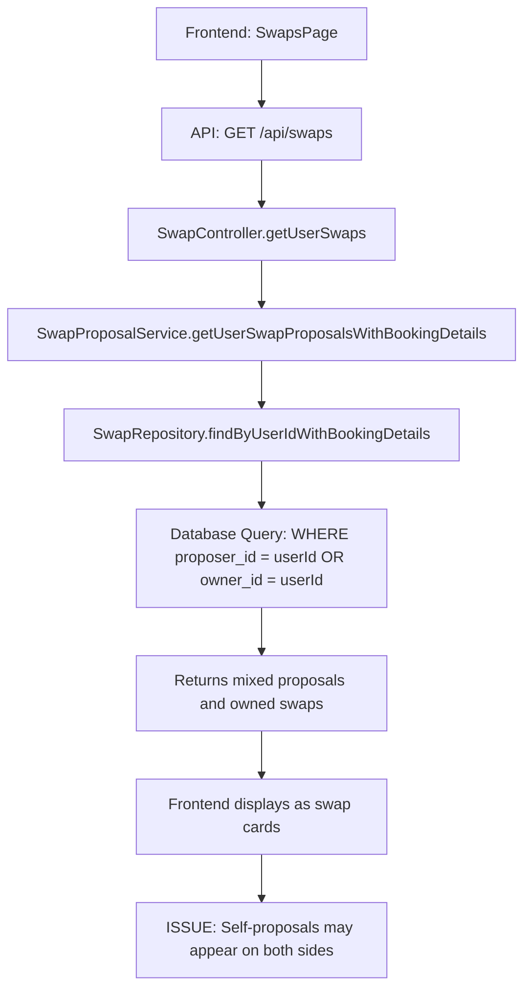

# Swap Self-Exclusion Fix - Current Data Structure Analysis

## Executive Summary

This analysis identifies the current data structure and flow for swap cards, revealing where self-proposals (users seeing their own swaps as proposals from themselves) can occur. The issue stems from the database schema design where the `swaps` table represents individual swap proposals rather than swap listings with multiple proposals.

## Database Schema Analysis

### Current Schema Structure

#### 1. Swaps Table (`swaps`)
```sql
CREATE TABLE swaps (
    id UUID PRIMARY KEY,
    source_booking_id UUID NOT NULL REFERENCES bookings(id),
    target_booking_id UUID NOT NULL REFERENCES bookings(id),
    proposer_id UUID NOT NULL REFERENCES users(id),
    owner_id UUID NOT NULL REFERENCES users(id),
    status VARCHAR(20) NOT NULL DEFAULT 'pending',
    -- ... other fields
    CONSTRAINT check_different_users CHECK (proposer_id != owner_id)
);
```

**Key Findings:**
- Each row in `swaps` represents a single proposal from one user to another
- `proposer_id` = user making the proposal
- `owner_id` = user who owns the target booking
- Database constraint prevents `proposer_id = owner_id` at creation time
- However, the constraint doesn't prevent data inconsistencies from other sources

#### 2. Related Tables
- `auction_proposals` - For auction-based swaps
- `swap_proposal_metadata` - Metadata tracking for proposals
- `swap_proposal_history` - Lifecycle events

### Current Data Flow Analysis

#### Backend Data Retrieval

**Primary Method:** `SwapController.getUserSwaps()`
```typescript
// In SwapController.ts line 250
getUserSwaps = async (req: Request, res: Response): Promise<void> => {
  // ...
  if (status) {
    swaps = await this.swapResponseService.getUserSwapResponses(userId, status, limit, offset);
  } else {
    swaps = await this.swapProposalService.getUserSwapProposalsWithBookingDetails(userId, limit, offset);
  }
}
```

**Service Layer:** `SwapProposalService.getUserSwapProposalsWithBookingDetails()`
```typescript
// In SwapProposalService.ts line 401
async getUserSwapProposalsWithBookingDetails(userId: string, limit: number = 100, offset: number = 0): Promise<SwapWithBookingDetails[]> {
  const swapsWithBookingDetails = await this.swapRepository.findByUserIdWithBookingDetails(userId, limit, offset);
  // ... processing
}
```

**Repository Layer:** `SwapRepository.findByUserIdWithBookingDetails()`
```sql
-- Current query in SwapRepository.ts
SELECT s.*, sb.*, tb.*
FROM swaps s
LEFT JOIN bookings sb ON s.source_booking_id = sb.id
LEFT JOIN bookings tb ON s.target_booking_id = tb.id
WHERE s.proposer_id = $1 OR s.owner_id = $1  -- CRITICAL: This is where self-proposals can appear
ORDER BY s.created_at DESC
```

#### Frontend Display Logic

**SwapsPage Component:**
- Displays swap cards in a grid layout
- Each card shows "Your Booking" on the left and "Their Booking" or "Awaiting Proposals" on the right
- Uses `SwapWithBookings` interface

**SwapCard Component:**
- Renders individual swap cards
- Determines user role (`proposer` vs `owner`) to decide which booking to show on which side
- Current logic assumes clean data separation

## Self-Proposal Problem Identification

### Root Cause
The current system treats each `swap` record as a proposal, but when displaying "swap cards" to users, it attempts to group proposals by the user's bookings. The issue occurs because:

1. **Query Logic Flaw:** The query `WHERE s.proposer_id = $1 OR s.owner_id = $1` returns:
   - Swaps where user is the proposer (user made proposals to others)
   - Swaps where user is the owner (others made proposals to user)

2. **Display Logic Confusion:** The frontend tries to show:
   - Left side: User's own booking
   - Right side: Proposals from others
   
   But the current data structure doesn't distinguish between these properly.

### Specific Scenarios Where Self-Proposals Appear

1. **Data Inconsistency:** If somehow a swap record exists where `proposer_id = owner_id` (despite database constraint)
2. **Display Logic Error:** When the frontend incorrectly interprets which booking belongs to which side
3. **Multiple Proposals:** When a user has multiple swaps for the same booking, the display logic may show their own booking on both sides

## Current API Endpoints

### GET /api/swaps
- **Controller:** `SwapController.getUserSwaps()`
- **Returns:** Array of `SwapWithBookingDetails`
- **Issue:** Returns both proposals made by user and proposals received by user without clear distinction

### Data Structure Returned
```typescript
interface SwapWithBookings extends Swap {
  sourceBooking: Booking;    // The booking being offered
  targetBooking?: Booking;   // The booking being requested (optional for cash swaps)
}
```

## Frontend Components Analysis

### SwapsPage.tsx
- **Location:** `apps/frontend/src/pages/SwapsPage.tsx`
- **Current Logic:** 
  ```typescript
  // Line 550+
  <div style={swapCardStyles}>
    <div style={bookingInfoStyles}>
      <h3>Your Booking</h3>
      {swap.sourceBooking?.title || 'Booking details unavailable'}
    </div>
    <div style={swapArrowStyles}>⇄</div>
    <div style={bookingInfoStyles}>
      <h3>{swap.theirBooking ? 'Their Booking' : 'Awaiting Proposals'}</h3>
      {swap.theirBooking ? swap.theirBooking.title : 'Waiting for proposals'}
    </div>
  </div>
  ```

### SwapCard.tsx
- **Location:** `apps/frontend/src/components/swap/SwapCard.tsx`
- **Current Logic:** Uses `userRole` prop to determine which booking to highlight
- **Issue:** Role determination may be incorrect when self-proposals exist

## Data Flow Summary



## Key Issues Identified

### 1. Database Query Logic
- **Problem:** Query returns both proposals made by user and proposals received by user
- **Impact:** Frontend cannot distinguish between user's own swaps and proposals from others
- **Location:** `SwapRepository.findByUserIdWithBookingDetails()`

### 2. Data Structure Confusion
- **Problem:** `SwapWithBookings` interface doesn't clearly separate user's booking from proposals
- **Impact:** Display logic assumes clean separation that doesn't exist
- **Location:** Frontend components

### 3. Missing Filtering Logic
- **Problem:** No filtering to exclude self-proposals at any level
- **Impact:** Self-proposals can appear in the UI
- **Location:** All layers (database, service, frontend)

## Recommended Fix Locations

### 1. Database Level (Primary Fix)
- **File:** `apps/backend/src/database/repositories/SwapRepository.ts`
- **Method:** `findByUserIdWithBookingDetails()`
- **Fix:** Add `AND s.proposer_id != s.owner_id` to query

### 2. Service Level (Secondary Validation)
- **File:** `apps/backend/src/services/swap/SwapProposalService.ts`
- **Method:** `getUserSwapProposalsWithBookingDetails()`
- **Fix:** Add validation to filter out any self-proposals

### 3. API Level (Tertiary Validation)
- **File:** `apps/backend/src/controllers/SwapController.ts`
- **Method:** `getUserSwaps()`
- **Fix:** Add final validation layer

### 4. Frontend Level (Display Logic)
- **File:** `apps/frontend/src/pages/SwapsPage.tsx`
- **Fix:** Update display logic to handle clean data structure

## Next Steps

1. **Implement database-level filtering** to exclude self-proposals
2. **Create optimized query** for swap cards with proposals
3. **Update service layer** to handle filtered data
4. **Modify API endpoints** to return clean data structure
5. **Update frontend components** to display filtered data
6. **Add validation mechanisms** to prevent future self-proposals

## Performance Considerations

- Current query joins multiple tables and may be slow with large datasets
- Recommended to create composite indexes for efficient filtering
- Consider caching frequently accessed swap card data

## Data Integrity Recommendations

1. **Add database constraints** to prevent self-proposal creation
2. **Implement cleanup scripts** for existing invalid data
3. **Add monitoring** to detect data inconsistencies
4. **Create validation utilities** for data integrity checks